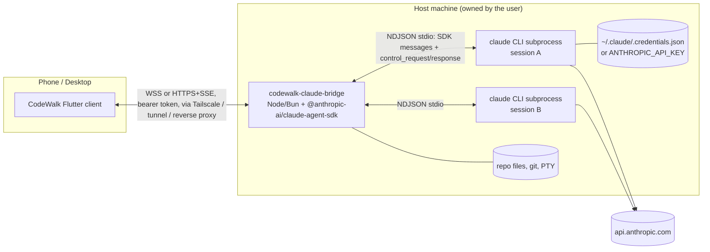

# 21 — Claude Code as a CodeWalk harness (research)

Research date: 2026-10-02. Versions inspected: Claude Code CLI **2.1.287** (native install, linux-arm64, local), TypeScript Agent SDK **@anthropic-ai/claude-agent-sdk 0.3.287** (npm, published 2026-10-01, bundles CLI 2.1.287), Python Agent SDK **claude-agent-sdk 0.2.163** (PyPI, 2026-09-30), ACP adapter **@agentclientprotocol/claude-agent-acp 0.85.0**.

Tag legend: **[V: key]** = verified against the source named by `key` (see §10 Sources). **[U]** = unverified / inferred / could not test. No agent session was run during this research (not allowed), so every wire example below is either quoted verbatim from a source (marked *verbatim*) or constructed from the published TypeScript types (marked *shape from types; values illustrative*).

Raw extracts saved next to this file in `plan/claude-code-src/`:

| File | Content |
| --- | --- |
| `agent-sdk-0.3.287-key-types-with-docs.d.ts` | ~100 key declarations **with JSDoc**, verbatim (messages, control protocol, Options, Query, permissions) |
| `agent-sdk-0.3.287-sdk.stripped.d.ts` | the whole `sdk.d.ts` with comments stripped (all types) |
| `agent-sdk-0.3.287-sdk-tools.stripped.d.ts` | input/output schemas of every built-in tool (Bash, Edit, Agent, TodoWrite, Task*, AskUserQuestion, ...) |
| `agent-sdk-0.3.287-bridge.d.ts`, `agent-sdk-0.3.287-browser-sdk.d.ts` | alpha Remote-Control bridge + browser transport exports (claude.ai-only) |
| `claude-cli-2.1.287-help.txt` | `claude --help` and subcommand help |

---

## 0. Executive summary

1. **Recommended surface: the official TypeScript Claude Agent SDK, run inside a thin host bridge** (Node ≥18 or Bun) on the machine where the code lives, in **streaming-input mode** (one long-lived `query()` per CodeWalk session). The bridge exposes a network API (WebSocket, or HTTP POST + SSE to mirror CodeWalk's OpenCode transport) to the phone, forwards SDK messages mostly verbatim, and turns `canUseTool` / `onElicitation` callbacks into client round-trips. Anthropic's own hosting guide describes exactly this pattern: *"The container exposes an HTTP or WebSocket endpoint and maps each active session to a long-lived query and the subprocess behind it."* [V: D-host]
2. **There is no official network-reachable Claude Code daemon/API for third-party clients.** Remote Control, claude.ai/code cloud sessions, teleport and the mobile app are closed to third parties: they relay through Anthropic servers and require the user's claude.ai OAuth session; the CLI's `--sdk-url` flag is allow-listed to Anthropic hosts ("reserved for Remote Control worker processes connecting to Anthropic's backend"). [V: D-rc, S6, S3]
3. **The TS SDK is the most complete control surface** (40 control-request kinds across both directions, 39 output message kinds): interrupt with receipt, runtime permission mode / model / effort (`applyFlagSettings`), file checkpoint rewind, session list/fork/rename/tag/delete, subagent transcripts, background task stop/background, MCP status/toggle, context-usage breakdown, plan-quota read (experimental), `readFile`. Python SDK has a subset (no `applyFlagSettings`, no `readFile`, no `backgroundTasks`). [V: S1, D-ts, D-py]
4. **Raw `claude -p --input-format stream-json --output-format stream-json` is the same protocol the SDK speaks** (NDJSON over stdio: SDK messages + `control_request`/`control_response`). A non-TS host (e.g., Dart/Go) can drive it directly — third parties already do (a Go host is cited in issue #98713) — but the docs only publish it as TS/Python types; treat it as semi-public and version-sensitive. [V: S5, D-ts, I-98713]
5. **Policy verdict: allowed with conditions, gray zone for distributed apps.** CodeWalk must never implement claude.ai login, never collect/store/proxy claude.ai tokens, never modify the binary, and never misrepresent its identity. The *user* signs in on their own host with Anthropic's own flow (`claude auth login`, `claude setup-token`) or uses their own API key; usage bills to the user. Official docs explicitly permit "an end user ... signing in to the unmodified Claude Code binary with their own Claude subscription", and the Help Center (Jun 15 2026) states that "Claude Agent SDK, `claude -p`, and third-party app usage still draw from your subscription's usage limits". But Anthropic's *preferred* path for third-party tools is API keys and it reserves the right to bill third-party-tool usage from usage credits. Offer API-key mode as the "strictly compliant" option. [V: D-legal, H-sdkplan, H-login, D-overview]
6. **Strong native mappings:** streaming text/thinking deltas, tool calls with structured outputs (`tool_use_result`, e.g. Edit `structuredPatch`), permissions (allow/deny/edit input/"always allow" rules/mode switch), AskUserQuestion, plan approval, interrupt, queued mid-turn messages, slash commands + skills discovery, images, model/effort switching, background subagents and Bash tasks (`task_*` events + level-set `background_tasks_changed`), plan rate-limit events, session list/resume/fork, file rewind.
7. **Gaps the bridge must fill:** directory listing / file tree / fuzzy file search, git diff, terminal (PTY), push notifications, persistent event buffer for phone reconnects, multi-session management, auth status/health. Todo lists are **model-dependent** (task tools are off by default on newer models). No "redo". No public SDK method for `cancel_async_message`, `get_task_output`, `file_suggestions` (they exist only in the wire protocol).
8. **Main risks:** policy drift (rules changed 4 times in 2026), protocol churn (CLI ships ~daily; pin the SDK and feature-detect `system/init.capabilities`), known protocol bugs (e.g. interrupt right after a user message ignored on later turns, open on 2.1.286), Anthropic's default permission mode is now `auto` when omitted (bridge must pass `permissionMode` explicitly).



---

## 1. Programmatic surfaces and maturity

| Surface | What it is | Network-reachable? | Maturity / notes |
| --- | --- | --- | --- |
| **TS Agent SDK** `@anthropic-ai/claude-agent-sdk` | `query()` spawns the CLI and talks NDJSON over stdio; `Query` object exposes control methods. Bundles the native CLI per platform via optionalDependencies (linux-x64/arm64 (+musl), darwin-x64/arm64, win32-x64/arm64). Requires Node ≥18; peer deps `zod ^4`, `@modelcontextprotocol/sdk ^1.29`, `@anthropic-ai/sdk >=0.93`. | No (local subprocess) | Production, versioned in lock-step with the CLI (`0.3.N` ↔ `2.1.N`), changelog per release. Most complete. Some APIs marked alpha/experimental (`prewarm`, `sessionStore`, `readMcpResource`, `usage_EXPERIMENTAL_...`). [V: S1, S5, CL-ts] |
| **Python Agent SDK** `claude-agent-sdk` | `query()` / `ClaudeSDKClient`; custom `Transport` ABC ("for example, a remote connection instead of a local subprocess", marked low-level/internal). | No | Production, subset of TS control methods. [V: D-py] |
| **`claude -p` stream-json** | `claude -p --input-format stream-json --output-format stream-json --verbose [--include-partial-messages] [--replay-user-messages] [--permission-prompt-tool stdio]` — the same wire protocol as the SDK (the SDK always passes `--output-format stream-json --verbose --input-format stream-json`, and `--permission-prompt-tool stdio` when `canUseTool` is set). | No (stdio) | Officially documented flags; the control protocol is documented through SDK types ("if you parse the wire protocol yourself..."). [V: S4, S5, D-headless, D-ts] |
| **`--permission-prompt-tool <mcp_tool>`** | Route permission prompts to an MCP tool (non-interactive). | Indirect (MCP server can be remote) | Documented; limited compared to `canUseTool` (cannot approve tools marked requiresUserInteraction). [V: D-cli] |
| **Remote Control** (`claude remote-control`, `--remote-control/--rc`, `/remote-control`) | Local CLI registers with Anthropic and polls; claude.ai/code and the Claude iOS/Android app drive it. Outbound HTTPS only, transcript stored on Anthropic servers. Server mode supports `--spawn same-dir|worktree|session`, `--capacity` (default 32). | Only via Anthropic (claude.ai) | GA for Pro/Max/Team/Enterprise; **API keys not supported**; requires full-scope claude.ai login (not `setup-token`). Not usable by third-party clients (see §4). [V: D-rc] |
| `@anthropic-ai/claude-agent-sdk/bridge` and `/browser` exports | Alpha helpers for the CCR (Claude Code Remote) backend: `attachBridgeSession`, `createCodeSession`, `fetchRemoteCredentials` (needs a claude.ai OAuth access token + trusted-device token), browser `query({ sse | websocket })` against `/v1/code/sessions/{id}/events`. | Anthropic backend only | Alpha, "separate versioning universe"; requires claude.ai OAuth tokens → policy-prohibited for third parties to hold. [V: S3] |
| Hidden `--sdk-url <url>` | CLI connects its stream-json I/O to a remote URL. | — | **Allow-listed**: error text "This flag is reserved for Remote Control worker processes connecting to Anthropic's backend". Not usable. [V: S6] |
| Cloud sessions (`--cloud`, `--teleport`, claude.ai/code, self-hosted environments) | Sessions run on Anthropic cloud or org-run runners; teleport pulls into terminal. | Via claude.ai only | No third-party API. Self-hosted environments: Team/Enterprise beta. [V: D-cli, D-new] |
| Background sessions / agent view (`claude --bg`, `claude agents [--json]`, `attach/logs/stop/respawn/rm`, `claude daemon status`) | A local supervisor process hosts background interactive sessions. `claude agents --json` is "the supported way to read session state from outside Claude Code" (state `working/blocked/done/failed/stopped`, `waitingFor`). | No | Stable for *reading state*; driving them is TUI-only (`attach`). Files under `~/.claude/jobs/` are not a stable interface. [V: D-agentview, S4] |
| **ACP adapter** `@agentclientprotocol/claude-agent-acp` (formerly zed-industries/claude-code-acp) | ACP (JSON-RPC over stdio) agent implemented on top of the TS Agent SDK: @-mentions, images, tool calls with permission requests, edit review, TODO lists, nested subagent transcripts, interactive/background terminals, slash commands, client MCP servers. | No (stdio). ACP remote transport (Streamable HTTP + WebSocket) is still a **draft RFD**. | Active (v0.85.0, 2026-10-01). Good if CodeWalk wants one protocol for many harnesses; loses Claude-only features (quotas, some task controls). [V: X-acp, X-acp-rfd] |
| `claude mcp serve` | Exposes Claude Code's *tools* (Read/Edit/Bash...) as a stdio MCP server. | No | Not the agent loop; not useful as a harness. [V: D-mcp] |
| Hooks | Shell/HTTP/prompt/agent/mcp_tool hooks on ~33 events (PreToolUse, PermissionRequest, Notification, Stop, SubagentStart/Stop, TaskCreated/Completed, PreCompact, SessionStart/End, ...). `http` hook type POSTs JSON to a URL. SDK hosts can register in-process hook callbacks. | HTTP hooks can call out | Stable; useful as an *event source* for TUI sessions (Happy's "local mode" pattern) or for policy. [V: S1, D-hooks] |
| Channels | MCP-server-pushed messages into a running session (Telegram/Discord/webhooks). | Inbound via your MCP server | Research-preview style feature; niche for CodeWalk. [V: D-rc table] |
| Managed Agents (Claude Platform API) | Anthropic-hosted agent harness (API-key billed), optional self-hosted sandbox. | Yes (REST API) | Not Claude Code; different product; API billing only. [V: D-overview] |

---

## 2. Recommended architecture (bridge on host + TS SDK)

### 2.1 Why TS SDK over raw stream-json or ACP
- **Completeness:** every control request has a typed method; reconnect helpers (`reinitialize()` redelivers pending `can_use_tool` and user dialogs after a transport gap; `pending_permission_requests` on the initialize response). [V: D-ts]
- **Officially supported** language binding with release notes per CLI version. [V: CL-ts]
- Raw stream-json from Dart is feasible (protocol below is fully typed) but you would re-implement the SDK's MCP-in-process routing, hook callback ids, initialize handshake, control request bookkeeping and keep up with churn. Only worth it if a Node/Bun dependency on the host is unacceptable. [U: maintenance cost estimate]
- ACP is the "lowest common denominator" option for multi-harness; adds a second translation layer and no stable remote transport yet. [V: X-acp-rfd]

### 2.2 Bridge responsibilities (proposal)
1. Auth for the phone (bearer token / pairing), TLS via user's tunnel (Tailscale, Cloudflare Tunnel, reverse proxy). The bridge itself never touches claude.ai credentials; it only spawns the CLI which reads the user's stored login or `ANTHROPIC_API_KEY`. [V: D-auth]
2. Session manager: map `codewalkSessionId → { query: Query, inputQueue: AsyncIterable<SDKUserMessage>, cwd, sdkSessionId }`. One CLI subprocess per active session ("One agent session maps to one subprocess"). [V: D-host]
3. Event log with monotonically increasing sequence numbers per session (ring buffer + optional disk), so the phone can resume with `Last-Event-ID`/`fromSeq`. Pending permission/AskUserQuestion requests kept until answered (CLI waits indefinitely for permission prompts and AskUserQuestion by default). [V: D-rc "Forwarded dialogs expire" (5 min only for other dialog kinds), D-tools AskUserQuestion]
4. Translate client commands → SDK calls (send message, interrupt, set mode/model/effort, rewind, stop task, ...).
5. Host features the SDK lacks: directory listing, fuzzy file search (for @-mentions), git status/diff, file upload for attachments, PTY terminal (node-pty), session list across projects (`listSessions()`), auth health (`claude auth status --json`), push notifications (FCM/APNs or ntfy) on `requires_action` / `result`.
6. Options to always pass explicitly: `permissionMode` (default changed to "leave it to Claude Code", which can mean `auto`), `includePartialMessages: true`, `enableFileCheckpointing: true` + `extraArgs: { 'replay-user-messages': null }`, `perTaskStopAffordance: true` (so Stop doesn't kill background agents), `agentProgressSummaries: true` (optional), `forwardSubagentText: true` (for nested transcripts), `promptSuggestions` (optional), `toolConfig.askUserQuestion.previewFormat: 'markdown'` (optional), `settingSources` omitted (load user/project/local like the CLI), `env: { ...process.env, ... }` (TS `env` *replaces* the subprocess env). [V: S1, CL-ts 0.3.286, D-todo, D-ckpt]
7. Do **not** use `--bare` for CodeWalk sessions: bare mode skips CLAUDE.md, skills, hooks, plugins, MCP and never reads OAuth credentials (API key only). [V: D-headless]

### 2.3 Transport to the phone
Either works; recommendation: **WebSocket** for bidirectional low latency (control round-trips like permissions), *or* **HTTP POST + SSE** to reuse CodeWalk's existing OpenCode SSE client stack. In both cases: JSON envelope `{seq, sessionId, kind, payload}` where `kind ∈ {sdk_message, permission_request, dialog_request, elicitation_request, bridge_event, error}` and `payload` for `sdk_message` is the SDK message **unchanged** (lets the Flutter client parse the documented SDK types directly and keeps the bridge thin). [U: design proposal]

### 2.4 Bridge skeleton (TypeScript, illustrative)
```ts
import { query, type SDKUserMessage, type PermissionResult } from "@anthropic-ai/claude-agent-sdk";

const inbox = new AsyncQueue<SDKUserMessage>();          // your async iterable
const q = query({
  prompt: inbox,                                          // streaming input mode
  options: {
    cwd, resume: sdkSessionId,                            // or sessionId: uuid for a new one
    permissionMode: "default",
    allowDangerouslySkipPermissions: true,                // only if you want a later "allow all" (bypass) switch
    includePartialMessages: true,
    enableFileCheckpointing: true,
    extraArgs: { "replay-user-messages": null },
    perTaskStopAffordance: true,
    forwardSubagentText: true,
    env: { ...process.env },
    canUseTool: async (toolName, input, opts) =>           // opts: suggestions, toolUseID, requestId, title, ...
      await askPhone({ toolName, input, ...opts }) as PermissionResult,
    onElicitation: async (req, { requestId }) => await askPhoneElicitation(req, requestId),
  },
});
for await (const msg of q) broadcast(sessionKey, { kind: "sdk_message", payload: msg });

// client commands
inbox.push({ type: "user", uuid: crypto.randomUUID(), parent_tool_use_id: null,
             message: { role: "user", content: [{ type: "text", text: "fix the tests" }] } });
await q.interrupt(); await q.setPermissionMode("acceptEdits"); await q.setModel("opus");
await q.applyFlagSettings({ effortLevel: "high" }); await q.rewindFiles(userMsgUuid);
await q.stopTask(taskId);
```
[V: S1 signatures; U: untested code]

---

## 3. Protocol reference (stream-json / Agent SDK)

### 3.1 Framing and handshake
- Newline-delimited JSON on the CLI's stdin/stdout. Everything the CLI writes is a `StdoutMessage`:
  ```ts
  declare type StdoutMessage = coreTypes.SDKMessage | coreTypes.SDKActiveGoalMessage | SDKControlResponse | SDKControlRequest | SDKControlCancelRequest | SDKKeepAliveMessage;
  ```
  [V: S1, verbatim]
- Control envelopes (verbatim types) [V: S1]:
  ```ts
  export declare type SDKControlRequest = { type: 'control_request'; request_id: string; request: SDKControlRequestInner; };
  export declare type SDKControlResponse = { type: 'control_response'; response: ControlResponse | ControlErrorResponse; };
  declare type ControlResponse = { subtype: 'success'; request_id: string; response?: Record<string, unknown>;
      pending_permission_requests?: SDKControlRequest[]; pending_user_dialog_requests?: SDKControlRequest[]; };
  declare type ControlErrorResponse = { subtype: 'error'; request_id: string; error: string;
      pending_permission_requests?: SDKControlRequest[]; pending_user_dialog_requests?: SDKControlRequest[]; };
  declare type SDKControlCancelRequest = { type: 'control_cancel_request'; request_id: string; };
  declare type SDKKeepAliveMessage = { type: 'keep_alive'; };
  ```
  Control requests flow **both ways**: host→CLI (interrupt, set_model, ...) and CLI→host (`can_use_tool`, `hook_callback`, `mcp_message`, `elicitation`, `request_user_dialog`). `control_cancel_request` withdraws an in-flight request (e.g. pending permission after an interrupt). [V: S1]
- Argv used by the SDK (from the bundle): `--output-format stream-json --verbose --input-format stream-json`, plus `--permission-prompt-tool stdio` (when `canUseTool`), `--resume=<id>`, `--continue`, `--fork-session`, `--resume-session-at=<uuid>`, `--model`, `--effort`, `--thinking adaptive|disabled` / `--max-thinking-tokens`, `--permission-mode`, `--allow-dangerously-skip-permissions`, `--include-partial-messages`, `--include-hook-events`, `--max-turns`, `--max-budget-usd`, `--mcp-config`, `--allowedTools`, `--tools`, `--add-dir`, `--agent`, `--fallback-model`, `--json-schema`, `--no-session-persistence`, `--plugin-dir`, `--permission-prompts`, `--setting-sources`... [V: S5]
- *Verbatim* raw handshake used by a third-party host (issue #98713, CLI 2.1.286):
  ```json
  {"type": "control_request", "request_id": "init", "request": {"subtype": "initialize"}}
  {"type": "user", "session_id": "", "parent_tool_use_id": null, "message": {"role": "user", "content": "Reply with just: ok"}}
  {"type": "control_request", "request_id": "stop", "request": {"subtype": "interrupt"}}
  ```
  with argv `claude -p --input-format stream-json --output-format stream-json --verbose --model haiku --setting-sources "" --strict-mcp-config --tools ""`. Observed order per turn: `control_response` → `system/init` → stream → `result`. [V: I-98713]
- *Verbatim* control_response construction in the official Python SDK [V: GH-py `_internal/query.py`]:
  ```python
  success_response = {"type": "control_response",
      "response": {"subtype": "success", "request_id": request_id, "response": response_data}}
  # can_use_tool allow:  response_data = {"behavior": "allow", "updatedInput": ..., "updatedPermissions": [...]}
  # can_use_tool deny:   response_data = {"behavior": "deny", "message": "...", "interrupt": true?}
  error_response = {"type": "control_response",
      "response": {"subtype": "error", "request_id": request_id, "error": str(e)}}
  ```
- `initialize` request fields (host→CLI): `hooks` (callback ids per event), `sdkMcpServers`, `jsonSchema`, `systemPrompt[]`, `appendSystemPrompt`, `planModeInstructions`, `agents`, `title`, `skills`, `promptSuggestions`, `agentProgressSummaries`, `forwardSubagentText`, `supportedDialogKinds`, `perTaskStopAffordance`, `plugins`... Response: `{ commands: SlashCommand[], agents: AgentInfo[], output_style, available_output_styles, models: ModelInfo[], account: AccountInfo, hooks_applied?, fast_mode_state?, ... }` + wrapper `pending_permission_requests` (always present from 2.1.268). Re-sending `initialize` on a live process (`reinitialize()`) redelivers pending permission/dialog requests and a `background_tasks_changed` snapshot. [V: S1, D-ts]

### 3.2 Outbound message catalog (`SDKMessage` union, 39 kinds)
```ts
export declare type SDKMessage = SDKAssistantMessage | SDKUserMessage | SDKUserMessageReplay | SDKResultMessage | SDKSystemMessage | SDKPartialAssistantMessage | SDKCompactBoundaryMessage | SDKStatusMessage | SDKAPIRetryMessage | SDKControlRequestProgressMessage | SDKModelRefusalFallbackMessage | SDKModelRefusalNoFallbackMessage | SDKLocalCommandOutputMessage | SDKHookStartedMessage | SDKHookProgressMessage | SDKHookResponseMessage | SDKPluginInstallMessage | SDKToolProgressMessage | SDKAuthStatusMessage | SDKTaskNotificationMessage | SDKTaskStartedMessage | SDKTaskUpdatedMessage | SDKTaskProgressMessage | SDKBackgroundTasksChangedMessage | SDKThinkingTokensMessage | SDKSessionStateChangedMessage | SDKWorkerShuttingDownMessage | SDKCommandsChangedMessage | SDKNotificationMessage | SDKFilesPersistedEvent | SDKToolUseSummaryMessage | SDKMemoryRecallMessage | SDKRateLimitEvent | SDKElicitationCompleteMessage | SDKPermissionDeniedMessage | SDKPromptSuggestionMessage | SDKMirrorErrorMessage | SDKInformationalMessage | SDKConversationResetMessage;
```
[V: S1, verbatim] — discriminate on `type` then `subtype`. Unknown types must be ignored (Python SDK returns `None` for unknown types). [V: GH-py tests]

| `type` / `subtype` | Purpose for CodeWalk | Key fields |
| --- | --- | --- |
| `system/init` | Session metadata; emitted **at the start of each turn** ("newest frame wins") | `session_id, cwd, model, permissionMode, tools[], mcp_servers[{name,status,source}], slash_commands[], terminal_slash_commands[]?, skills[], agents[]?, plugins[], plugin_errors[]?, output_style, apiKeySource, claude_code_version, capabilities[]?, fast_mode_state?` |
| `assistant` | One message **per completed content block** (text / thinking / tool_use); several share `message.id`; `stop_reason` null until result | `message: BetaMessage, parent_tool_use_id, error?, uuid, session_id, user_message_uuid(s)?, aborted?, supersedes?, subagent_type?, timestamp?, context_usage?, usage_report?` |
| `stream_event` | Raw Messages-API stream events (`message_start`, `content_block_start/delta/stop`, `message_delta`, `message_stop`) — main thread only | `event, parent_tool_use_id (always null), ttft_ms?` |
| `user` | Tool results (and replays of user input with `--replay-user-messages`) | `message: MessageParam, parent_tool_use_id, tool_use_result? (structured tool output), origin?, isReplay?` |
| `result` | Turn complete. Exactly one per turn | success: `result, num_turns, total_cost_usd, usage, modelUsage, permission_denials, terminal_reason?, stop_reason, duration_ms, duration_api_ms, is_error, api_error_status?`; errors: `subtype error_during_execution|error_max_turns|error_max_budget_usd|error_max_structured_output_retries, errors[], startup_failure_reason?` |
| `system/session_state_changed` | **Authoritative busy indicator**: `idle | running | requires_action` | `state` |
| `system/status` | `status: 'compacting' | 'requesting' | null`, may carry `permissionMode`, `compact_result/compact_error` | |
| `system/compact_boundary` | Where history was compacted | `compact_metadata{trigger manual|auto, pre_tokens, post_tokens?, duration_ms?}` |
| `system/api_retry` | Retry banner | `attempt, max_retries, retry_delay_ms, error_status, error (category)` |
| `rate_limit_event` | Subscription quota state changes | `rate_limit_info{status allowed|allowed_warning|rejected, resetsAt?, rateLimitType?, utilization?, overage*...}` |
| `system/task_started` / `task_progress` / `task_updated` / `task_notification` | Background/foreground tasks: subagents (`local_agent`), Bash & Monitor (`local_bash`), `remote_agent`, workflows | see §3.9 |
| `system/background_tasks_changed` | Full live set of background tasks (**replace** semantics) | `tasks[{task_id, task_type, description, ambient?}]` |
| `tool_progress` | Heartbeat every 30 s per running main-thread tool; subagent retry info | `tool_use_id, tool_name, elapsed_time_seconds, heartbeat?, subagent_retry?` |
| `tool_use_summary` | Model-written summary of preceding tool calls | `summary, preceding_tool_use_ids[]` |
| `system/thinking_tokens` | Thinking progress estimate | `estimated_tokens, estimated_tokens_delta` |
| `system/notification` | Loop-side text notifications | `key, text, priority low|medium|high|immediate, timeout_ms?` |
| `system/informational` | Banners: warnings, hook feedback, command output | `content, level info|notice|suggestion|warning, prevent_continuation?` |
| `system/permission_denied` | A tool call was denied (rule/mode/none-prompts) | `tool_name, tool_use_id, decision_reason(_type)?, message` |
| `system/commands_changed` | Command list changed mid-session (replace cache) | `commands: SlashCommand[]` |
| `conversation_reset` | `/clear`, plan-mode exit with clear, etc.; later messages carry a **new session_id** | `new_conversation_id, trigger?` |
| `prompt_suggestion` | Predicted next prompt (after `result`) | `suggestion` |
| `auth_status` | Auth flow progress | `isAuthenticating, output[], error?` |
| `system/model_refusal_fallback` / `model_refusal_no_fallback` | Safety refusal handling; may retract earlier messages (`retracted_message_uuids`, `supersedes`) | |
| `system/hook_started|hook_progress|hook_response` | Hook lifecycle (`includeHookEvents`) | `hook_id, hook_name, hook_event, stdout, stderr, outcome` |
| `system/elicitation_complete`, `files_persisted`, `memory_recall`, `plugin_install`, `worker_shutting_down`, `mirror_error`, `control_request_progress`, `local_command_output` (never emitted per docs) | niche | |

[V: S1, D-ts, D-stream-out]

#### Examples (*shape from types; values illustrative* unless marked verbatim)

`system/init`
```json
{"type":"system","subtype":"init","session_id":"0b7c5a8e-5d1e-4f6e-9a51-7c2a7e0f1c11","uuid":"5c0e…","cwd":"/home/u/repo",
 "claude_code_version":"2.1.287","model":"claude-sonnet-5-5","permissionMode":"default","apiKeySource":"none",
 "tools":["Agent","Bash","Edit","Read","Write","WebFetch","WebSearch","AskUserQuestion","Skill","TaskStop","ExitPlanMode","mcp__github__create_issue"],
 "mcp_servers":[{"name":"github","status":"connected","source":"user"}],
 "slash_commands":["clear","compact","context","usage","model","effort","code-review","my-skill"],
 "terminal_slash_commands":["exit"],"skills":["my-skill"],"agents":["general-purpose","Explore","Plan"],
 "plugins":[],"output_style":"default","capabilities":["interrupt_receipt_v1","interrupt_cancel_queued_v1"],
 "fast_mode_state":"off"}
```

`stream_event` (text / thinking / tool input deltas)
```json
{"type":"stream_event","session_id":"0b7c…","uuid":"…","parent_tool_use_id":null,
 "event":{"type":"content_block_delta","index":0,"delta":{"type":"text_delta","text":"Running the tests"}}}
{"type":"stream_event","session_id":"0b7c…","uuid":"…","parent_tool_use_id":null,
 "event":{"type":"content_block_delta","index":1,"delta":{"type":"input_json_delta","partial_json":"{\"command\":\"npm t"}}}
```
Order per assistant API call: `message_start` → `content_block_start` → deltas → **complete `assistant` message** → `content_block_stop` → ... → `message_delta` → `message_stop`. Subagent token deltas are not forwarded. [V: D-stream-out]

`assistant` (tool_use block) then `user` (tool_result with structured output)
```json
{"type":"assistant","session_id":"0b7c…","uuid":"…","parent_tool_use_id":null,
 "message":{"id":"msg_01…","type":"message","role":"assistant","model":"claude-sonnet-5-5",
  "content":[{"type":"tool_use","id":"toolu_01ABC","name":"Edit",
              "input":{"file_path":"/home/u/repo/src/a.ts","old_string":"foo","new_string":"bar"}}],
  "stop_reason":null,"usage":{"input_tokens":3,"output_tokens":41,"cache_read_input_tokens":21000,"cache_creation_input_tokens":0}}}
{"type":"user","session_id":"0b7c…","uuid":"…","parent_tool_use_id":null,
 "message":{"role":"user","content":[{"type":"tool_result","tool_use_id":"toolu_01ABC","content":"The file … has been updated."}]},
 "tool_use_result":{"filePath":"/home/u/repo/src/a.ts","oldString":"foo","newString":"bar","originalFile":"…",
   "structuredPatch":[{"oldStart":10,"oldLines":1,"newStart":10,"newLines":1,"lines":["-foo","+bar"]}],
   "userModified":false,"replaceAll":false}}
```
`tool_use_result` shapes per tool are in `agent-sdk-0.3.287-sdk-tools.stripped.d.ts` (e.g. `BashOutput{stdout,stderr,interrupted,backgroundTaskId?,gitOperation?...}`, `FileEditOutput{structuredPatch,gitDiff?}`, `AgentOutput` (completed | async_launched | remote_launched)). [V: S2, D-ts]

`result` success
```json
{"type":"result","subtype":"success","session_id":"0b7c…","uuid":"…","is_error":false,"num_turns":4,
 "result":"All 42 tests pass.","stop_reason":"end_turn","terminal_reason":"completed",
 "duration_ms":48211,"duration_api_ms":30122,"total_cost_usd":0.4213,
 "usage":{"input_tokens":12,"output_tokens":1840,"cache_read_input_tokens":98000,"cache_creation_input_tokens":4200},
 "modelUsage":{"claude-sonnet-5-5":{"inputTokens":12,"outputTokens":1840,"cacheReadInputTokens":98000,"cacheCreationInputTokens":4200,"webSearchRequests":0,"costUSD":0.4213,"contextWindow":1000000,"maxOutputTokens":64000}},
 "permission_denials":[],"user_message_uuid":"c1f…","user_message_uuids":["c1f…"],"result_index":3}
```
Notes: `usage` = main loop only, per-turn; `modelUsage`/`total_cost_usd` are cumulative across turns in streaming-input sessions and are **client-side estimates**. `terminal_reason ∈ completed|max_turns|tool_deferred|aborted_streaming|aborted_tools|hook_stopped|stop_hook_prevented|background_requested|blocking_limit|rapid_refill_breaker|prompt_too_long|image_error|model_error|api_error|malformed_tool_use_exhausted|budget_exhausted|structured_output_retry_exhausted|tool_deferred_unavailable|turn_setup_failed`. Results with `origin.kind === "task-notification"` answer background completions, not the user. [V: D-ts, S1]

`rate_limit_event` (*verbatim* from official Python SDK tests) [V: GH-py `tests/test_rate_limit_event_repro.py`]
```json
{"type":"rate_limit_event","rate_limit_info":{"status":"allowed_warning","resetsAt":1700000000,"rateLimitType":"five_hour","utilization":0.85,"isUsingOverage":false},"uuid":"550e8400-e29b-41d4-a716-446655440000","session_id":"test-session-id"}
{"type":"rate_limit_event","rate_limit_info":{"status":"rejected","resetsAt":1700003600,"rateLimitType":"seven_day","isUsingOverage":false,"overageStatus":"rejected","overageDisabledReason":"out_of_credits"},"uuid":"660e8400-e29b-41d4-a716-446655440001","session_id":"test-session-id"}
```

On-disk transcript line for a usage-limit hit (*verbatim* fixture, CLI 2.1.179; `~/.claude/projects/<cwd>/<session>.jsonl` format, not stream-json) [V: X-happy fixture]:
```json
{"type":"assistant","error":"rate_limit","isApiErrorMessage":true,"apiErrorStatus":429,"message":{"model":"<synthetic>","role":"assistant","content":[{"type":"text","text":"You've hit your limit · resets Jul 23 at 6pm (America/Los_Angeles)"}],"stop_reason":"stop_sequence"}, "...":"..."}
```
In stream-json the same condition surfaces as an `assistant` message with `error: "rate_limit"` (field `SDKAssistantMessage.error`) plus `rate_limit_event status:"rejected"`. [V: S1; U: exact co-occurrence]

`system/session_state_changed`, `system/task_started`, `system/task_notification`, `system/background_tasks_changed`
```json
{"type":"system","subtype":"session_state_changed","state":"requires_action","uuid":"…","session_id":"0b7c…"}
{"type":"system","subtype":"task_started","task_id":"a1b2c3","tool_use_id":"toolu_01AG","description":"Audit auth module","subagent_type":"general-purpose","task_type":"local_agent","is_backgrounded":true,"spawn_depth":1,"uuid":"…","session_id":"0b7c…"}
{"type":"system","subtype":"task_notification","task_id":"a1b2c3","tool_use_id":"toolu_01AG","status":"completed","output_file":"/tmp/claude-…/a1b2c3.output","summary":"Found 3 issues …","usage":{"total_tokens":48210,"tool_uses":17,"duration_ms":93011},"uuid":"…","session_id":"0b7c…"}
{"type":"system","subtype":"background_tasks_changed","tasks":[{"task_id":"b9","task_type":"local_bash","description":"npm run dev"}],"uuid":"…","session_id":"0b7c…"}
```

### 3.3 Inbound: user messages and control requests

User message (host → CLI), verbatim type [V: S1]:
```ts
export declare type SDKUserMessage = {
  type: 'user'; message: MessageParam; parent_tool_use_id: string | null;
  isSynthetic?: boolean; tool_use_result?: unknown; priority?: 'now' | 'next' | 'later';
  origin?: SDKMessageOrigin; shouldQuery?: boolean; timestamp?: string; client_composed?: true;
  uuid?: UUID; pasted_content?: MessageParam['content'][]; inline_pastes?: string[]; session_id?: string; ... };
```
- `message.content`: string or Messages-API blocks (`text`, `image` base64/url, `document`...). Images only in streaming-input mode. Invalid image block → text note "[Image could not be processed: …]". [V: D-stream-in]
- `uuid`: set it (client-generated) to correlate replies (`user_message_uuid(s)` on first reply frames and on `result`) and as a rewind/fork anchor. [V: D-ts, S1]
- `shouldQuery:false` appends context without a model turn. `client_composed:true` disables `@path` expansion and slash-command dispatch. `priority`: `'now'` moves running shell/agents/MCP calls to the background and joins the running turn (0.3.286 changelog; mirrors the TUI's Ctrl+Enter "send now"). [V: D-ts, CL-ts; U: exact `next`/`later` semantics]

Control requests host→CLI (`SDKControlRequestInner` subtypes) and SDK method [V: S1, D-ts]:

| subtype | Payload | TS `Query` method | Notes |
| --- | --- | --- | --- |
| `initialize` | see §3.1 | implicit / `reinitialize()` | |
| `interrupt` | `{cancel_queued?}` | `interrupt()` → `{still_queued[], cancelled?[]}` | capability `interrupt_receipt_v1`, `interrupt_cancel_queued_v1` (raw only) |
| `set_permission_mode` | `{mode}` | `setPermissionMode()` | |
| `set_model` | `{model?: string|null}` | `setModel()` | mid-turn: applies from next API call |
| `set_max_thinking_tokens` | `{max_thinking_tokens?, thinking_display?}` | `setMaxThinkingTokens()` (deprecated) | |
| `apply_flag_settings` | `{settings}` | `applyFlagSettings()` (TS only) | `effortLevel`, `permissions`, `agent`, `model`, `fastMode`, `ultracode`, `hooks`, `skillOverrides` |
| `update_settings` | `{source, settings}` | `updateSettings()` | allowlisted keys only |
| `rewind_files` | `{user_message_id, dry_run?}` | `rewindFiles()` | needs checkpointing |
| `stop_task` | `{task_id}` | `stopTask()` | |
| `background_tasks` | `{tool_use_id?}` | `backgroundTasks()` | Ctrl+B equivalent |
| `get_task_output` | `{task_id}` → `{output, total_bytes, truncated}` | — (raw only) | last 8 KiB of a shell/Monitor task |
| `cancel_async_message` | `{message_uuid}` | — (raw only) | take back a queued message |
| `mcp_status` / `mcp_reconnect` / `mcp_toggle` / `mcp_set_servers` / `mcp_read_resource` | | `mcpServerStatus()`, `reconnectMcpServer()`, `toggleMcpServer()`, `setMcpServers()`, `readMcpResource()` | |
| `get_context_usage` | `{detail?}` | `getContextUsage()` | per-category tokens, autocompact threshold |
| `get_usage` | `{skip_behaviors?}` | `usage_EXPERIMENTAL_MAY_CHANGE_DO_NOT_RELY_ON_THIS_API_YET()` | plan windows (§3.15) |
| `get_session_cost` | — | — | text of `/usage` |
| `list_models` | — | `supportedModels()` (from initialize) | |
| `read_file` | `{path, max_bytes?, encoding?}` | `readFile()` | gated by Read permission rules; 1 MB default, 10 MB cap |
| `seed_read_state` | `{path, mtime}` | `seedReadState()` | |
| `reload_plugins` / `reload_skills` / `reload_output_styles` | | `reloadPlugins()`, `reloadSkills()`, `reloadOutputStyles()` | |
| `rename_session` | `{title}` | (standalone `renameSession()`) | |
| `get_settings`, `get_hooks_listing`, `list_permission_rules`, `register_repo_root`, `set_color`, `get_binary_version`, `mcp_call`, `file_suggestions` (`{query}`) | | — | `file_suggestions` returns `{suggestions:[{path}], cwd?}` in the CLI binary; undocumented [V: S6; U: stability] |

Control requests CLI→host: `can_use_tool`, `hook_callback`, `mcp_message` (in-process SDK MCP servers), `elicitation` (MCP elicitation form/url), `request_user_dialog` (`dialog_kind` + opaque payload; only kinds declared in `supportedDialogKinds`, e.g. `refusal_fallback_prompt`). [V: S1]

### 3.4 Permissions

Evaluation order: hooks → deny rules → ask rules (incl. AskUserQuestion, requiresUserInteraction MCP tools, org "ask" connectors) → permission mode → allow rules (incl. built-in safe reads) → `canUseTool`. `canUseTool` **never fires for auto-approved calls**; use a `PreToolUse` hook to see/gate every call. [V: D-perm]

`can_use_tool` request (CLI→host), verbatim type excerpt [V: S1]:
```ts
declare type SDKControlPermissionRequest = {
  subtype: 'can_use_tool'; tool_name: string; mcp_server?: { name: string; source: string };
  input: Record<string, unknown>; permission_suggestions?: PermissionUpdate[]; blocked_path?: string;
  decision_reason?: string;   // may carry ANSI escapes; sanitize
  decision_reason_type?: 'rule'|'mode'|'subcommandResults'|'permissionPromptTool'|'hook'|'asyncAgent'|'sandboxOverride'|'workingDir'|'safetyCheck'|'classifier'|'other';
  classifier_approvable?: boolean; suppress_always_allow_rule?: boolean; default_to_no?: boolean;
  matched_ask_rule?: { source: string; tool_name: string; rule_content?: string };
  title?: string; display_name?: string; tool_use_id: string; agent_id?: string; description?: string;
  requires_user_interaction?: boolean; };
```
Example on the wire (*shape from types*):
```json
{"type":"control_request","request_id":"k3j9x1","request":{"subtype":"can_use_tool","tool_name":"Bash",
 "input":{"command":"rm -rf dist && npm run build","description":"Clean and rebuild"},
 "tool_use_id":"toolu_01XYZ","decision_reason_type":"rule",
 "permission_suggestions":[{"type":"addRules","rules":[{"toolName":"Bash","ruleContent":"npm run build:*"}],"behavior":"allow","destination":"localSettings"}]}}
```
Answer (host→CLI) — `PermissionResult` inside a success control_response [V: S1, GH-py]:
```json
{"type":"control_response","response":{"subtype":"success","request_id":"k3j9x1",
 "response":{"behavior":"allow","updatedInput":{"command":"rm -rf dist && npm run build","description":"Clean and rebuild"},
             "updatedPermissions":[{"type":"addRules","rules":[{"toolName":"Bash","ruleContent":"npm run build:*"}],"behavior":"allow","destination":"session"}]}}}
{"type":"control_response","response":{"subtype":"success","request_id":"k3j9x1",
 "response":{"behavior":"deny","message":"User declined: don't delete dist","interrupt":false}}}
```
- `PermissionUpdate` = `addRules|replaceRules|removeRules` (`rules[{toolName, ruleContent?}]`, `behavior allow|deny|ask`), `setMode {mode}`, `addDirectories|removeDirectories`; `destination ∈ userSettings|projectSettings|localSettings|session|cliArg`. "Always allow" = echo a suggestion back with the destination you want. Hide the persistent option when `suppress_always_allow_rule`; don't preselect approve when `default_to_no`; when `requires_user_interaction` one-tap approve must not be offered. [V: S1, D-input]
- Since 2.1.207 `updatedInput` may be omitted on allow. `decisionClassification: user_temporary|user_permanent|user_reject` optional. [V: D-input, S1]
- **Modes** (`PermissionMode = 'default'|'acceptEdits'|'bypassPermissions'|'plan'|'dontAsk'|'auto'`; CLI also accepts alias `manual`): default = prompt; acceptEdits = auto file edits + mkdir/touch/mv/cp/rm/sed inside workdirs; plan = no edits, edits/shell-writes go to `canUseTool`; dontAsk = deny instead of prompting; bypassPermissions = everything except "actions no mode auto-approves" (needs `allowDangerouslySkipPermissions: true`; refuses as root outside a sandbox); auto = model classifier (availability by plan/model: `ModelInfo.supportsAutoMode`). Auto became the default for new sessions on Pro/Max/Team from Aug 14 2026, and the TS SDK (≥0.3.286) no longer forces `default` when `permissionMode` is omitted. Switch at runtime with `setPermissionMode()`; `system/status` may carry the new `permissionMode`. [V: D-modes, D-perm, CL-ts, D-new]
- **AskUserQuestion** arrives as `can_use_tool` with `tool_name:"AskUserQuestion"`; input `{questions:[{question, header (≤12 chars), options:[{label, description, preview?}] (2–4), multiSelect}]}` (1–4 questions). Answer *verbatim format from docs*: `{"behavior":"allow","updatedInput":{"questions":[...],"answers":{"How should I format the output?":"Summary","Which sections should I include?":["Introduction","Conclusion"]},"response":"optional free text"}}`. Not available inside subagents. [V: D-input]
- **Plan approval**: `ExitPlanMode` arrives via `can_use_tool` (input carries `plan`); approve with `updatedPermissions:[{type:"setMode", mode:"acceptEdits"|"auto"|"default", destination:"session"}]` (pattern used by claude-agent-acp); deny with `interrupt:true` to stop, or a message to keep planning. [V: X-acp source; U: exact suggestion list contents]
- MCP **elicitation** → `onElicitation(request) → {action:'accept'|'decline'|'cancel', content?}`; `--permission-prompts none` cancels unanswered ones. [V: S1, D-headless]
- `permissionPrompts: 'none'` (CLI `--permission-prompts none`) = nobody answers; prompts become denials + `system/permission_denied`. [V: D-headless]

### 3.5 Turn control: stop, interrupt, mid-turn messages
- `interrupt()` aborts the current turn; turn ends with a `result` (typically `error_during_execution`, `terminal_reason aborted_streaming|aborted_tools`). With `perTaskStopAffordance:true` background agents survive interrupts (otherwise an interrupt kills them). Receipt lists `still_queued` message uuids that will still run. [V: S1, D-ts]
- **Known bug (open, 2.1.286):** an `interrupt` sent right after a user message, on any turn after the first, is ACKed `success` but ignored; workaround: re-send interrupt after that turn's `system/init`. [V: I-98713]
- Mid-turn messages: just push another user message into the input stream. Semantics mirror the TUI queue: if Claude is running tool calls, the message is passed "as soon as those tool calls finish, within the same turn"; still-queued messages start new turns. Several near-simultaneous sends may merge into one turn (`user_message_uuids`). `priority:'now'` = "send now". Take back = raw `cancel_async_message {message_uuid}`. [V: D-interactive, D-ts, CL-ts, S1]
- `close()` kills the subprocess. SIGTERM leaves the turn unfinished (exit 143); prefer interrupt. [V: S1, D-headless]

### 3.6 Sessions
- IDs: `session_id` on every message; transcripts at `~/.claude/projects/<encoded-cwd>/<session-id>.jsonl`. Options: `resume`, `continue`, `forkSession`, `sessionId` (custom UUID), `resumeSessionAt` (+ `resumeDropsTurn` validation), `persistSession:false`, `title`. [V: D-sess, S1]
- Standalone functions: `listSessions({dir?, limit, offset, includeWorktrees, includeProgrammatic})` → `SDKSessionInfo{sessionId, summary, lastModified, customTitle?, firstPrompt?, gitBranch?, cwd?, tag?, createdAt?}`; `getSessionMessages(id, {dir, limit, offset, includeSystemMessages})`; `getSessionInfo`, `renameSession`, `tagSession`, `deleteSession`, `forkSession(id, {upToMessageId, title})` ("Forked sessions start without undo history"); `listSubagents`, `getSubagentMessages`. [V: S1, D-sess]
- SDK sessions are tagged with entrypoint `sdk-ts` and hidden from the terminal `/resume` picker by default (Happy overrides `CLAUDE_CODE_ENTRYPOINT` for that reason). [V: S1 includeProgrammatic doc; X-happy] — overriding the entrypoint may conflict with "do not misrepresent identity"; prefer leaving it. [U]
- Caveat: a 2.1.139 report says `system/init.session_id` in `--resume` mode was a new per-invocation tag while the transcript stayed under the original ID (closed "not planned"). Re-verify on current CLI; keep the canonical ID from the first run. [V: I-58760; U: current behavior]
- `conversation_reset` (e.g. `/clear`) switches to a new `session_id`. [V: D-py]

### 3.7 Undo / checkpoints
- Files: `enableFileCheckpointing:true` (+ `extraArgs:{'replay-user-messages':null}` to receive user-message UUIDs) → `rewindFiles(userMessageUuid, {dryRun})` → `{canRewind, error?, filesChanged[], insertions, deletions}`. Tracks Write/Edit/NotebookEdit only; **not Bash edits, not subagent edits**; directories not restored; checkpoints per session. [V: D-ckpt, S1]
- Conversation: `forkSession(id,{upToMessageId})` or `resume + resumeSessionAt` (branch); original stays intact. **No redo** API (redo = switch back to the original session). [V: D-sess, S1]

### 3.8 Model, effort, thinking, agent
- Lists: `supportedModels()` → `ModelInfo{value, resolvedModel?, displayName, description, supportsEffort?, supportedEffortLevels?, supportsAdaptiveThinking?, supportsFastMode?, supportsAutoMode?}`; `supportedAgents()` → `AgentInfo{name, description, model?}`. [V: S1]
- Start: `model`, `effort: 'low'|'medium'|'high'|'xhigh'|'max'`, `thinking: {type:'adaptive'|'enabled'(budgetTokens)|'disabled', display?}`, `fallbackModel`, `agent` (main-thread agent). Runtime: `setModel()`, `applyFlagSettings({effortLevel, agent, fastMode, ultracode})`; or send `/model sonnet`, `/effort high`, `/fast` as prompts (work in -p). [V: S1, D-ts, D-headless]

### 3.9 Subagents and background tasks
- Agent tool input: `{description, prompt, subagent_type?, model?: sonnet|opus|haiku|fable, run_in_background?, name?, isolation?: worktree|remote}`; **agents run in the background by default** ("Set to false only when your very next action depends on this agent's result"). Output union: `completed{content, totalTokens, totalToolUseCount, usage, toolStats...}` | `async_launched{agentId, outputFile, ...}` | `remote_launched{taskId, sessionUrl,...}`. [V: S2, D-new]
- Events: `task_started` (`task_type local_agent|local_bash|remote_agent|local_workflow`, `is_backgrounded`, `spawn_depth`), `task_progress` (usage; `summary` with `agentProgressSummaries`), `task_updated` (patch `status pending|running|completed|failed|killed|paused`), `task_notification` (`completed|failed|stopped`, `output_file`, `summary`, usage), `background_tasks_changed` (level set; reset on process restart), `tool_progress` (heartbeats, subagent retry). Subagent messages carry `parent_tool_use_id`; full text needs `forwardSubagentText`. Background subagents surface permission prompts in the main session (since 2.1.186) with `agent_id`. [V: S1, D-ts, D-tools]
- Controls: `stopTask(taskId)`, `backgroundTasks(toolUseId?)`; raw `get_task_output` for shell/Monitor tail. Model-facing: `TaskStop` tool; `TaskOutput` deprecated (read the output file). [V: S1, D-tools]
- Bash `run_in_background:true` → task with output file; limit 30 min default, 2 h max (env `BASH_DEFAULT_TIMEOUT_MS`/`BASH_MAX_TIMEOUT_MS`); foreground commands auto-move to background at timeout. In one-shot `-p`, background shells die ~5 s after the result and background agents are capped by `CLAUDE_CODE_PRINT_BG_WAIT_CEILING_MS` (600 s; buggy, #98170) — another reason to use long-lived streaming input. [V: D-tools, D-headless, I-98170]
- Monitor tool: background command/WebSocket watcher whose lines feed back to Claude. [V: D-tools]

### 3.10 Todo / task list
- Tools: `TodoWrite{todos[{content,status pending|in_progress|completed,activeForm}]}` (output `{oldTodos,newTodos}`) or `TaskCreate/TaskGet/TaskUpdate/TaskList` (status incl. `deleted`, `blocks/blockedBy`, `owner`). Seen as `tool_use` blocks + `tool_use_result`; hooks `TaskCreated/TaskCompleted`. [V: S2, D-todo]
- **Only on by default for Claude 3.x, Opus 4–4.7, Sonnet 4–4.6, Haiku 4.5** (CLI ≥2.1.268). Newer models (Opus 5, Sonnet 5, Fable 5.x) don't use a written checklist unless opted in: `env CLAUDE_CODE_ENABLE_TODO_TOOLS=1` or name a tool in `allowedTools`. Background and cloud sessions get them on every model. [V: D-todo, D-tools]

### 3.11 Slash commands, custom commands, skills
- Discovery: `system/init.slash_commands` (names), `supportedCommands()` → `SlashCommand{name, description, argumentHint, aliases?, builtin?}`, `system/commands_changed` (replace cache), `terminal_slash_commands` (hide on phone), `skills[]` in init, `reloadSkills()`. [V: S1, D-skills]
- Dispatch: send `/name args` as a normal user message; unknown `/x` becomes a normal prompt (≥2.1.274); terminal-only built-ins (`/theme`, `/login`, `/resume`, `/plugin`) return "isn't available in this environment". `/compact`, `/clear`, `/context`, `/usage`, `/model x`, `/effort x`, `/config key=value`, `/mcp` work headless. Skills invoke via `/skill-name` or by the model through the `Skill` tool; `skills` option filters (`'all'`|list). Custom commands = `.claude/commands/*.md` (legacy) or skills; MCP prompts appear as commands. [V: D-skills, D-headless]

### 3.12 @-mentions, files, attachments
- CLI expands `@path` (and `@server:resource`) in prompt text unless `client_composed`. No SDK file-search API → bridge implements fuzzy search (or raw `file_suggestions`, undocumented). [V: S1, S6]
- `readFile(path)` for viewers (permission-gated). Directory listing / tree / git diff: bridge. [V: S1]
- Images: base64 `image` blocks in `message.content` (streaming input). Other files: upload to the host via the bridge, then reference with `@path` (this is what Remote Control does: "Claude Code downloads other files to your machine and passes them to Claude as @ file references"). [V: D-stream-in, D-rc]

### 3.13 MCP
`system/init.mcp_servers[{name,status}]`, `mcpServerStatus()` → `McpServerStatus{name, status connected|failed|needs-auth|pending|disabled, serverInfo?, error?, scope?, source?, tools[]}`, `reconnectMcpServer`, `toggleMcpServer`, `setMcpServers`. OAuth for MCP servers: `claude mcp login <name> [--no-browser]` on the host. [V: S1, D-cli]

### 3.14 Hooks as event source
SDK `hooks` option registers in-process callbacks (`PreToolUse`, `PostToolUse`, `PermissionRequest`, `Notification`, `Stop`, `SubagentStart/Stop`, `PreCompact`, `SessionStart/End`, `UserPromptSubmit`, `TaskCreated/Completed`, `FileChanged`, `CwdChanged`, `PreModelSwitch/PostModelSwitch`, `MessageDisplay`, ... 33 events). `includeHookEvents` streams `hook_started/progress/response`. For *TUI* sessions not started by the bridge, settings-level `http` hooks can POST events to the bridge (Happy uses a SessionStart hook + transcript tailing for its "local mode"). [V: S1, D-hooks, X-happy]

### 3.15 Usage, cost and quota display
- **Push:** `rate_limit_event` (subscription only): `status allowed|allowed_warning|rejected`, `rateLimitType five_hour|seven_day|seven_day_opus|seven_day_sonnet|seven_day_overage_included|overage`, `utilization` (Python docs: fraction 0.0–1.0), `resetsAt` (unix seconds), `overageStatus`, `overageDisabledReason`, `errorCode:'credits_required'` (+ `canUserPurchaseCredits`). [V: S1, D-py, D-ts]
- **Pull (experimental):** `usage_EXPERIMENTAL_MAY_CHANGE_DO_NOT_RELY_ON_THIS_API_YET({skipBehaviors:true})` → `{session{total_cost_usd, model_usage, lines added/removed}, subscription_type 'pro'|'max'|'team'|'enterprise'|null, rate_limits_available, rate_limits{five_hour{utilization 0–100, resets_at ISO}, seven_day, seven_day_opus, seven_day_sonnet, seven_day_oauth_apps, model_scoped[], extra_usage{is_enabled, monthly_limit, used_credits, utilization, currency}}}`. Also `/usage` returns text + structured `usage_report` on the assistant message. [V: S1]
- Cost: `result.total_cost_usd`, `modelUsage[*].costUSD` (estimates; for subscriptions they are notional). Context: `getContextUsage()`. Text prefixes exported for matching: `USAGE_LIMIT_ERROR_PREFIXES` ("You've hit your", "You've reached your", ...), `USAGE_WARNING_PREFIXES` ("You've used", "You're close to"). [V: S1, D-cost]

### 3.16 Errors
`SDKAssistantMessageError = authentication_failed|oauth_org_not_allowed|account_on_hold|verification_required|billing_error|rate_limit|overloaded|invalid_request|model_not_found|server_error|unknown|max_output_tokens|cloud_credential_error`; `system/api_retry` (with `error_status`); result error subtypes + `errors[]`; `startup_failure_reason` (`cwd_unavailable`, `session_held_by_background`, `cli_version_too_old`, `bypass_root`, ...; set `CLAUDE_CODE_STARTUP_FAILURE_RESULTS=1` to always get it); `auth_status`; `model_refusal_*`; process exit codes (0/non-zero; 143 on SIGTERM). Missing auth in `-p` is printed as the result on stdout. [V: S1, D-ts, D-headless]

---

## 4. Remote access

- **Official network daemon for third parties: none.** [V: D-rc, D-cli, D-overview] Anthropic's remote options all go through claude.ai: Remote Control (local execution, Anthropic relay, claude.ai/code + Claude mobile app, push notifications, QR pairing, Trusted Devices), cloud sessions, Dispatch (Desktop), Channels. "Your local Claude Code session makes outbound HTTPS requests only and never opens inbound ports on your machine." [V: D-rc]
- **Why CodeWalk can't ride Remote Control:** the CCR APIs (`/v1/code/sessions/{id}/bridge`, `/events/stream`) need the user's claude.ai OAuth access token (and trusted-device token) — holding those is explicitly forbidden ("developers may not collect, store, or intermediate Claude.ai credentials or session tokens"), and `--sdk-url` is allow-listed. [V: S3, S6, D-legal]
- **Bridge needed:** a host process exposing WS/HTTP that owns SDK queries (Anthropic's long-running-session hosting pattern). [V: D-host]
- How third parties do it:
  - **Happy** (slopus/happy, ~24k★, active): `happy claude` wrapper on the host; *local mode* = real interactive `claude` in the terminal + SessionStart hook + JSONL transcript scanning; *remote mode* = restarts the session through the official Agent SDK (`query()` with `canUseTool`), relayed over WebSocket to Happy's server with E2E encryption to iOS/Android/web; maps SDK messages to its own session protocol. [V: X-happy]
  - **CloudCLI / Claude Code UI** (siteboon/claudecodeui, ~14k★): Node server on the host with `@anthropic-ai/claude-agent-sdk` + `ws` + `node-pty` (terminal); web/mobile UI. [V: X-cloudcli]
  - **ACP clients** (Zed, JetBrains AIR, etc.) via `claude-agent-acp` over stdio; remote ACP transport is a draft RFD (Streamable HTTP + WebSocket on `/acp`). [V: X-acp, X-acp-rfd]
  - A Go SDK host driving raw stream-json is referenced in #98713. [V: I-98713]
  - **Omnara** formerly wrapped Claude Code for mobile; it has pivoted to its own managed-agents platform (BYO model keys) and no longer reflects a Claude Code bridge. [V: X-omnara]

---

## 5. Install, update, auth

- Install (official): native `curl -fsSL https://claude.ai/install.sh | bash` (macOS/Linux/WSL), `irm https://claude.ai/install.ps1 | iex` (Windows PowerShell), `install.cmd` (CMD); Homebrew `brew install --cask claude-code` (stable) / `claude-code@latest`; WinGet `winget install Anthropic.ClaudeCode`; signed apt/dnf/apk repos (stable/latest); npm `npm install -g @anthropic-ai/claude-code` (Node ≥22 for the installer; installs the same native binary). Platforms: macOS 13+, Windows 10 1809+/Server 2019+, Ubuntu 20.04+, Debian 10+, Alpine 3.19+; x64 or ARM64; 4 GB RAM. Windows: Git for Windows recommended (else PowerShell tool). [V: D-setup]
- Verified locally: native install at `~/.local/share/claude/versions/2.1.287` runs on linux aarch64. [V: local]
- Updates: native installs auto-update in background (channel `latest` default or `stable` ~1 week behind; `minimumVersion`; disable with `DISABLE_AUTOUPDATER=1`/`DISABLE_UPDATES`); `claude update`, `claude install <version|stable|latest>`; Homebrew/WinGet/apt/dnf/apk don't auto-update (opt-in `CLAUDE_CODE_PACKAGE_MANAGER_AUTO_UPDATE=1` for brew/winget). [V: D-setup]
- SDK binary choice: the TS SDK ships its own platform binary (version-locked, e.g. 0.3.287 ↔ 2.1.287) or use `pathToClaudeCodeExecutable` to drive the user's installed (auto-updating) `claude`. Recommendation: bundled binary for protocol stability; feature-detect via `capabilities` either way. Both read the same `~/.claude` config/credentials [U: assumed, same binary family and `CLAUDE_CONFIG_DIR` semantics].
- Headless auth (on the host, by the user): `claude auth login` (claude.ai default; `--console` for API billing; prints URL and accepts a pasted code over SSH/containers), `claude setup-token` (1-year OAuth token → `CLAUDE_CODE_OAUTH_TOKEN`; model requests only, no Remote Control/connectors; not read in `--bare`), `ANTHROPIC_API_KEY` (always used in `-p` when present), `apiKeyHelper`, Bedrock/Vertex/Foundry. Precedence: cloud provider > `ANTHROPIC_AUTH_TOKEN` > `ANTHROPIC_API_KEY` > `apiKeyHelper` > `CLAUDE_CODE_OAUTH_TOKEN` > profiles > `/login` OAuth. Credentials: Linux/Windows `~/.claude/.credentials.json` (0600), macOS Keychain. [V: D-auth, S4]
- Health check: `claude auth status --json` → `{loggedIn, authMethod ('none'|'claude.ai'|'oauth_token'|'api_key'|'api_key_helper'|'third_party'), apiProvider, configDirectory, projectsDirectory, email, orgId, orgName, subscriptionType, analyticsDisabled}` (exit 1 if logged out). Also `AccountInfo` from `initializationResult()` / `accountInfo()`. [V: local run (values redacted), D-cli, S1]

---

## 6. Policy / ToS (critical)

Verbatim official texts:

1. Claude Code docs — Legal and compliance, *Authentication and credential use* (https://code.claude.com/docs/en/legal-and-compliance):
   > "**OAuth authentication** is intended exclusively for purchasers of Claude Free, Pro, Max, Team, and Enterprise subscription plans and is designed to support ordinary use of Claude Code and other native Anthropic applications."
   > "**Developers** building products or services that interact with Claude's capabilities, including those using the Agent SDK, should use API key authentication through Claude Console or a supported cloud provider. Anthropic does not permit third-party developers to offer Claude.ai login into their own applications, or to route requests through Free, Pro, or Max plan credentials on behalf of their users. Moreover, developers may not collect, store, or intermediate Claude.ai credentials or session tokens — sign-in to a Claude account must complete through Anthropic's own flow."
   > "This does not restrict how customers provision and manage their own API keys ... Nor does it prevent an end user from signing in to the unmodified Claude Code binary with their own Claude subscription, including where a platform hosts Claude Code as described under *Can customers offer Claude Code in their products?* above."
   > "Anthropic reserves the right to take measures to enforce these restrictions and may do so without prior notice."
   
   Same page, *Can customers offer Claude Code in their products?*:
   > "**The Claude Code binary must not be modified.** Claude Code must be installed and run as published by Anthropic, and customers may not remove, disable, or restrict any authentication method built into it ..."
   > "**Customers may not pay for, resell, or intermediate Claude usage on their end users' behalf.** Each end user must authenticate with their own Anthropic API key, Claude subscription plan credentials, or 3P inference provider credential ..."
   > Branding: "You can accurately say, in plain text, that your product has Claude Code preinstalled or that it runs Claude Code. But you can't use the Claude Code or Anthropic names or logos as part of your own product, feature, or company name, in your own logo, or in a way that suggests Anthropic built, endorses, or is partnered with your product."
   > Acceptable use: "Advertised usage limits for Pro and Max plans assume ordinary, individual usage of Claude Code and the Agent SDK."
2. Agent SDK overview note (https://code.claude.com/docs/en/agent-sdk/overview):
   > "Unless previously approved, Anthropic does not allow third party developers to offer claude.ai login or rate limits for their products, including agents built on the Claude Agent SDK. Use the API key authentication methods described in the Quickstart instead."
   > Branding: allowed "Claude Agent", "{YourAgentName} Powered by Claude"; not permitted "Claude Code" or "Claude Code Agent" as your product name, or Claude Code-branded ASCII art.
3. Help Center — *Use the Claude Agent SDK with your Claude plan* (https://support.claude.com/en/articles/15036540):
   > "Update June 15: We're pausing the changes to Claude Agent SDK usage described below. For now, nothing has changed: Claude Agent SDK, claude -p, and third-party app usage still draw from your subscription's usage limits. ... When we have an update, we'll share it before anything takes effect."
   > (pre-pause text, preserved) the planned monthly credit would have covered "Third-party apps that authenticate with your Claude subscription through the Agent SDK".
4. Help Center — *Log in to your Claude account* (https://support.claude.com/en/articles/13189465):
   > "The preferred way to access Anthropic services using third-party software, tools, or services (“third-party tools”), including open-source projects, is through API key authentication through Claude Console or a supported cloud provider. Anthropic may at its discretion allow paid subscribers who have enabled usage credits to use certain third-party tools to access Anthropic services included in paid subscription plans, but reserves the right to draw use of such third-party tools from usage credits rather than subscription limits. ... Use of third-party tools that misrepresent their identity to Anthropic’s servers, attempt to route third-party traffic against subscription limits, or otherwise violate applicable terms or policies is prohibited and such use may be enforced against."
   > "If you’re building a product, application, or tool for others, use API key authentication through Claude Console or a supported cloud provider."
5. Consumer Terms (effective Oct 8 2025, https://www.anthropic.com/legal/consumer-terms) prohibit: "Except when you are accessing our Services via an Anthropic API Key or where we otherwise explicitly permit it, to access the Services through automated or non-human means, whether through a bot, script, or otherwise."

Timeline (news, secondary): Jan 9 2026 server-side block of subscription OAuth tokens in non-Claude-Code clients; Feb 19 2026 docs formalized the ban (with an Anthropic employee calling it a "docs clean up" and saying personal Agent SDK + Max use was unchanged); Mar 19 OpenCode removed Claude OAuth ("anthropic legal requests"); Apr 4 2026 "third-party harnesses" (OpenClaw first) moved to extra usage; May 13 a separate Agent SDK credit announced for Jun 15; **Jun 15 paused** (status still paused per the HC article on 2026-10-02). [V: N-*, H-sdkplan]

**Verdict for CodeWalk**
- ✅ Allowed (best reading of official text): CodeWalk's host bridge spawns the **unmodified** Claude Code binary (via the official SDK) on the **user's own machine**, authenticated by the user through Anthropic's own flow or with the user's own API key; usage billed to that user. Anthropic's Help Center explicitly acknowledges "third-party app usage" through the Agent SDK drawing from subscription limits (as of Jun 15 2026). [V: D-legal, H-sdkplan]
- ⚠️ Gray: CodeWalk is "a tool for others", and both the SDK note and the login article say such tools *should* use API keys; Anthropic may move third-party-tool usage to paid usage credits at any time. Displaying the user's own plan quota is probably fine (it is the user's own data), but "offer ... rate limits for their products" is ambiguous. [U]
- ❌ Not allowed: in-app "Sign in with Claude"/OAuth, reading/forwarding `~/.claude/.credentials.json` or OAuth tokens, using claude.ai tokens against Remote Control/CCR APIs, patching the binary, spoofing client identity, hosting a shared Claude Code paid by CodeWalk for users, naming the feature "Claude Code" as product branding.
- Recommended product stance: (a) a "Claude Code (your own installation)" harness that requires the user to log in on the host (`claude auth login` / `claude setup-token`) or set `ANTHROPIC_API_KEY`; (b) explicit in-app disclosure that usage counts against the user's Claude plan or API account and that Anthropic prefers API keys for third-party tools; (c) API-key mode documented as the strictly compliant option; (d) monitor H-sdkplan / D-legal for changes (policy changed 4 times in 2026).

---

## 7. Capability mapping (generic client → Claude Code)

| Client capability | Claude Code mechanism | Status | Notes |
| --- | --- | --- | --- |
| Streaming assistant text | `stream_event` `text_delta` (+ complete `assistant` per block) | Native | Main thread only; subagents via complete messages |
| Reasoning / thinking display | `thinking` blocks, `thinking_delta`, `system/thinking_tokens` | Native | `thinking.display summarized|omitted` |
| Tool call cards + results | `tool_use` / `tool_result` + `tool_use_result` structured outputs | Native | Edit has `structuredPatch`; Bash has stdout/stderr |
| Diff view of changes | Edit/Write `structuredPatch`/`gitDiff`; repo diff via bridge `git` | Partial | Internal `get_workspace_diff` exists (Remote Control only) |
| Session busy/idle indicator | `system/session_state_changed` | Native | |
| Event notifications (done, needs input) | `result`, `session_state_changed=requires_action`, `system/notification`, `Notification` hook | Partial | Push delivery is the bridge's job (Anthropic push only via Remote Control) |
| Errors / retries | `assistant.error`, `system/api_retry`, `result` error subtypes, `terminal_reason`, `startup_failure_reason`, `auth_status` | Native | |
| Permission prompts | `can_use_tool` ↔ `PermissionResult` (allow/deny/edit input/interrupt) | Native | Hide "always" when `suppress_always_allow_rule` |
| "Always allow" rule | `updatedPermissions` (`addRules`, destination session/localSettings/...) from `permission_suggestions` | Native | |
| Global "allow all" | `setPermissionMode('bypassPermissions')` (needs `allowDangerouslySkipPermissions` at start; not as root) / `acceptEdits` / `auto` / bridge-side auto-allow | Native | Some actions never auto-approve |
| Question to user | AskUserQuestion via `can_use_tool` + `answers` | Native | 1–4 questions, 2–4 options, previews optional |
| Plan mode + approval | `permissionMode:'plan'`, `ExitPlanMode` via `can_use_tool` + `setMode` update | Native | |
| Stop / abort | `interrupt()` (+ receipt); `close()` | Native | Bug #98713 timing |
| Mid-turn messages | push `SDKUserMessage` while running (queue/fold), `priority:'now'` | Native | Take-back: raw `cancel_async_message` only |
| Session list / history | `listSessions`, `getSessionMessages`, `getSessionInfo` | Native | Local disk only (or SessionStore) |
| Resume / fork / rename / tag / delete | `resume`, `forkSession`, `renameSession`, `tagSession`, `deleteSession` | Native | |
| Undo | `rewindFiles(uuid)` (files) + fork/`resumeSessionAt` (conversation) | Partial | Not Bash/subagent edits |
| Redo | — | Missing | Re-open original session |
| Quota / plan usage | `rate_limit_event` (push), `usage_EXPERIMENTAL_...` (pull), `/usage` `usage_report` | Partial | Subscription only; experimental API; policy gray zone |
| Cost / tokens | `result.total_cost_usd`, `modelUsage`, `getContextUsage()` | Native | Estimates |
| Context window meter / compaction | `getContextUsage()`, `/compact`, `system/status compacting`, `compact_boundary` | Native | |
| Slash commands | `slash_commands`, `supportedCommands()`, `commands_changed`, send `/name` | Native | Hide `terminal_slash_commands` |
| Custom commands | `.claude/commands/*.md`, MCP prompts → same command surface | Native | |
| Skills | `skills[]`, `Skill` tool, `/skill-name`, `skills` option, `reloadSkills()` | Native | |
| @ file mentions | `@path` expansion by CLI | Partial | Autocomplete/search by bridge (raw `file_suggestions` undocumented) |
| File listing / tree / open file | `readFile()` only | Partial | Listing/search by bridge |
| Attachments / images | base64 `image` blocks; other files → upload + `@path` | Partial | Images native; files via bridge |
| Terminal access | — | Missing | Bridge PTY (node-pty); `!cmd` shell mode not verified in SDK |
| Model selection | `supportedModels()`, `setModel()`, `/model` | Native | |
| Effort / thinking | `effort` option, `applyFlagSettings({effortLevel})` (TS), `/effort`, `thinking` | Native | Per-model `supportedEffortLevels` |
| Agent selection | `agent` option, `applyFlagSettings({agent})`, `supportedAgents()` | Native | |
| Async / background subagents | Agent tool (background default), `task_*`, `background_tasks_changed`, `stopTask`, `backgroundTasks` | Native | `perTaskStopAffordance:true` |
| Background shell tasks | Bash `run_in_background`, Monitor, `task_*`, raw `get_task_output` | Partial | No SDK method for output tail |
| Subagent transcript | `parent_tool_use_id`, `forwardSubagentText`, `getSubagentMessages` | Native | |
| Todo / task list | TodoWrite / Task* tool calls (+ hooks) | Partial | Off by default on newer models; opt-in env |
| MCP server status | `mcp_servers` in init, `mcpServerStatus()`, toggle/reconnect | Native | MCP OAuth on host CLI |
| Hooks visibility | `includeHookEvents`, hook callbacks | Native | |
| Prompt suggestions | `promptSuggestions` → `prompt_suggestion` | Native | |
| Auth status / account | `claude auth status --json`, `accountInfo()` | Native | Login itself must happen on host via Anthropic flow |
| Multi-device sync / reconnect | bridge event log + `reinitialize()` for pending prompts | Partial | Bridge responsibility |
| Install / update | official installers, `claude update`, SDK-bundled binary | Native | Bridge must be installed separately (Node/Bun) |

---

## 8. Open questions / unverified

1. Live wire capture not performed: exact field presence/ordering on 2.1.287 (e.g. whether `result.stop_reason` is `end_turn`, init `tools` list on Opus 5, `rate_limit_event` frequency) — **[U]** run a scripted capture before implementation.
2. Whether a client-supplied `uuid` on `SDKUserMessage` is accepted as the checkpoint id for `rewindFiles` without `--replay-user-messages` — docs say enable replay. **[U]**
3. `priority` semantics for `next` / `later` (only `now` described in changelog). **[U]**
4. `file_suggestions`, `get_task_output`, `cancel_async_message` over stdio from a host: present in types/binary, no public SDK method; stability unknown. **[U]**
5. `system/init.session_id` behavior on `--resume` in current CLI (old report #58760). **[U]**
6. Interrupt race bug #98713 fix status. **[V open on 2.1.286]**
7. Policy: whether Anthropic's April-2026 "third-party harness → extra usage" enforcement applies to apps that run the unmodified CLI through the Agent SDK. Help Center (Jun 15) says SDK/third-party app usage still draws from subscription limits, but the login article reserves the right to switch. **[U]**
8. Whether displaying subscription quota from `rate_limit_event`/`get_usage` in a third-party UI counts as "offering rate limits" under the SDK note. **[U]**
9. Whether the SDK-bundled binary and a separately installed `claude` share credentials transparently on macOS Keychain. **[U]**
10. Exact `ExitPlanMode` `permission_suggestions` content (which `setMode` options are offered). **[U]**
11. `!command` shell mode and `/btw` side questions in SDK/stream-json sessions. **[U]**
12. Dart ACP SDK availability (none found in a quick GitHub search) if the ACP route is chosen. **[U]**

---

## 9. Practical pitfalls for implementers
- Pass `permissionMode` explicitly (SDK ≥0.3.286 defers to settings/auto). [V: CL-ts]
- TS `env` replaces the child environment: spread `process.env`. [V: D-todo]
- `canUseTool` + bare `allowedTools` or `bypassPermissions` → callback never fires (warning `CLAUDE_SDK_CAN_USE_TOOL_SHADOWED`). [V: D-perm]
- `system/init` repeats every turn; treat as state refresh. [V: S1]
- `background_tasks_changed` is a level signal; reset on process restart; `reinitialize()` sends a snapshot. [V: S1]
- Parse unknown message types/subtypes leniently; feature-detect `capabilities`. [V: D-ts]
- Sanitize `decision_reason` (ANSI). Render MCP `ui://` resources sandboxed. [V: S1]
- In `-p` one-shot mode background work is killed at exit; use streaming input with open stdin. [V: D-headless, I-98170]
- `-p`/SDK skip the workspace trust dialog: project hooks and `.mcp.json` servers run even in untrusted folders — CodeWalk should require explicit user confirmation before opening a new directory. [V: D-headless]

---

## 10. Sources

Local / package evidence
- **S1** `@anthropic-ai/claude-agent-sdk@0.3.287` `sdk.d.ts` — https://registry.npmjs.org/@anthropic-ai/claude-agent-sdk/-/claude-agent-sdk-0.3.287.tgz (extracts in `plan/claude-code-src/`)
- **S2** same package, `sdk-tools.d.ts`
- **S3** same package, `bridge.d.ts`, `browser-sdk.d.ts`
- **S4** `claude --help` / subcommand help, Claude Code 2.1.287 (local)
- **S5** same package, `sdk.mjs` (argv construction, control handling)
- **S6** Claude Code 2.1.287 native binary strings (`--sdk-url` allowlist, `file_suggestions`, `get_workspace_diff`)

Official docs (code.claude.com/docs/en/…)
- **D-overview** https://code.claude.com/docs/en/agent-sdk/overview
- **D-ts** https://code.claude.com/docs/en/agent-sdk/typescript
- **D-py** https://code.claude.com/docs/en/agent-sdk/python
- **D-stream-in** https://code.claude.com/docs/en/agent-sdk/streaming-vs-single-mode
- **D-stream-out** https://code.claude.com/docs/en/agent-sdk/streaming-output
- **D-input** https://code.claude.com/docs/en/agent-sdk/user-input
- **D-perm** https://code.claude.com/docs/en/agent-sdk/permissions
- **D-sess** https://code.claude.com/docs/en/agent-sdk/sessions
- **D-ckpt** https://code.claude.com/docs/en/agent-sdk/file-checkpointing
- **D-todo** https://code.claude.com/docs/en/agent-sdk/todo-tracking
- **D-skills** https://code.claude.com/docs/en/agent-sdk/skills
- **D-host** https://code.claude.com/docs/en/agent-sdk/hosting
- **D-cost** https://code.claude.com/docs/en/agent-sdk/cost-tracking
- **D-headless** https://code.claude.com/docs/en/headless
- **D-cli** https://code.claude.com/docs/en/cli-reference
- **D-rc** https://code.claude.com/docs/en/remote-control
- **D-mobile** https://code.claude.com/docs/en/mobile
- **D-tools** https://code.claude.com/docs/en/tools-reference
- **D-modes** https://code.claude.com/docs/en/permission-modes
- **D-interactive** https://code.claude.com/docs/en/interactive-mode
- **D-agentview** https://code.claude.com/docs/en/agent-view
- **D-setup** https://code.claude.com/docs/en/setup
- **D-auth** https://code.claude.com/docs/en/authentication
- **D-mcp** https://code.claude.com/docs/en/mcp
- **D-hooks** https://code.claude.com/docs/en/hooks
- **D-new** https://code.claude.com/docs/en/whats-new
- **D-legal** https://code.claude.com/docs/en/legal-and-compliance

Policy / help center
- **H-sdkplan** https://support.claude.com/en/articles/15036540-use-the-claude-agent-sdk-with-your-claude-plan
- **H-login** https://support.claude.com/en/articles/13189465-log-in-to-your-claude-account
- **T-consumer** https://www.anthropic.com/legal/consumer-terms

Repos / issues
- **CL-ts** https://github.com/anthropics/claude-agent-sdk-typescript/blob/main/CHANGELOG.md
- **GH-py** https://github.com/anthropics/claude-agent-sdk-python (`tests/test_rate_limit_event_repro.py`, `src/claude_agent_sdk/_internal/query.py`)
- **I-98713** https://github.com/anthropics/claude-code/issues/98713
- **I-58760** https://github.com/anthropics/claude-code/issues/58760
- **I-98170** https://github.com/anthropics/claude-code/issues/98170
- **X-happy** https://github.com/slopus/happy (`docs/session-protocol-claude.md`, `packages/happy-cli/src/claude/sdk/query.ts`, fixtures)
- **X-cloudcli** https://github.com/siteboon/claudecodeui
- **X-omnara** https://github.com/omnara-ai/omnara
- **X-acp** https://github.com/agentclientprotocol/claude-agent-acp
- **X-acp-rfd** https://agentclientprotocol.com/rfds/streamable-http-websocket-transport

News (secondary, timeline only)
- **N-1** https://alternativeto.net/news/2026/2/anthropic-officially-bans-using-subscription-authentication-for-third-party-claude-use
- **N-2** https://techcrunch.com/2026/04/04/anthropic-says-claude-code-subscribers-will-need-to-pay-extra-for-openclaw-support/
- **N-3** https://thenewstack.io/anthropic-agent-sdk-confusion/
- **N-4** https://thenewstack.io/anthropic-pauses-claude-agent-sdk-subscription-change/
- **N-5** https://news.ycombinator.com/item?id=49753579
