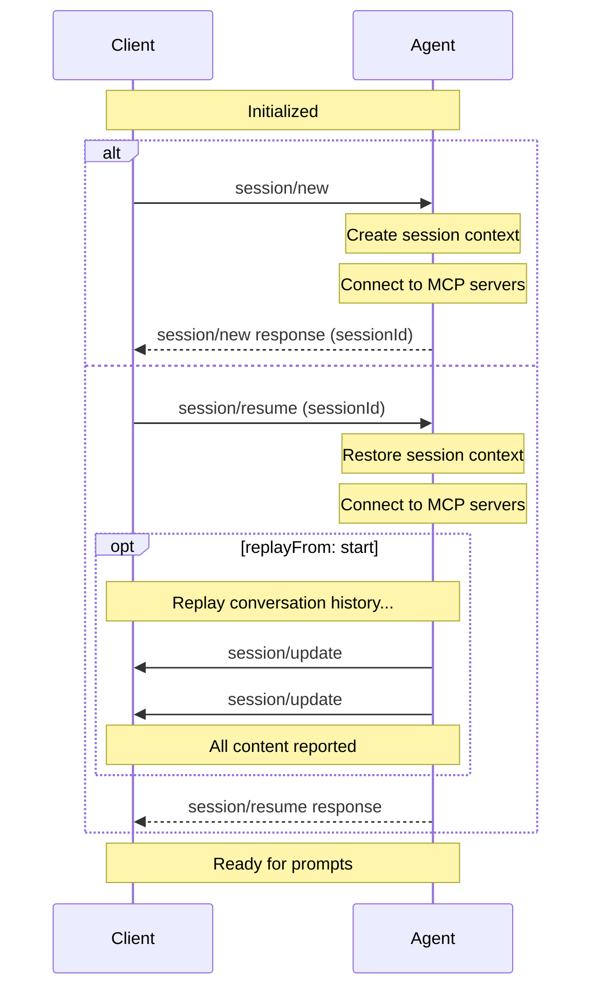

Sessions represent a specific conversation or thread between the [Client](/protocol/v2/overview#client) and [Agent](/protocol/v2/overview#agent). Each session maintains its own context, conversation history, and state, allowing multiple independent interactions with the same Agent.

Before creating a session, Clients **MUST** first complete the [initialization](/protocol/v2/initialization) phase to establish protocol compatibility and capabilities.

<br />



<br />

## Creating a Session

Clients create a new session by calling the `session/new` method with:

- The [working directory](#working-directory) for the session
- A list of [MCP servers](#mcp-servers) the Agent should connect to

```json
{
  "jsonrpc": "2.0",
  "id": 1,
  "method": "session/new",
  "params": {
    "cwd": "/home/user/project",
    "mcpServers": [
      {
        "type": "stdio",
        "name": "workspace-tools",
        "command": "/path/to/mcp-server",
        "args": ["--stdio"],
        "env": []
      }
    ]
  }
}
```

The Agent **MUST** respond with a unique [Session ID](#session-id) that identifies this conversation:

```json
{
  "jsonrpc": "2.0",
  "id": 1,
  "result": {
    "sessionId": "sess_abc123def456"
  }
}
```

## Initial Session State

Agents **MAY** include initial [configuration options](/protocol/v2/session-config-options) in `configOptions` and [available slash commands](/protocol/v2/slash-commands) in `availableCommands` in both `session/new` and `session/resume` responses. For example, a new session can return both:

```json
{
  "jsonrpc": "2.0",
  "id": 1,
  "result": {
    "sessionId": "sess_abc123def456",
    "configOptions": [
      {
        "configId": "brave_mode",
        "name": "Brave Mode",
        "description": "Skip confirmation prompts and act autonomously",
        "type": "boolean",
        "currentValue": false
      }
    ],
    "availableCommands": [
      {
        "name": "test",
        "description": "Run tests for the current project"
      }
    ]
  }
}
```

`availableCommands` is optional. Omission or `[]` means no initial commands are advertised, and empty lists are omitted when serializing setup responses. Agents **MUST NOT** send `null` for this field. Tolerant receivers treat `null` or a malformed non-array value like omission and skip invalid command items within an array.

Returning commands in the response avoids requiring command notifications before the `session/new` response. Agents can still advertise commands later or update the list through `available_commands_update` notifications. Each notification replaces the complete command list, including `[]` to clear it.

## Resuming Sessions

Agents that support the `session` method surface **MUST** support
`session/resume`, allowing Clients to reconnect to existing sessions. By
default, resume restores the session context without replaying prior
conversation history. Clients that need history replay can request it with
`replayFrom`.

To resume an existing session, Clients **MUST** call the `session/resume` method
with:

- The [Session ID](#session-id) to resume
- [MCP servers](#mcp-servers) to connect to
- The [working directory](#working-directory)
- Optionally, a `replayFrom` cursor

```json
{
  "jsonrpc": "2.0",
  "id": 2,
  "method": "session/resume",
  "params": {
    "sessionId": "sess_789xyz",
    "cwd": "/home/user/project",
    "mcpServers": [
      {
        "type": "stdio",
        "name": "workspace-tools",
        "command": "/path/to/mcp-server",
        "args": ["--mode", "workspace"],
        "env": []
      }
    ]
  }
}
```

When `replayFrom` is omitted or `null`, the Agent **MUST NOT** replay the
conversation history via `session/update` notifications before responding. It
restores the session context, reconnects to the requested MCP servers, and
returns once the session is ready to continue.

To request full history replay, Clients set `replayFrom` to
`{ "type": "start" }`:

Replay cursors are inclusive: replay includes the position identified by the
cursor. For `{ "type": "start" }`, that means replaying all retained conversation history.

```json
{
  "jsonrpc": "2.0",
  "id": 3,
  "method": "session/resume",
  "params": {
    "sessionId": "sess_789xyz",
    "cwd": "/home/user/project",
    "replayFrom": {
      "type": "start"
    }
  }
}
```

When `replayFrom.type` is `"start"`, the Agent **MUST** replay all retained
conversation history to the Client in the form of `session/update` notifications before
responding. User, agent, and thought messages can each be replayed as message
updates with full `content` arrays or as chunks.

Agents are not required to persist every inserted user message or retain it for
any minimum period. Live-only messages, including locally handled commands, may
be absent from replay. A successful prompt response confirms insertion, not
future availability in history; absence from replay does not contradict it.

For example, a user message from the conversation history:

```json
{
  "jsonrpc": "2.0",
  "method": "session/update",
  "params": {
    "sessionId": "sess_789xyz",
    "update": {
      "sessionUpdate": "user_message",
      "messageId": "msg_user_8f7a1",
      "content": [
        {
          "type": "text",
          "text": "What's the capital of France?"
        }
      ]
    }
  }
}
```

Followed by the agent's response:

```json
{
  "jsonrpc": "2.0",
  "method": "session/update",
  "params": {
    "sessionId": "sess_789xyz",
    "update": {
      "sessionUpdate": "agent_message",
      "messageId": "msg_agent_c42b9",
      "content": [
        {
          "type": "text",
          "text": "The capital of France is Paris."
        }
      ]
    }
  }
}
```

During replay, the Agent **MUST** include an opaque, unique `messageId` for each
replayed message. A retained user message inserted by `session/prompt` **MUST**
use the ID returned in that prompt response, including after reconnecting or
restarting the Agent. Replaying a command reports its message; it does not
execute the command again.

`user_message`, `agent_message`, and `agent_thought` updates
are upserts keyed by `messageId`; their `content` arrays replace the whole
message content, while chunk updates with the same `messageId` append content.

When replay reconstructs a message from its beginning using chunks, the Agent
**MUST** first send the corresponding message update (`user_message`,
`agent_message`, or `agent_thought`) with the same ID and `content: []`.
This clears any content the Client already holds before replayed chunks append.
A full-content message update can instead replace the retained content directly.

Clients apply replayed message updates and chunks in the order they are
received. If a message update with `content` arrives after chunks for the same
`messageId`, it replaces the content accumulated from those chunks. If chunks
arrive after a message update, they append to that update's current content.
Message updates that omit `content` can update other optional fields without
changing the current content.

When all requested replay entries have been reported to the Client, the Agent
**MUST** respond to the original `session/resume` request.

```json
{
  "jsonrpc": "2.0",
  "id": 3,
  "result": {}
}
```

The response **MAY** also include `configOptions` and `availableCommands` as
described in [Initial Session State](#initial-session-state), whether or not
history replay was requested.

## Closing Active Sessions

Agents that support the `session` method surface **MUST** support
`session/close`, allowing Clients to tell the Agent to cancel any ongoing work
for a session and free any resources associated with that active session.

To close an active session, Clients **MUST** call the `session/close` method with the session ID:

```json
{
  "jsonrpc": "2.0",
  "id": 2,
  "method": "session/close",
  "params": {
    "sessionId": "sess_789xyz"
  }
}
```

<ParamField path="sessionId" type="SessionId" required>
  The ID of the active session to close.
</ParamField>

The Agent **MUST** cancel any ongoing work for that session as if [`session/cancel`](/protocol/v2/prompt-lifecycle#cancellation) had been called, then free the resources associated with the session.

On success, the Agent responds with an empty result object:

```json
{
  "jsonrpc": "2.0",
  "id": 2,
  "result": {}
}
```

Agents MAY return an error if the session does not exist or is not currently active.

## Additional Workspace Roots

Agents that advertise `session.additionalDirectories` allow Clients
to include `additionalDirectories` on supported session lifecycle requests to
expand the session's effective workspace root set. Supported stable lifecycle
requests include `session/new` and `session/resume`.

```json
{
  "jsonrpc": "2.0",
  "id": 2,
  "method": "session/resume",
  "params": {
    "sessionId": "sess_789xyz",
    "cwd": "/home/user/project",
    "additionalDirectories": [
      "/home/user/shared-lib",
      "/home/user/product-docs"
    ]
  }
}
```

When present, `additionalDirectories` has the following behavior:

- `cwd` remains the primary working directory and the base for relative paths
- each `additionalDirectories` entry **MUST** be an absolute path
- omitting the field or providing an empty array activates no additional roots for the resulting session
- on `session/resume`, Clients must send the full intended additional-root list again; that list may differ from any previous or reported list as long as the request `cwd` matches the session's `cwd`, and omitting the field or providing an empty array does not restore stored roots implicitly

Clients **MUST** only send `additionalDirectories` when the Agent advertises `session.additionalDirectories`.

## Session ID

The session ID returned by `session/new` is a unique identifier for the conversation context.

Clients use this ID to:

- Send prompt requests via `session/prompt`
- Cancel ongoing operations via `session/cancel`
- Resume previous sessions via `session/resume`
- Close active sessions via `session/close`

## Working Directory

The `cwd` (current working directory) parameter establishes the primary file system context for the session. This directory:

- **MUST** be an absolute path
- **MUST** be used for the session regardless of where the Agent subprocess was spawned
- **MUST** remain the base for relative-path resolution
- **MUST** be part of the session's effective root set

When `session.additionalDirectories` is in use, the session's effective root set is `[cwd, ...additionalDirectories]`. This root set **SHOULD** serve as a boundary for tool operations on the file system.

## MCP Servers

The [Model Context Protocol (MCP)](https://modelcontextprotocol.io) allows Agents to access external tools and data sources. When creating a session, Clients **MAY** include connection details for MCP servers that the Agent should connect to.

MCP servers can be connected to using different transports. Agents advertise supported transports during initialization using `session.mcp.stdio`, `session.mcp.http`, and any extension-specific transport capabilities.

### Transport Types

Every MCP server object has a `type` discriminator that identifies its transport. Custom implementation-specific transport types **MUST** begin with `_`; unknown non-underscore transport types are reserved for future ACP variants.

#### Stdio Transport

When the Agent supports `session.mcp.stdio`, Clients can specify MCP servers configurations using the stdio transport.

<ParamField path="type" type="string" required>
  Must be `"stdio"` to indicate stdio transport
</ParamField>

<ParamField path="name" type="string" required>
  A human-readable identifier for the server
</ParamField>

<ParamField path="command" type="string" required>
  The absolute path to the MCP server executable
</ParamField>

<ParamField path="args" type="array">
  Command-line arguments to pass to the server. Omitted and empty values are
  equivalent.
</ParamField>

<ParamField path="env" type="EnvVariable[]">
  Environment variables to set when launching the server. Omitted and empty
  values are equivalent.

  <Expandable title="EnvVariable">
      <ParamField path="name" type="string">
        The name of the environment variable.
      </ParamField>
      <ParamField path="value" type="string">
        The value of the environment variable.
      </ParamField>
  </Expandable>
</ParamField>

Example stdio transport configuration:

```json
{
  "type": "stdio",
  "name": "workspace-tools",
  "command": "/path/to/mcp-server",
  "args": ["--stdio"],
  "env": [
    {
      "name": "API_KEY",
      "value": "secret123"
    }
  ]
}
```

#### HTTP Transport

When the Agent supports `session.mcp.http`, Clients can specify MCP servers configurations using the HTTP transport.

<ParamField path="type" type="string" required>
  Must be `"http"` to indicate HTTP transport
</ParamField>

<ParamField path="name" type="string" required>
  A human-readable identifier for the server
</ParamField>

<ParamField path="url" type="string" required>
  The URL of the MCP server
</ParamField>

<ParamField path="headers" type="HttpHeader[]">
  HTTP headers to include in requests to the server. Omitted and empty values are
  equivalent.

  <Expandable title="HttpHeader">
      <ParamField path="name" type="string">
        The name of the HTTP header.
      </ParamField>
      <ParamField path="value" type="string">
        The value to set for the HTTP header.
      </ParamField>
  </Expandable>
</ParamField>

Example HTTP transport configuration:

```json
{
  "type": "http",
  "name": "api-server",
  "url": "https://api.example.com/mcp",
  "headers": [
    {
      "name": "Authorization",
      "value": "Bearer token123"
    },
    {
      "name": "Content-Type",
      "value": "application/json"
    }
  ]
}
```

### Checking Transport Support

Before using stdio or HTTP transports, Clients **MUST** verify the Agent's capabilities during initialization:

```json highlight={7-10}
{
  "jsonrpc": "2.0",
  "id": 0,
  "result": {
    "protocolVersion": 2,
    "capabilities": {
      "session": {
        "mcp": {
          "stdio": {},
          "http": {}
        }
      }
    },
    "info": {
      "name": "my-agent",
      "title": "My Agent",
      "version": "1.0.0"
    }
  }
}
```

If `session.mcp.stdio` is omitted or `null`, the Agent does not support stdio transport.
If `session.mcp.http` is omitted or `null`, the Agent does not support HTTP transport.
Supplying `{}` means the Agent supports the corresponding transport.

Agents **SHOULD** connect to all MCP servers specified by the Client.

Clients **MAY** use this ability to provide tools directly to the underlying language model by including their own MCP server.
