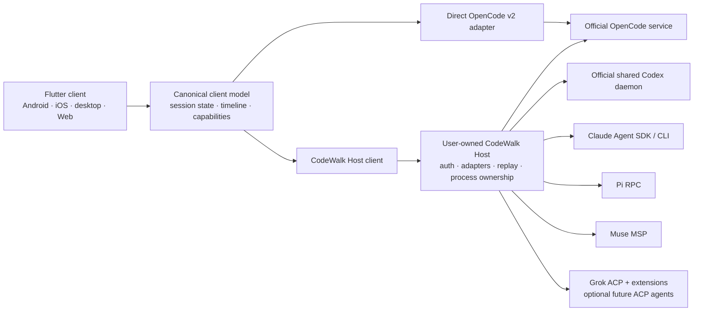

# CodeWalk v2 implementation plan

## 1. Status, objective, and recommendation

**Recommend a hybrid architecture: retain direct connections to official OpenCode v2 servers, and add a user-owned CodeWalk Host for other harnesses and optional host services. Implement that host in TypeScript on a pinned Node.js runtime.**

CodeWalk remains a Flutter application. It presents one session list, timeline, composer, attention inbox, and settings experience. Harness adapters preserve differences in permissions, session ownership, streaming, history, and available actions.

This is a planning deliverable. No files were changed, services started, dependencies installed, or tests executed. Read-only Git inspection confirmed revision `14fbf519`, with `plan/` untracked.

The evidence supports implementation, subject to bounded feasibility gates. It does **not** support these promises:

- Live control of every terminal session, regardless of harness.
- Reliable iOS notifications while CodeWalk is terminated using only a direct connection.
- Uniform file undo, permission bypass, sandbox behavior, or message queues.
- Lossless recovery of ephemeral OpenCode deltas after an upstream disconnect.
- A complete `dsh` client with resumed transcript history through its current ACP surface.

### Intended product behavior

A user connects a host, selects a project, and sees sessions grouped by project with harness badges. They can create sessions using installed harnesses, resume supported external sessions, follow background agents, answer questions, inspect changes, and continue work across devices.

The application distinguishes:

1. **What exists:** a discovered session or saved transcript.
2. **What is happening:** observed execution and background-task state.
3. **What CodeWalk can do:** supported, currently available controls.
4. **Who owns execution:** an official shared daemon, CodeWalk Host, or an external process.
5. **How fresh the view is:** live, reconnecting, cached, incomplete, or unknown.

A disabled action explains its reason. An absent capability never becomes a fabricated upstream feature.

### Connection architecture



**Direct mode** supports the official OpenCode API without requiring another service. It has truthful limitations: no CodeWalk host file-write service, no durable CodeWalk notification inbox, and no host-owned approval responder.

**Host mode** is the recommended multi-harness setup. It connects to existing official services when available and owns subprocesses only where required. It does not impersonate OpenCode.

Use native protocols for OpenCode, Codex, Claude, Pi, and Muse. Use ACP v1 plus verified Grok extensions for Grok. Keep generic ACP support bounded; ACP v2 and its remote transport proposals are not a stable foundation for the initial release.

The community reference supports this direction without establishing official behavior: OpenChamber isolates OpenCode wire knowledge and adds bounded replay, but remains OpenCode-only. Its implementation is evidence for architectural patterns, not a replacement contract. See [the pinned OpenChamber analysis](/home/ubuntu/MEGA/WORK/codewalk/plan/31-multi-harness-clients.md:96), especially §2.2–2.6.

---

## 2. Decision assessment

“Keep” preserves a product choice. “Change” identifies a recommended reconsideration, not an authorization to alter the baseline. Open-choice recommendations remain proposals for the orchestrator’s discussion.

| Decision | Verdict | Evidence and argument | Concrete direction, alternative, and tradeoff | Confidence / verification |
|---|---|---|---|---|
| **D01 — connection architecture** | **Unresolved; recommend hybrid** | OpenCode has an authenticated HTTP/SSE service. Codex has a shared local daemon. Claude, Pi, and Muse require a host integration. A universal mandatory gateway adds deployment cost to otherwise valid OpenCode installations. | Direct OpenCode plus optional CodeWalk Host; all other initial integrations use the host. Universal host is simpler internally but removes the lightweight OpenCode-only path. Direct adapters for every harness would multiply platform and process-management code. | **High** on need for a host; **medium** on cost of the hybrid boundary. Prove the same OpenCode fixtures through direct and host paths. |
| **D02 — rollout** | **Unresolved; recommend gated releases** | OpenCode is the core migration; Codex tests genuine multi-client ownership and a second rich protocol. Adding seven adapters immediately would delay lifecycle correctness. | First stable release: OpenCode v2 and shared-daemon Codex across all selected client platforms. Next: Claude and Pi. Then Muse and Grok, independently gated. Defer `dsh` until transcript recovery improves or label it a constrained preview. | **Medium-high.** Validate Codex compatibility and platform gates before assigning release dates. |
| **D03 — new skeleton, same repository** | **Keep** | Inventory shows v1 wire types and mutable state spread through very large presentation classes. Existing rendering, theme, voice, and local-data behavior still have value. | Build a new composition root and feature modules; port selected components. Preserve v1 on its maintenance line before removing its implementation. Avoid running mixed v1/v2 protocol reducers inside the new app. | **High.** Dependency-audit each reused component and retain relevant behavioral tests. |
| **D04 — same app ID** | **Keep, with migration consequences** | `android/app/build.gradle.kts:93–98` uses `com.verseles.codewalk` and Flutter’s build number. `pubspec.yaml:19` is `1.265.0+1790827338`. An in-place update retains local data but v1 servers become incompatible. | Preserve ID and signing identity. Use a strictly higher build number. Provide an explicit v2 migration screen and manual legacy recovery instructions. Alternative: separate app IDs permit coexistence but contradict the selected replacement experience and fragment updates. | **High** on Android mechanics; **medium** across all distribution channels. Test signed upgrade from the final v1 build and document downgrade limitations. |
| **D05 — allow-all ON, native where possible** | **Change recommended for mechanism and wording; retain selected default in baseline** | OpenCode session wildcard rules override agent denies; `always` persists project-wide. Codex approval policy is separate from sandboxing. Pi has no native approval enforcement. A single “allow all” label conceals material differences. | Recommended refinement: default-on **“Automatically approve eligible requests”**, preserve explicit denies and sandbox settings, use one-shot responses where native bypass changes policy semantics. Keep unrestricted access as a separately described native option. Literal native-bypass baseline is documented below and requires explicit ADR treatment. | **High.** Test deny rules, plan agents, child inheritance, administrator constraints, toggling off, and disconnected clients for every adapter. |
| **D06 — native usage plus experimental vendor queries** | **Keep** | Native quota signals exist for Codex, Claude, and Muse. OpenCode exposes tokens/cost and structured errors, not a universal remaining-quota API. Current v1 probing reads credential files and sometimes refreshes tokens. | Native first. Experimental host connectors are per-provider opt-ins with reviewed access methods, freshness, bounded polling, and no credential export or token refresh. Some providers remain unavailable. | **High** architecturally; **provider-specific** feasibility. Verify each endpoint and authentication policy separately before enabling it. |
| **D07 — notifications/background delivery** | **Unresolved; recommend host attention inbox first** | Event detection and device delivery are separate problems. Mobile suspension prevents a socket from being a universal background-delivery solution. | Host-owned attention records, foreground/local OS notifications, Android best-effort monitoring, optional user-configured notification sinks and Web Push. Do not promise terminated-app iOS alerts. A future notification-only broker would require a separate product decision. | **High** on architecture; **medium** on platform details. Require current Apple/Android documentation review and physical-device tests. |
| **D08 — user network, no hosted relay** | **Keep** | Direct official services and a host gateway can operate over LAN, VPN, TLS reverse proxy, or SSH. This avoids a CodeWalk account and centralized code transport. | Prefer OS-managed Tailscale/VPN and HTTPS/WSS. Native desktop may offer SSH forwarding. Browser clients require a browser-accessible secure endpoint; they cannot use native SSH or Unix sockets. | **High.** Test TLS, origin policy, tunnel loss, IPv6, and proxy authentication. |
| **D09 — six platforms** | **Keep** | Flutter already targets five; iOS has no project directory in the inspected inventory. Platform facilities differ significantly. | Support common chat functionality on all six. Publish a platform capability table for installation, terminals, voice, updates, and background delivery. Add iOS immediately to development and CI gates. | **High** for shared UI; **medium** for packaging/plugins. iOS signing and macOS host-management entitlements are release prerequisites. |
| **D10 — official OpenCode binary, SHA-256, service** | **Keep** | Source-backed distribution metadata provides artifact URL, SHA-256, and size; service lifecycle and pairing replace v1’s unmanaged `serve` process. | Download a tested version from official metadata, verify before extraction, use the shared service, and pair locally. Do not overwrite or restart an unrelated installation silently. | **High.** Test all shipping targets and installation ownership. The pack’s blanket “no Windows ARM64 binary” summary conflicts with detailed build evidence; gate on actual artifact metadata. |
| **D11 — desktop manages host/harnesses** | **Keep, scope management explicitly** | Desktop can manage local user services; Android/iOS/Web cannot install host binaries. Official distributions differ. | Install only selected harnesses. Distinguish CodeWalk-managed and externally managed installations. Mobile and Web connect and show host setup instructions; remote management is available only through an authenticated installed host with explicit management capability. | **High.** Verify installer return contracts, update rollback, and process ownership on Linux/macOS/Windows. |
| **D12 — English plan** | **Keep** | Product/process preference. | English engineering plan; application localization remains independent. | **High.** No feasibility issue. |
| **D13 — external sessions essential** | **Keep, qualify live attachment** | OpenCode shared service and Codex daemon support shared state/control. Claude SDK supplies history and resume but does not establish public live control of arbitrary running TUI processes. Pi and Muse also require ownership distinctions. | List external history and resume inactive sessions. Offer live attachment only where verified. Show “running externally,” “history only,” or “close the terminal session to continue here” where appropriate. | **High** on distinction; **medium** per harness. Run terminal↔CodeWalk continuity and simultaneous-client spikes. |
| **D14 — unified list and capability handling** | **Keep** | All seven have materially different operations, identities, and state richness. | Group by host/project, badge by harness, preserve lineage, and derive actions from negotiated session capabilities. Local archive must be labeled differently from native archive. | **High.** Test identical native IDs across hosts/runtimes and capability changes after reconnect. |
| **D15 — host runtime** | **Unresolved; recommend TypeScript/Node** | Claude’s richest supported integration is its TS SDK. Muse has an official TS client; Pi and ACP have TS surfaces. Dart AOT, Go, or Rust would require SDK sidecars or more protocol maintenance. | TypeScript on a pinned supported Node runtime, meeting Pi’s ≥22.19 requirement if using its SDK. Do not require Bun. Go/Rust remain options for a later measured bottleneck or packaging problem. | **Medium-high.** Packaging spike must prove SDK subprocesses, Unix-socket WebSockets, SQLite, PTY dependencies, and signed distribution on target hosts. |
| **D16 — independent planning process** | **Process-only** | Scheduling is not technical evidence. | Preserve this complete plan and its source references; technical conclusions remain independent of scheduling. | No implementation dependency. |

### Recommended reconsiderations

These are proposals for discussion, not silent baseline changes:

1. **Refine D05’s semantics.** Automatic approval should not silently turn a read-only agent into a writable agent or disable a sandbox. This changes the implementation mechanism more than the selected low-friction experience.
2. **Accept qualified external-session continuity under D13.** “Continue saved terminal work” is feasible more broadly than “control any currently running terminal process.” Uniform live control is blocked by upstream surfaces.
3. **Explicitly accept the D07/D08 background-delivery limit.** Without an approved native push path, iOS support includes foreground operation and catch-up, not guaranteed alerts after termination.
4. **Keep D04 only with a concrete recovery story.** Manual legacy download is not equivalent to frictionless downgrade or side-by-side installation under the same application ID.

---

## 3. Harness integration and capability matrix

Legend:

- **N** — official native surface.
- **B** — CodeWalk Host supplies the function, clearly identified as client/host behavior.
- **E** — vendor or community extension.
- **X** — experimental, preview, or version-gated.
- **—** — unavailable through the selected integration.
- **?** — evidence is insufficient; a spike is required.

### 3.1 Protocols, versions, and ownership

| Harness | Integration baseline | Selected transport | External history / resume | Live attachment and ownership |
|---|---|---|---|---|
| **OpenCode** | v2.0.21 source `8a8bd622`; recorded 2.0.22 delta `05018b88` | N HTTP `/api/*` + global SSE; direct or through host | N shared database and official session list; upstream v1 migration is separate | N through the shared service. `/api/session/active` is process-local; do not substitute another `serve` process and assume equivalent active state. |
| **Codex** | Generated protocol 0.159.3; daemon source `rust-v0.160.0` | N app-server v2 through shared daemon WebSocket-over-UDS; host gateway | N list/read/resume/fork/archive/delete | N shared daemon rejoin. CLI and daemon versions can differ. Embedded/no-daemon TUI sessions are a separate case. |
| **Claude Code** | Agent SDK 0.3.287 / CLI 2.1.287 | N SDK streaming input inside host; one live query/subprocess per active session | N `listSessions`, messages, resume, fork, rename/delete | B host-owned queries share across CodeWalk clients. Arbitrary live TUI attachment is **not established**. No use of private Remote Control APIs. |
| **Pi** | 1.0.0 | N RPC JSONL subprocess per active session | N resume/fork/entries; B listing through official `SessionManager` | Host owns RPC process. Concurrent control of an unrelated TUI’s active session file is not established. |
| **Muse Code** | 1.4.2; MSP v1, developer-preview distribution | N `muse serve` stdio, preferably official TS SDK | N list/read/resume/fork/delete; cursor recovery | Session leases and `sessionInUse` exist. Do not equate disk discovery with attachment to a different TUI process. |
| **Grok Build** | 1.0.46; ACP v1 plus `x.ai/*` | N authenticated WebSocket server, reached through host | N standard and E session methods/history | Server preserves state across reconnects. Shared-leader and unrelated TUI ownership need verification. |
| **DeepSeek `dsh`** | 0.2.0-rc.2 | N ACP v1 stdio through host, future opt-in | N list/resume inactive sessions; **no transcript replay** | Host-owned ACP sessions only. No adoption of the internal Web UI protocol. |

Sources: [OpenCode API dossier](/home/ubuntu/MEGA/WORK/codewalk/plan/11-opencode-v2-server-api.md:52), [Codex dossier](/home/ubuntu/MEGA/WORK/codewalk/plan/20-codex.md:19), [Claude dossier](/home/ubuntu/MEGA/WORK/codewalk/plan/21-claude-code.md:19), and dossiers [Pi](/home/ubuntu/MEGA/WORK/codewalk/plan/22-pi.md:9), [Muse](/home/ubuntu/MEGA/WORK/codewalk/plan/23-muse-code.md:1), [Grok](/home/ubuntu/MEGA/WORK/codewalk/plan/24-grok-build.md:9), [dsh](/home/ubuntu/MEGA/WORK/codewalk/plan/25-deepseek-dsh.md:9).

### 3.2 Chat, control, and agent work

| Harness | Text / reasoning / tool output | Busy / errors / retry | Mid-turn input | Stop and background work | Agent tasks and subagents |
|---|---|---|---|---|---|
| OpenCode | N typed flat messages; start/delta/end; authoritative final values | N execution events, structured errors, retry schedule | N steer and queue; durable inbox; cancellation before delivery | N interrupt; session-wide backgrounding of eligible work; individual child interrupt | N child sessions and synthetic parent continuation. No native todo API. |
| Codex | N item streams, reasoning, command output, diffs | N thread/turn state, typed errors and retry indication | N explicit steer; `turn/start` on active work also steers; X queue | N turn interrupt; X background terminals; child input is restricted | N plan updates, goals, child threads and collaboration items |
| Claude | N main-thread token streams, thinking and structured tools; subagent full-message forwarding | N `session_state_changed`, result outcomes, retries | N queued/folded input; `priority: now`; exact queue controls partly raw/version-specific | N interrupt, stop task, background task operations; process close is stronger | N task events/background snapshot; TodoWrite/Task tools only when actually enabled |
| Pi | N text/thinking/tool events | N errors/retries; settlement is `agent_settled`, not merely `agent_end` | N steer/follow-up queues and queue modes | N abort, bash abort, retry abort, queue clear | — built-in task/subagent system; E optional extensions |
| Muse | N typed items, output references, cursor-ordered deltas | N status/outcomes/retry/error codes | N queue/steer/replace/unqueue with command IDs | N interrupt/retract/cancel and task controls | N todos, goals, workflows, subagent controls |
| Grok | N ACP chunks/tools; E richer notifications | N RPC/stop reasons; E retry details | E interject/queue; semantics must be mapped exactly | N cancel; E task/subagent controls | N/E plan, subagents, scheduler and background work |
| dsh | N committed text/thought chunks and generic tools; no token-level stream | N errors and stop reasons; internal retries not exposed | — steer/queue; one prompt per session | N prompt cancellation/close | Internal features exist, but structured tasks/subagents are — over selected ACP |

### 3.3 Approvals, questions, quota, and selection

| Harness | Approval / allow-all | Forms and questions | Tokens / cost / context | Account quota | Model / effort / agent |
|---|---|---|---|---|---|
| OpenCode | N ordered rules; N wildcard bypass or B/client one-shot replies; project-wide `always` | N typed forms, including conditional fields | N tokens/cost; model limits; context precision must follow upstream semantics | No universal remaining quota; structured limit errors; optional X host connectors | N session agent/model/variant |
| Codex | N requests, native choices, policies, administrator constraints; sandbox separate | N/X user input and MCP elicitation, negotiated by version | N cumulative and last usage; context limit; no invented price | N account windows/credits and sparse updates | N models/efforts; X collaboration modes; subagent direct-input gate |
| Claude | N callback/modes and scoped rule suggestions; bypass limitations | N AskUserQuestion, plan approval, elicitation/dialogs | N estimated cost, model usage, context read | N rate-limit events; X explicit usage query | N models, efforts, agents; mode/model updates have defined application timing |
| Pi | — native permission enforcement; default unrestricted by absence; E dialogs are not inherently approvals | E extension UI | N session stats and model usage | — native windows | N models/thinking; — native agent picker |
| Muse | N server-minted choices, requirement guard, approval modes | N userInput requests/answers | N usage, estimated/partial cost, explicit context pressure | N usage windows and updates | N model/effort; — verified general agent picker |
| Grok | N ACP approvals; E native bypass; denies/hooks/admin policy remain relevant | E `x.ai/ask_user_question`; response contract needs confirmation | N/E usage and partial cost | E billing surface, shape ? | N config options; E agent profiles |
| dsh | N one-shot allow/reject; B automatic reply possible; no native allow-all mode | — elicitation/questions | N limited context/usage | — cost/quota | N negotiated model/effort; — agent picker |

### 3.4 Sessions, files, commands, and media

| Harness | Session lifecycle | Undo / redo | Files and search | Commands / skills / mentions | Terminal and attachments |
|---|---|---|---|---|---|
| OpenCode | N create/list/read/fork/rename/delete; B archive | N staged revert/commit/clear; optional file effects; no generic redo promise after commit | N list/find/read; B writes and content search; no native symbol search | N command/skill/reference discovery; structured file/agent/skill prompt inputs | N token-authenticated PTY and shell; N files/images/PDF input subject to route support |
| Codex | N create/list/resume/fork/rename/archive/delete | N practical fork-at-boundary; no file undo; rollback removed; revert currently unusable for ordinary threads | N fs APIs/fuzzy search; B conflict protection | B local command palette; N skills; file text references; typed app/plugin mentions | N command PTY but connection-scoped; B persistent host PTY; N images, other files through host context paths |
| Claude | N create/list/resume/fork/rename/delete; B archive | N checkpoint file rewind with exclusions; conversation fork/resume boundary; no redo API | N permission-gated read; B listing/search/write | N headless command/skill discovery; hide terminal-only commands; N `@path` expansion | B PTY; N images; B uploaded files referenced on host; PDF route validation required |
| Pi | N create/resume/fork/clone/rename; B list/archive; no native delete RPC | Conversation fork; no file undo | B browse/search/read/write | N extension commands/templates/skills; B local built-ins; no RPC `@file` expansion | N bash, B PTY; N images; B explicitly extracted document context |
| Muse | N create/list/resume/fork/rename/delete; B archive | Fork-at-cutpoint and retract; no established MSP file undo/redo | B browse/search/read/write | N structured skills; B local commands; N text `@path` | N user shell; B PTY; N images; B document handling |
| Grok | N/E create/list/load/resume/fork/rename/delete; archive ?/B | E conversation rewind only; files remain changed | E file/search/git APIs | N/E commands/skills; typed ACP resources; native built-ins must be verified | E terminal/PTY; images implemented but advertisement mismatch requires a compatibility gate |
| dsh | N create/list/resume/close; — fork/delete/rename through ACP; B archive | — | B separate host workspace services, not agent delegation | — commands/skill registry; N resource links | — native terminal; B workspace PTY; conditional N raster images |

**Notifications, exports, drafts, tabs, themes, accessibility, localization, and application voice are client/host capabilities for every harness.** Their presence must not imply corresponding upstream support.

### Important matrix qualifications

- A host file editor is **CodeWalk workspace access**, not an agent tool and not automatically governed by that agent’s sandbox.
- ACP client-side filesystem and terminal methods run on the **host**, never on the phone or browser’s filesystem.
- Local archive hides a row in CodeWalk. It does not stop, delete, or archive the upstream session.
- A host-captured transcript can replay only what the host observed. It cannot invent history that `dsh` does not expose.
- Do not depend on a nonexistent Dart ACP ecosystem. The broader dossier found community packages, contradicting older “none found” notes. This architecture uses the official TS ACP SDK on the host; any future Dart ACP dependency needs a conformance audit. See [ACP versions and SDK evidence](/home/ubuntu/MEGA/WORK/codewalk/plan/30-acp-and-unifying-protocols.md:79).

---

## 4. Architecture and interfaces

### 4.1 Proposed layout

Use a new skeleton in the existing repository. Keep modules cohesive; do not recreate dozens of pass-through use-case classes.

```text
lib/
  main.dart
  app/
    bootstrap.dart
    app_router.dart
    app_shell.dart
    dependency_graph.dart

  domain/
    identity.dart
    capabilities.dart
    sessions.dart
    timeline.dart
    execution.dart
    interactions.dart
    usage.dart
    commands.dart
    workspace.dart
    failures.dart
    events.dart
    harness_connection.dart

  connections/
    host/
      host_client.dart
      host_event_decoder.dart
    opencode_v2/
      opencode_connection.dart
      opencode_api.dart
      opencode_event_decoder.dart
      opencode_projection.dart
      opencode_capabilities.dart
      wire/
    transport/
      http_transport.dart
      sse_transport.dart
      websocket_transport.dart
      origin_credentials.dart

  state/
    host_registry.dart
    session_index.dart
    session_store.dart
    session_reducer.dart
    composer_controller.dart
    interaction_store.dart
    attention_store.dart
    workspace_controller.dart

  features/
    onboarding/
    sessions/
    chat/
    composer/
    interactions/
    tasks/
    workspace/
    usage/
    settings/

  platform/
    notifications/
    runtime_management/
    secure_storage/
    voice/
    desktop/
    networking/

  persistence/
    local_store.dart
    payload_store.dart
    migrations/v1_to_v2.dart

host/
  package.json
  src/
    main.ts
    server/
      http.ts
      websocket.ts
      pairing.ts
      authentication.ts
      origin_policy.ts
    runtime/
      registry.ts
      supervisor.ts
      installation.ts
      compatibility.ts
    adapters/
      adapter.ts
      opencode/
      codex/
      claude/
      pi/
      muse/
      acp/
      grok/
    state/
      session_index.ts
      projection.ts
      command_ledger.ts
      event_journal.ts
      interaction_coordinator.ts
    services/
      workspace.ts
      attachments.ts
      terminals.ts
      attention.ts
      notification_sinks.ts
      usage_connectors.ts
    storage/
      database.ts
      migrations/

protocol/
  codewalk-host-v1.schema.json
  compatibility.json
  fixtures/
    opencode/
    codex/
    claude/
    pi/
    muse/
    grok/
    dsh/
    canonical/

test/
  contract/
  unit/state/
  unit/migration/
  widget/v2/
  integration/v2/
  web/

host/test/
  contract/
  lifecycle/
  security/
  storage/
```

`dsh` needs a compatibility profile over ACP, not a parallel bespoke runtime. Add its adapter folder only if actual protocol differences justify one.

### 4.2 Boundary rules

- Widgets consume domain values and issue typed commands.
- No widget imports Dio, SDK types, wire DTOs, or a protocol method name.
- Adapters own wire parsing, native semantics, error mapping, and capability assessment.
- Transport code owns framing, authentication, disconnects, and request correlation.
- Reducers own deterministic state transitions.
- Platform services own notifications, voice, secure storage, installation, and window behavior.
- Host workspace services are separate from harness adapters.
- A connection failure never means a turn failed or stopped.
- No presentation-layer tool-name parsing. An adapter may recognize a versioned native tool schema; the resulting domain value is typed.

Retain `provider` if useful, using narrow stores and immutable snapshots. Keep `get_it` inside the composition root. Neither package requires a rewrite simply because the application skeleton changes.

### 4.3 Why TypeScript/Node

The initial host should use:

- Official Claude Agent SDK.
- Official Muse TS SDK, contingent on its packaged runtime behavior.
- Pi RPC, with official `SessionManager` used only for discovery where needed.
- Official ACP TS SDK for stable v1.
- Generated Codex protocol types from tested releases.
- Official OpenCode client or a narrow generated HTTP client.

Use a pinned, supported Node runtime meeting all selected SDK requirements. Do not require the user to manage a separate runtime manually in the desktop-managed path.

A small HTTP server plus WebSocket transport is enough. Do not adopt a distributed-services framework, message broker, ORM, or arbitrary remote plugin execution system.

SQLite is appropriate for the host journal, command ledger, and client metadata. The packaging spike must select a maintained binding with tested Linux ARM64, macOS, and Windows distribution. A candidate such as `better-sqlite3` is a **dependency proposal**, not a verified repository dependency; validate its current prebuild and signing story before adoption.

Dart AOT offers attractive packaging but loses the official Claude SDK advantage. Go/Rust offer strong process and networking primitives but add protocol/SDK integration work without an established bottleneck. Bun should remain optional until SDK and native-module compatibility are demonstrated.

### 4.4 Deliberate hybrid cost

Host mode normalizes native protocols into the CodeWalk domain. Direct OpenCode mode performs the same mapping in Dart.

That creates **one intentional duplicate adapter implementation**, confined to OpenCode. It is preferable to duplicating every harness across Flutter platforms, and preferable to requiring a host component for all existing OpenCode servers.

Control this cost with shared raw fixtures and canonical expected outputs. Both implementations must pass identical lifecycle, prompt, permission, form, and reconnect cases.

Do not expose direct Grok or direct Codex as additional Flutter adapters in the first release. The host can connect to their existing official servers.

### 4.5 Identity

```ts
type SessionRef = {
  hostId: string;       // CodeWalk connection/host identity
  runtimeId: string;    // exact harness installation + state store
  nativeSessionId: string;
};

type ProjectRef = {
  hostId: string;
  projectId: string;    // host-assigned opaque identity
};

type SessionLocation = {
  project: ProjectRef;
  directory: string;    // native host path, not a client-local path
  workspaceId?: string;
};
```

Rules:

- Native session IDs are never globally unique in CodeWalk.
- Harness kind is not enough to identify a runtime: two `CODEX_HOME` directories are distinct.
- Projects are not merged merely because their paths or Git remotes match.
- Path normalization occurs on the host with its filesystem rules; never lowercase every Windows or macOS path indiscriminately.
- Session identity survives project moves; location is mutable metadata.
- Fork lineage and parent-child lineage are separate relationships.
- Direct OpenCode profiles use stable local profile identity. `/api/info.pid`, URL, and a service-process registration ID must not become permanent database identity.
- Associating a direct profile with a new host runtime requires explicit connection mapping, not heuristic session merging.

### 4.6 Capabilities as structured contracts

A Boolean `supportsUndo` or `supportsPermissions` is insufficient.

```ts
type Capability = {
  support: "native" | "host" | "extension" | "experimental" | "unsupported";
  available: boolean;
  reason?: string;
  sourceVersion: string;
  limits?: Record<string, number | string | boolean>;
};

type SessionCapabilities = {
  history: {
    list: Capability;
    read: Capability;
    resume: Capability;
    liveAttach: Capability;
    fork: Capability;
    archive: Capability;
    delete: Capability;
  };
  input: {
    steer: Capability;
    queue: Capability;
    cancelQueued: Capability;
    images: Capability;
    documents: Capability;
  };
  permissions: {
    interaction: Capability;
    persistentScopes: string[];
    automaticApproval: Capability;
    sandboxControl: Capability;
  };
  recovery: {
    conversationFork: Capability;
    stagedRevert: Capability;
    fileCheckpointRestore: Capability;
    redo: Capability;
  };
};
```

Effective capability is the intersection of:

1. Adapter implementation.
2. Tested upstream version/schema.
3. Negotiated server capabilities.
4. Installation and account configuration.
5. Current session state and ownership.
6. Client platform facilities.

Capabilities carry an epoch/revision and can change after authentication, reconnect, model selection, or upstream update.

Read-only discovery should remain usable when an optional feature fails. Unsupported policy-sensitive mutations fail closed with a specific explanation.

### 4.7 Connection and adapter contracts

```ts
interface HarnessAdapter {
  inspect(): Promise<RuntimeDescriptor>;
  listSessions(query: SessionQuery): Promise<SessionPage>;
  readSession(ref: SessionRef, query: HistoryQuery): Promise<SessionSnapshot>;
  observe(refs: ObservationRequest): AsyncIterable<AdapterEvent>;
  execute(command: HarnessCommand): Promise<NativeReceipt>;
  recover(request: RecoveryRequest): Promise<RecoveryResult>;
  closeConnection(): Promise<void>;
}

type HarnessCommand =
  | { kind: "session.create"; requestId: string; input: CreateSession }
  | { kind: "prompt.submit"; requestId: string; ref: SessionRef; input: Prompt }
  | { kind: "execution.interrupt"; requestId: string; ref: SessionRef;
      expectedExecutionId?: string }
  | { kind: "interaction.reply"; requestId: string; reply: InteractionReply }
  | { kind: "selection.update"; requestId: string; ref: SessionRef;
      selection: SessionSelection }
  | SessionLifecycleCommand
  | BackgroundTaskCommand;
```

Keep separate interfaces for `WorkspaceService`, `TerminalService`, `RuntimeManager`, and `NotificationSink`. A harness should not implement dozens of host utilities merely to satisfy an oversized common interface.

### 4.8 Event envelope and provenance

```ts
type EventEnvelope = {
  protocolVersion: 1;
  eventId: string;
  stream: { id: string; epoch: string; sequence: string };
  scope: HostScope | RuntimeScope | ProjectScope | SessionScope;
  recordedAt: string;
  source: {
    harness: string;
    runtimeVersion: string;
    adapterVersion: string;
    nativeType: string;
    nativeEventId?: string;
    nativeCursor?: string;
    nativeAggregateSequence?: string;
  };
  payload: DomainEvent;
};

type DomainEvent =
  | SessionUpserted
  | SessionRemoved
  | TimelineItemUpserted
  | TimelineFieldDelta
  | TimelineItemsRetracted
  | ExecutionChanged
  | InboxChanged
  | InteractionOpened
  | InteractionUpdated
  | InteractionResolved
  | WorkGraphChanged
  | UsageChanged
  | CapabilitiesChanged
  | RecoveryRequired;
```

Host sequence orders **host observations**, not all upstream actions. Native cursors remain opaque. OpenCode durable sequence numbers are scoped to their aggregate and can have gaps caused by internal events; do not assume every missing integer means a lost public event.

Preserve raw provenance without making raw JSON the UI model:

- Known fields map into typed domain values.
- Unknown enum values remain representable.
- Unknown events go to bounded diagnostics and may invalidate a relevant projection.
- Unknown interactive requests are visibly unsupported and resolved only through a verified native decline/cancel path.
- Raw payload capture is bounded and redacted; it is not an indefinite second archive of secrets and source code.

### 4.9 Timeline and execution state

```ts
type SessionRuntimeState = {
  connection: "online" | "reconnecting" | "offline" | "authRequired";
  history: "fresh" | "stale" | "recovering" | "partial";
  execution:
    | { state: "idle"; outcome?: Outcome }
    | { state: "running"; executionId?: string }
    | { state: "waiting"; reasons: InteractionRef[] }
    | { state: "retrying"; attempt?: number; retryAt?: string }
    | { state: "interruptionRequested"; executionId?: string }
    | { state: "unknown"; lastObservedState?: string };
  ownership: Ownership;
  background: { active: number; unknown: number };
};
```

Execution and connectivity are orthogonal. A disconnected session may still be running.

Timeline items should include user input, assistant text/reasoning, tool execution, shell output, system/synthetic notices, compaction, selection changes, plan updates, and unknown items.

For text and reasoning:

- Use stable native item IDs and block ordinals.
- Apply deltas only to their stream generation.
- Authoritative completed values replace provisional values.
- A retry that reuses a message ID starts a new generation.
- A completion guard must permit legitimate retry/reset/retraction behavior.

For tools:

- Preserve input streaming separately from parsed input.
- Preserve tool lifecycle, output availability, truncation, attachments, and error status.
- Tool success does not imply session completion.
- Tool outputs remain lazily expandable and byte-bounded.

The OpenCode reference reducer demonstrates authoritative text replacement and inbox reconciliation at [lines 750–790 and 904–938](/home/ubuntu/MEGA/WORK/codewalk/plan/opencode-v2-src/client-solid-data.reference-reducer.ts:750). Port semantics, not its entire application architecture.

### 4.10 Prompt admission, optimism, and ambiguous mutations

Use a persistent local command ID for every mutation. Distinguish:

```text
draft → submitting → admitted → delivered → settled
                   ↘ rejected
                   ↘ outcome unknown
```

“Admitted” means accepted for execution, not completed.

**OpenCode:** use its supported client message ID and exact payload replay semantics. Preserve the official ascending ID shape because message ordering and revert boundaries use IDs. The prompt schema accepts `id` and returns a durable inbox item; v1’s prohibition on sending IDs is obsolete for this adapter. See [prompt contract lines 392–410](/home/ubuntu/MEGA/WORK/codewalk/plan/opencode-v2-src/protocol-groups/session.ts:392) and [ID generation](/home/ubuntu/MEGA/WORK/codewalk/plan/opencode-v2-src/schema/identifier.ts:1).

**Muse:** retain its UUIDv7 `commandId`, value-identical replay, admission acknowledgments, and authoritative view-stream outcomes.

**Codex and Claude:** use supplied client IDs/UUIDs for correlation. Do not infer idempotency from the presence of a correlation field.

**Pi, ACP, and other uncertain operations:** a transport timeout after submission is an ambiguous outcome. Reconcile before offering retry.

The host command ledger deduplicates repeated client requests, but cannot guarantee exactly-once upstream execution across a crash between submission and acknowledgment. Record that uncertainty explicitly.

Do not:

- Match repeated user messages by content.
- Automatically retry slash commands without verified idempotency.
- Resend an ambiguous voice reply.
- Send offline drafts automatically after reconnection.
- Display a local queue as an upstream queue.

### 4.11 Replay and recovery

**Host client reconnect**

1. Authenticate and negotiate protocol.
2. Request events after the last host stream cursor.
3. Replay when retained.
4. Otherwise return `RecoveryRequired` and a snapshot at an explicit host watermark.
5. Apply events after that watermark.

Use bounded journal retention, initially **24 hours or 64 MiB per runtime**, whichever limit is reached first, with lazy output blobs and configurable lower limits. These are proposed budgets, subject to measurement.

Durable interactions and command receipts need separate retention from high-volume deltas. Completed transcript recovery should usually come from the harness.

**OpenCode upstream reconnect**

The raw source confirms a 4,096-event subscriber buffer and disconnect-on-overflow; there is no upstream SSE replay. See [event-feed.ts:8–67](/home/ubuntu/MEGA/WORK/codewalk/plan/opencode-v2-src/server/event-feed.ts:8).

After `server.connected`:

- Refresh active executions.
- Reconcile watched sessions, recent history, inbox, permissions, forms, and child relationships.
- Optionally use the experimental session log from a known durable cursor.
- Track `log.synced` watermarks without treating unpublished sequence positions as missing events.
- Mark interrupted text prefixes as incomplete until an authoritative ending arrives.

The experimental log is useful but must not become an unconditional prerequisite. Stable snapshot recovery remains the fallback. See [log contract lines 724–739](/home/ubuntu/MEGA/WORK/codewalk/plan/opencode-v2-src/protocol-groups/session.ts:724).

Snapshots and buffered events cannot manufacture an atomic upstream snapshot if the API provides no watermark. Recovery logic must favor authoritative completed values and expose uncertainty for in-flight content.

### 4.12 Multi-client coordination

CodeWalk Host serializes its own mutations per session and coordinates competing approval replies. It cannot lock out external official clients.

Use:

- Expected turn IDs for steering where supported.
- Native request IDs plus requirement/revision guards.
- Host compare-and-set for host-owned metadata.
- Native resolved events to dismiss prompts on every client.
- A mutation receipt distinguishing accepted, stale, already resolved, and unknown.

Muse requires its `currentRequirementId`; a stage-one approval must never resolve stage two. See [MSP approval contract lines 35–75](/home/ubuntu/MEGA/WORK/codewalk/plan/harness-src/muse/msp-v1-stable.d.ts:35).

For external changes:

- Update model/agent chips from authoritative state.
- Keep drafts independent from current model state.
- Warn about a changed target before destructive history operations.
- Do not silently reset settings merely because the user opened a session.
- Do not apply global automatic-approval defaults to every discovered external session.

### 4.13 Host lifecycle

CodeWalk Host runs as a user service. Closing the app does not terminate agents.

The runtime registry distinguishes:

- External service: observe/connect; no implicit stop/update.
- CodeWalk-managed official service: lifecycle through official commands.
- Host-owned subprocess: supervise and recover according to adapter semantics.

For Claude/Pi/MSP subprocesses, a phone disconnect does not close stdin. Retain active and waiting sessions. Idle eviction is allowed only when the adapter can persist and later resume without losing active background work.

Host restart behavior must report actual loss:

- Official OpenCode/Codex services may continue independently.
- Host-owned SDK/RPC processes may terminate or lose their control channel.
- Reconstruct from native history where possible.
- Never mark an interrupted process as successfully completed.
- Never replay a prompt automatically merely to restore a previous “running” indicator.

---

## 5. UX and behavior

### 5.1 Mobile-first navigation

Use three primary destinations: **Sessions**, **Workspace**, and **Settings**. Attention is a persistent badge/inbox reachable from the session shell.

On phones:

- Full-width conversation with a compact project/harness header.
- Bottom sheets for model, agent, effort, permissions, and task details.
- Child sessions open with a parent breadcrumb.
- Required interactions remain reachable above the keyboard.
- Background work is summarized without filling the timeline with repeated status messages.

On wide screens:

- Session/project navigation on the left.
- Conversation in the center.
- Optional workspace, changes, usage, or task pane on the right.
- Preserve tabs and configurable keyboard navigation.

Keep Material You, dynamic color, contrast controls, text scaling, reduced motion, RTL, and semantic labels. Streaming should not repeatedly interrupt screen readers.

### 5.2 Onboarding and installation

Present two entry paths:

1. **Connect to a host or OpenCode service.**
2. **Set up this computer**, desktop only.

Host setup installs CodeWalk Host first, then only the harnesses the user selects. Show installed version, management owner, authentication state, and compatibility.

For OpenCode:

- Probe authenticated `GET /api/info`.
- Validate JSON shape and version; HTML 200 is not success.
- Reject v1 with an actionable migration/legacy-client screen.
- Detect an existing shared service before starting one.
- Verify artifact URL, expected size, and SHA-256 before extraction.
- Use a versioned installation directory and atomic activation.
- Avoid changing the user’s global `opencode` executable unless the chosen install mode explicitly manages it.
- Start or attach through `opencode service`, normally port 49374.
- Use local automatic pairing for desktop-managed setup.
- Mobile/Web users scan or enter a one-time pairing link/code.

Pairing codes expire after five minutes; tokens last thirty days, and password rotation invalidates them. These details are verified in [pairing.ts:7–30](/home/ubuntu/MEGA/WORK/codewalk/plan/opencode-v2-src/server/pairing.ts:7) and [auth.ts:16–54](/home/ubuntu/MEGA/WORK/codewalk/plan/opencode-v2-src/server/auth.ts:16). Pair with a non-HTML `Accept` header; otherwise the route follows browser-cookie behavior, as shown in [handlers_server.ts:29–49](/home/ubuntu/MEGA/WORK/codewalk/plan/opencode-v2-src/server/handlers_server.ts:29).

Do not consume pairing links through a preview fetch before the pairing action.

The source-backed artifact inventory includes Windows ARM64, while the install script excludes that target. Use the artifact manifest and shipping-platform test results rather than repeating the research index’s simplified claim. See [distribution details](/home/ubuntu/MEGA/WORK/codewalk/plan/11-opencode-v2-server-api.md:1971).

### 5.3 Host authentication and network access

CodeWalk Host should use:

- Loopback binding by default.
- Explicit remote-access configuration.
- Short-lived, single-use pairing invitations.
- Per-device revocable credentials.
- OS secure storage on native clients.
- HTTPS/WSS or an authenticated user tunnel.
- Exact browser origin allowlists.
- No long-lived credentials in WebSocket query strings, logs, exports, or deep links.

For browsers, authenticate over HTTPS and obtain a short-lived WebSocket ticket, or use a same-origin secure session cookie with CSRF/origin protections. Ticket handling must redact access logs.

Direct OpenCode Web mode needs verified CORS and authenticated streaming. Do not assume native `EventSource` can send Basic authorization headers. Use the tested browser HTTP streaming path.

Proxy authentication must coexist with upstream authentication. v1’s behavior where a proxy Bearer header replaces Basic cannot simply be retained. Prefer a user-controlled same-origin gateway where the proxy terminates its own auth and the gateway applies upstream auth.

Keep provider credentials on the host. CodeWalk’s client credential is authority to use the host, not a copy of the provider account token.

### 5.4 External sessions

The list displays origin and control status:

- **Live shared session**
- **Running in another application**
- **Saved session**
- **History only**
- **Owned by CodeWalk Host**
- **Ownership unknown**

Per harness:

**OpenCode:** share the same official service and state store. List roots with `parentID=null`, discover children separately, and always send `location.directory` on creation. Session creation ignores the directory header and otherwise may use the service’s home directory. See [session API details](/home/ubuntu/MEGA/WORK/codewalk/plan/11-opencode-v2-server-api.md:766).

**Codex:** discover the managed daemon and attach through its owner-only socket. Do not start a separate TCP app-server and claim it controls the same live sessions. `thread/resume` can rejoin running threads and replay pending requests. Negotiate against the running daemon version, not only the CLI version. The inspected [daemon README](/home/ubuntu/MEGA/WORK/codewalk/plan/codex-src/app-server-daemon-README.md:13) also documents fallback to embedded servers and inherited environment.

**Claude:** use official SDK history functions, including programmatic sessions where appropriate. Continue inactive terminal sessions through SDK resume. Leave SDK identity truthful; do not spoof a TUI entrypoint to alter terminal visibility. Arbitrary active-TUI takeover is excluded until an official surface proves it safe.

**Pi:** use official session listing and entry APIs. Treat unrelated live TUI writers as external; require quiescence or fork before adopting a session when exclusive ownership cannot be established.

**Muse:** honor session leases and `sessionInUse`. Expose read-only history while another owner holds execution.

**Grok:** verify the shared server/leader topology separately from history resume. Native remote TUI attachment is promising but not proof of every concurrency scenario.

**dsh:** show a clear “earlier transcript unavailable through this connection” boundary on resumed sessions. A locally captured transcript may supplement it, with provenance.

Do not tail or modify private transcript formats as a hidden universal fallback.

### 5.5 Composer

The composer contains independent controls for:

- Harness, chosen at session creation.
- Agent/persona, where supported.
- Model and variant/reasoning effort.
- Delivery mode while running.
- Approval automation.
- Attachments and context references.

Model and agent selection timing is visible:

- OpenCode selections change session state for subsequent provider turns.
- Codex fields may apply to a new or active turn depending on the method.
- Claude model changes apply from a subsequent API call.
- `dsh` pins its selected route for the current prompt.

Do not store one generic “effort” enum. Render the server-provided options and retain its native value.

While busy, show only verified delivery actions:

- **Steer current work**
- **Queue next turn**
- **Send now**, if its semantics are distinct
- **Keep as draft**, when no native delivery option exists

Queued messages are visible, individually identified, and cancellable only when the protocol supports it. A cancellation racing delivery updates the actual outcome rather than deleting the bubble optimistically forever.

### 5.6 Commands, skills, and mentions

Use one palette with provenance:

- **CodeWalk action:** opens UI or invokes a typed operation.
- **Harness command:** discovered and sent through that harness’s command surface.
- **Skill:** discovered by stable identity/path, with its native invocation format.
- **Extension command:** labeled as extension-provided.

Avoid inventing server-side slash commands:

- OpenCode uses `/api/command` and its command endpoint.
- Codex built-ins are client/TUI behavior; map supported actions to RPCs.
- Claude hides terminal-only commands.
- Pi distinguishes extension commands/templates/skills from TUI built-ins.
- Muse uses structured skill inputs.
- Grok command execution requires verified extension behavior.
- `dsh` does not expose commands through its ACP profile.

Skills are not interchangeable text snippets. Preserve scope, enabled state, path/ID, dependencies when supplied, and invocation semantics:

- OpenCode prompt `skills[]`.
- Codex skill input plus expected text marker.
- Claude headless skill command or native tool.
- Pi `/skill:name`.
- Muse `skill` input part.

`@` autocomplete should distinguish files, agents, skills, resources, and connectors. Encode the native representation, not just a decorated string. Remove OpenCode v1 symbol search unless a new host service supplies an explicitly separate capability.

### 5.7 Permissions and sandbox semantics

Maintain separate values:

```text
Automatic approval preference
Native approval mode
Persistent grants
Agent policy / explicit denies
Sandbox and execution environment
Host workspace permissions
```

Never present these as one switch.

#### Baseline D05 implementation consequences

If the selected “native policy when supported” means native unrestricted modes:

- OpenCode uses a session ruleset that can override agent denies and is inherited by new children.
- Codex still requires a separate sandbox choice; `never` means no approval prompts, not universal permission to escape the sandbox.
- Claude bypass mode has startup and policy restrictions; it does not answer human questions.
- Muse selects a server-supported approval mode.
- Grok bypass retains documented deny/hook/admin constraints.
- Pi’s tools are already unrestricted unless another isolation mechanism is installed.
- `dsh` requires host one-shot approval responses rather than interpreting its `never` policy as approval; there, `never` is reject.

The UI must explain the effective behavior and show administrator restrictions.

#### Recommended refinement

Preserve default-on automation while preferring **one-shot acceptance of eligible approval requests** where native bypass would erase meaningful restrictions.

For OpenCode, this matches the official client’s auto-approve mechanism. Explicit denies never become approval requests, so they remain enforced. The raw implementation combines agent rules before session rules and uses last-match evaluation; the distinction is consequential. See [permission.ts:87–178](/home/ubuntu/MEGA/WORK/codewalk/plan/opencode-v2-src/core/permission.ts:87) and [auto-approval options](/home/ubuntu/MEGA/WORK/codewalk/plan/12-opencode-v2-events-and-schemas.md:627).

Global settings are defaults for newly created or explicitly adopted sessions. Opening an external session must not change its policy.

Disabling automation:

- Stops the responder immediately.
- Does not claim to revoke already granted native permissions.
- Does not restore an old full ruleset over external changes.
- Offers separate management of persistent grants.
- Reports child inheritance and existing-child differences.

In host mode, one host coordinator answers eligible requests. In direct mode, client-side automatic approval works only while connected.

### 5.8 Questions and forms

Questions never become approvals merely because they arrive through an approval callback.

Render:

- Strings, numbers, integers, booleans, single/multiple choices.
- Conditional visibility and requiredness.
- Native IDs and option values.
- External-action fields.
- Secret input when the upstream contract declares it.
- Cancellation, expiry, replacement, and resolved-by-another-client states.

OpenCode forms support more than v1’s question wizard; `sessionID` can also be the special global owner for some elicitations. See [form.ts:18–172](/home/ubuntu/MEGA/WORK/codewalk/plan/opencode-v2-src/schema/form.ts:18).

Preserve answers on network failure. Do not split free text on commas. Revalidate pending status before retrying submission. Unknown field types require an explicit unsupported-form state, not a guessed answer.

### 5.9 Background agents, tasks, and completion

Use a **work graph** with typed nodes:

```text
Session / execution
  ├─ foreground child session
  ├─ background child session
  ├─ background shell/task
  ├─ workflow
  └─ goal
```

Every edge records native provenance and control capability. Parent-child relationships must come from native identifiers; remove positional “Nth tool corresponds to Nth child” matching.

Presentation:

- Parent timeline includes compact child/task cards.
- Header shows running and waiting counts.
- Expanding a card opens its own transcript or output.
- Child approvals/forms surface in the parent attention dock with origin.
- A child’s composer is read-only when direct input is unsupported.
- Cancellation describes its scope.

Do not equate:

- Parent idle with all descendants complete.
- A subagent tool returning with the child completing.
- A background notification with a user-requested turn.
- Interrupting a parent with stopping all background work.

OpenCode background completion can automatically resume the parent. Its session-wide background endpoint affects all eligible blocking work; there is no per-child equivalent for that operation. Child interruption is supported. See [subagent lifecycle evidence](/home/ubuntu/MEGA/WORK/codewalk/plan/12-opencode-v2-events-and-schemas.md:946).

The known nested-background completion bug needs a regression fixture and live acceptance test. CodeWalk should show the observed child state and outstanding descendants, not “repair” upstream execution with synthetic prompts.

Task lists remain agent-controlled. Native plans/todos are read-only unless the protocol exposes a specific user operation. OpenCode’s removed todo endpoint must not be recreated by parsing arbitrary assistant prose.

### 5.10 Usage and quota

Display four distinct concepts:

1. **Context:** current model-context occupancy or an explicitly labeled estimate.
2. **Tokens:** turn/session accounting with cache and reasoning distinctions.
3. **Cost:** currency amount, source, scope, partial/estimated status.
4. **Quota:** account/model window, limit state, reset, credits, observation time.

Never divide lifetime token usage by a context limit. Never derive remaining subscription quota from token totals. Never sum cumulative snapshots as though they were deltas.

Usage records need:

```ts
type UsageObservation = {
  scope: UsageScope;
  kind: "tokens" | "context" | "cost" | "quota";
  source: "nativeEvent" | "nativeRead" | "hostConnector" | "estimate";
  observedAt: string;
  freshness: "fresh" | "stale" | "unknown";
  completeness: "complete" | "partial";
  values: UsageValues;
};
```

Preserve sparse updates correctly. Codex account rate-limit events are sparse; Claude percentage scales differ between push and experimental pull surfaces; Muse percentages may exceed 100. These are adapter concerns.

Experimental vendor connectors:

- Disabled by default, per provider.
- No hidden shell session.
- No reading or forwarding Claude OAuth credentials.
- No refresh-token writes or provider-auth file mutation.
- No assumption that OpenChamber’s credential access is permitted for CodeWalk.
- Stop on authentication failure and honor `Retry-After`.
- Display “unavailable” rather than an invented zero.

### 5.11 Files, attachments, terminal, and recovery

**Workspace files**

Keep browsing, quick open, read, diff, selection-to-context, and a focused editor.

Host writes require:

- An explicitly configured workspace root.
- Host-side containment and symlink checks.
- Size and binary-file limits.
- Expected content hash or equivalent conflict detection.
- Atomic replacement where supported.
- A conflict response when the file changed externally.

Do not use hidden OpenCode shell sessions for file mutations. Direct OpenCode mode remains read-only unless the user connects a host workspace service.

**Attachments**

Negotiate MIME and size limits. Show whether an attachment is:

- Native model input.
- A host file reference.
- Extracted text.
- Unsupported.

OpenCode files can use `data:` or host `file:` URIs. Codex accepts data/local images, not arbitrary HTTP image URLs. Muse’s 10 MiB frame cap must account for base64 overhead. Pi images are native, while document extraction is a host feature.

Do not silently convert PDFs into a lossy text prompt. Offer extraction with page/size limits and provenance. Uploaded files live in host-owned bounded storage and are cleaned only after references expire.

**Terminals**

Retain xterm rendering, mobile extra keys, resize, copy, and selection behavior.

Differentiate:

- Harness-native terminal.
- User shell command added to the transcript.
- CodeWalk workspace terminal.

Codex `command/exec` processes are connection-scoped. A host-retained upstream connection can survive a phone disconnect, but not necessarily host/upstream connection loss. Do not claim durable terminal reattachment without a tested host PTY implementation.

**Undo**

Expose concrete operations:

- Fork conversation from here.
- Stage OpenCode revert.
- Restore files from an available checkpoint.
- Clear a staged revert.
- Commit a staged history change.

OpenCode `revert/stage` may apply file changes immediately when requested; it is not merely a harmless preview. Use a separate diff preview first. Verify clear/commit behavior before labeling any control “Redo.” See [revert contract lines 531–563](/home/ubuntu/MEGA/WORK/codewalk/plan/opencode-v2-src/protocol-groups/session.ts:531).

Claude checkpoint rewind excludes Bash and subagent edits and has no general redo. Codex and Pi do not provide file undo. Grok rewind changes conversation history only. Do not simulate universal undo through `git reset`, checkout, or unconditional reverse patching.

### 5.12 Notifications and bounded polling

The host detects attention events and stores a durable inbox. Device delivery is an independent capability.

Attention records include session reference, native cause ID, category, resolution state, preview policy, and target navigation. Deduplicate by cause, not by a global cooldown that suppresses unrelated sessions.

Initial delivery:

- Foreground: in-app attention and optional sound.
- Desktop background: local notifications while the application/tray process is running.
- Android: optional supported foreground monitoring; sparse OS-scheduled recovery where appropriate.
- Web: in-page notifications; optional user-hosted Web Push after a dedicated spike.
- iOS: foreground/local delivery and catch-up; no guaranteed terminated-app alerts in the baseline.

A notification-only external service or third-party sink is a separately configured option. Do not embed APNs provider credentials in distributed clients or user host packages.

| Purpose | Trigger and cadence | Bound / invalidation | Cost policy |
|---|---|---|---|
| OpenCode stream liveness | Heartbeats; reconnect after approximately 45 seconds without bytes | Backoff with jitter; reset after healthy connection | One upstream SSE stream per runtime |
| Recovery | Reconnect, foreground return, explicit gap | Watched sessions and recent roots; bounded history pages | No per-delta message fetch |
| Silent active-state safeguard | Only known-active sessions with missing relevant progress | At most one runtime-level reconciliation per 60 seconds; stop when settled | No continuous polling of every historical session |
| External history discovery | Filesystem metadata changes; list screen open | Debounce changes; fallback at most every 60 seconds while relevant | Page metadata; no whole-transcript scan loop |
| Catalogs | Native invalidation event or opening stale selector | Suggested 10-minute soft cache | No background catalog polling |
| Native quota reads | Connect/account change/open quota panel | Suggested 60-second minimum read interval; native events preferred | Coalesce per account |
| Experimental usage connector | Explicit opt-in and active interest | Suggested 15-minute minimum; backoff, expiry, `Retry-After` | No background prompts or shell sessions |
| Authentication flow | Native specified interval, otherwise bounded progressive polling | Stop at expiry/cancel | No permanent auth-status loop |

All cadence values are proposed limits to validate, not claimed upstream requirements.

Replace the three overlapping Android monitoring paths with one observation/attention coordinator. Overlay and car surfaces consume its records; they must not independently discover completion or auto-approve requests.

---

## 6. Rewrite, reuse, discard, and migration

### 6.1 Component map

| Current component | Decision | Proposed destination / reason |
|---|---|---|
| `lib/presentation/providers/chat_provider.dart` and parts | **Rewrite** | `state/session_store.dart`, reducer, composer and interaction stores; eliminate one shared mutable class |
| `lib/presentation/pages/chat_page.dart` and parts | **Rewrite orchestration; selectively reuse widgets** | `features/chat/`; separate navigation, timeline, input, and panels |
| `lib/data/datasources/chat_remote_datasource.dart` | **Replace** | `connections/opencode_v2/`; no v1 route fallback or polling send watcher |
| v1 message/session/domain models | **Replace** | Canonical domain plus adapter-owned wire DTOs |
| `lib/domain/repositories/chat_repository.dart` and pass-through use cases | **Simplify** | A few cohesive connection/session/workspace interfaces |
| `local_opencode_server_runtime*` | **Rewrite** | `platform/runtime_management/` and host runtime manager; official shared service, verified install/update |
| `chat_title_generator*` and hidden-title sessions | **Discard mechanism** | Use upstream titles; local fallback title until rename. Optional explicit generation only through a supported API |
| `workspace_file_operations_service.dart` shell pipeline | **Discard mechanism** | Explicit host workspace service; direct OpenCode read-only fallback |
| `quota_remote_datasource*`, especially embedded JS | **Replace** | Native usage adapters plus reviewed opt-in host connectors |
| `permission_auto_approve_runtime.dart` and page-level approval drains | **Rewrite** | One interaction coordinator with exact request ownership |
| `android_background_alert_worker.dart`, overlay SSE, duplicate polling | **Replace** | One observation source and attention pipeline |
| `P/theme/*`, math/HTML/Markdown/diff widgets | **Reuse selectively** | Protocol-free rendering library; retain sanitization and accessibility |
| `app_tab_strip.dart`, session tab widgets | **Keep UI; rewrite state binding** | Canonical session references and simpler tab controller |
| Drafts, input history, canned answers | **Keep** | Versioned local stores; validate saved model/agent overrides before use |
| `session_export_service.dart` | **Keep behavior; rewrite input model** | Canonical export schema plus optional native provenance |
| `message_image_export_service.dart` | **Keep** | Client-only feature with platform capability tests |
| `forward_message_service.dart` | **Rewrite boundary** | Explicit copy/forward as new input; no cross-harness history conversion |
| `codewalk_terminal_*`, vendored xterm | **Reuse renderer; rewrite transport** | Separate native terminal and host PTY adapters |
| Voice services, STT/TTS backends | **Keep modular backends** | `platform/voice/`; do not couple them to session protocol |
| Settings, shortcut codecs, tray/window services | **Reuse selectively** | Smaller settings model, local/harness/host provenance |
| Secure storage, redaction, bounded payload storage | **Keep principles; migrate schema** | New identity scopes and browser-specific storage behavior |
| Embedded Tailscale stack | **Defer as optional transport** | Prefer OS VPN first; avoid making vendored native networking a requirement for six-platform parity |
| Android overlay and Android Auto | **Retain product direction; defer port until attention core is stable** | Consume the same attention and command-admission contracts |
| Worktree UI, cloud tasks, plugin marketplaces, custom agent execution | **Defer** | No initial dependency; preserve accurate capability placeholders where useful |
| OpenCode native share/unshare, LSP/formatter status, old todo/symbol routes | **Discard unsupported assumptions** | Keep local exports and supported host alternatives |

The inspected inventory provides exact existing paths and v1-only workarounds at [§2–§3](/home/ubuntu/MEGA/WORK/codewalk/plan/00-codewalk-v1-inventory.md:185). Its architecture findings are corroborated by the current repository interface, which directly exposes v1 session status, todos, share, and other OpenCode-specific concepts.

### 6.2 Local features that should survive

The rewrite should preserve:

- Per-session drafts, attachments, input history, and canned responses.
- Tabs, pins, recent sessions, unread indicators, project icons, and keyboard shortcuts.
- Markdown/JSON export, message copy/share, loaded-history search, and forwarding.
- Material You themes, contrast, density/text size, RTL, and all fourteen locales.
- Native voice input/read-aloud where supported, plus optional existing backends after platform validation.
- Desktop tray/window behavior, release history, sanitized logs, and update visibility.

Simplify overlapping appearance controls only after measuring their usage or receiving a separate product decision. A rewrite is not authorization to discard user preferences silently.

### 6.3 Remove v1 workarounds explicitly

Remove or replace:

- Dual SSE streams and hash-based cross-stream dedupe.
- `prompt_async` completion watchers.
- Content-signature optimistic-message matching.
- Whole-message refetches for every delta.
- Legacy route and DTO-shape guessing.
- Heuristic child-session assignment.
- Hidden title/file/quota sessions.
- Fake-agent configuration used for device selection sync.
- v1 `session.status` as OpenCode v2 lifecycle authority.
- Hardcoded v1 tool names in widgets.
- Synthetic abort/error transcript rows used to compensate for old state handling.
- Cost totals based only on resident messages.
- Independent background approval implementations.

Retain bounded caches, event batching, cancellation/generation guards, and recovery. Those solve general client problems and are not v1-specific.

### 6.4 Local schema migration

Create a versioned migration that is restartable and idempotent.

1. Preserve the original v1 preferences and payloads.
2. Import client-local settings, appearance, locale, shortcuts, and voice configuration.
3. Import server profiles as **unverified v2 connections**, preserving credentials securely but never assuming compatibility.
4. Import drafts and local metadata using explicit legacy identity mappings.
5. Rebuild session/message caches from v2 where possible; retain legacy cached content only as labeled offline data or exportable archives.

Do not reinterpret v1 wire caches as v2 messages.

Unmapped drafts go to a recoverable “Imported drafts” view. Canned model/agent selections that no longer exist remain visible but inactive until corrected.

Migration transaction markers belong in the actual application database/preferences schema, not ad hoc progress files.

### 6.5 App replacement and rollback

Preserve:

- Android application ID and signing key.
- A monotonically increasing Android build number.
- Platform bundle/product identities where the selected distribution requires continuity.
- A recoverable v1 local-data snapshot.
- The final v1 release asset and maintenance line.

The current build number is timestamp-sized. Do not replace it with `20000` merely because the version becomes 2.0.0.

A manual legacy APK may not install over a higher versionCode. Under the same ID, legacy and v2 do not normally coexist. Document export, uninstall/reinstall, and data-loss implications. Do not promise a transparent downgrade.

Upstream OpenCode migration is separate: v2 uses the same default database location and can migrate v1 history. A copied app settings backup is not an upstream database backup. Before a managed migration, preserve the official state using a supported quiescent backup procedure. Never run old and new binaries concurrently against a database unless upstream explicitly supports it.

### 6.6 Documentation and ADRs

Before implementation, prepare coordinated ADR changes for:

- v2-only contract migration and native multi-harness adapters.
- Hybrid direct/host architecture.
- Session ownership and concurrency.
- Automatic approval versus native policy and sandbox.
- Host workspace mutations replacing ADR-043’s shell exception.
- Native usage replacing ADR-029’s hidden-shell mechanism.
- Authentication layering replacing incompatible ADR-033 assumptions.
- Attention/background delivery guarantees.
- Local-data migration and rollback.

Update ADR-023’s source anchors and retire v1-specific invariants only with explicit migration rationale. Preserve its contract-first principle.

Any intentional deviation from official semantics requires rationale, risk, rollback/feature flag, and regression tests. Do not present a new host feature as an OpenCode API addition.

`BEHAVIOR.md` remains implemented behavior only. Update it as stages ship. Update `CODEBASE.md`, `CONTRACT_MATRIX.md`, README/setup documents, and platform instructions at the same boundaries. Do not recreate `ROADMAP.md`.

---

## 7. Ordered implementation stages and rollout

### Stage 0 — Feasibility and contract gates

**Purpose:** resolve assumptions that could invalidate the architecture before rewriting the UI.

| Spike | Suggested bound | Evidence required | Fallback |
|---|---:|---|---|
| OpenCode shared-service lifecycle and reconnect | 2 engineer-days | Prompt ID replay, pairing, active state, log/snapshot repair, nested background behavior, revert semantics | Stable snapshots; disable experimental controls that fail |
| Shared Codex daemon on Linux/macOS/Windows | 2–3 days | UDS WebSocket/proxy, real daemon version, TUI→GUI live rejoin, pending approval replay, concurrent clients | Preview gate; no separate-process claim of shared control |
| Claude external history and SDK ownership | 2 days | Terminal history list/read/resume, programmatic-session visibility, busy-owner refusal, current auth policy | Inactive resume only; API-key mode documented; no live takeover |
| Host packaging/runtime | 2–3 days | SDK spawning, runtime bundling, SQLite, PTY, service lifecycle, native module support | Drop optional PTY from first host package; retain core adapters |
| Web/iOS connectivity and storage | 2–3 days | Authenticated streams, origin/CORS, TLS, secure storage, plugin availability, iOS project build | Host-origin Web deployment; honest platform capability limits |
| v1→v2 replacement | 2 days | Signed upgrade, interrupted migration, drafts/settings retention, legacy recovery instructions | Hold stable replacement release until recovery is reliable |

These are proposed engineering timeboxes, not completion guarantees. Failed spikes produce a bounded scope decision, not a speculative workaround.

### Stage 1 — Skeleton and canonical vertical slice

Implement:

- New app bootstrap/router.
- Domain identity, capabilities, timeline, execution, interactions, and failure models.
- Small stores and deterministic reducer.
- Fake harness connection using canonical fixtures.
- Session list → chat → send → stream → interaction → settle flow.
- Six-platform build skeleton, including iOS.

**Acceptance:** no UI imports wire types; two fake harnesses with different capabilities use the same screens; drafts and navigation remain isolated across hosts/projects.

### Stage 2 — Direct OpenCode v2

Implement:

- Pair/password auth and `/api/info` detection.
- Session discovery/create/history/pagination.
- Typed prompt IDs and inbox state.
- Global SSE projection and recovery.
- Model/agent/variant selection.
- Permissions, forms, child sessions, usage, errors.
- Files read/find/list, diff, shell, and PTY as separately gated features.
- Explicit rejection of v1 connections.

**Acceptance:** complete chat lifecycle works against pinned official OpenCode; TUI-created sessions appear and continue; app suspension/reconnect does not duplicate prompts or leave stale approval cards.

### Stage 3 — CodeWalk Host and shared Codex

Implement:

- Authenticated host transport and device pairing.
- Runtime registry/supervisor.
- Event journal, command ledger, attention store.
- OpenCode host adapter using shared canonical fixtures.
- Codex shared-daemon adapter and runtime discovery.
- Multi-client interactions and external session rejoin.
- Host workspace read/write conflict handling.

**Acceptance:** a Codex TUI session is listed, read, steered, and interrupted from CodeWalk through the same daemon; another client’s approval resolves correctly; phone disconnect does not terminate the turn.

### Stage 4 — Product parity, migration, and platform hardening

Implement:

- v1 local-data migration.
- Tabs/drafts/pins/export/search/settings.
- Theme/localization/accessibility.
- Existing voice backends through platform boundaries.
- Attention UI and truthful background settings.
- Desktop installation/update ownership.
- Signed platform packaging and Web deployment.

**Acceptance:** no silent loss of local data; all six selected client platforms pass common-chat gates; unavailable platform facilities are explained; replacement from final v1 has a tested recovery path.

### Recommended first stable release

**CodeWalk v2.0:** OpenCode v2 plus shared-daemon Codex, with the common client experience on Android, Linux, macOS, Windows, Web, and iOS.

Do not call iOS supported merely because Dart contains iOS branches. Its project, build, signing, authentication, resume, and device tests must pass.

The first release need not include every advanced host utility or every harness. It must include complete lifecycle correctness for its supported adapters.

### Stage 5 — Claude and Pi

Claude:

- Streaming-input SDK owner.
- External inactive-session resume.
- Questions, native permission modes, background tasks.
- Context/native quota events.
- File checkpoint preview/rewind with limitations.
- Commands/skills and model/effort controls.

Pi:

- RPC lifecycle and `agent_settled`.
- Explicit project-trust selection.
- Session listing and resume through official APIs.
- Steer/follow-up queues.
- Extension dialogs, without pretending they are native permission enforcement.

**Acceptance:** each adapter passes the common contract suite plus its native ownership and settlement cases. No generic “supports all” capability defaults.

### Stage 6 — Muse and Grok

Muse first if its distribution and ownership spikes pass:

- Stable schema fingerprint checks.
- Native command idempotency and cursor recovery.
- Multi-stage approvals.
- Tasks, goals, subagents, quota windows.

Grok:

- Stable ACP core plus a versioned extension profile.
- Exact question-response schema.
- Shared server/leader tests.
- Files/terminal/queue extensions independently gated.
- Browser clients remain behind the host, avoiding token-in-URL transport compromises.

These can ship in separate minor releases. Their readiness should not be coupled.

### Stage 7 — Optional extensions

Consider only after stable lifecycle coverage:

- Android overlay and Android Auto on the unified attention pipeline.
- User-configured notification sinks and Web Push.
- Additional voice models and platform integrations.
- Generic ACP agent registry onboarding.
- `dsh` preview, clearly limited to supported ACP behavior.
- ACP v2 behind a separately tested experimental adapter.

`dsh` should not enter the stable supported-harness list while the product promises recoverable resumed transcripts that its selected public surface cannot provide.

---

## 8. Testing and validation

### 8.1 Contract fixtures

Store raw upstream input, expected canonical output, version pin, and source reference together.

Required fixtures include:

| Area | Cases |
|---|---|
| OpenCode admission | Same prompt ID/same payload replay; conflicting payload; response lost after admission; inbox cancellation racing delivery; default steer; `resume:false` |
| OpenCode projection | Multiple text ordinals; interleaved tool streams; final replacement; retry with same assistant ID; synthetic completion; shutdown interruption |
| Codex shared state | TUI-created thread; running resume; approvals replay; resolved request from another client; child direct-input rejection; CLI/daemon version skew |
| Claude stream semantics | Partial plus complete blocks; repeated `system/init`; merged user UUIDs; task-notification-origin result; conversation reset; interrupt receipt; pending interactions after reinitialize |
| Pi | LF framing including Unicode line separators inside strings; prompt disposition `handled`; `agent_end` followed by more work; final `agent_settled`; clear queue versus abort |
| Muse | Command replay; view gap; cursor resume; stale requirement ID; multi-stage approval; lease conflict; unknown item kind |
| Grok | ACP framing; extension capability advertisement; question schema; interject admission versus delivery; history replay; unsupported extension errors |
| dsh | Committed chunks; no prior transcript on resume; inactive-only adoption; one-shot approval; unsupported operations omitted |

### 8.2 Reducer and recovery tests

Test:

- Duplicate events.
- Stale responses after host/project/session switches.
- Late deltas after authoritative completion.
- Legitimate retry/reset reopening a generation.
- Missing start event and bounded orphan-delta buffering.
- Snapshot/live-stream races.
- Replay cursor expiry and host epoch changes.
- OpenCode durable sequence gaps that are not lost public events.
- Root idle with running descendants.
- Nested background completion and parent auto-resume.
- Deletion while a session is open.
- Location changes without identity changes.
- Identical IDs across runtimes.
- Unknown/malformed events and bounded diagnostics.

Use property-based or generated event permutations where meaningful, constrained by each upstream’s documented ordering.

### 8.3 Permissions and interaction races

Test:

- Allow-all default versus persisted opt-out.
- Opening an external session does not mutate policy.
- OpenCode wildcard override and safe one-shot behavior as separate cases.
- `always` project persistence.
- Child inheritance and toggling the parent after child creation.
- Administrator-denied modes.
- Two clients answering the same request.
- Form replaced/resolved while being edited.
- Multi-stage Muse request updates.
- Claude human-interaction requests excluded from automation.
- Pi extension confirmation not automatically classified as permission.
- Disconnect during a decision and reconciliation before retry.

### 8.4 Host and transport tests

Test:

- Process ownership and shutdown.
- Phone disconnect while subprocess waits for a question.
- Host restart while upstream command outcome is unknown.
- Journal truncation/disk-full behavior.
- Adapter crash isolation and bounded restart policy.
- Credentials redacted from logs and notification payloads.
- Origin allowlists and rejected unauthenticated WebSockets.
- Cross-origin redirects never receive upstream credentials.
- Browser Basic-auth streaming and reconnect.
- TLS proxy, VPN, SSH tunnel loss, and IPv6.
- Workspace traversal, symlink escape, stale file hash, binary and oversized files.
- PTY output flooding without blocking chat or approvals.
- Upstream update while a session is active.

### 8.5 UX, platforms, and proposed budgets

Initial measurable budgets:

- Common cached session switch: **p95 under 100 ms** to display cached content on the agreed reference phone.
- Streaming rebuild work: **p95 under 8 ms** per UI frame on that device.
- Resident timeline: initially **500 items**, with older history paged and output blobs lazy.
- No unbounded transcript or terminal-output strings.
- One upstream OpenCode event stream per runtime.
- No per-token network refetch.
- Host replay bounded by configured bytes and age.
- No scheduled quota polling when disabled or without active interest.
- Zero duplicate attention records for the same native cause across reconnect.
- Idle network/battery measurements compared against v1 on the same device, with regressions investigated before release.

These budgets require baseline measurements; they are not reported performance results.

Test TalkBack, VoiceOver, keyboard-only navigation, large text, RTL, reduced motion, high contrast, IME composition, mobile keyboard resizing, file drops/paste, and long tool output.

Physical-device tests are required for Android process death and iOS suspension. Simulators do not establish reliable background-delivery behavior.

### 8.6 Validation commands and gates

Proposed focused commands, after the relevant files exist:

```sh
source ~/paths
export PATH="$HOME/flutter/bin:$PATH"
rtk flutter test test/contract/opencode_v2_contract_test.dart
```

```sh
source ~/paths
export PATH="$HOME/flutter/bin:$PATH"
rtk flutter test test/unit/state test/widget/v2
```

```sh
source ~/paths
export PATH="$HOME/flutter/bin:$PATH"
rtk flutter analyze lib/domain lib/connections lib/state lib/features
```

Define host scripts for type checking, contract tests, and lifecycle tests, then run them through the repository’s normal command wrapper.

At stable validation gates:

```sh
source ~/paths
export PATH="$HOME/flutter/bin:$PATH"
rtk make check
```

```sh
source ~/paths
export PATH="$HOME/flutter/bin:$PATH"
rtk make test-web
```

Run platform builds on appropriate runners:

- Android APK: supported x64 builder/GitHub Actions, after checks pass.
- Linux: shipped architecture plus an ARM64 host-package test.
- macOS/iOS: macOS runner, signing/entitlement gates, physical-device acceptance.
- Windows: native runner, including user-service/process behavior.
- Web: release build and real-browser transport tests.

When an Android test build is useful, use a specific caption:

```sh
source ~/paths
export PATH="$HOME/flutter/bin:$PATH"
HEY_CAPTION="CodeWalk v2: OpenCode pairing, shared Codex sessions, and reconnect recovery" rtk make android
```

Do not run Android APK builds on the ARM64 Linux planning host. Do not use `make precommit` directly for normal CodeWalk validation.

The inspected Makefile has `check: deps gen analyze test-coverage-tools test` and a separate Chrome-based `test-web` target at [Makefile:244–289](/home/ubuntu/MEGA/WORK/codewalk/Makefile:244). Extend these gates to include host tests and shared contract fixtures.

Independent code review is required after coherent implementation stages and targeted verification. No implementation review is needed for this read-only planning response.

---

## 9. Risks, unresolved facts, references, and execution start

### 9.1 Principal risks and mitigations

| Risk | Consequence | Mitigation |
|---|---|---|
| Fast upstream protocol changes | Broken interaction or incorrect state | Tested version ranges, pinned fixtures, schema fingerprints where available, runtime-version detection, feature-specific gates |
| Hybrid adapter duplication | Direct/host OpenCode behavior diverges | One shared fixture corpus and canonical output contract; no additional direct native adapters initially |
| Over-normalization | Lost native semantics | Rich capability descriptors, native provenance, distinct undo/queue/approval operations |
| Host failure during non-idempotent mutation | Duplicate or lost work | Persistent command ledger, native correlation, explicit unknown outcome, no blind replay |
| External concurrent writers | Session corruption or unexpected policy changes | Native shared-daemon surfaces, ownership labels, no private-file mutation, no arbitrary TUI takeover |
| Default automation changes agent constraints | Unexpected writable or unrestricted behavior | D05 reconsideration, separate sandbox controls, precise effective-mode UI and ADR exception |
| Same-ID replacement | Users with v1 servers cannot continue immediately | Migration screen, retained drafts/settings, legacy download and downgrade documentation |
| Mobile background assumptions | Missed or misleading notifications | Separate event detection/delivery capabilities; host inbox; no terminated-app iOS promise |
| Host workspace access exceeds harness sandbox | Misleading security expectations | Separate capability, workspace authorization, containment and conflict checks |
| Large transcripts/output | UI stalls and memory growth | Pagination, bounded journals, lazy outputs, frame batching and performance gates |
| Credential-based quota probing | Credential damage or prohibited access | Native signals first; explicit opt-in reviewed connectors; no token refresh or credential forwarding |
| Mac distribution restrictions | Managed installation or self-update fails | Early entitlement/signing/distribution spike; connect-only mode remains usable |

### 9.2 Unresolved facts and required outcomes

These are verification items, not requests to the end user.

1. **Claude live-TUI continuity:** no generally usable official attachment surface is established. Initial support is inactive-session resume; retain this limit unless new official evidence proves otherwise.
2. **Muse cross-process ownership:** test TUI-created sessions, lease conflicts, and released ownership on all supported host platforms.
3. **Grok extensions:** verify question replies, queue/cancel behavior, billing shape, shared-leader constraints, and image capability advertisement.
4. **Codex daemon compatibility:** generate fixtures from the running daemon’s version and verify Windows socket/discovery behavior; do not infer it from CLI version.
5. **OpenCode revert and nested background work:** reproduce exact stage/clear/commit effects and the reported nested-job bug before enabling strong completion/redo claims.
6. **Native push:** establish a distribution-compatible APNs/FCM/Web Push design only if reliable suspended delivery becomes a release requirement. No provider credentials may be distributed to arbitrary hosts.
7. **Claude authentication policy:** the evidence contains nuanced and potentially changing official guidance. The integration must use the unmodified official binary/SDK, truthful client identity, host-side user authentication, and no credential intermediation. Recheck official terms before shipping; do not market subscription compatibility as an unconditional guarantee.
8. **Host package dependencies:** choose exact Node, SDK, SQLite, and PTY versions after platform packaging tests. Avoid unverified promises of single-binary distribution.
9. **Direct profile association:** OpenCode’s remote identity surface does not establish a permanent installation ID. Use explicit mapping when upgrading a direct profile to host mode.
10. **OpenCode model/context interpretation:** validate which usage fields represent current context versus cumulative accounting before displaying a percentage.

If one of these assumptions fails, reduce the affected capability or hold that adapter’s release. Do not broaden into private APIs or transcript mutation to preserve a uniform UI.

### 9.3 Source hierarchy and inspected references

The plan uses the supplied **2026-10-02** research snapshot. Official source/schema takes precedence over dossier summaries; local application code establishes v1 behavior. No live protocol experiments were performed in this investigation.

Material references:

| Reference | Inspected evidence and use |
|---|---|
| **Decisions** | [plan/02-decisions.md](/home/ubuntu/MEGA/WORK/codewalk/plan/02-decisions.md:1), D01–D16 and baseline-change rules |
| **Inventory** | [plan/00-codewalk-v1-inventory.md](/home/ubuntu/MEGA/WORK/codewalk/plan/00-codewalk-v1-inventory.md:19), architecture, feature map, workarounds and reuse boundaries |
| **v1 contract** | [plan/01-codewalk-v1-opencode-contract.md](/home/ubuntu/MEGA/WORK/codewalk/plan/01-codewalk-v1-opencode-contract.md:9), current transport/send/permission behavior |
| **Contract policy** | [ADR.md:1103](/home/ubuntu/MEGA/WORK/codewalk/ADR.md:1103), ADR-023, especially v1 optimistic-ID and auto-approval exceptions |
| **Current UX** | [BEHAVIOR.md:1815](/home/ubuntu/MEGA/WORK/codewalk/BEHAVIOR.md:1815), interactions; [task list](/home/ubuntu/MEGA/WORK/codewalk/BEHAVIOR.md:1895); [attention/notifications](/home/ubuntu/MEGA/WORK/codewalk/BEHAVIOR.md:2396) |
| **OpenCode v2 primary** | [Pinned v2.0.21 source](https://github.com/anomalyco/opencode/tree/v2.0.21), [official v2 docs](https://opencode.ai/v2/docs/), raw snapshots in `plan/opencode-v2-src/` |
| **OpenCode API/events** | [11 API dossier](/home/ubuntu/MEGA/WORK/codewalk/plan/11-opencode-v2-server-api.md:1), [12 events/schemas](/home/ubuntu/MEGA/WORK/codewalk/plan/12-opencode-v2-events-and-schemas.md:1), [13 v1/v2 diff](/home/ubuntu/MEGA/WORK/codewalk/plan/13-opencode-v2-vs-v1-diff.md:7) |
| **Codex** | [Dossier](/home/ubuntu/MEGA/WORK/codewalk/plan/20-codex.md:1), [raw daemon README](/home/ubuntu/MEGA/WORK/codewalk/plan/codex-src/app-server-daemon-README.md:1), [pinned official source](https://github.com/openai/codex/tree/rust-v0.160.0) |
| **Claude** | [Dossier](/home/ubuntu/MEGA/WORK/codewalk/plan/21-claude-code.md:1), [SDK Query signatures:916–965](/home/ubuntu/MEGA/WORK/codewalk/plan/claude-code-src/agent-sdk-0.3.287-sdk.stripped.d.ts:916), [official SDK documentation](https://code.claude.com/docs/en/agent-sdk/overview), [authentication/compliance guidance](https://code.claude.com/docs/en/legal-and-compliance) |
| **Pi** | [Dossier](/home/ubuntu/MEGA/WORK/codewalk/plan/22-pi.md:1), [raw RPC commands](/home/ubuntu/MEGA/WORK/codewalk/plan/harness-src/pi/rpc-types.ts:20), [official repository](https://github.com/earendil-works/pi) |
| **Muse** | [Dossier](/home/ubuntu/MEGA/WORK/codewalk/plan/23-muse-code.md:1), [raw MSP contract](/home/ubuntu/MEGA/WORK/codewalk/plan/harness-src/muse/msp-v1-stable.d.ts:1), [official SDK repository](https://github.com/meta-models/muse-code-sdk) |
| **Grok** | [Dossier](/home/ubuntu/MEGA/WORK/codewalk/plan/24-grok-build.md:1), [official source](https://github.com/xai-org/grok-build) |
| **dsh** | [Dossier](/home/ubuntu/MEGA/WORK/codewalk/plan/25-deepseek-dsh.md:1), [raw ACP contract:62–76](/home/ubuntu/MEGA/WORK/codewalk/plan/harness-src/dsh/dsh-acp-README.md:62), [official repository](https://github.com/deepseek-ai/deepseek-harness) |
| **ACP** | [Dossier](/home/ubuntu/MEGA/WORK/codewalk/plan/30-acp-and-unifying-protocols.md:1), official snapshot `9e032156545412be9bba5e092f12d0080c499b6d`, stable v1 versus draft v2 |
| **Community reference** | [OpenChamber dossier §2](/home/ubuntu/MEGA/WORK/codewalk/plan/31-multi-harness-clients.md:96), [pinned source](https://github.com/openchamber/openchamber/tree/fc012ae0029fa2ac8d1d52b4af37040fc536258e) |
| **Build gates** | [Makefile:244](/home/ubuntu/MEGA/WORK/codewalk/Makefile:244), [.github/workflows/ci.yml](/home/ubuntu/MEGA/WORK/codewalk/.github/workflows/ci.yml:1), [release workflow](/home/ubuntu/MEGA/WORK/codewalk/.github/workflows/release.yml:16) |

Two evidence conflicts were material:

- Windows ARM64 OpenCode artifacts exist in detailed source-backed distribution evidence, despite a contrary research-index summary; installer-script support is a separate issue.
- Community Dart ACP packages exist in the broader ACP dossier, despite “none found” in the Grok dossier.

The implementation must preserve this source-priority discipline.

### 9.4 Execution start

Strict prerequisites before implementation:

1. Record the architecture recommendation and unresolved D05/D07/D13 consequences in the final decision register.
2. Preserve the v1 maintenance baseline and migration fixtures before removing implementation code.
3. Resolve the Stage 0 blockers that affect ownership, packaging, and replacement.
4. Approve coordinated ADR changes before implementing intentional contract divergence.
5. Define the initial tested upstream versions and release capability matrix.

First implementation artifacts should be:

- `protocol/codewalk-host-v1.schema.json`
- `protocol/fixtures/opencode/`
- `protocol/fixtures/codex/`
- `lib/domain/identity.dart`
- `lib/domain/capabilities.dart`
- `lib/domain/events.dart`
- `lib/state/session_reducer.dart`
- `host/src/adapters/adapter.ts`

Start with a fixture-backed session lifecycle, then connect the first real adapter. Do not begin by copying `ChatProvider` into the new skeleton.

**Immediate next action:** preserve this plan and mark D01, D02, D07, and D15 as recommendations, with the D05 mechanism change separately flagged for discussion.