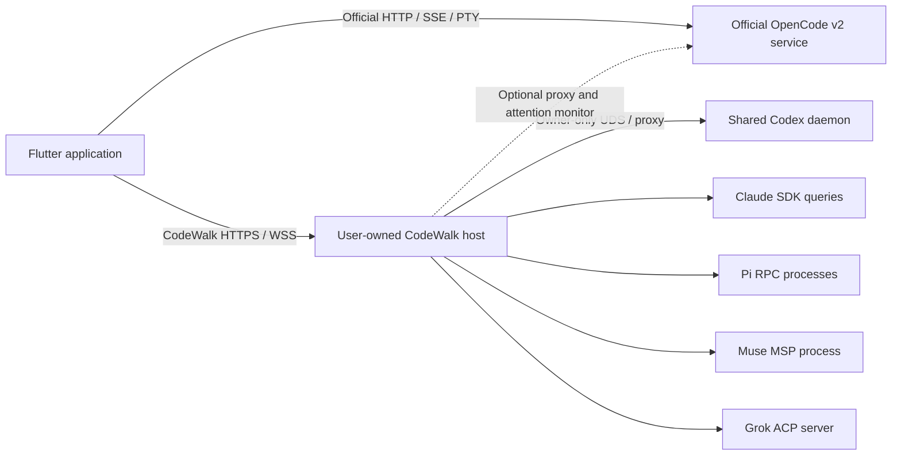

# CodeWalk v2 implementation plan

## 1. Status, objective, and recommended direction

**Recommend a hybrid architecture: connect directly to OpenCode v2, and use a user-owned CodeWalk host service for harnesses that require local process ownership, filesystem services, or browser-compatible access.**

Use native protocols for OpenCode, Codex, Claude Code, Pi, and Muse. Use ACP v1 with negotiated x.ai extensions for Grok Build. Reserve generic ACP support for the longer tail and an eventual experimental `dsh` integration.

Implement the host service in **TypeScript on a supported Node LTS runtime**, rather than Dart AOT, Bun-only, Go, or Rust initially. The decisive reason is access to the official Claude Agent SDK and the Muse SDK without maintaining a second implementation of their control protocols. The Flutter application remains Dart.

The final product should let users:

- Connect to their own hosts through LAN, VPN, TLS reverse proxy, or SSH tunnel.
- See sessions grouped by host and project, with harness identity and accurate capabilities.
- Continue externally created sessions wherever the official protocol supports it.
- Observe streaming output, tools, background work, approvals, questions, usage, and errors without confusing their different meanings.
- Disconnect the phone without treating the underlying agent as stopped.
- Understand when a session supports history resume, live attachment, or exclusive process ownership.
- Use Android, Linux, macOS, Windows, Web, and iOS with explicit platform limitations.

This is a planning deliverable based on selective read-only inspection. No implementation, tests, installation, services, commits, or releases were performed.

### Important findings that change the design

1. **OpenCode v2 supports client-supplied prompt IDs and returns durable inbox admission.** The v1 `local_user_*` content-matching system should be replaced. However, safe retry behavior must still be verified against the admission implementation; accepting an ID is not sufficient proof of exactly-once execution.

2. **There is an experimental OpenCode file-write endpoint.** The evidence-pack summaries claiming there is no write endpoint are incomplete. The inspected source declares `POST /api/experimental/fs/write`, accepting raw bytes and allowing targets outside the location. It is not a stable replacement for every file-management operation.  
   Evidence: `plan/opencode-v2-src/protocol-groups/fs.ts:76–88`.

3. **An archived timestamp in OpenCode session output does not establish an archive mutation API.** The inspected `PATCH /api/session/{id}` accepts only title, metadata, and permissions. Use an explicitly app-owned archive overlay until a supported upstream operation is verified.  
   Evidence: `plan/opencode-v2-src/protocol-groups/session.ts:358–374`.

4. **OpenCode’s global SSE stream has no replay.** A CodeWalk event journal cannot recover events it never received. Reconnect must repair from upstream state, with experimental durable-log catch-up as an optional enhancement.

5. **Codex’s shared daemon is essential to live TUI continuity.** A separately launched WebSocket app-server is not an equivalent connection path.

6. **Claude history resume is feasible; arbitrary live TUI control is not established.** The host can list history through official SDK functions and resume a quiescent session. It cannot promise to attach to every already-running Claude process.

7. **Allow-all has materially different meanings.** In particular, OpenCode’s wildcard session permission rule can override agent deny rules. Codex approval policy does not independently remove sandbox restrictions. Pi has no native approval system.

8. **Reliable iOS background notification delivery is not solved by a persistent host socket.** The initial delivery contract must state foreground/resume behavior honestly. A future notification provider requires separate product and credential decisions.

### Planning and release blockers

There is no blocker to preparing the implementation. The following are release blockers for affected capabilities:

- Codex shared-daemon connection and reconnect validation on Linux, macOS, and Windows.
- iOS project creation, signing, distribution, and plugin compatibility.
- macOS managed installation under the existing sandboxed release configuration.
- Verified OpenCode prompt retry semantics and hydration races.
- Reliable identification of external Claude sessions that are safe to resume.
- Muse distribution and live-session ownership validation before production support.
- Any promise of dependable sleeping-device notifications without a functioning platform delivery mechanism.

---

## 2. Decision Assessment: D01–D16

The baseline below preserves selected answers. Recommendations to change a selected answer are advisory and require discussion before changing direction.

| Decision | Verdict | Evidence and argument | Recommendation or alternative; tradeoffs | Confidence and verification |
|---|---|---|---|---|
| **D01 — connection architecture** | **Unresolved; recommend hybrid** | OpenCode has an official authenticated network service. Claude, Pi, and Muse require a host process. Codex’s shared service is local-only. ACP’s stable transport is stdio. | Direct OpenCode plus an optional host service that becomes required for other harnesses. Avoid requiring a daemon for every OpenCode user. A universal daemon simplifies client transport but increases installation and failure burden. | **High** on the need for a host; **medium** on implementation details. Validate Codex UDS/proxy and browser authentication. |
| **D02 — release phases** | **Unresolved; recommend gated rollout** | Seven protocols with different maturity and lifecycle guarantees should not share one undifferentiated launch gate. | v2.0: OpenCode and shared-daemon Codex. Next: Claude. Then Pi and Grok. Muse after distribution/ownership validation. `dsh` remains experimental/deferred. Platforms remain in scope throughout. | **Medium**. Reassess after bounded spikes; do not treat version labels as accepted commitments. |
| **D03 — new skeleton, same repository** | **Keep** | Inventory identifies approximately 22.8k-line ChatProvider and 27.5k-line ChatPage classes, raw protocol leakage, and direct networking in presentation. | Build a new composition root and feature modules in the same repository; selectively transplant proven UI and platform services. Preserve v1 independently before deleting its implementation. | **High**. Confirm extraction boundaries with compilation and dependency checks. |
| **D04 — same app ID, replacement update** | **Keep, with migration gates** | Existing app ID and updater continuity are product preferences, not protocol constraints. Android downgrade and data retention complicate manual legacy recovery. | Preserve `com.verseles.codewalk`; add a v2 migration experience and export/recovery instructions. Do not silently rewrite server addresses or install OpenCode v2 during app migration. | **High** on feasibility; **medium** on platform downgrade details. Test upgrades from the released signed APK and desktop packages. |
| **D05 — allow-all ON by default** | **Change recommended; baseline retained** | OpenCode’s last matching wildcard can override deny rules. Claude bypass needs explicit startup support and has restrictions. Pi cannot provide an OFF control without an extension. | Preferred alternative: default ON **automatic approval of eligible requests**, preserve native deny/sandbox constraints, and make unrestricted native bypass a separate setting. This reduces surprising privilege changes, but differs from maximal native allow-all. Baseline implementation must accurately expose its effective policy. | **High** on semantic differences. Verify policy transitions, child inheritance, and managed restrictions per adapter. |
| **D06 — native usage plus experimental queries** | **Keep, narrowly scoped** | Codex, Claude, and Muse expose useful native signals. OpenCode exposes tokens/cost but no unified remaining-quota API. Existing quota code reads and sometimes refreshes host credentials. | Native first. Experimental vendor queries must be separate host plugins with explicit credentials and policy checks. Do not reuse the existing credential-scraping or token-refresh scripts. Claude OAuth tokens must not be collected by the bridge. | **High** on architecture; **medium** on permissible individual endpoints. Revalidate each connector separately. |
| **D07 — notifications** | **Unresolved; recommend staged delivery** | No examined general harness protocol supplies mobile push. Persistent host connections do not keep iOS/Web clients awake. Existing Android paths overlap. | Initial: one foreground attention pipeline; optional bounded Android monitoring; desktop tray/local notifications. Later: separately approved platform push integration. State unavailable background guarantees visibly. | **High** on architectural limitation; **medium** on implementation. Physical-device background/termination tests required. |
| **D08 — user-managed network, no hosted relay** | **Keep** | Official network surfaces and user-owned bridges are sufficient for connectivity. Avoids central transcript handling and service dependence. | Default loopback host binding; user explicitly configures LAN/VPN/proxy/tunnel. Provide diagnostics and setup instructions. Do not automatically expose public interfaces. | **High**. Verify TLS, origin, proxy, and tunnel recipes on selected platforms. |
| **D09 — six client targets** | **Keep** | Flutter supports the selected application architecture, but existing repository lacks `ios/`; several plugins and desktop facilities are platform-specific. | Shared core and six platform build gates. Connection-only roles for Android/iOS/Web; managed installation on supported desktop distributions. | **High** on design; **medium** on delivery readiness. Establish macOS/iOS runners and physical-device coverage early. |
| **D10 — official OpenCode binaries, SHA-256, service** | **Keep** | Official service/pairing and distribution metadata are inspected. GitHub “latest” still identifies v1 in the snapshot. | Use official v2 distribution metadata and mandatory digest verification. Discover an existing service before creating one. Treat port 49374 as a default, not identity. | **High**. Validate metadata, platform assets, installed binary version, and authenticated `/api/info`. |
| **D11 — desktop manages host/harness installation** | **Keep, with ownership boundaries** | Official install channels exist, but SDK-bundled binaries, system installs, and shared services have different ownership. | Manage CodeWalk-owned artifacts; discover user-managed installs. Updates of shared/user-managed services require explicit action and quiescence. Android/iOS/Web never install host binaries. | **High**. Test uninstall/update without stopping externally owned work. |
| **D12 — English plan** | **Keep** | Explicit delivery preference. | English engineering plan; retain existing localization for product UI. | **High**. Editorial verification only. |
| **D13 — continue externally created sessions** | **Keep, with exact limits** | OpenCode shared state and Codex daemon support continuity. Claude SDK supports local history, but no generally usable third-party live daemon. Pi RPC lacks session listing, although SDK listing exists. | Make discovery and history continuation essential. Distinguish live attachment, resumable history, and external-running read-only state. If live control of every arbitrary Claude TUI session is mandatory, the present official surface is insufficient. | **High** for OpenCode/Codex; **medium** for other ownership semantics. Cross-client integration tests are mandatory. |
| **D14 — unified list and accurate capabilities** | **Keep** | Protocols share user-facing concepts but not identical operations. | Unified list with harness badges, explicit origin/ownership, and capability-driven actions. Separate app archive from native archive. | **High**. Capability-negative widget tests prevent invented support. |
| **D15 — daemon runtime** | **Unresolved; recommend TypeScript/Node** | Official Claude TS SDK offers richer controls than alternative bindings. Muse and Pi also have official TS surfaces. | TypeScript on supported Node LTS; package a runtime where needed. Bun may become a tested optional runtime. Dart/Go/Rust add wire-protocol ownership or a TS sidecar. | **High** on maintenance advantage; **medium** on packaging. Prototype Windows/macOS process, UDS, PTY, and SQLite packaging. |
| **D16 — independent planning process** | **Process-only** | Scheduling does not establish technical correctness. | Preserve evidence, uncertainties, and recoverable session references. Implementation gates depend on facts and tests. | **High**. No product implementation consequence. |

### Selected decisions worth reconsidering

1. **D05:** separate automatic approval from unrestricted permission rules and sandbox policy. The current baseline can erase meaningful OpenCode agent restrictions.
2. **D04:** retain replacement updating, but accept that manual v1 recovery may require backup, uninstall, or a deliberately repackaged legacy build. “Manual download” alone does not guarantee a safe downgrade.
3. **D13:** explicitly accept that some harnesses provide history continuation without live takeover. Otherwise Claude support is blocked on an unavailable official integration surface.
4. **D06:** restrict experimental usage plugins to independently verified authentication paths. Opt-in does not make credential interception supported.
5. **D09/D11:** accept that a sandboxed macOS store-style distribution may offer connection-only functionality unless an approved managed-host installation mechanism is established.

---

## 3. Harness capability matrix

### Legend and evidence baseline

- **N:** native official surface.
- **B:** CodeWalk host facility, separately identified.
- **X:** upstream vendor extension.
- **E:** experimental or version-sensitive.
- **—:** unavailable through the selected integration.
- **?:** important behavior not verified.
- **A:** app-local functionality.

These are protocol capabilities, not unconditional UI promises. Effective capability also depends on server version, model, policy, platform, and session ownership.

| Harness | Selected surface and snapshot | Transport and ownership |
|---|---|---|
| **OpenCode** | Native v2 HTTP/SSE; source v2.0.21 `8a8bd622`, recorded 2.0.22 build `05018b88` | Direct authenticated official shared service; optional host proxy/monitor |
| **Codex** | App-server v2 generated from CLI 0.159.3; observed daemon 0.160.0 | Host connects to shared daemon UDS/proxy; preserve live TUI sessions |
| **Claude Code** | Agent SDK 0.3.287 / CLI 2.1.287 | Host-owned streaming-input SDK query; external history through official session functions |
| **Pi** | 1.0.0 RPC JSONL / official SDK session discovery | Host-owned RPC process per active session |
| **Muse Code** | 1.4.2, MSP v1, fingerprinted schema | Host-owned `muse serve`; native session lease/conflict handling |
| **Grok Build** | 1.0.46, ACP v1 plus x.ai extensions | Prefer host-managed connection to native authenticated WS server; optional direct native profile later |
| **DeepSeek `dsh`** | 0.2.0-rc.2 ACP profile | Experimental host-owned stdio process; no internal Web API integration |

### Session lifecycle and external continuity

| Capability | OpenCode | Codex | Claude | Pi | Muse | Grok | `dsh` |
|---|---|---|---|---|---|---|---|
| List sessions | N, cursors | N, cursors | N, SDK local history | B using official SDK listing | N | N/X | N |
| Create/resume | N | N | N, SDK query | N | N | N | N |
| Read previous history | N | N, paginated | N | N, entries/tree | N, view pages | N/X | **— on ACP resume** |
| Live external attachment | N, shared service | N, shared daemon | — for arbitrary TUI; managed SDK sessions B | ?; no shared stable RPC server | ?; lease restrictions | X/?, leader/shared server | — |
| Fork | N | N | N | N | N | X | — |
| Rename | N | N | N | N | N | X | — |
| Archive | A; no verified native mutation | N | A | A | A unless verified | A unless verified | A |
| Delete upstream session | N, children cascade | N, cascade | N | — RPC; defer native deletion | N | X | — |
| Close/unload without deletion | Detach client | N unsubscribe/unload | B query ownership rules | B process/session rules | N | N/X | N |
| External-running ownership warning | A/N status | A/N loaded/status | B supported state where available | B/? | N conflict | X/? | N inactive resume constraint |

An app-local archive merely hides a session in CodeWalk. It must not imply deletion, stopping, upstream archival, or visibility in another client.

### Conversation, selection, and control

| Capability | OpenCode | Codex | Claude | Pi | Muse | Grok | `dsh` |
|---|---|---|---|---|---|---|---|
| Text/reasoning streaming | N deltas + final replacement | N items/deltas | N main-thread partials | N | N | N | N committed chunks; no token stream |
| Structured tools/results | N | N | N | N | N | N | N generic |
| Typed errors/retries | N | N | N | N | N | N/X | N; limited visibility |
| Steer active work | N | N exact turn | N; priority behavior partly ? | N | N | X interject | — |
| Queue next turn | N | E | N; priority mapping partly ? | N follow-up queue | N | X | — |
| Cancel/edit queued input | N inbox | E | E/raw-only controls | N clear queue; individual controls limited | N unqueue | X | — |
| Interrupt | N | N turn | N receipt | N abort | N cancel/interrupt | N | N |
| Background task/subagent controls | N child sessions/shells | N/E | N | Extensions only | N | X | — structured ACP surface |
| Agent-controlled plan/task list | — native todo | N turn plan; plan mode E | N/partial tool-dependent | Extensions only | N todos/goals | N/X | — |
| Agent selection | N | No equivalent named-agent registry | N | — | — stable registry | X/profile | — |
| Model selection | N session | N thread/turn | N | N | N | N/X config | N config |
| Effort/variant selection | N model variant | N model-supported effort | N supported effort | N thinking level | N effort | N config | N route-supported effort |
| Slash commands | N catalog/command route | A mappings; no generic server catalog | N supported commands | N extension/template/skill catalog | Skills; A local commands | N/X; dispatch verify | — |
| Skills | N attachments; activation endpoint E | N structured skill input | N command/Skill mechanisms | N `/skill:name` | N structured skill selector | X | — ACP exposure |
| `@` mentions | N structured file/agent attachments | File paths versus app/plugin mentions differ | CLI expansion, B suggestions | Text/context conventions | Native text `@path` | ACP resources/X search | Resource links only |

Codex’s method digest labels `item/tool/requestUserInput` stable, while inspected generated types explicitly describe its payload as experimental. Treat this as a version-specific capability requiring a live fixture, not a settled stability guarantee.  
Evidence: `plan/codex-src/methods.md:187–194`; `plan/codex-src/key-types.ts:1138–1166`.

### Permissions, questions, usage, and workspace facilities

| Capability | OpenCode | Codex | Claude | Pi | Muse | Grok | `dsh` |
|---|---|---|---|---|---|---|---|
| Approval requests | N | N server RPC requests | N SDK callbacks | — native | N staged server choices | N ACP | N one-shot |
| Native allow-all policy | N wildcard; may override deny | N approval policy; sandbox separate | N bypass with startup/policy restrictions | Already ungated; no toggle | N `allowAll`; restrictions apply | N/X; deny/hooks retained | — verified ACP control |
| Manual approval fallback | N | N | N | Extension only | N | N | N |
| Questions/forms | N typed forms | N/E user input + elicitation | N AskUserQuestion/elicitation | Extension UI only | N | X ask-user + ACP elicitation | — |
| Tokens/context | N | N | N | N | N | N/X | N partial |
| Cost | N | Native available accounting; availability varies | N estimate/notional for subscriptions | N estimate | N estimate/partial | N/X partial | — verified |
| Remaining quota/rate windows | — unified native quota | N account rate limits | N events; pull E | — general native quota | N usage windows | X billing shape ? | — |
| File list/name search/read | N | N | N read; B list/search | B | B | X | B |
| Write/create/rename/delete files | Write E; otherwise B | N fs operations; policies verify | B manual workspace service | B | B | X | B |
| File-content search | B | B or verified native search | B | B | B | X | B |
| Workspace symbols | — initial; later language service B | — initial | — initial | — initial | — initial | X only if verified | — |
| Interactive terminal | N PTY/token | N connection-scoped exec PTY; B persistence | B | B | B; native user-shell ≠ PTY | X/native reverse terminal | B |
| Shell recorded in session | N | N | ? public SDK shell syntax | N RPC bash | N negotiated userShell | N/X | — ACP |
| Native file rewind | N staged revert, coverage verify | — | N tracked-file checkpoints only | — | — MSP guarantee | — conversation rewind only | — |
| Conversation rewind | N stage/commit | N paginated revert or fork; no old rollback | N fork/resume boundary | N fork | N fork boundary | X rewind | — |
| True redo | N clear staged revert before commit | — general | — | — | — | — verified | — |
| Background notification delivery | B/platform | B/platform | B/platform | B/platform | B/platform | B/platform | B/platform |
| Images | N model-gated | N data/local image | N streaming input | N model-gated | N | N implementation; advertisement mismatch | N route/store-gated |
| PDF/document input | N URI, model/processing verification | B uploaded host file; no generic PDF part assumed | Document blocks or B path, route verification | B file context | B file context | ACP resource/B; verify | B resource; limited |

### Per-harness integration constraints

**OpenCode**

- Use `/api/info` with JSON/schema validation; old v1 paths can return HTML 200.
- Use session selections, not invented per-prompt model/agent fields.
- Use `session.execution.*`; do not rely on declared-but-unpublished `session.status`.
- Use source-confirmed flat messages and ordinal content identities.
- Expose forms rather than preserving the v1 question-only DTO.
- Preserve project-wide “Always” wording.
- Native titles replace hidden title-generator sessions.
- Optional experimental log, file write, stats, persistent PTY, and explicit skill activation remain separately gated.

**Codex**

- Attach to the shared daemon; do not start a second app-server against the same session store as the default.
- Detect daemon version independently from CLI version.
- Route unsolicited thread and subagent notifications by `threadId`.
- Resume pending server requests and dismiss them on `serverRequest/resolved`.
- Preserve `canAcceptDirectInput`; child threads are not automatically editable chats.
- Do not use removed `thread/rollback`.
- Do not send ordinary HTTP image URLs where ingress rejects them.
- A browser cannot connect directly to the inspected TCP listener because Origin-bearing requests are rejected.
- Keep the upstream connection alive if CodeWalk offers persistent Codex command terminals.

**Claude**

- Use the official SDK and unmodified binary on the user’s host.
- Pass permission mode explicitly.
- Keep streaming input alive for background work.
- Preserve callbacks, task snapshots, repeated init refreshes, conversation resets, and canonical session IDs.
- Use official login on the host; never collect Claude OAuth credentials or private Remote Control credentials.
- Prefer API-key/provider authentication for a distributed third-party integration; do not present subscription behavior as a permanent policy guarantee.
- Treat file rewind as partial: no Bash/subagent edits, no general redo, and real rewind can report skipped links.
- Do not impersonate the TUI entrypoint to make SDK sessions appear in its default picker.

**Pi**

- Use native RPC rather than a lossy community ACP adapter initially.
- Identify settlement using `agent_settled`, not merely `agent_end`.
- Use SDK session discovery because RPC has no session-list operation.
- Preserve fork-tree identities and durable entry cursors.
- Pass explicit project-resource trust at process startup.
- Do not label project trust or tool exclusion as a full permission sandbox.
- Pi extensions remain an optional, separately supported integration.

**Muse**

- Use MSP directly; preserve `commandId`, `viewCursor`, revisions, and schema fingerprint.
- Follow its multi-stage approval protocol and server-minted choices.
- Treat admission as distinct from view-stream outcome.
- A user shell is not an interactive terminal.
- Validate history/live ownership against `sessionInUse` rather than assuming session resume can take over the TUI.

**Grok**

- Support ACP v1 core plus explicit, versioned x.ai extension handlers.
- Keep WS bearer authentication behind the host for browser consistency.
- Preserve deny rules/hooks under native always-approve.
- Conversation rewind must state that files remain changed.
- Treat documented extension names as implementation evidence, not proof of stable payload schemas.
- Validate live leader mode and image capability advertisement.

**`dsh`**

- Do not integrate its internal Web UI protocol.
- ACP can resume an inactive session without replaying its old transcript.
- An experimental integration must display that limitation, not pretend the session is new or history-free by choice.
- Defer production support until history, ownership, and stability improve.

---

## 4. Architecture and exact boundaries

### 4.1 Connection and ownership model



The host is required for bridged harnesses, but optional for direct OpenCode.

A host must distinguish:

- **Externally owned shared services:** OpenCode and Codex daemons.
- **CodeWalk-owned session processes:** Claude/Pi/MSP processes created by the host.
- **Discovered external history:** resumable records without process ownership.
- **Externally running sessions:** observable where supported, with control disabled unless native live attachment is verified.

Closing a tab, disconnecting, exiting the desktop app, stopping the host, interrupting a turn, and deleting a session are different operations.

### 4.2 Proposed repository layout

```text
contracts/
  codewalk-host/v1.schema.json
  capabilities.schema.json
  fixtures/
    opencode-v2/
    codex/
    claude/
    pi/
    muse/
    grok/
    acp/

host/
  package.json
  src/
    main.ts
    server/http.ts
    server/websocket.ts
    auth/pairing.ts
    auth/device_registry.ts
    runtime/process_supervisor.ts
    runtime/install_manager.ts
    runtime/service_manager.ts
    storage/store.ts
    storage/event_journal.ts
    storage/operation_ledger.ts
    sessions/session_registry.ts
    sessions/ownership.ts
    adapters/adapter.ts
    adapters/codex/
    adapters/claude/
    adapters/pi/
    adapters/muse/
    adapters/grok/
    adapters/acp/
    opencode/proxy.ts
    opencode/attention_monitor.ts
    workspace/files.ts
    workspace/search.ts
    workspace/terminal.ts
    attention/attention_service.ts
    usage/vendor_plugins.ts

lib/
  main.dart
  app/
    bootstrap.dart
    app_shell.dart
    navigation.dart
    dependency_graph.dart
  core/
    platform/
    security/
    logging/
    localization/
  domain/
    identity.dart
    capabilities.dart
    sessions.dart
    timeline.dart
    events.dart
    operations.dart
    interactions.dart
    usage.dart
    work.dart
    workspace.dart
  connections/
    connection_profile.dart
    connection_controller.dart
    transports/http_transport.dart
    transports/sse_transport.dart
    transports/websocket_transport.dart
    adapters/opencode_v2/
      client.dart
      wire/
      mapper.dart
      reducer_support.dart
      recovery.dart
    adapters/codewalk_host/
      client.dart
      mapper.dart
  state/
    host_store.dart
    session_index.dart
    session_store.dart
    session_reducer.dart
    operation_controller.dart
    attention_store.dart
  persistence/
    local_store.dart
    cache_store.dart
    migration_v1.dart
  features/
    onboarding/
    sessions/
    chat/
    composer/
    interactions/
    work/
    workspace/
    usage/
    settings/
    exports/
  services/
    notifications/
    voice/
    updates/
```

Keep shared widgets small and independent. Do not recreate ChatProvider and ChatPage as giant classes split into `part` files.

### 4.3 Avoid duplicate protocol ownership

- **Direct OpenCode:** the Flutter adapter owns wire decoding and domain mapping.
- **Bridged harnesses:** the host adapter owns native protocol decoding and maps into the CodeWalk host domain.
- **Host-connected Flutter:** decodes the CodeWalk host contract, not every native protocol again.
- **Optional OpenCode proxy:** preserves official OpenCode payloads and endpoints; it does not require a second full OpenCode domain mapper.
- **Optional OpenCode attention monitor:** decodes only the small officially defined event/state subset needed for attention and repair.

This deliberately permits one direct adapter and one bridge adapter in Flutter. It avoids forcing a daemon onto OpenCode users while preventing seven full protocol implementations on the phone.

### 4.4 Public domain contracts

Representative contracts:

```ts
type SessionKey = {
  hostId: string;
  harnessInstanceId: string;
  sessionId: string;
};

type Capability = {
  status: "supported" | "experimental" | "unsupported" | "unknown";
  source: "native" | "vendorExtension" | "host" | "client";
  reason?: string;
  constraints?: Record<string, unknown>;
};

type SessionDescriptor = {
  key: SessionKey;
  project: ProjectRef;
  parent?: SessionKey;
  forkedFrom?: SessionKey;
  origin: "terminal" | "ide" | "codewalk" | "unknown";
  ownership:
    | "sharedNative"
    | "hostManaged"
    | "externalHistory"
    | "externalRunning"
    | "unknown";
  canObserveLive: boolean;
  canAcceptInput: boolean;
  selections: SelectionState;
};

type EventEnvelope = {
  schemaVersion: 1;
  hostEpoch: string;
  hostSeq?: string;
  session: SessionKey;
  source: {
    harness: string;
    version: string;
    nativeEventId?: string;
    nativeCursor?: string;
    aggregateSeq?: string;
    nativeType: string;
  };
  persistence: "durable" | "ephemeral";
  occurredAt?: string;
  receivedAt: string;
  event: DomainEvent;
};
```

Use string-encoded large sequence numbers on the JSON boundary to avoid JavaScript/Dart-Web integer precision surprises.

The domain timeline is an explicit union:

- User input, with delivery/admission state.
- Assistant output, with commentary/final distinctions where supplied.
- Text and reasoning blocks.
- Tool invocation and result.
- Shell output.
- Compaction.
- Selection/context change.
- Synthetic continuation.
- Execution boundary.
- Unknown structured content.

Do not force every source row into “user” or “assistant.” Preserve native IDs and semantics.

Unknown content renders a bounded generic card and can expose sanitized structured detail. It must not silently become ordinary assistant text.

### 4.5 Adapter interface

Use a small common core with optional operation groups:

```ts
interface HarnessAdapter {
  identify(): Promise<HarnessIdentity>;
  capabilities(scope: CapabilityScope): Promise<CapabilitySet>;

  listSessions(query: SessionQuery): Promise<Page<SessionDescriptor>>;
  openSession(request: OpenSessionRequest): Promise<SessionSnapshot>;
  createSession(request: CreateSessionRequest): Promise<OperationReceipt>;

  submit(input: SubmitInput): Promise<OperationReceipt>;
  interrupt(target: InterruptTarget): Promise<OperationReceipt>;
  answer(request: InteractionAnswer): Promise<OperationReceipt>;

  events(): AsyncIterable<AdapterEvent>;
  reconcile(scope: RecoveryScope): Promise<RecoveryResult>;

  lifecycle?: SessionLifecycleOperations;
  selections?: SelectionOperations;
  work?: BackgroundWorkOperations;
  workspace?: NativeWorkspaceOperations;
}
```

An unavailable operation returns a typed unsupported error before sending a mutation. UI hiding is not the only enforcement.

No dynamic plugin framework is needed initially. Use a static registry of supported adapters and explicit feature modules.

### 4.6 Capability calculation

Effective capabilities are the intersection of:

1. Adapter implementation.
2. Negotiated server surface/version.
3. Session ownership and native state.
4. Selected model/route.
5. Host policy and available facilities.
6. Client platform.

Examples:

- A model can disable image submission even though its harness supports images.
- A Codex child can have readable history while refusing direct input.
- A direct OpenCode profile can browse files but lack supported manual rename.
- Pi cannot expose a functional native “ask for approvals” switch.
- Web cannot install a host binary.
- A stale connection disables mutations while retaining cached reading.

Do not use a single `supportsUndo` or `supportsSubagents` boolean. Store semantic capabilities such as:

```text
history.fork
history.truncate
files.rewindTracked
revert.stageAndClear
work.children.observe
work.children.send
work.children.interrupt
approval.autoEligible
approval.nativeBypass
terminal.attachPersistent
```

### 4.7 State machines

Keep independent axes rather than one overloaded status enum.

**Connection**

```text
unconfigured → authenticating → connecting → synchronizing → ready
ready → disconnected → reconnecting → synchronizing
any → authRequired | incompatible | failed
```

**Execution**

```text
unknown | idle | running | retryScheduled | interrupting
```

**Attention**

```text
none | approvalRequired | inputRequired | failed | completedUnread
```

**Background work**

```text
unknown | scheduled | running | blocked | completed | failed | cancelled
```

A parent can be idle while a child continues. A session can be running and simultaneously require input. A disconnect changes connection confidence, not the native execution result.

Shutdown interruption that upstream automatically resumes must not be presented as a user cancellation or successful completion.

### 4.8 Identity and storage

Use:

```text
HostId / HarnessInstanceId / NativeSessionId
```

Do not key everything by URL or `serverId::directory`.

- A host ID is provisioned by CodeWalk or explicitly associated with a profile.
- A harness instance includes relevant user/service identity.
- Project references use host-authoritative paths and native project IDs when available.
- Fork lineage is distinct from parent-child work lineage.
- Preserve case-sensitive paths, Windows drive/UNC semantics, and symlink distinctions.
- Do not merge sessions from two endpoints merely because IDs, paths, PIDs, or hostnames match.
- Linking a direct OpenCode profile with its host proxy requires explicit verified aliasing.

**Host storage**

Use SQLite for the device registry, session registry, operation ledger, app overlays, durable normalized events, and snapshot watermarks. Verify the selected Node runtime’s SQLite facility and supported-platform packaging first; keep the dependency behind one storage boundary.

**Client storage**

- Preferences: small settings and profile metadata.
- Secure storage: paired tokens and API keys for client-local services.
- Bounded durable cache: session summaries, timelines, drafts, tabs, local attention.
- Web: IndexedDB-backed cache, with browser-specific credential persistence.
- Schema-versioned migration and atomic writes.
- No unlimited message blobs in shared preferences.

### 4.9 Replay, ordering, and reconciliation

For the host protocol:

1. Append a durable normalized fact and update its projection transactionally.
2. Provide a snapshot with a journal watermark.
3. Replay only events after that watermark.
4. Deduplicate native facts by appropriate native event/cursor identity.
5. Send explicit `replayReset` when the retained cursor is unavailable.
6. Never describe a host sequence as an upstream sequence.

Initial tunable retention:

- Durable normalized journal: seven days, with a 256 MiB host cap.
- Live replay buffer: 8 MiB per connection budget.
- Do not persist every token delta indefinitely.
- Persist authoritative final blocks and meaningful lifecycle facts.
- Apply bounded slow-client backpressure and repair from snapshots.

For direct OpenCode:

- Connect the stream before hydrating.
- Buffer events received during hydration.
- Merge snapshots with a connection-generation fence and a lifecycle update ledger.
- Preserve durable facts and pending inputs observed during the reads.
- Do not let a stale active snapshot undo newer execution events.
- Guard the race where an input moves from inbox to projected history between separate reads.
- Optional log catch-up tracks per-aggregate sequence and honors `log.synced`.
- Do not require contiguous public sequence numbers: internal durable events share the sequence space.
- After a lost ephemeral prefix, mark streamed text incomplete until an authoritative ended event replaces it.

The official reference reducer already documents the inbox/history hydration race and applies lifecycle updates over its active snapshot.  
Evidence: `client-solid-data.reference-reducer.ts:593–640`.

### 4.10 Optimistic input and ambiguous mutations

Model operation state explicitly:

```text
draft → sending → admitted → delivered → settled
sending → failed | outcomeUnknown
```

- OpenCode: client-minted native-format ID, exact inbox correlation.
- Muse: native UUIDv7 command ID and replay semantics.
- Claude: client message UUID correlation; verify replay/duplicate behavior.
- Codex: returned turn identity plus adapter-specific input correlation; do not invent idempotency.
- Pi: request response disposition and ordered message events; no fuzzy matching of identical prompts.
- ACP v1: pending prompt request and source-specific completion; do not synthesize draft-v2 guarantees.

The host operation ledger can deduplicate a client’s repeated request **to the host**. It cannot guarantee exactly-once upstream execution after a crash between upstream submission and recorded acknowledgement.

For an ambiguous submission:

1. Preserve the input.
2. Reconcile native state.
3. Confirm by a native ID where possible.
4. Otherwise display “Delivery could not be confirmed.”
5. Require a user-triggered resend; never silently resend a potentially expensive turn.

Reads can use bounded retries. Mutations require verified idempotency or explicit conflict reconciliation.

### 4.11 Multi-client coordination

- Use one host operation serializer per session.
- Approvals use exact native request IDs and requirement revisions.
- First resolved response wins; other clients receive the native/host resolution.
- Pending cards remain in a “submitting” state until outcome is confirmed.
- Native 404/already-resolved/stale-requirement results trigger refresh, not generic retry.
- Preserve model/permission changes made by another client.
- Use native expected-turn guards where available.
- Do not claim host leases control direct TUI clients.
- When upstream offers no compare-and-set, document the remaining race rather than presenting a local lock as authoritative.

---

## 5. UX and intended behavior

### 5.1 Responsive application structure

Use Material You with three responsive compositions:

- **Compact:** project/session drawer, timeline, fixed composer, sheets for files/work/usage.
- **Medium:** session rail plus timeline; optional detail sheet.
- **Expanded:** project/session pane, timeline, contextual workspace/work pane.

Tabs remain useful on desktop; compact layouts use a searchable recent-session picker rather than squeezing many tabs.

Retain per-session scroll anchors. Child activity must never move a parent’s reading position.

### 5.2 Onboarding and authentication

Offer:

1. **Connect to a host:** pairing QR/link or endpoint setup.
2. **Connect directly to OpenCode v2:** native pairing/password and authenticated compatibility check.
3. **Set up this desktop:** discover existing services, then install missing components through official channels.

Managed setup must show:

- Installed versus user-managed components.
- Version and compatibility.
- Local service address.
- Network exposure status.
- Pairing expiration.
- Authentication status per harness.
- Sanitized diagnostics and recovery action.

For OpenCode:

- Redeem pairing with JSON Accept behavior.
- Store the returned token as the Basic password for fixed user `opencode`.
- Track expiration and re-pair.
- Password rotation invalidates existing paired tokens.
- Avoid long-lived credentials in query strings.
- Obtain short-lived native PTY tickets.

Automatic local pairing can be implemented through an authenticated local service call once service discovery and ownership are verified. It must not require scraping printed passwords into application logs.

For the CodeWalk host:

- Proposed one-time pairing code and device token registry.
- Default loopback binding.
- Origin validation.
- Short-lived WS tickets obtained over authenticated HTTPS.
- Device revocation.
- Browser-safe cookie/ticket flow.
- Tokens bound to the intended host; never forwarded across redirects/origins.

### 5.3 Desktop installation and updates

**OpenCode**

- Query official v2 metadata, not GitHub “latest.”
- Require an advertised SHA-256.
- Download to a staging directory, verify, inspect executable version, then activate.
- Keep one previous CodeWalk-owned binary for rollback.
- Discover the shared service first.
- Apply service configuration through official CLI commands.
- Do not edit registration files or databases.
- Do not overwrite an existing v1 command unexpectedly.

Platform support must come from actual release metadata. The pack contains conflicting Windows ARM64 statements; use inspected current assets rather than a hardcoded absence.

**Other harnesses**

- Discover official installations first.
- Track installation method.
- Use official update mechanisms for the selected method.
- Keep SDK/binary versions compatible.
- Never run arbitrary install commands from protocol payloads.
- Schedule managed updates only when affected work is quiescent.
- A shared daemon update can interrupt users outside CodeWalk; it requires an explicit operation.

**macOS**

Existing `macos/Runner/Release.entitlements` enables app sandboxing and only audio input. Managed binary installation/process execution needs an early packaging decision and test. A signed/notarized direct distribution may differ from a sandboxed store distribution.

### 5.4 Unified sessions and external ownership

Session rows show:

```text
Host → Project → Session
Harness badge · Origin · Running/Needs input · Ownership
```

Opening a session is observational where possible. It must not automatically:

- Start a new turn.
- Replace its model.
- Apply the global allow-all preference.
- Stop its original client.
- Convert it into a CodeWalk-owned session.

**OpenCode:** attach to shared state and native execution.

**Codex:** list history and loaded threads; resume/rejoin through the same shared daemon.

**Claude:** list local history with official SDK helpers. For an externally running session, show history/state where supported and require a deliberate handoff before SDK continuation. Do not claim absence from a CodeWalk lease table proves the TUI is stopped.

**Pi:** use official session-manager discovery, then open an RPC process only when continuation is safe. Concurrency against an external TUI is a verification gate.

**Muse/Grok:** honor native in-use/leader semantics.

**`dsh`:** explain that existing history is unavailable over the selected ACP surface.

### 5.5 Composer and command semantics

Show:

- Harness.
- Agent/profile where meaningful.
- Model.
- Variant/effort.
- Effective approval policy.
- Delivery mode while busy.

Use explicit labels:

- **Steer current work**
- **Queue next turn**
- **Send now**, only where that native behavior is verified.

Do not translate every harness’s busy submission into the same operation.

Selections have scope and timing:

```text
session default / next turn / current running execution
```

The UI shows “Applies to next model call” or “Applies to next turn” when appropriate. Native echoed state is authoritative.

Commands are categorized:

- CodeWalk local actions.
- Harness commands.
- Skills.
- Modes.

Do not send local `/new` or `/sessions` as model text. Do not fabricate a server slash-command registry for Codex. Do not recursively scan arbitrary skill files to substitute for native discovery.

Mentions preserve source semantics:

- File reference.
- Agent reference.
- Skill reference.
- App/plugin reference.
- Plain path text where native behavior requires it.

### 5.6 Approvals and forms

Keep questions separate from approval automation.

Approval cards include:

- Owning session and child origin.
- Action and resource.
- Native choices.
- Exact persistence scope.
- Policy restrictions.
- Effective sandbox context when known.

For OpenCode, label `always` as project-wide approval. Do not reuse v1’s “permanently for this session.”

For Muse, present only current server-minted choices and stage requirements.

For Claude, preserve edited input and native permission suggestions; hide unavailable “always” operations.

Forms support:

- Typed string/number/integer/boolean fields.
- Single/multiple selections.
- Free-text custom answers.
- Required constraints.
- Conditional visibility.
- External links.
- Cancellation and validation errors.

Do not split free text on commas. Do not automatically answer questions because allow-all is enabled.

### 5.7 Allow-all behavior under the retained baseline

Keep global ON as the baseline preference, but display **desired policy** and **effective policy** separately.

- New managed sessions receive the supported native policy.
- Existing external sessions retain their native policy until the user explicitly changes it.
- Unsupported or policy-blocked settings show the reason.
- Pi shows “This harness does not provide approval controls,” rather than a fake OFF state.
- Codex approval and sandbox controls remain separate.
- Claude bypass cannot be enabled if startup/policy restrictions prohibit it.
- Turning OpenCode wildcard allow-all OFF removes only CodeWalk-owned rules; it must not restore an old entire ruleset over concurrent changes.
- Child inheritance and per-session overrides require explicit reconciliation.

The ON preference must never be represented as a universal guarantee that every operation will proceed.

### 5.8 Asynchronous subagents and background work

Provide a **Work panel** with a tree:

```text
Main session
  Explore module — running
  Review changes — waiting for approval
    Nested investigation — running
  Build command — completed
```

Each work item contains:

- Exact native identity.
- Parent relationship.
- Objective/label.
- Start and settlement state.
- Latest structured progress.
- Owning session.
- Available observe/send/interrupt/stop actions.
- Error and result summary.
- Background versus foreground relationship.

Rules:

- A tool returning a background child ID is not child completion.
- A parent’s idle event does not settle its children.
- A child result may generate a real synthetic parent continuation.
- Preserve that continuation instead of inventing a duplicate user message.
- Follow exact child IDs; discard positional Nth-tool/Nth-child matching.
- Detect cycles and invalid cross-parent relationships.
- Opening a child preserves the immediate parent viewport.
- Codex child input stays disabled when native `canAcceptDirectInput` disallows it.
- Stop parent, stop child, stop task, and stop all are separate supported actions.

OpenCode’s nested-background early-completion report is an upstream risk. Display native facts and descendant activity separately. Do not hide the discrepancy by inventing a corrected upstream completion event.

### 5.9 Tasks and plans

Retain the agent-controlled task panel where actual structured data exists.

- Codex: native turn plan.
- Claude: native task/todo tools and events when emitted.
- Muse: native todos/goals.
- Grok: native plan updates.
- Pi: negotiated extension only.
- OpenCode v2 and `dsh` ACP: no fabricated native todo list.

Do not infer a structured progress percentage from arbitrary Markdown. A textual plan remains a message, not authoritative task state.

### 5.10 Usage, quotas, and errors

Display four independent concepts:

1. **Context:** current model-call occupancy and source.
2. **Tokens:** turn/session counters and definitions.
3. **Cost:** estimate, partial estimate, or authoritative billing signal.
4. **Quota:** provider/account usage windows or credits.

Do not derive remaining subscription quota from tokens. Do not sum only loaded messages and call it lifetime session cost.

Each usage record includes scope, timestamp, source, confidence, and completeness. Account quota appears once per account/host, not falsely once per session.

Errors distinguish:

- Connection/authentication.
- Admission rejection.
- Delivery outcome unknown.
- Provider quota/rate limit.
- Native retry scheduled.
- Tool failure.
- Turn failure.
- Interrupted execution.
- Host process failure.
- Unsupported capability.

Do not add a second automatic turn retry while the harness is already retrying.

### 5.11 Notifications and attention

Use one semantic attention pipeline shared by:

- Inline cards.
- Session-list badges.
- Tabs.
- Desktop tray.
- Local notifications.
- Optional background hosts.

Attention identity includes host, harness instance, session, and native request/execution boundary.

Initial behavior:

- Foreground notifications on all supported platforms.
- Desktop local notifications while the desktop process runs.
- Optional Android monitoring with a visible user-controlled session.
- iOS and Web recover attention on foreground/resume.
- No guarantee of continuous delivery while terminated or suspended.

Remove duplicate Android polling/completion detectors.

A future push phase must establish who holds APNs/FCM/VAPID credentials and how the distributed app is registered. A user-owned generic gateway cannot automatically send APNs to the official CodeWalk app without authorized credentials for that app identity.

Notification payloads should contain opaque navigation identity and generic category by default, not transcript content.

### 5.12 Files, terminals, and attachments

**Files**

- Direct OpenCode: read/list/find; experimental write only when explicitly enabled and verified.
- Host workspace service: list/read/search/write/rename/delete as its own capability.
- Display “Host file access” rather than pretending these are agent tools.
- Protect writes with expected content hash/mtime.
- Reject stale saves and offer merge/reload.
- Validate traversal, symlink escape, roots, UNC paths, and leaf names.
- Autosave remains OFF by default.
- Preserve line endings and encoding.
- Manual editor undo is distinct from agent/session rewind.

**Terminals**

- Keep xterm UI.
- Native OpenCode PTY: obtain connect ticket.
- Codex command PTY: disclose connection ownership; host connection retention can prevent phone disconnection from killing it.
- Host PTY: explicit create/attach/detach/close semantics and bounded scrollback.
- Reattach with a snapshot and sequence watermark.
- Terminal dismissal does not necessarily terminate its process.

**Attachments**

- Model-gate images before submission and validate again on the host.
- Preserve MIME/name/size.
- Keep draft attachments recoverable.
- Upload host files through a dedicated scoped endpoint.
- Remove abandoned uploads with a bounded TTL.
- Do not send local phone paths as server file paths.
- PDFs may be native documents, host file references, or explicitly extracted text depending on the adapter.
- Never silently describe PDF extraction as native PDF vision.
- Expose payload limits before network submission.

---

## 6. Rewrite, reuse, simplify, defer, and discard

| Existing files/modules | Disposition | Proposed replacement or boundary |
|---|---|---|
| `lib/presentation/providers/chat_provider.dart` and `chat_provider/*` | **Rewrite** | `state/session_store.dart`, pure reducer, operation controller, session index |
| `lib/presentation/pages/chat_page.dart` and its parts | **Rewrite composition** | Independent chat, composer, interactions, work, workspace, navigation features |
| `lib/data/datasources/chat_remote_datasource.dart` | **Replace** | Direct OpenCode v2 client and CodeWalk host client |
| `lib/domain/entities/chat_message.dart`, `chat_realtime.dart`, v1 session/permission DTOs | **Replace** | Explicit domain unions; native wire DTOs confined to adapters |
| `lib/domain/repositories/chat_repository.dart` and one-method use cases | **Simplify** | Small operation groups; no pass-through class per method |
| `chat_provider_message_merge_ops.dart`, message reconciliation/time heuristics | **Discard v1 machinery** | Native identity correlation; snapshot fences; explicit ambiguous delivery |
| `chat_provider_realtime_*` dual-stream paths | **Discard/rewrite** | One stream per direct OpenCode host; bounded repair |
| `chat_title_generator.dart` | **Discard hidden-session path** | Native title/rename, or local fallback title without model calls |
| `quota_remote_datasource.dart` and JS-in-Dart scripts | **Discard** | Native usage adapters and isolated opt-in host plugins |
| `workspace_file_operations_service.dart` | **Discard shell transport** | Native experimental write or explicit host filesystem service |
| `local_opencode_server_runtime*` | **Rewrite implementation; retain useful diagnostics UX** | Desktop install/service manager with discovery, digest verification, ownership |
| `terminal_remote_datasource.dart`, terminal socket/controller | **Reuse rendering concepts; rewrite transport/lifecycle** | Capability-specific terminal adapters |
| `permission_request_card.dart` | **Reuse visual layout selectively** | Typed interaction choices and exact scope |
| `question_request_card.dart` | **Rewrite behavior** | General forms, preserving useful wizard UX |
| `session_todo_list_widget.dart` | **Reuse presentation** | Structured plan source; unsupported harnesses omit it |
| `session_diff_viewer.dart`, `diff_parser.dart` | **Reuse selectively** | Typed native diffs; explicit partial/unavailable state |
| `app_tab_strip.dart`, `session_tab_strip.dart` | **Keep/simplify** | Harness-neutral keys and small tab controller |
| Draft persistence/composer history/canned answers | **Keep** | Dedicated composer store; selection overrides validated per harness |
| Markdown/math/basic HTML/Mermaid/code rendering | **Keep** | Domain-content input, bounded rendering, unknown-content fallback |
| Themes, dynamic color, contrast, AMOLED | **Keep** | Shared design tokens; remove upstream network assumptions |
| Locale catalogs and l10n bridge | **Keep** | Preserve current keys; add only needed v2 copy |
| Voice/STT/TTS interfaces and platform support utilities | **Keep selectively** | Client-local voice service; platform capability matrix |
| Multiple voice engines/model managers | **Simplify rollout, retain assets/config** | Ship proven engines first; migrate optional engines after resource tests |
| Exports, message image export, forwarding | **Keep** | Export full paginated history; forwarding is a new input with provenance |
| Notification/attention coordinator | **Keep concepts; rewrite event input** | One typed attention pipeline |
| WorkManager + foreground/overlay/car independent pollers | **Discard duplicate monitoring** | Shared monitor; optional specialized surfaces later |
| Android overlay and Android Auto messaging | **Defer port** | Resume only after core notification and exact delivery semantics are stable |
| Embedded vendored Tailscale | **Defer initial port** | Prefer system-managed VPN; retain user data and migration guidance |
| Cloudflare Access proxy authentication | **Keep supported current-platform behavior selectively** | Connection-auth wrapper; independently validate Web/iOS support |
| Fake `__codewalk` agent selection sync | **Discard** | Native selections or CodeWalk host/client preference storage |
| v1 legacy route/schema fallbacks | **Discard** | Explicit v2-only detection and compatibility diagnostics |
| v1 positional subagent resolver | **Discard** | Exact child/task identity |
| dormant worktree functionality | **Defer UI** | Native capability-specific worktree module later |

### Coordinated documentation

Update after implementation and review:

- **ADR-023:** preserve contract-first policy; replace v1-specific invariants with pinned v2 obligations and source references.
- **ADR-029:** retire shell credential scraping and define usage provenance.
- **ADR-033:** distinguish proxy authentication from harness authentication.
- **ADR-043:** retire shell-backed file mutations; document native/host write boundaries.
- Relevant lifecycle, permissions, tabs, attention, voice, and persistence ADRs.
- `CONTRACT_MATRIX.md`: per-harness operations, stability, ownership, and fixtures.
- `ai-docs/opencode_*`: retain historical v1 references explicitly; add authoritative v2 anchors.
- `BEHAVIOR.md`: implemented behavior only.
- `CODEBASE.md`: actual new structure and commands.
- README/install/recovery/release instructions.
- GitHub Issues: implementation tasks and acceptance criteria. Do not recreate `ROADMAP.md`.

An official v2 migration is not itself an intentional divergence. A CodeWalk behavior that changes native semantics requires the ADR exception specified by ADR-023.

### Local-data migration and rollback

1. Preserve legacy settings/cache keys in a versioned inert namespace.
2. Export profiles, settings, drafts, tabs, and local annotations before destructive conversion.
3. Import theme, locale, accessibility, voice configuration, and compatible local preferences.
4. Import old server profiles as **legacy connection metadata requiring v2 verification**.
5. Do not change `:4096` to `:49374` automatically.
6. Do not infer that old session IDs map to v2 IDs.
7. Match migrated upstream sessions only with documented upstream provenance.
8. Preserve unmatched drafts in a recovery view.
9. Migrate secrets only through existing secure storage and verified origin identity.
10. Make migration restartable and transactional.

Preserve the app ID and signing identity. Use monotonically increasing build numbers above published/test builds, subject to each platform’s format and limits. Existing version is `1.265.0+1790827338`; `Makefile` already derives Android build codes from epoch plus an offset and compares against a reference.

Manual v1 rollback must explain that Android may reject a lower-version package, uninstalling may erase data, and the same app ID prevents ordinary side-by-side installation. Keep export/recovery instructions concrete.

---

## 7. Ordered implementation stages and rollout

Version labels below are recommendations, not approved release commitments.

### Stage 0 — bounded feasibility spikes

Time-box each spike to **one or two engineering days**, returning fixtures and a go/no-go result rather than production UI.

| Spike | Required evidence | Failure response |
|---|---|---|
| OpenCode admission/recovery | Duplicate ID, changed payload, timeout after admission, inbox promotion race, reconnect during text | Disable automatic retry; use explicit outcome-unknown handling |
| Codex shared daemon | TUI-created live thread; UDS/proxy handshake; approvals; daemon restart; Windows | Block Codex production; do not substitute a separate app-server silently |
| Claude external continuity | Official list/history; resume quiescent TUI session; running-session rejection/ownership; canonical IDs | Deliver history-only for external-running sessions; explicit handoff |
| Host packaging | Node runtime, SQLite, UDS, child signals, PTY on three desktop OSes | Narrow distribution packaging; avoid changing the protocol architecture prematurely |
| Web/auth | OpenCode CORS/pair redemption; host WS ticket; proxy login; mixed-content/Origin | Require supported HTTPS host path; do not weaken auth |
| iOS foundation | Build, signing, secure storage, networking, picker, voice, suspension/resume | Block iOS shipping until gate passes; retain target in plan |
| macOS managed install | Existing sandbox behavior and chosen distribution | Connection-only sandboxed edition or approved direct distribution |
| Muse ownership/distribution | Official install assets, lease conflicts, external resume, schema fingerprint | Defer production adapter |
| Grok extensions | Exact request/result fixtures for input, queue, usage, subagents | Expose only verified extension subset |

### Stage 1 — new application core and contract foundation

Implement identity, capability, event, interaction, operation, and usage contracts. Add the new composition root, storage, navigation, and responsive shell.

**Acceptance**

- Widgets import no native wire models.
- Networking is confined to connection/adapters.
- Cross-host session IDs cannot collide.
- Unknown capabilities/content render safely.
- Six platform conditional imports compile.
- Draft/tab/settings migration fixtures pass.

### Stage 2 — OpenCode vertical slice

Implement pairing, projects, session list/create/open, cursor history, prompt admission, SSE reduction, interruption, model/agent selections, errors, permissions, and forms.

**Acceptance**

- Continue a TUI-created session.
- Repeated identical prompts remain distinct.
- Disconnect during streaming repairs correctly.
- Snapshot hydration cannot erase an observed prompt.
- No v1 route or polling-send watcher remains.
- No false success on HTML 200 or auth failure.

### Stage 3 — OpenCode complete lifecycle and client-local features

Implement children/background shells, native revert, diff, file browsing, PTY, commands, skills, images/documents, local archive, drafts, tabs, exports, accessibility, themes, localization, and voice.

**Acceptance**

- Parent and nested child state remain separate.
- Forms survive reconnection.
- Revert labels distinguish file effects and irreversible commit.
- Experimental endpoints are visible as experimental and optional.
- Export loads complete history.
- No hidden sessions for title, quota, or file operations.

### Stage 4 — host and shared-daemon Codex vertical slice

Implement host pairing, device registry, journal, snapshots, operation ledger, Codex native adapter, and filesystem/terminal service boundaries.

**Acceptance**

- Live terminal session is visible and controllable through the same daemon.
- CLI/daemon version skew is handled.
- Two clients resolve one approval without duplication.
- Browser connection works through host authentication.
- Child input respects native restrictions.
- Host reconnect/restart does not silently repeat a turn.

### Stage 5 — platform and migration release gate

Complete Android/iOS/Web connection roles and desktop packaging, updater compatibility, migration recovery, attention, performance, and installation documentation.

**Recommended v2.0 scope**

- Production OpenCode v2.
- Production shared-daemon Codex only if Stage 0/4 gates pass.
- Six client targets, with iOS distribution/signing complete.
- Native usage.
- Explicit foreground/resume notification contract.
- Optional bounded Android monitoring.
- Existing local essentials: drafts, tabs, exports, themes, localization, accessibility, and proven voice paths.

Do not publish an automatic v1-replacement update while required selected-platform or data-migration gates are failing.

### Stage 6 — Claude integration

Add SDK process ownership, supported external history/resume, callback approvals, questions, tasks, partial usage, checkpoints, and model/effort controls.

**Acceptance**

- No private Remote Control API or OAuth interception.
- Background work persists while phone disconnects.
- Query shutdown/process failure is distinct from turn success.
- Partial rewind coverage is shown.
- External-running history does not imply live takeover.

**Recommended next release phase:** Claude production support after these gates.

### Stage 7 — Pi and Grok

Pi native RPC; Grok ACP core plus verified x.ai extension subset.

**Acceptance**

- Pi settlement and queues follow native semantics.
- Pi has no misleading approval controls.
- Grok conversation rewind never claims file restoration.
- ACP reverse filesystem/terminal requests execute on the host, not the phone.
- Unsupported commands and capability mismatches are explicit.

### Stage 8 — Muse, generic ACP, and optional delivery enhancements

Muse MSP after lease/distribution validation; generic ACP profiles with conservative capabilities; separately approved push architecture.

`dsh` remains experimental until it offers sufficient history continuity or a supported alternative. No production dependency on its internal Web API.

---

## 8. Testing and validation

### 8.1 Contract fixtures

Create source-pinned fixtures for:

- Handshake and version/capability negotiation.
- Prompt admission versus execution.
- Streaming starts/deltas/final replacements.
- Tools with malformed/incomplete JSON input.
- Native retries and failures.
- Approvals and request resolution.
- Forms and cancellation.
- Session list/history pagination.
- Model/effort changes.
- Child/background work.
- Usage and partial cost.
- Unknown events/items/enums.
- Process exit and reconnect.

Each fixture records provenance, upstream version, capture method, and whether it is observed or schema-derived.

Use Muse’s published conformance transcripts as source evidence, while validating the selected installed binary separately.

### 8.2 Critical correctness tests

**Reducers and recovery**

- Duplicate final events.
- Missing ephemeral deltas.
- Delta after authoritative final.
- Durable sequence spaces with skipped internal events.
- Stale snapshot after new execution event.
- Inbox promotion between separate reads.
- Event before session-list arrival.
- Page overlap and cursor invalidation.
- Session deletion during hydration.
- Host epoch change and unavailable replay cursor.
- Unrecognized event version without crash.

**Input and mutations**

- Timeout before/after native admission.
- Host crash after upstream submission.
- Same prompt text twice.
- Same native ID with conflicting payload.
- Steer targeting a completed or different turn.
- Model switch racing with external client.
- Queue cancellation racing with delivery.
- App restart with outcome-unknown input.

**Permissions/forms**

- Two devices answer simultaneously.
- Approval resolved externally.
- Muse requirement stage changes before answer.
- Global forms versus session forms.
- Child approval shown in root with exact origin.
- Allow-all toggled while requests are pending.
- Native deny/admin restrictions.
- Turning OFF preserves concurrent user rules.
- Question never auto-answered.
- Free text containing commas.
- Invalid/conditional typed fields.

**External continuity**

- OpenCode TUI creates session before and after connection.
- Codex live daemon session with TUI and two CodeWalk clients.
- Codex daemon version differs from CLI.
- Claude quiescent history resume.
- Claude externally running session.
- Pi simultaneous file/session use.
- Muse lease conflict.
- Grok native remote/leader session.
- `dsh` history limitation.

**Background work**

- Parent idle with running child.
- Nested background child finishes after its parent job.
- Tool returns immediately with running child ID.
- Synthetic continuation arrives after parent idle.
- Stop child versus stop root.
- Upstream early-completion discrepancy.
- Host dies with pending child approval.

**Filesystem/terminal**

- Save conflict.
- Symlink/hardlink and root escape.
- Windows drive and UNC paths.
- Binary files and non-UTF-8.
- Terminal phone disconnect versus upstream connection disconnect.
- Native ticket expiry.
- Terminal reattach snapshot/sequence.
- Bounded output and backpressure.

### 8.3 Platform tests

| Platform | Required tests/build gate |
|---|---|
| Android | Signed update from v1; notifications denied; background/FGS restrictions; process death; network switch; picker/voice/accessibility; APK on x64 CI |
| Linux | Native client build; x64/ARM64 host; service lifecycle; Secret Service; desktop notifications; paths |
| macOS | Signed/notarized build; sandbox/distribution choice; Keychain; service/process ownership; x64/ARM64 where shipped |
| Windows | Native build; official installs; shared Codex daemon; process-tree lifecycle; path/UNC; PTY; credential storage |
| Web | `make test-web`; HTTPS/CORS/Origin; WS ticket; IndexedDB migration; reconnect; tab suspension; no native installer assumptions |
| iOS | Simulator build plus signed physical-device run; foreground/background/termination recovery; ATS/TLS; secure storage; picker/voice; no persistent-socket promise |

### 8.4 Performance and battery budgets

These are proposed measurable budgets, not observed current results:

- No network fetch on every token delta.
- UI notification batching at most once per display frame; stream coalescing around 50–100 ms where useful.
- 60 fps target on a representative midrange phone.
- Cached session switch to first useful content within 250 ms.
- 500 resident timeline rows initially; cursor pagination beyond that.
- Bounded tool output with on-demand expansion.
- One active direct OpenCode SSE connection per host profile.
- No per-child polling loop while structured events work.
- No regular background polling on iOS/Web.
- Host idle CPU below 1% on a representative machine, measured.
- Idle foreground monitor battery impact measured over an eight-hour comparison before enabling by default.

Tune budgets based on profiling; do not sacrifice correctness to hit arbitrary numbers.

### 8.5 Bounded polling policy

| Purpose | Cadence and bound | Invalidation/cost control |
|---|---|---|
| Active connection liveness | SSE byte watchdog around 45 seconds; heartbeat-aware | Reconnect with jittered backoff; no separate frequent healthy polling |
| Inactive profile health | Every 60 seconds while settings/list visible; slower otherwise | One cheap probe/profile; stop when app suspended |
| Degraded active-session repair | 5 seconds initially, back off to 30 seconds, stop after five minutes or settlement | Small active/pending/history reads; only selected/tracked sessions |
| Local history discovery without events | 30 seconds only while the relevant list is visible | Coalesce watchers; scan/list metadata, not full transcripts |
| Native quota refresh | On opening usage view, minimum 60-second TTL | Native events invalidate; no prompt spend |
| Experimental vendor query | Minimum five-minute TTL | Opt-in, shared per account, Retry-After, no token refresh |
| Experimental background Android monitor | User-enabled and bounded by platform lifecycle | One coordinator; no duplicate WorkManager/overlay loops |
| Child progress | No polling in healthy event mode | Explicit refresh/recovery only |

Polling must stop when its purpose ends. Reconnect backoff and repair are not permanent substitute protocols.

### 8.6 Commands and final gates

Proposed focused checks after implementing the corresponding paths:

```sh
source ~/paths
export PATH="$HOME/flutter/bin:$PATH"
rtk flutter analyze lib/domain lib/connections lib/state
rtk flutter test test/contract/opencode_v2
rtk flutter test test/unit/state
rtk flutter test test/widget/chat_v2
```

Host checks, after defining scripts:

```sh
source ~/paths
rtk npm --prefix host run typecheck
rtk npm --prefix host run test:contract
rtk npm --prefix host run test
```

Stable validation gates:

```sh
source ~/paths
export PATH="$HOME/flutter/bin:$PATH"
rtk make check
rtk make test-web
```

Use platform-specific Flutter builds and host-package smoke tests on appropriate runners.

When a testable Android APK is useful and checks pass:

```sh
source ~/paths
export PATH="$HOME/flutter/bin:$PATH"
HEY_CAPTION="CodeWalk v2: OpenCode pairing and shared Codex sessions" rtk make android
```

Do not run Android release APK builds on ARM64 Linux. Use appropriate GitHub Actions runners. Normal validation does not call `make precommit` directly.

Run the required reviewer workflow after coherent implementation stages and verification. Planning-only work does not require implementation review. After micro-fixes, use focused validation unless the change invalidates the prior full check.

The existing analyze allowance and coverage threshold are legacy gates. Retain enforcement during migration, then establish a zero-new-warning rule for the new skeleton rather than inheriting a broad exception as design policy.

---

## 9. Risks, mitigations, and unresolved facts

| Risk | Mitigation | Verification/fallback |
|---|---|---|
| Protocol changes after the snapshot | Pin fixtures, generated schemas, and supported versions; tolerate unknown variants | Scheduled compatibility tests; disable affected experimental capability |
| Daemon/CLI skew | Identify actual service version | Regenerate against daemon version; no CLI-version assumption |
| False exactly-once claim | Separate host deduplication from native admission | Crash/timeout fixture; outcome-unknown UI |
| OpenCode hydration loss | Stream-before-snapshot, fences, event overlay, repair | Inbox promotion race test; optional experimental log |
| Native allow-all erases restrictions | Effective-policy UI and scoped changes | Recommend safer D05 alternative; ADR exception where intentional |
| Arbitrary Claude live attachment unavailable | Honest ownership model and handoff | History-only while external process runs |
| Host process failure loses live callbacks | Reconcile requests from native source; invalidate stale epochs | Mark unrecoverable managed runs interrupted/unknown; do not resubmit |
| Notification promises exceed OS behavior | Foreground/resume contract and tested optional background mode | Push feature only after platform credential/delivery gate |
| Six-platform plugin drift | Conditional imports and platform gates early | Disable individual local capability with explanation |
| macOS sandbox blocks managed install | Decide distribution model in Stage 0 | Connection-only sandboxed variant if necessary |
| File API access exceeds agent sandbox | Separate host workspace authority and scoped roots | Read-only default for unknown roots; explicit manual operations |
| Vendor usage integration intercepts credentials | Native first; isolated supported connectors | Skip connector if policy/auth cannot be verified |
| SQLite/native PTY packaging failures | Small dependency boundary and packaged smoke tests | Select tested implementation/runtime before host release |
| Legacy app downgrade loses data | Export and retained inert migration state | Document uninstall/downgrade consequences; test signed packages |
| `dsh` cannot replay history | Defer production integration | Experimental limited profile with visible history limitation |
| Muse distribution/lease uncertainty | Production gate before adapter launch | Defer; do not scrape private storage |
| ACP draft assumed stable | Implement stable v1 and namespaced extensions only | Draft-v2 experiment separately feature-flagged |

### Explicit assumptions

- The user accepts external-session continuity with capability-specific live-control limits.
- A user-owned host process is acceptable for non-network harnesses.
- Desktop direct distribution can support managed installations; store/sandbox distributions may differ.
- A supported Node LTS runtime can package the required SDKs and native facilities on all host targets.
- OpenCode 2.0.21/2.0.22 behavior remains a useful initial fixture baseline.
- Native account usage signals are preferable to credential scraping.
- iOS/Web foreground-only initial notification delivery is acceptable pending a later decision.

If any assumption is false, revise the affected stage and product promise before implementation. Do not compensate with private APIs, false capability labels, duplicated app-server processes, or hidden shell sessions.

---

## 10. Inspected evidence and official references

Material local anchors:

- `plan/02-decisions.md`: selected baseline and critique requirements.
- `plan/00-codewalk-v1-inventory.md:65–169, 244–375, 380–512`: architecture, local features, workarounds, reuse seams.
- `plan/01-codewalk-v1-opencode-contract.md`: current v1 API/event baseline.
- `ADR.md:1103–1255`: ADR-023 and v1-specific invariants.
- `BEHAVIOR.md:1815–1930`: current permissions, questions, file operations, and tasks.
- `BEHAVIOR.md:2887–2970`: reconciliation and subagent scope/navigation.
- `CONTRACT_MATRIX.md`: v1 contract obligations requiring coordinated replacement.
- `Makefile:244–289, 334–416`: focused tests, Web tests, `make check`, Android gates.
- `pubspec.yaml:19, 22, 42–51, 96, 112`: version/runtime/network/state/storage/background dependencies.
- `.github/workflows/release.yml`: current platform build distribution.
- `macos/Runner/Release.entitlements`: current sandbox setting.

Decisive raw protocol evidence:

- `plan/opencode-v2-src/server/auth.ts:16–62`: fixed Basic user, pairing token lifetime, password rotation.
- `plan/opencode-v2-src/protocol-groups/session.ts:358–410`: mutation fields and async prompt admission.
- `plan/opencode-v2-src/protocol-groups/session.ts:531–564`: staged/clear/commit revert.
- `plan/opencode-v2-src/protocol-groups/session.ts:724–776`: log, interrupt, background operations.
- `plan/opencode-v2-src/protocol-groups/fs.ts:30–88`: reads/list/find and experimental write.
- `plan/opencode-v2-src/core/permission.ts:87–101, 148–178, 299–305`: last match, rule merge, project-wide saved approvals.
- `plan/opencode-v2-src/schema/prompt-input.ts:8–34`: file/agent/skill input model.
- `plan/opencode-v2-src/client-solid-data.reference-reducer.ts:593–640, 904–917, 982–1044`: hydration races, authoritative final content, lifecycle reduction.
- `plan/codex-src/key-types.ts:42–57, 265–268, 1138–1166, 1179–1180`: identity, child input capability, user input, request resolution.
- `plan/20-codex.md:81–132, 170–263, 460–632`: shared daemon, live attachment, transport restrictions and uncertainty.
- `plan/claude-code-src/agent-sdk-0.3.287-key-types-with-docs.d.ts:1928–1953, 2175–2189, 3410–3421`: permission controls, account, rewind coverage.
- `plan/21-claude-code.md:362–438, 474–552`: sessions, controls, host integration and unverified behavior.
- `plan/harness-src/muse/msp-v1-stable.d.ts`: stable protocol, cursor/command/approval contracts.
- `plan/harness-src/dsh/dsh-acp-README.md:76–109`: unsupported surfaces and committed-output behavior.
- `plan/30-acp-and-unifying-protocols.md:17–65, 148–159, 535–558, 662–689`: stable/draft transport distinction, Dart package evidence, reverse client calls and gaps.
- `plan/31-multi-harness-clients.md:73–172`: inspected secondary OpenChamber reference, pinned `fc012ae0029fa2ac8d1d52b4af37040fc536258e`.

Official references corresponding to the inspected snapshots:

- [OpenCode v2 documentation](https://opencode.ai/v2/docs/)
- [OpenCode v1 migration guide](https://opencode.ai/v2/docs/migrate-v1/)
- [OpenCode pinned v2 source](https://github.com/anomalyco/opencode/tree/8a8bd622a3d7dc29ccf30ec17f84e363ed95ed72)
- [OpenAI Codex source](https://github.com/openai/codex)
- [Claude Agent SDK documentation](https://code.claude.com/docs/en/agent-sdk/overview)
- [Claude authentication and compliance](https://code.claude.com/docs/en/legal-and-compliance)
- [Pi source](https://github.com/earendil-works/pi)
- [Muse SDK and protocol](https://github.com/meta-models/muse-code-sdk)
- [Grok Build source](https://github.com/xai-org/grok-build)
- [DeepSeek Harness source](https://github.com/deepseek-ai/deepseek-harness)
- [Pinned ACP source](https://github.com/agentclientprotocol/agent-client-protocol/tree/9e032156545412be9bba5e092f12d0080c499b6d)
- [OpenChamber secondary reference](https://github.com/openchamber/openchamber/tree/fc012ae0029fa2ac8d1d52b4af37040fc536258e)

The snapshots are evidence from **2026-10-02**, not a promise about future releases. Revalidate versions, schemas, distribution assets, and authentication policy before implementing or shipping the affected integration.

---

## 11. Execution start

Begin with the bounded **OpenCode admission/recovery** and **Codex shared-daemon continuity** spikes. Their results determine the input ledger, recovery model, and first release scope.

First implementation artifacts:

1. `contracts/capabilities.schema.json`
2. `contracts/codewalk-host/v1.schema.json`
3. Source-pinned fixtures under `contracts/fixtures/opencode-v2/` and `codex/`
4. `lib/domain/identity.dart`, `operations.dart`, and `events.dart`
5. The new application bootstrap and adapter boundaries

Before replacing v1 code, preserve its maintenance revision, inspect the working tree, and define migration acceptance fixtures. Before any real host experiment, identify process ownership and avoid concurrent mutation of externally running sessions.

**The first bounded action is to define the OpenCode timeout-after-admission fixture and its expected “admitted versus outcome unknown” states.** That establishes the most important correctness boundary before new chat code is written.