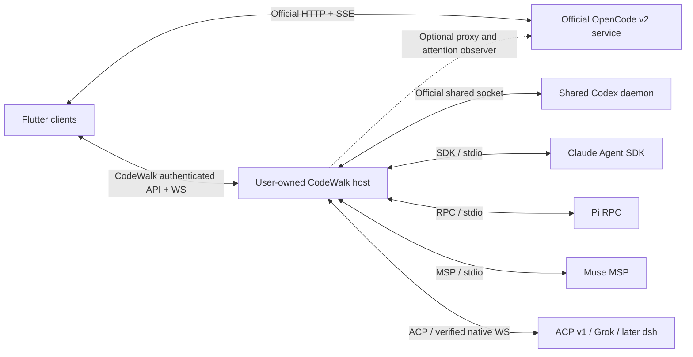

# CodeWalk v2 implementation plan

## 1. Status, objective, and recommended direction

**Planning is complete; implementation has not started.** This investigation remained read-only. No files, services, dependencies, repositories, or external state were changed, and no tests or builds were run.

The inspected repository is at `14fbf519`, with CodeWalk `1.265.0+1790827338`. The research pack is a **2026-10-02 snapshot**, not a permanent compatibility guarantee.

CodeWalk v2 should become a **Flutter client with native harness adapters and an optional, user-owned host service**:

- Connect directly to official OpenCode v2 HTTP/SSE servers.
- Use the host service for the shared Codex daemon, Claude Agent SDK, Pi RPC, Muse MSP, and stdio ACP agents.
- Allow a verified direct Grok connection later, while recommending the host service when reconnects, browser access, notifications, or session ownership require it.
- Normalize supported behavior into a small CodeWalk domain model.
- Preserve upstream semantics and capability differences explicitly.
- Keep all conversational traffic on the user’s network. Introduce no CodeWalk-hosted session relay.

The host service must **attach to official shared services where available**, rather than replacing them. It owns only the processes it launches and the supplementary services it provides.

The recommended daemon implementation is **TypeScript on a pinned Node runtime**, rather than Bun as the initial production runtime. Claude and Muse already expose official TypeScript SDKs; Pi provides official TypeScript integration; ACP has a TypeScript SDK. This minimizes duplicate protocol implementations and avoids a Go/Rust core that still needs JavaScript sidecars.

The recommended public rollout is:

1. **v2.0:** complete OpenCode v2 support, a proven host service, and Codex integration through its shared daemon.
2. **v2.1:** Claude and Pi, after their ownership, authentication, and capability gates pass.
3. **v2.2:** Muse and Grok, after native conformance and distribution gates pass.
4. **Later experimental integration:** `dsh`, conditional on a useful history-replay contract.

These version assignments are **recommendations for D02**, not previously accepted release commitments.

### Intended final behavior

A user can open CodeWalk on Android, iOS, Web, Linux, macOS, or Windows; select a host and project; see sessions from enabled harnesses; identify each session’s harness and ownership; and continue a supported session without changing its protocol identity.

A running session remains on its host when a phone sleeps or disconnects. CodeWalk reconnects, repairs its projection, restores pending interactions, and distinguishes an interrupted observation from an interrupted agent.

Unsupported actions remain absent or disabled with an accurate explanation. “Resume,” “attach,” “fork,” “rewind files,” “archive locally,” and “stop background tasks” are separate actions.

### Material findings that change the plan

Two supplied summary claims conflict with stronger pinned evidence:

| Summary claim | Inspected evidence | Planning consequence |
|---|---|---|
| OpenCode v2 has no file-write endpoint | The pinned protocol and OpenAPI contain `POST /api/experimental/fs/write` | Support it as an **experimental capability**, not a stable general file-management API |
| OpenCode has no Windows ARM64 binary | The update metadata includes `opencode-windows-arm64.zip`; the curl installer excludes that target | Desktop binary installation can potentially support Windows ARM64, subject to artifact and execution verification |

The filesystem route explicitly permits targets outside the location. CodeWalk must not describe it as inherently project-confined. See [the pinned filesystem contract](/home/ubuntu/MEGA/WORK/codewalk/plan/opencode-v2-src/protocol-groups/fs.ts:75) and [saved update metadata](/home/ubuntu/MEGA/WORK/codewalk/plan/opencode-v2-docs/docs-install-script.md:637).

No blocker prevents producing this plan. There are implementation gates, particularly:

- Live attachment to an arbitrary existing Claude terminal process is not established.
- `dsh` resume does not replay history.
- iOS has no project directory or release pipeline yet.
- Native iOS background push requires a publisher-controlled APNs provider arrangement.
- Codex integration must negotiate the running daemon version, which may differ from the CLI.

---

## 2. Decision assessment: D01–D16

“Keep” preserves the user’s baseline. Recommendations to change a baseline are advisory and must be discussed before changing the final direction.

| ID | Verdict | Evidence and argument | Recommendation or concrete alternative | Confidence / verification |
|---|---|---|---|---|
| **D01 — connection architecture** | **Unresolved; recommend hybrid** | OpenCode supplies a shared authenticated network service. Codex shares live sessions through a local owner-only socket. Claude, Pi, and Muse require host execution. Stable ACP transport is stdio. | Direct OpenCode plus an optional CodeWalk host service. A universal mandatory daemon would simplify transport but impose installation on users who already have a sufficient OpenCode server. Direct-only cannot deliver the selected harness scope. | **High** on the architectural need. Spike browser authentication and shared Codex socket attachment before freezing the host protocol. |
| **D02 — rollout** | **Unresolved; recommend staged releases** | Seven harnesses expose materially different contracts. Codex proves the second native protocol; Claude introduces process ownership and authentication questions; Muse/Grok have broad young surfaces; `dsh` lacks replay. | v2.0 OpenCode + Codex; v2.1 Claude + Pi; v2.2 Muse + Grok; `dsh` experimental later. All six client platforms stay in the program. | **Medium-high**. Revise dates after bounded spikes and one complete second-adapter slice. |
| **D03 — new skeleton, same repository** | **Keep** | The inventory reports two very large shared-state classes, wire types in presentation, direct Dio access, and many v1-specific recovery paths. Source inspection corroborates the coupling. | Build a new skeleton in this repository; preserve the existing revision and later maintenance branch; transplant bounded components instead of adapting the entire old provider. | **High**. Verify reused widgets’ dependencies before moving each component. |
| **D04 — same app ID, updater replacement** | **Keep, with a rollback caveat** | Android uses `com.verseles.codewalk` and Flutter’s build number. The same identity preserves installed-app continuity but prevents ordinary coexistence and can block installing older v1 APKs over v2. | Keep the main ID. Require migration backups, unchanged signing identity, monotonic build numbers, and explicit legacy-install instructions. Reconsider a separately identified **manual legacy artifact** if easy coexistence or rollback is desired. | **High** on Android behavior; **medium** across desktop stores. Test a real signed v1→v2 upgrade and legacy recovery before release. |
| **D05 — allow-all ON, global/session controls** | **Change recommended; baseline remains ON** | OpenCode wildcard session rules override agent deny rules and are inherited by children. Codex approval policy and sandbox policy are independent. Claude/Grok retain deny constraints. Pi has no native approval gate. | Keep automatic approval ON as a product preference, but recommend defining it as **approve emitted requests while preserving upstream restrictions**, with full-access/sandbox changes separate. If the selected native wildcard policy is retained, label its stronger OpenCode semantics explicitly and document the ADR exception. | **High** on inspected semantics. Capture deny-rule, child-inheritance, policy-lock, and disconnected-client cases for each adapter. |
| **D06 — native usage plus opt-in vendor queries** | **Keep with a narrower implementation boundary** | Native Codex limits, Claude events, Muse windows, and OpenCode tokens/cost cover much useful information. Undocumented vendor endpoints and credential scraping have greater drift and policy risks. | Native first. Experimental vendor connectors run on the host, off by default, using authorized credentials and independently verified endpoints. Do not port credential-file scraping or token refresh/writeback. | **High** for native-first; **medium** per vendor connector. Each connector requires current official policy/endpoint review and isolated tests. |
| **D07 — notifications/background delivery** | **Unresolved; recommend host attention plus staged delivery** | A host survives client suspension; mobile operating systems constrain persistent sockets. Native iOS push requires APNs provider credentials. | First release: host attention feed, local notifications, explicit Android monitoring, foreground/resume delivery on iOS. Add direct Web Push and optional notification-only gateway later. Never promise terminated-app delivery without an enabled mechanism. | **High** on limitations; **medium** on product timing. Validate physical devices, browser service workers, and publisher credentials. |
| **D08 — user-managed network, no hosted relay** | **Keep** | Official network services, authenticated host connections, VPNs, TLS proxies, and SSH can satisfy remote access without carrying sessions through CodeWalk infrastructure. | Support LAN/VPN/TLS endpoints first. Add app-managed SSH where platform libraries pass verification. Show separate network and upstream authentication failures. | **High**. Test IPv6, certificate chains, VPN changes, proxies, and SSH disconnects. |
| **D09 — Android/Linux/macOS/Windows/Web/iOS** | **Keep** | Flutter already targets five of these, but `ios/` is absent and several native integrations lack Web/iOS support. | Retain all six targets. Define a common connected-client tier and platform-specific installation/background/voice tiers. A missing optional facility must not masquerade as support. | **High** on product feasibility; **medium** on schedule. Establish macOS/iOS signing and platform runners early. |
| **D10 — official OpenCode binary, SHA-256, service** | **Keep** | The shared service, port 49374, authentication, pairing, and checksum metadata exist. GitHub’s latest release is not a valid v2 artifact selector. | Download from official v2 metadata; require checksum verification; install atomically; discover/start the shared service through official commands; automatically pair locally. | **High**. Verify metadata shape, extraction safety, CPU/libc targets, Windows ARM64, and restart ownership. |
| **D11 — desktop manages host/harness installations** | **Keep** | Desktop can run official installers and services. Mobile/Web cannot generally perform host process management. | Desktop offers install/update operations through official channels. Android/iOS connect; Web connects and can request authorized operations from an existing host, but never executes local installers. | **High**. Test install ownership, package-manager detection, uninstall scope, and active-session upgrade deferral. |
| **D12 — English plan** | **Keep** | A documentation preference with no technical constraint. | English plan and engineering contracts; retain application localization. | **High**. Documentation review. |
| **D13 — external sessions essential** | **Keep, with explicit support levels** | OpenCode shares service state. Codex can rejoin running shared-daemon threads. Claude SDK lists and resumes local history; this does not establish arbitrary live-process control. Pi/Muse/Grok have different ownership constraints. | Make discovery and continuation release gates. Distinguish history-only, resumable, live-attached, externally owned, and bridge-owned sessions. Do not create a second process against a busy session to simulate live attachment. | **High** for OpenCode/Codex; **medium** elsewhere. Terminal-created fixtures and concurrency captures are mandatory. |
| **D14 — unified sessions and capability-aware UI** | **Keep** | A unified list is feasible without uniform protocols. Session, model, quota, and permission state must be scoped to the runtime. | Group by host/project, show harness badges, and filter actions by runtime + session + model + platform capabilities. Keep native IDs and semantics. | **High**. Test collisions, duplicate endpoint aliases, and capability changes after reconnect. |
| **D15 — daemon language/runtime** | **Unresolved; recommend TypeScript/Node** | Official Claude/Muse SDKs and Pi/ACP integrations reduce implementation work. Dart lacks equivalent native SDK coverage. Go/Rust would still need JavaScript integration processes. | TypeScript, pinned Node, explicit dependency lockfile, small process supervisor. Bun remains an evaluated alternative after SDK and native-module conformance. | **Medium-high**. Package/runtime spike across Linux ARM64/x64, macOS, Windows; measure idle memory and installer size. |
| **D16 — independent helpers, scheduling/budget** | **Process-only** | This governs planning execution, not product architecture. | Preserve independent deliverables and recovery references. Scheduling and confidence counts must not substitute for inspected evidence. | Not a product feasibility question. The orchestrator verifies process compliance. |

### Baseline changes recommended for reconsideration

1. **D05: preserve restrictions when auto-approving.** This avoids making OpenCode’s default toggle silently disable read-only agent rules. Keep sandbox/full-access controls separate.
2. **D04: define a practical legacy recovery artifact.** Same-ID replacement is reasonable; “download v1 manually” alone is insufficient when the package manager rejects a downgrade.
3. **D06: exclude credential scraping from the experimental feature.** Native signals and authorized host APIs remain; existing OAuth-file reads and token writebacks are discarded.
4. **D07: decide whether optional notification-only infrastructure is acceptable later.** It can carry opaque notification data without carrying chat traffic. Without it, native iOS terminated-app notification delivery remains limited.

These recommendations do not silently replace the selected baseline.

---

## 3. Evidence and integration pins

The initial compatibility fixtures should use these versions, followed by fresh captures against the actual runtime selected for implementation.

| Harness / protocol | Inspected integration version | Primary surface | Source boundary |
|---|---|---|---|
| OpenCode | `v2.0.21`, `8a8bd622`; recorded `2.0.22` changes at `05018b88` | HTTP `/api/*`, global SSE, official shared service | [API dossier](/home/ubuntu/MEGA/WORK/codewalk/plan/11-opencode-v2-server-api.md:7), [event dossier](/home/ubuntu/MEGA/WORK/codewalk/plan/12-opencode-v2-events-and-schemas.md:1) |
| Codex | Generated types from CLI `0.159.3`; daemon/source evidence at `rust-v0.160.0` | App-server v2 through shared daemon socket | [daemon semantics](/home/ubuntu/MEGA/WORK/codewalk/plan/20-codex.md:112), [generated types](/home/ubuntu/MEGA/WORK/codewalk/plan/codex-src/key-types.ts:321) |
| Claude | Agent SDK `0.3.287`, CLI `2.1.287` | Official host-side SDK; long-lived streaming input | [SDK types](/home/ubuntu/MEGA/WORK/codewalk/plan/claude-code-src/agent-sdk-0.3.287-sdk.stripped.d.ts:929), [dossier](/home/ubuntu/MEGA/WORK/codewalk/plan/21-claude-code.md:317) |
| Pi | `1.0.0` | Official RPC JSONL or SDK | [RPC dossier](/home/ubuntu/MEGA/WORK/codewalk/plan/22-pi.md:64), [security contract](/home/ubuntu/MEGA/WORK/codewalk/plan/harness-src/pi/security.md:1) |
| Muse | CLI/SDK `1.4.2`, MSP v1; saved fingerprint `sha256:61afea…68e2` | `muse serve`, official TS SDK | [MSP types](/home/ubuntu/MEGA/WORK/codewalk/plan/harness-src/muse/msp-v1-stable.d.ts:35), [SDK contract](/home/ubuntu/MEGA/WORK/codewalk/plan/harness-src/muse/sdk-ts-README.md:1) |
| Grok Build | Dossier `1.0.46`; registry snapshot references `1.0.47` | ACP v1 over official WS/stdio plus `x.ai/*` | [native server guide](/home/ubuntu/MEGA/WORK/codewalk/plan/harness-src/grok/15-agent-mode.md:60), [extension inventory](/home/ubuntu/MEGA/WORK/codewalk/plan/24-grok-build.md:94) |
| `dsh` | `0.2.0-rc.2` | Official automation-only ACP stdio | [exact ACP limitations](/home/ubuntu/MEGA/WORK/codewalk/plan/harness-src/dsh/dsh-acp-README.md:65) |
| ACP | Stable schema `v1.24.1`; v2 `alpha.7` is draft | Stable stdio; harness-specific remote transports separately verified | [transport contract](/home/ubuntu/MEGA/WORK/codewalk/plan/acp-src/protocol-v1/transports.mdx:1), [comparison](/home/ubuntu/MEGA/WORK/codewalk/plan/30-acp-and-unifying-protocols.md:17) |

OpenChamber is a useful secondary reference for bounded replay, projection boundaries, local archive, attention, and reconnect behavior. Its inspected commit is `fc012ae0029fa2ac8d1d52b4af37040fc536258e`. It remains OpenCode-only; its private provider queries and OpenCode-impersonating community proxies are not contracts to adopt. See [OpenChamber evidence, §2](/home/ubuntu/MEGA/WORK/codewalk/plan/31-multi-harness-clients.md:73).

---

## 4. Capability matrix

Legend:

- **N:** native official surface.
- **B:** CodeWalk host service supplies the facility.
- **X:** official harness-specific extension.
- **E:** experimental or version-gated.
- **C:** community extension or adapter.
- **—:** unsupported through the selected surface.
- **?:** material uncertainty requiring verification.

A native feature can still require the bridge for remote transport. Capability labels describe the feature, not merely its transport.

### 4.1 Transport, session lifecycle, and external ownership

| Harness | Connection and process ownership | External discovery / history / live control | Create / resume / fork | Archive / delete / rewind |
|---|---|---|---|---|
| **OpenCode v2** | **N** HTTP/SSE shared per-user service; direct or optional host proxy | **N** shared sessions, including TUI sessions; session list is paginated | **N** create, resume through prompt admission, fork | No native archive: **B/app-local** archive. **N** recursive delete. **N** staged conversation/file revert |
| **Codex** | **N** shared daemon UDS; **B** network/Web access | **N** stored thread list and live rejoin through the same daemon. Standalone TCP server is a different owner | **N** start/resume/fork | **N** archive/unarchive/delete. Fork is practical conversation rewind; file undo **—**; revert API unusable for ordinary current threads |
| **Claude** | **B** owns long-lived SDK queries/processes | **N** local list/history. Resume inactive terminal histories. Arbitrary live TUI takeover **—/?** | **N** resume/fork/history mutations | **N** delete; local archive **B**. **N partial** file checkpoints; fork/resume boundary for conversation; redo **—** |
| **Pi** | **B** owns RPC process per active session, or official SDK sessions | **N SDK/B** listing and persisted history. No general shared live daemon contract | **N** new/switch/fork/clone; retain entry-tree lineage | Rename **N**; archive **B**; deletion not in RPC. File rewind **—**; conversation fork **N** |
| **Muse** | **B** owns `muse serve`; MSP leases must be respected | **N** list/read/resume with cursor. Existing TUI history continuation is feasible; simultaneous external ownership needs a spike | **N** start/resume/fork | Delete **N**; archive **B**. MSP rewind is fork/retract, not general file restore |
| **Grok Build** | **N** authenticated WS server; **B** recommended for persistence and browser credentials | **N/X** list/history; state persists across reconnect. Shared-leader and concurrent TUI behavior require capture | **N/X** new/load/resume/fork | **X** delete/rename; local archive **B**. Rewind changes conversation only |
| **`dsh`** | **B** owns ACP process | **N** list/resume inactive sessions, but **no transcript replay**. General external live control **—** | **N** new/resume/close; fork **—** | Delete/rename/rewind **—** through ACP; local hide/archive **B** |

**D13 acceptance must not equate a visible stored transcript with a controllable running process.**

### 4.2 Streaming, interactions, tasks, and cancellation

| Harness | Text / reasoning / tools | Permissions and allow-all | Questions / plans / tasks | Subagents and stop semantics |
|---|---|---|---|---|
| **OpenCode v2** | **N** typed started/delta/ended; final ended content authoritative | **N** ordered rules; `once/always/reject`; wildcard rules have stronger deny-override semantics | **N** forms. Native todo/task list **—**. Render plan text without inventing task state | **N** child sessions/background jobs; child interrupt; parent interrupt does not imply all background children stop |
| **Codex** | **N** turn/item streams, reasoning summaries, command output, diffs | **N** command/file/permission requests; policy and sandbox separate; admin requirements constrain both | **E** question/plan/queue surfaces; **N** plan updates/goals where available | **N** child threads and activity; direct child input generally rejected; turn interrupt is separate from child/archive actions |
| **Claude** | **N** partial main-thread streams; complete subagent messages/forwarding | **N** callbacks, modes, rule updates. Questions and interaction-required actions remain manual | **N** AskUserQuestion/elicitation; plan approval; task tools are model/config dependent | **N** background tasks/subagents; `stopTask`; interrupt receipt can report queued work; task-survival option matters |
| **Pi** | **N** text/thinking/tool deltas and authoritative message end | Native permission requests **—**. Default unrestricted execution; gating requires **C/new extension** | **N** extension dialogs; native todo/subagent system **—** | **N** abort/retry/bash/queue controls. Subagents require extensions; `agent_settled` is the settlement signal |
| **Muse** | **N** cursor/revisioned items and text/output deltas | **N** server-minted choices and requirement guards; native allowAll may be policy-blocked | **N** user-input requests, todo lists, goals, workflows | **N** subagents/background tasks; separate interrupt/cancel/retract/stop controls |
| **Grok Build** | **N** ACP chunks/tools/plans; **X** richer state | **N/X** permissions and modes; deny rules/hooks remain; sandbox separate | **X** questions; **N** ACP plan; **X** task facilities | **X** child/task controls; verify extension payloads before exposing actions |
| **`dsh`** | **N partial** committed chunks, not provider-token streaming; generic tools | **N** one-shot allow/reject requests; **B** responder for auto-approval | Questions/plans **—** through ACP | Internal subagents not structurally exposed; **N** prompt/autonomous cancellation and session close |

### 4.3 Composer, commands, skills, mentions, attachments, and selection

| Harness | Steer / queue / retract | Commands and skills | Mentions and attachments | Agent / model / effort |
|---|---|---|---|---|
| **OpenCode v2** | **N** steer/queue, `resume:false`, inbox mode change/cancel | **N** command catalog/execution, skill attachments; skill activation endpoint **E** | **N** file/data URLs, agent/skill attachments and mention ranges; image/PDF support depends on model and parser | **N** session agent/model/variant selections; no per-prompt model override |
| **Codex** | **N** explicit steer with expected turn ID; queue **E**; start while busy steers | Server slash registry **—**. **N** skills; app palette maps supported operations | **N** images via data/local paths; skills and connector/plugin mentions structured; file mentions are not connector mentions; PDF handling **B/?** | **N** model/effort catalog; collaboration mode **E**; no universal OpenCode-style primary-agent selector |
| **Claude** | **N** streaming-input messages, `priority:now`; exact next/later and takeback stability require verification | **N** supported command/skill lists; hide terminal-only commands | **N** images, native `@path` expansion unless client-composed; other files **B** upload/reference; PDF behavior verified per model | **N** supported models/agents/efforts; runtime methods; distinguish requested from effective fallback |
| **Pi** | **N** steer/follow-up queues and complete queue snapshots | **N** extension/template/skill catalog; TUI built-ins mapped to RPC locally | Images **N**; RPC `@file` expansion **—**; file search/context embedding **B**; PDFs **B** extraction/reference | Model/thinking **N**; agent selector **—** |
| **Muse** | **N** start-ifBusy, steer, unqueue, interrupt/retract | Skills **N**; general TUI slash-command registry **—** | Image input **N**; text `@path` references; PDF **B/?** | Model/effort **N**; stable primary-agent selector **—/?** |
| **Grok Build** | **X** interject/queue; cancellation separately scoped | **N/X** available commands and skills; verify builtin execution | Images handled but not always advertised: **X/?**. File/resource context and fuzzy search **N/X**; PDFs **B/?** | **N/X** model/config/effort; agent profile differs from generic agent selection |
| **`dsh`** | One in-flight prompt; steer/queue **—** | Commands/skills **—** through ACP | **N** resource links and conditional raster images; PDF **B**, explicitly converted/labeled | **N** model/configured reasoning effort; primary-agent selector **—** |

### 4.4 Files, terminals, usage, and notifications

| Harness | Browse / search / read / write | Terminal and shell | Tokens / cost / context / quota | Notification source |
|---|---|---|---|---|
| **OpenCode v2** | **N** list/find/read; write **E**; content/symbol search **—**, optionally **B** | **N** PTY ticket/WS, shell jobs; persistent PTY **E** | **N** session/step tokens and cost; context limits; remaining quota **—**; provider limit errors; stats **E** | Execution/forms/permissions/error events; host/app delivery |
| **Codex** | **N** fs and fuzzy search; exact filesystem access restrictions require verification | **N** command PTY is connection-scoped; bridge connection can survive phone detach. Transcript shell is unsandboxed | **N** token usage and account rate limits; no automatic cost inference from subscription allowance | Turn/status/approval/error events; host/app delivery |
| **Claude** | Read **N**; general tree/search/write **B** | Interactive PTY **B**; tool Bash output is not a user terminal | **N** result/model usage and context; native rate-limit events; usage pull **E** | Result/state/notification/task events; host/app delivery |
| **Pi** | General client filesystem **B** | **N** streamed noninteractive bash; PTY **B** | **N** token/cost/context stats; vendor quota **—** | Native completion/retry/dialog events; host/app delivery |
| **Muse** | General filesystem **B** | **N** capability-gated userShell; do not presume full PTY equivalence | **N** counted usage, estimated/partial cost, context, quota windows | Cursor-ordered status/approval/task/usage events |
| **Grok Build** | **X** fs/fuzzy/content search | **X** terminal/PTY; ACP reverse terminal handled on host when advertised | **N/X** usage/cost; billing/quota shape **?** | Native/extension state and interaction events |
| **`dsh`** | Host service **B**; ACP client fs unsupported | Terminal **—** through ACP; independent host terminal is separate | Context **N partial**; cost/quota **—** | Generic prompt settlement/errors; host/app delivery |

A host-supplied filesystem or terminal is **CodeWalk host functionality**, not a claimed upstream harness capability.

---

## 5. Architecture and exact boundaries

### 5.1 Recommended topology



The optional OpenCode path should initially be a **scoped pass-through plus attention observer**, not a second complete OpenCode timeline implementation. Flutter’s OpenCode adapter remains responsible for mapping the official wire contract.

For bridge-owned harnesses, host adapters emit the CodeWalk domain protocol. Flutter consumes it through one host adapter.

This is a deliberate asymmetry that reduces duplicate reducers:

- OpenCode wire semantics are implemented once in Dart.
- Claude/Codex/Pi/Muse/ACP wire semantics are implemented on the host.
- The host understands only the OpenCode events needed for supplementary attention and delivery.
- Shared fixtures verify both paths’ domain expectations.

### 5.2 Proposed repository layout

```text
lib/
  main.dart
  main_v2.dart                         # temporary development entry only
  src/
    app/
      bootstrap.dart
      dependency_registry.dart
      router.dart
      app_shell.dart
    domain/
      identity.dart
      capabilities.dart
      session.dart
      timeline.dart
      content.dart
      execution.dart
      interactions.dart
      usage.dart
      tasks.dart
      catalog.dart
      errors.dart
      commands.dart
      ports/
        harness_port.dart
        filesystem_port.dart
        terminal_port.dart
        host_management_port.dart
    adapters/
      opencode_v2/
        client.dart
        wire/
        event_decoder.dart
        projection.dart
        synchronization.dart
        capability_profile.dart
      host_v1/
        client.dart
        wire/
        event_decoder.dart
        capability_profile.dart
    infrastructure/
      connections/
        connection_registry.dart
        connection_supervisor.dart
        http_transport.dart
        websocket_transport.dart
        sse_parser.dart
        credential_binding.dart
      persistence/
        local_store.dart
        schema_migrations.dart
        draft_store.dart
        tab_store.dart
        transcript_cache.dart
    application/
      session_controller.dart
      session_index_controller.dart
      composer_controller.dart
      interaction_controller.dart
      task_controller.dart
      attention_controller.dart
      catalog_controller.dart
    features/
      onboarding/
      hosts/
      sessions/
      chat/
      files/
      terminal/
      usage/
      settings/
    platform/
      installation/
      notifications/
      voice/
      secure_storage/
      lifecycle/
      desktop/

host/
  package.json
  src/
    main.ts
    config.ts
    api/
      http.ts
      websocket.ts
      pairing.ts
      authorization.ts
    runtime/
      registry.ts
      supervisor.ts
      ownership.ts
      session_locks.ts
      version_negotiation.ts
    adapters/
      codex/
      claude/
      pi/
      muse/
      acp/
      grok/
      opencode_observer/
    services/
      files.ts
      search.ts
      attachments.ts
      attention.ts
      usage_connectors/
      installation.ts
    storage/
      database.ts
      journal.ts
      checkpoints.ts
      command_receipts.ts

contracts/
  codewalk-host-v1/
    manifest.json
    schemas/
    examples/

test/
  contract/
  unit/v2/
  widget/v2/
  web/
  integration/v2/
```

The temporary `main_v2.dart` is an implementation aid. The shipped v2 app has one bootstrap and **no runtime v1 compatibility path**.

Keep `provider` and `get_it` initially. Replacing state-management packages is not necessary to solve the current coupling. Controllers must own bounded state, use immutable projections, and expose selectors; they must not become another shared 20,000-line class.

### 5.3 Domain identity

Every identifier is scoped.

```ts
type HostId = string;
type RuntimeId = string;

type SessionRef = {
  hostId: HostId;
  runtimeId: RuntimeId;
  nativeSessionId: string;
};

type ProjectRef = {
  hostId: HostId;
  canonicalDirectory: string;
  upstreamProjectId?: string;
};

type RuntimeIdentity = {
  runtimeId: RuntimeId;
  harness: "opencode" | "codex" | "claude" | "pi" | "muse" | "grok" | "dsh";
  installationNamespace: string;
  protocolVersion: string;
  runtimeVersion: string;
  cliVersion?: string;
};
```

`installationNamespace` distinguishes separate Codex homes, Claude configuration roots, or private server installations without exposing their credential paths.

Rules:

- Never use a native session ID alone as a cache key.
- Never use PID as persistent host/runtime identity.
- A bridge host has a stable generated identity bound to its pairing credentials.
- A direct OpenCode profile has a persisted local identity.
- Endpoint aliases are merged only after explicit verified association; matching titles, URLs, or directory names is insufficient.
- Project grouping uses host filesystem identity. Windows case rules, UNC paths, symlinks, and worktrees require host-aware canonicalization.
- A fork relationship and a spawned-child relationship are separate fields.
- A host replacement requires re-pairing rather than silently inheriting credentials.

### 5.4 Ports

Avoid a universal method accepting arbitrary maps. Use a small set of typed ports:

```dart
abstract interface class HarnessPort {
  RuntimeDescriptor get runtime;
  CapabilitySet get capabilities;

  Future<SessionPage> listSessions(SessionQuery query);
  Future<SessionSnapshot> openSession(
    SessionRef session, {
    required OpenIntent intent,
  });
  Future<CommandReceipt> createSession(CreateSessionCommand command);
  Future<CommandReceipt> submit(SubmitInputCommand command);
  Future<CommandReceipt> control(ControlCommand command);
  Future<CommandReceipt> reply(InteractionReply command);
  Future<CatalogSnapshot> readCatalog(ProjectRef project);

  Stream<DomainEnvelope> observe(ObservationScope scope);
}
```

Optional filesystem, terminal, and host-management ports are injected only when available.

`OpenIntent` distinguishes:

- `viewHistory`
- `attachLive`
- `resumeInactive`

Opening a list item must not accidentally start an agent.

### 5.5 Capability negotiation

A boolean such as `supportsUndo` is inadequate.

```ts
type Capability = {
  availability: "available" | "unavailable" | "experimental" | "unknown";
  implementation: "native" | "host" | "client" | "extension";
  reason?: string;
  constraints?: Record<string, unknown>;
};

type SessionCapabilities = {
  history: Capability & { mode?: "full" | "paged" | "suffix" | "none" };
  liveAttach: Capability;
  directInput: Capability;
  fork: Capability;
  archive: Capability & { scope?: "upstream" | "host" | "device" };
  rewind: Capability & {
    conversation?: "stage" | "fork" | "truncate" | "none";
    files?: "snapshot" | "checkpointPartial" | "none";
    redo?: "clearStage" | "switchOriginal" | "none";
  };
  approvalPolicy: Capability;
  sandboxPolicy: Capability;
  delivery: Capability & { modes?: string[] };
};
```

Effective capability is the intersection of:

1. Adapter implementation.
2. Negotiated upstream contract/version.
3. Host operating system.
4. Selected session’s ownership/state.
5. Selected model’s modalities/options.
6. User policy and upstream administrative constraints.
7. Client platform.

Unknown means unavailable until verified. A harmless advertised-method probe may refine it; mutation probes may not.

Capability changes emit a revisioned update and immediately invalidate affected controls. A direct-input-disabled Codex child remains inspectable with its composer disabled.

### 5.6 Timeline and content

The canonical timeline supports:

- User input.
- Assistant step/message.
- Synthetic/system notice.
- Tool call.
- Shell job.
- Compaction.
- Model/agent/location change.
- Execution outcome marker.
- Unknown upstream item.

Assistant content is a union of text, reasoning, file/resource reference, tool reference, and unknown content. Preserve native message, turn, tool, segment, and parent identifiers.

Tool presentation uses a **semantic classification provided by the adapter**, such as file-read, file-change, command, search, delegation, or generic. Keep the native tool name available in details. Widgets must not infer semantics from raw names such as `Bash`, `shell`, or `task`.

Render only reasoning the upstream actually exposes. Do not manufacture reasoning text or equate a reasoning summary with an internal reasoning transcript.

### 5.7 Event envelope and provenance

```ts
type DomainEnvelope = {
  schemaVersion: 1;
  runtimeId: RuntimeId;
  session?: SessionRef;
  project?: ProjectRef;
  kind: string;
  payload: DomainEvent;

  hostCursor?: { epoch: string; sequence: number };
  upstream: {
    protocol: string;
    eventType: string;
    eventId?: string;
    aggregateId?: string;
    sequence?: number;
    revision?: number;
    cursor?: string;
    durable: boolean;
    receivedAt: number;
  };
  rawReference?: string;
};
```

Do not invent upstream sequence numbers.

- OpenCode durable sequence is per aggregate and can contain gaps for nonpublic records.
- Muse cursors remain opaque.
- ACP session-list cursors remain opaque and follow their specified lifetime.
- Codex item IDs and turn IDs provide identity, not a universal replay cursor.
- A host journal sequence describes **CodeWalk delivery**, not upstream execution ordering.

Raw provenance is available for diagnostics through an explicitly enabled, bounded, redacted capture. Credentials, auth frames, attachment bodies, and secret form answers are excluded. Unknown events retain their type and source reference without becoming plain assistant text.

### 5.8 State machines

Keep connection, execution, interaction, and submission state independent.

```text
Connection:
  disconnected → connecting → authenticating → synchronizing → live
                                   ↘ authRequired
  live → degraded → reconnecting
  incompatible is an explicit terminal connection condition

Execution:
  unknown | idle | running | retrying | compacting | interrupting
  Last outcome:
    succeeded | failed | interrupted | cancelled | unknown

Submission:
  draft → sending → admitted → pendingDelivery → delivered
             ↘ rejected
             ↘ indeterminate

Interaction:
  pending → submitting → settled
                ↘ failed / stale / indeterminate
```

A disconnected stream does not make the session idle. An acknowledged interrupt does not prove settlement. Parent idle does not prove background descendants have stopped.

Session-tree state carries both:

- The selected session’s execution state.
- The aggregate count of running/waiting descendants.

### 5.9 Host protocol

Define an explicit **CodeWalk protocol**, not an OpenCode facade.

Suggested versioned surface:

- `GET /cw/v1/info`
- `POST /cw/v1/pair/claim`
- `GET /cw/v1/runtimes`
- `GET /cw/v1/sessions`
- `GET /cw/v1/sessions/{ref}/snapshot`
- `POST /cw/v1/commands`
- `GET /cw/v1/commands/{commandId}`
- `POST /cw/v1/events/ticket`
- `GET /cw/v1/events` over WebSocket
- Separate authorized filesystem, attachment, and installation operations.

These are **proposed CodeWalk endpoints**, not existing upstream routes.

Use HTTP for snapshots, commands, uploads, and health. Use one multiplexed WebSocket for events and reverse interactions. PTY binary traffic has a separate channel or bounded multiplexed lane.

Mutation commands carry:

```ts
type Command = {
  commandId: string;
  session?: SessionRef;
  expectedSessionRevision?: number;
  expectedTurnId?: string;
  capabilityRevision: number;
  operation: TypedOperation;
};
```

Persist a receipt before dispatch. Record whether dispatch occurred and whether upstream admission is known.

A local receipt cannot create upstream exactly-once semantics after a crash. Commands with ambiguous dispatch remain `indeterminate` until repaired or explicitly resent.

### 5.10 Persistence and replay

Use SQLite on the host for:

- Runtime registry and ownership.
- Session index overlays.
- Command receipts.
- Canonical checkpoints and delivery journal.
- Attention state and notification deduplication.
- Host archive/pin metadata.

Select the SQLite implementation in the runtime spike. Do not assume a native npm module packages cleanly on all targets. Keep the storage interface limited to transaction, query, checkpoint, receipt, and journal operations.

Proposed default bounds:

- Transport replay: **24 hours or 64 MiB per host**, whichever limit arrives first.
- Raw diagnostic capture: **10 MiB**, disabled by default.
- Terminal in-memory tail: **1 MiB per terminal**, with truncation markers.
- Client warm transcript: newest **50–100 items**, paging older history.
- Client resident transcript target: **500 items**, with a byte cap as well.

Checkpoints and journal boundaries are committed atomically. On a missing cursor, send an explicit reset with a snapshot cursor. Never silently replay an incomplete suffix as complete history.

Upstream remains authoritative for native session history. CodeWalk’s cache is not an alternative agent database. `dsh` cannot recover old history from its selected API, so cached history must be labeled incomplete; this is a reason to defer public integration.

---

## 6. Synchronization, ordering, and mutation safety

### 6.1 OpenCode v2 connection

Probe authenticated `GET /api/info`, validate JSON and a supported major version, then negotiate features.

Do not detect v2 by a successful legacy route: unmatched routes can return HTML with status 200. Location routes use `location[directory]` or the documented header; session creation must send `location.directory` in its body. See [transport and scoping evidence](/home/ubuntu/MEGA/WORK/codewalk/plan/11-opencode-v2-server-api.md:54).

Consume **one global `/api/event` stream per connected service**. Parse:

- Blank-line framing.
- Multiple `data:` lines.
- Comment heartbeats.
- UTF-8 splits.
- Bounded frame sizes.
- EOF and subscriber overflow.

The stream is live-only, with no SSE replay. Official documentation confirms subscribers must reconnect explicitly after failure. [OpenCode client documentation](https://opencode.ai/v2/docs/build/client/).

On reconnect:

1. Start the stream and buffer relevant events.
2. Refresh active sessions and visible session metadata.
3. Fetch inbox, projected messages, pending permissions, and forms.
4. Overlay events that overtook those reads.
5. Use the experimental durable log when negotiated and verified.
6. Repair unfinished segments without pretending lost deltas were recovered.

The official reducer documents a race where separate inbox/message reads can both miss a promoted input. Port its update-overlay and outbox behavior; do not blindly replace collections with snapshots. See [the reference reducer](/home/ubuntu/MEGA/WORK/codewalk/plan/opencode-v2-src/client-solid-data.reference-reducer.ts:593).

With the durable log enabled:

- Buffer live events during catch-up.
- Apply durable events after the stored aggregate sequence.
- Treat `log.synced` as the captured watermark.
- Deduplicate durable events by aggregate/sequence.
- Apply buffered events after that watermark.
- Re-fetch ephemeral interactions, active state, and incomplete streamed content.

Sequence gaps alone do not imply missing public events, because internal records share the aggregate sequence.

Without the experimental log:

- Repair from official projections and buffered live events.
- Retain indeterminate local admissions.
- Mark incomplete live text as reconnecting.
- Let authoritative ended content replace the missing prefix.
- Do not claim gap-free token replay.

### 6.2 Streaming reducer rules

- Segment identity is message/item ID plus ordinal or native segment ID.
- Delta append applies only to the active stream generation.
- Ended/completed content replaces streamed content.
- A late delta cannot append to a finalized segment.
- A retry that legitimately reuses a message ID starts a new generation.
- Snapshot hydration cannot overwrite newer event state.
- Deletion, committed revert, and explicit reset can remove rows; ordinary snapshots cannot erase an unexplained newer tail.
- Tool progress may be a replacement snapshot, not an append operation.
- UI flushes are batched independently of protocol ingestion.
- A malformed record is isolated and logged with a safe type/code; it does not erase the session.

### 6.3 Prompt admission

**OpenCode:** mint a valid `msg_` identifier, persist it with the draft, submit it as `id`, and reconcile by ID. Reposting the same admission ID is supported; conflicting content must remain an error. No content/time matching.

**Muse:** preserve the upstream `commandId` and its documented same-command retry semantics. Admission is not completion.

**Codex:** use `clientUserMessageId` where supported for correlation. Do not infer idempotency from the existence of that field. After an ambiguous result, inspect thread/items and the host receipt before resending.

**Claude/Pi/ACP:** correlate with supported message/command identifiers. A generic JSON-RPC request ID is not durable submission deduplication. If the host crashes after writing stdin but before recording admission, mark the result indeterminate.

A disconnected “Send” button must not automatically create a retry loop. Offer “Check delivery,” “Keep draft,” and an explicit resend action when duplication cannot be ruled out.

### 6.4 Selection and concurrent clients

For OpenCode, agent/model/variant are session mutations, not prompt fields. Apply changes in order and await confirmation before sending. If another client changes selection, update the effective chips.

For Codex, turn settings can persist to later turns. Explicit steer includes the expected active turn ID. A stale turn must fail visibly rather than steer a newer turn.

For bridge-owned sessions:

- Serialize CodeWalk mutation dispatch per session.
- Expose a controller lease with expiry and ownership.
- Allow multiple readers.
- Require an explicit handoff for a second CodeWalk controller.
- Preserve upstream locking errors.
- Do not imply the lease controls an unrelated terminal process.

For official shared OpenCode/Codex services, CodeWalk is one client among others. Use upstream state and request-resolution events. Do not fabricate exclusive ownership.

### 6.5 Interaction races

An interaction identity includes runtime, session, native request ID, and any upstream stage/requirement identifier.

- Muse replies include the current `requirementId`.
- Codex pending request replays are deduplicated and dismissed on `serverRequest/resolved`.
- OpenCode permission/form lists are repaired after reconnect.
- Claude callback promises remain host-owned while phones detach.
- A resolved notification cannot reopen an old approval.
- Duplicate replies become “Already resolved” only when the adapter establishes that meaning.
- Unknown reply failures retain the entered answer.
- Host restart does not replay old approvals against a new process.

The host is the sole automatic responder for bridge-owned sessions. App pages, background workers, and overlays do not independently auto-approve the same request.

---

## 7. Installation, authentication, update, and migration UX

### 7.1 Mobile-first onboarding

Use three bounded choices:

1. **Set up this computer** — desktop only.
2. **Connect to a host** — all platforms.
3. **Connect directly to OpenCode v2** — all platforms where network/browser constraints permit.

For a connection, show:

- Host label and address.
- Transport/authentication state.
- Available harnesses.
- Project selection.
- Delivery capabilities.
- Version compatibility.

The UI must distinguish “host reachable,” “upstream authenticated,” “harness ready,” and “project available.” A partial failure must not block unrelated harnesses.

Do not rewrite `localhost` into an emulator address in production onboarding. Keep emulator behavior in development configuration.

### 7.2 Managed OpenCode installation

Replace the current runtime service with an installation coordinator that:

1. Discovers an existing official service and its install owner.
2. Selects an official v2 artifact for OS, architecture, CPU baseline, and libc.
3. Requires SHA-256 metadata and verifies before extraction.
4. Rejects archive traversal and stages on the destination filesystem.
5. Activates the binary atomically.
6. Runs official service commands and verifies authenticated `/api/info`.
7. Creates and redeems a local pairing code.
8. Stores the redeemed token in secure storage.
9. Leaves the shared service running when CodeWalk closes.

A port occupied by an unrelated process is not successful installation.

Do not overwrite a package-managed binary with CodeWalk’s private installation. A managed binary may live in a CodeWalk-owned directory, while service operations remain official. Existing users can retain their package manager.

Pairing is single-use and expires after five minutes; redeemed OpenCode session tokens last 30 days and are invalidated by password rotation. Use Basic username `opencode` with the token as password. See [the pinned auth implementation](/home/ubuntu/MEGA/WORK/codewalk/plan/opencode-v2-src/server/auth.ts:16) and [pairing implementation](/home/ubuntu/MEGA/WORK/codewalk/plan/opencode-v2-src/server/pairing.ts:9).

“Automatic pairing” means desktop setup can perform local pairing. It does not mean a phone can reach a loopback URL printed by a different computer.

### 7.3 CodeWalk host pairing

Proposed behavior:

- Installation creates a private host identity.
- The user issues an enrollment code locally.
- The QR contains host address, protocol version, host identity, and an expiring claim.
- Claim exchange uses a request body, not a long-lived credential in a URL.
- Each client receives a revocable device credential.
- The host lists paired devices and supports revocation.
- Browser clients use secure same-origin cookies or short-lived WebSocket tickets with exact Origin checks.
- Persistent credentials are never placed in access logs or notification payloads.

Remote installation APIs must be authenticated and limited to approved harness recipes. Repository files cannot introduce installer commands.

### 7.4 Harness authentication

| Harness | CodeWalk behavior |
|---|---|
| OpenCode | Official pairing or password; provider integration workflows only through negotiated official endpoints |
| Codex | Use the user’s official host login and daemon; use supported app-server auth where appropriate; no first-party relay reuse |
| Claude | Run the unmodified official binary/SDK; direct the user to official host authentication; offer user-owned API/cloud credentials; no embedded Claude OAuth or token forwarding |
| Pi | Host-side official provider login/configuration; do not treat every advertised provider login as independently approved for third-party use |
| Muse | Official host login or API-key configuration; account APIs only when their experimental contract is verified |
| Grok | Official host authentication and supported server secret; TLS/VPN for remote transport |
| `dsh` | Host API-key configuration; ACP’s no-op authentication does not authenticate the network bridge |

Current Anthropic documentation requires developers to use API/cloud authentication, prohibits collecting or intermediating Claude OAuth credentials, and separately permits users to sign in to the unmodified binary. This plan therefore treats subscription-based third-party behavior as a **policy verification gate**, not an unconditional guarantee. [Claude authentication and credential rules](https://code.claude.com/docs/en/legal-and-compliance).

OpenAI’s current app-server documentation permits continued local/open-source app-server authentication but distinguishes commercial/hosted use. Recheck this before any product-model change. [Codex app-server authentication guidance](https://learn.chatgpt.com/docs/app-server).

### 7.5 Upgrade ownership

Display three versions where relevant:

- Installed CLI.
- Running official daemon/service.
- CodeWalk adapter compatibility profile.

Codex’s daemon can update independently. Negotiate against the running daemon; do not restart it because the CLI version differs.

For every upgrade:

- Identify who installed the binary.
- Defer disruptive restart while work is active.
- Keep the previous CodeWalk-owned binary until the replacement is healthy.
- Reconnect and renegotiate.
- Invalidate incompatible feature profiles.
- Never stop a shared user service merely because CodeWalk exits.
- Never interpret a slow health response as permission to restart a busy harness.

### 7.6 Same-ID v1→v2 migration

Preserve `com.verseles.codewalk`, signing identity, and increasing build number. Do not reset the build number to `1` when changing the semantic version to `2.0.0`.

The existing release command already calculates the next build number, commits version metadata, tags, and pushes. Planning must not invoke it. See [release implementation](/home/ubuntu/MEGA/WORK/codewalk/Makefile:418).

Use a transactional local schema migration:

1. Detect the v1 schema.
2. Retain a recoverable legacy namespace.
3. Import safe app preferences and host labels.
4. Import drafts, canned answers, model favorites, pins, and tabs with unresolved references.
5. Mark legacy OpenCode profiles as **requiring v2 verification and pairing**.
6. Treat cached v1 transcripts as optional read-only legacy exports, not v2 session truth.
7. Commit the migration only after validation.
8. Preserve a migration report with counts and unresolved references.

Do not independently edit or migrate OpenCode’s database. Follow the official OpenCode migration flow and expose its status when available.

Old server IDs may not map to new runtime IDs. Titles are never used to match sessions. A draft attached to an unresolved session is placed in a recovery inbox rather than discarded.

Manual v1 recovery must describe package downgrade restrictions. A separately built legacy identity would improve coexistence but requires a product decision. Under the current same-ID baseline, some platforms require uninstall/downgrade handling, so exported local data is essential.

---

## 8. UX and complete chat lifecycle

### 8.1 Unified sessions and external sessions

The home screen groups sessions by host and project, with:

- Harness badge.
- Native session title and origin.
- Running/waiting/background-work status.
- Ownership indicator.
- Local archive/pin/unread overlay.
- Last verified time.

Use distinct actions:

- **View history**
- **Attach to running session**
- **Continue session**
- **Fork from here**
- **Take control**, only where a supported ownership transition exists

Opening history does not launch a process or change permissions.

For Claude and Pi histories, the host obtains metadata through official SDK/session APIs. A directory watcher can invalidate the index, but may not imply that a running TUI is controllable. Do not read credential stores.

OpenCode root listing uses `parentID=null`; child listing uses the parent ID. Codex lists sources accurately and rejoins the shared daemon. Muse must honor `sessionInUse` rather than launching a competing owner.

### 8.2 Composer

The compact composer has:

- Text/draft area.
- Attachment control.
- Model/agent/effort chips appropriate to the harness.
- Delivery selector while busy.
- Submit or scoped stop action.
- Interaction badge.

Show the actual delivery wording:

- OpenCode: **Steer at next step** / **Queue for next turn**.
- Codex: **Steer current turn**; queue only when enabled and verified.
- Claude: **Send while running**, with documented merge/queue behavior; do not promise exact next-turn isolation.
- Pi: **Steer** / **Follow up**.
- Muse: **Steer** / **Queue**, plus replace only where intentionally exposed.
- Grok: verified **Interject** / **Queue** extension modes.
- `dsh`: disabled send while the session already has an in-flight prompt.

Persist drafts before network dispatch. A model change racing a send must not silently apply to an unintended session.

### 8.3 Async children and background work

Use a read-only activity strip under the session header and delegation cards in the timeline:

- Label, agent role, model, elapsed time.
- Foreground/background relation.
- Running, waiting for input, retrying, completed, failed, cancelled, or unknown.
- Open child, inspect output, or cancel when supported.
- Parent breadcrumb with exact viewport restoration.

Do not pair children by position, title similarity, or count.

OpenCode child links come from metadata, `parentID`, session listing, and active state. Foreground progress metadata is ephemeral, so reconnect must rebuild the relationship from the child list. Background completion creates a synthetic parent message and can resume the parent automatically. See [subagent lifecycle](/home/ubuntu/MEGA/WORK/codewalk/plan/12-opencode-v2-events-and-schemas.md:946).

The OpenCode “background” action affects currently backgroundable blocking work in the parent session. It must not appear as a per-child action when no such endpoint exists.

Show separate commands:

- **Stop this response**
- **Stop this child**
- **Stop all supported background tasks**

Explain the scope in the action sheet. Parent stop must not falsely indicate that detached jobs stopped.

For known nested-background premature completion reports:

- Track child execution and synthetic delivery separately.
- Show “Parent response finished; background work remains.”
- Avoid a fabricated whole-tree completion.
- Include an upstream-version regression fixture and a live reproduction gate.
- Do not invent a client-side wait protocol to repair the upstream job contract.

### 8.4 Permissions and forms

Permission cards show the actual action, resource, owner, offered choices, and persistence scope.

OpenCode labels:

- **Allow once**
- **Always for this project**, only when save patterns exist
- **Reject and stop**
- **Reject with feedback**, reflecting the different continuation behavior

“Always” must not retain v1’s session-only label.

Forms support:

- String, number, integer, boolean, multiselect.
- Options plus custom input when permitted.
- Required fields and validation.
- Conditional visibility.
- Hidden/default fields.
- External URL actions.
- Field-keyed answers.
- Preserved answers on transient submission failure.

Do not hardcode every OpenCode form as `q0…qN`; those keys describe the question tool’s forms, not the complete generic form contract. The schema also permits a global owner for some elicitation. See [the form schema](/home/ubuntu/MEGA/WORK/codewalk/plan/opencode-v2-src/schema/form.ts:27).

Claude AskUserQuestion and plan approval remain typed interactions even if carried through permission callbacks. Allow-all never answers them.

### 8.5 Agent-controlled plans and tasks

Use a common read-only task view for structured upstream data:

- ACP plans replace the complete list.
- Muse todo/goal state uses native revisions.
- Codex plan updates and goals retain separate identities.
- Claude Task/Todo tools use verified schemas and model/config availability.
- Pi extension widgets are labeled extension output, not automatically parsed into a native checklist.
- OpenCode has no native todo surface in the pinned version.

For OpenCode, keep plan text in the timeline and allow a local “pin this plan” reading aid. Do not fabricate server-controlled task completion or add a hidden todo agent.

### 8.6 Commands, skills, and mentions

Maintain one palette with two explicit sources:

- **CodeWalk actions:** navigation, new session, search, usage, open files, exports.
- **Harness actions:** discovered commands/skills and typed adapter operations.

Rules:

- OpenCode commands use the official command endpoint.
- Codex slash actions map to supported RPCs; there is no native slash-command registry.
- Claude terminal-only commands are hidden.
- Pi TUI built-ins map to RPCs; extension/template/skill commands remain their native catalog.
- Muse exposes skills without pretending every TUI command exists.
- Grok command extensions are negotiated.
- `dsh` command support remains unavailable.

Skills retain ID/path, source scope, enabled state, invocation syntax, and required dependencies. A listed skill is not necessarily an enabled skill.

Mentions are typed composer tokens:

- Host file/resource.
- Agent.
- Skill.
- Connector/plugin target where supported.

Adapters encode them correctly. Pi does not receive an unsupported literal `@file` expansion promise. Codex connector mentions are not file mentions. Missing symbol search is hidden.

### 8.7 Attachments

Keep picking, paste, drag/drop, previews, and selected-lines-to-chat.

Every attachment has:

- Local immutable handle.
- MIME/type and size.
- Content hash.
- Upload state.
- Host/runtime ownership.
- Native reference or inline encoding.
- Conversion provenance if transformed.

Use conservative client limits independent of upstream maxima. OpenCode’s inspected parser accepts attachments up to 20 MiB, but inline base64 and mobile memory justify a smaller configurable default.

PDF handling is per adapter:

- Native reference/data when verified.
- Host upload and native file reference where supported.
- Explicit text extraction fallback when necessary.
- No silent substitution of extracted text for an original PDF.
- No OCR or Office converter dependency in the first core slice.

Reject stale attachment references after host/project changes. A local phone path must never become a purported host path.

### 8.8 Files and undo

Preserve tree, quick-open, viewer, editor drafts, line endings, and explicit save.

Separate:

1. Editor-local undo/redo.
2. Conversation rewind/fork.
3. Harness file checkpoint restore.
4. Filesystem mutation.

For host-managed file writes:

- Check canonical root and symlink containment.
- Require an expected content hash/revision.
- Write through a same-filesystem temporary file and atomic rename.
- Preserve mode and line-ending behavior where possible.
- Return a conflict instead of overwriting externally changed content.
- Keep deletion confirmation.
- Reconcile open tabs after rename/delete.

For direct OpenCode:

- Browse/read/find are native.
- Experimental write is exposed only with its capability label.
- General rename/delete/mkdir are unavailable unless supplied by the host.
- Do not resurrect shell-backed hidden-session mutations.
- Do not claim atomic conflict protection that the native endpoint does not provide.

OpenCode staged revert remains reversible until committed or a new admission commits it. Codex rewind creates a new thread; Claude checkpoints exclude Bash/subagent edits; Grok rewind does not restore files. These differences appear before the action.

Do not implement generic `git apply -R`, checkout, or stash as “Undo this turn.”

### 8.9 Errors and retries

Normalize categories while retaining source code/type:

- Transport/authentication.
- Protocol/version.
- Upstream overloaded.
- Rate/usage limit.
- Policy/sandbox denial.
- Interaction stale/resolved.
- Invalid input/attachment.
- Execution failure.
- Cancellation/interruption.
- Storage/process failure.
- Unknown.

A retry notice is separate from a terminal error. Tool failure need not fail the whole session.

Show cause, scope, next supported action, and retry timing. Preserve partial output. Never suppress errors by broad string matching for “abort” or “retry.”

Respect `Retry-After` and native retry events. Do not start a second model request while the harness is already retrying.

---

## 9. Usage, quota, context, and polling policy

### 9.1 Separate measurements

```ts
type UsageSnapshot = {
  scope: "account" | "session" | "turn" | "step" | "sessionTree";
  source: "native" | "vendorExperimental" | "clientEstimate";
  tokens?: TokenBreakdown;
  cost?: { amount: number; currency: string; estimated: boolean; partial: boolean };
  context?: {
    used?: number;
    capacity?: number;
    measurement: "reported" | "estimated";
  };
  windows?: UsageWindow[];
  credits?: CreditBalance;
  ordinaryUsageAllowed?: boolean | null;
  observedAt: number;
  staleAfter?: number;
};
```

Never equate:

- Cumulative tokens with current context occupancy.
- Subscription usage percentage with dollar spend.
- Available credits with included quota.
- Parent totals with totals that already include children.
- A reset timestamp with confirmed permission to resume requests.

Specific accounting rules:

- Claude’s `total_cost_usd` is cumulative for the query lifecycle; do not sum successive result totals.
- Claude’s main-loop usage and model usage have different coverage.
- Muse cost can change when price information is re-adopted; a universal monotonic-cost guard is wrong.
- OpenCode root-tree aggregation must avoid double-counting children.
- Codex context calculations require verified semantics of the latest usage breakdown, not lifetime totals.
- Codex `ordinaryUsageAllowed:null` means unavailable, not permission.
- Sparse quota updates merge only according to their adapter contract.

Unknown quota displays **Unavailable**, not zero or full.

### 9.2 Experimental vendor usage connectors

Each connector must declare:

- Official or undocumented endpoint status.
- Authentication source and allowed credential handling.
- Supported account type.
- Response parser version.
- Cache TTL and request timeout.
- Rate-limit backoff.
- Policy review date.
- Disable/rollback behavior.

Start with zero enabled private-endpoint connectors. Do not read or forward Claude OAuth files or Codex auth databases to recreate native quota APIs.

The current hidden-session quota implementation, including credential refresh/writeback, should be removed. Its behavior is recorded in [the v1 inventory](/home/ubuntu/MEGA/WORK/codewalk/plan/00-codewalk-v1-inventory.md:338) and [ADR-029](/home/ubuntu/MEGA/WORK/codewalk/ADR.md:1593); that history does not authorize copying it into v2.

### 9.3 Bounded polling

| Purpose | Proposed policy | Invalidation / stop condition |
|---|---|---|
| Active foreground transport | Events first; heartbeat watchdog around the official 45-second OpenCode reference; jittered reconnect from 1 to 30 seconds | Stop on auth failure, incompatible protocol, explicit disconnect, or platform suspension |
| SSE unavailable but HTTP usable | Active-session/interaction repair at 5, 15, 30, then 60 seconds; at most 10 minutes automatically | Stop when events recover, no observed active work remains, app hides, or budget expires |
| Visible external-history index | Filesystem invalidation with 500 ms debounce; bounded 30-second repair while visible if watchers miss changes | Stop when list is hidden; never continuously scan every transcript |
| Native quota pull | Connect/popup/manual refresh; shared minimum 60-second TTL; optional 5-minute refresh only while visible | Native update, account change, rate-limit cooldown, or hidden view |
| Experimental vendor quota | At most once per five minutes per account; coalesce across clients; honor Retry-After | Opt-out, auth failure, endpoint drift, or rate-limit cooldown |
| Inactive host status | On host-list entry; optionally every five minutes while visible | Stop when list hides |
| Android fallback work | OS-managed best effort, minimum supported cadence; no exact completion SLA | Data Saver, revoked credentials, unsupported transport, or disabled monitoring |
| iOS | Foreground and resume synchronization; no recurring socket/polling promise | Suspension |

Defaults are proposed budgets, not upstream guarantees. Instrument request count and bytes so these policies can be enforced.

---

## 10. Notifications, attention, and platform support

### 10.1 One attention model

Create one attention coordinator consuming canonical events. It emits revisioned items for:

- Pending approval/form.
- Failed execution.
- New completed response.
- Background task requiring attention.
- Delayed observation.

All delivery surfaces consume this model:

- In-app badges.
- Desktop tray/local notifications.
- Android notification and optional overlay.
- Web notification bridge/service worker.
- iOS local or future remote notification.

The overlay, car integration, and background worker no longer run separate harness reducers.

Deduplicate by runtime/session/outcome or interaction identity. A response finishing while children run can be labeled **Response ready — background work continues**.

Preserve reading behavior:

- Child activity does not move the parent viewport.
- Child idle alone does not mark an unrelated parent message unread.
- A genuine synthetic parent continuation is new parent timeline content.
- Returning from a child restores the immediate parent’s anchor.

### 10.2 Delivery recommendation

**v2.0:** implement host attention and local delivery first.

- Desktop receives events while the application/tray runs.
- Android may offer explicit ongoing monitoring with a visible notification.
- Web receives live notifications while active.
- iOS receives foreground/resume attention and supported local notifications.
- A host can retain missed attention for the next connection.

Android foreground-service starts are restricted; starting monitoring while the app is already backgrounded is not universally permitted. [Android foreground-service restrictions](https://developer.android.com/develop/background-work/services/fgs/restrictions-bg-start).

**Later optional delivery:**

- Web Push using a user-owned host’s VAPID setup.
- User-configured external notification sinks.
- An optional notification-only gateway for native APNs/FCM.

A native iOS provider requires the app publisher’s APNs signing arrangement; distributing that private signing key to user hosts is inappropriate. [Apple APNs provider authentication](https://developer.apple.com/documentation/usernotifications/establishing-a-token-based-connection-to-apns).

If introduced, a notification gateway carries an opaque device/attention handle and minimal category data, never transcripts, provider tokens, or chat requests. It is separately opt-in and is not a session relay.

Silent iOS background notifications are delayed/throttled and not guaranteed; they are unsuitable for an exact approval-resolution SLA. [Apple background notification limits](https://developer.apple.com/documentation/usernotifications/pushing-background-updates-to-your-app).

### 10.3 Platform tiers and gates

| Platform | Common client support | Platform-specific facilities | Release gate |
|---|---|---|---|
| Android | Hosts, sessions, chat, interactions, files, attachments, usage | Local notifications, optional monitoring/overlay, voice, updater | Signed upgrade from v1; physical device background/Doze tests; x64 build runner |
| Linux | Full connected client | Managed install/host, tray, local voice where supported | x64/ARM64 smoke; system libraries and secure storage |
| macOS | Full connected client | Managed install/host, Keychain, tray/window, voice | Signed/notarized distribution; arm64 and supported x64 runner |
| Windows | Full connected client | Managed install/host, secure storage, tray, official process handling | x64 and ARM64 support verification; installer/update tests |
| Web | Full connected client where HTTPS/CORS/auth permit | No local process installation, no embedded VPN/SSH assumption; browser-specific voice/clipboard | `make test-web`, real Origin/auth tests, secure-context tests |
| iOS | Full connected client | No local harness installation; Keychain, mic/photos, share/deep links; restricted background | New `ios/` project, macOS CI, signing, TestFlight and physical-device tests |

Web cannot directly use Codex’s inspected TCP listener because its Origin handling rejects browser requests. Use the authenticated host bridge.

Keep system VPN/Tailscale compatibility across platforms. Embedded Tailscale remains separately capability-gated; do not let its current unsupported platforms block ordinary network connections.

---

## 11. Rewrite, reuse, simplify, defer, and discard

The feature inventory is the starting evidence, not a command to delete working UX. See [v1 feature inventory](/home/ubuntu/MEGA/WORK/codewalk/plan/00-codewalk-v1-inventory.md:185).

| Existing area / likely files | Decision | Proposed destination and reason |
|---|---|---|
| `lib/presentation/providers/chat_provider.dart` and parts | **Rewrite** | Small application controllers plus adapter projections; eliminate shared wire/state coupling |
| `lib/presentation/pages/chat_page.dart` and parts | **Rewrite orchestration; reuse selected view components** | `features/chat/`; pages compose state rather than own network/policy logic |
| `lib/data/datasources/chat_remote_datasource.dart` | **Replace** | `adapters/opencode_v2/`; one stream, v2 DTOs, stable admission IDs |
| Existing domain chat/session/permission entities | **Replace** | Harness-neutral entities with native provenance and capabilities |
| `core/network/dio_client.dart` | **Reuse selected mechanics, rewrite binding** | Origin-bound credentials, separate stream pool, proxy authentication composition; no global mutable active-server client |
| `local_opencode_server_runtime*` | **Rewrite** | Official v2 binary/service lifecycle plus generic installation coordinator |
| `chat_title_generator*` | **Discard hidden-session generator** | Native title events; local provisional titles where upstream lacks them |
| `quota_remote_datasource*` | **Discard shell strategy; reuse presentation math selectively** | Native usage adapters and isolated opt-in host connectors |
| `workspace_file_operations_service.dart` | **Replace transport; retain behavioral constraints** | Host atomic filesystem service or native experimental write; preserve dirty-draft protection |
| `terminal_remote_datasource.dart`, terminal controller/socket/panel | **Rewrite wire lifecycle; reuse terminal presentation** | Capability-specific terminal port, tickets, reconnect ownership |
| Theme files and semantic colors | **Keep, simplify configuration** | Material You/dynamic color, contrast, AMOLED, density, syntax palettes |
| Markdown/code/diff/math/Mermaid/HTML rendering | **Reuse after isolation/security tests** | Domain content views; retain unknown-content fallback and documented HTML allowlist |
| Drafts and composer history | **Keep, rewrite storage keys** | Host/runtime/session-scoped persistent drafts and recovery inbox |
| Tabs/MRU/pins/recent sessions | **Keep, simplify state machine** | Explicit tabs, undo-close, stable scoped IDs; avoid time-based expiry complexity unless still valuable |
| Session export / message image sharing / forwarding | **Keep, adapt** | Domain exports with provenance; forwarding creates a new input using the destination adapter |
| Canned answers | **Keep** | Local templates; unsupported destination overrides are shown rather than silently ignored |
| Localization and RTL | **Keep** | Existing catalog and ARB workflow; new strings in all locales with generated code synchronized |
| Accessibility/shortcuts/viewport anchors | **Keep as acceptance requirements** | Reuse focus and anchor patterns; test mobile/desktop screen readers and keyboard navigation |
| STT/TTS services | **Reuse interfaces and working engines** | Platform services independent of harness; download models on demand |
| Android monitoring/overlay/car networking | **Rewrite** | One attention/connection model; no duplicate protocol consumers |
| Android overlay UI | **Keep optional, after core delivery** | Consume attention snapshots; preserve privacy and explicit actions |
| Android Auto replies | **Defer until idempotent command path is verified** | Adapter-aware dispatch; no ambiguous automatic resend |
| Desktop tray/chrome | **Keep** | Independent of harness; closing UI does not stop official shared services |
| Release history/updater/logging | **Keep, update migration/distribution behavior** | Preserve parser format, redaction, signed update identity |
| Cloudflare OAuth module | **Keep as separately verified proxy capability** | Solve proxy auth plus upstream Basic composition; extend platforms only with tests |
| Dormant worktree UI/data | **Defer richer UI** | Preserve native worktree capability; no broad workflow invention in v2.0 |

### v1 workarounds to remove

Remove or replace all of these:

1. Dual SSE and hash-based cross-stream deduplication.
2. Send-completion polling and content/time optimistic matching.
3. Delta-triggered full-message refetches.
4. Synthetic completion timestamps and broad abort-string suppression.
5. Growing-limit history pagination.
6. Legacy route/payload fallback chains.
7. Fake `__codewalk` agent configuration storage.
8. Hidden sessions for titles, files, and quotas.
9. Positional child-session association.
10. Three overlapping Android completion detectors.

Reconnect recovery, bounded caches, generation guards, notification batching, and dirty-editor protection remain valuable. OpenCode v2 still has a live-only stream, so recovery itself is not obsolete.

### Documentation migration

Before v2 implementation is declared complete:

- Amend ADR-023 to point to pinned v2 anchors and native-adapter contracts.
- Replace its v1 optimistic-send and completion invariants.
- Rewrite EXC-001 around the final D05 semantics.
- Supersede ADR-029’s shell quota strategy.
- Supersede ADR-043’s hidden shell file mutations.
- Reconcile ADR-033 with mandatory upstream authentication.
- Update subagent, attention, selection, installation, and migration decisions.
- Rebuild `CONTRACT_MATRIX.md` around per-adapter capabilities and fixtures.
- Update `CODEBASE.md` after structure stabilizes.
- Update `BEHAVIOR.md` only for implemented behavior.
- Update README/platform/setup instructions.
- Do not recreate `ROADMAP.md`.

Intentional divergence requires an ADR exception with rationale, risk, feature flag/rollback, and regression tests. Unsupported upstream behavior cannot be “fixed” solely by changing documentation.

---

## 12. Ordered implementation stages

Estimates are planning ranges for an experienced team, not commitments. Re-estimate after Stage 0. With two engineers, the first public release is plausibly a **12–18 week program**, depending especially on iOS and installer/signing work.

### Stage 0 — feasibility and contract spikes, 5–10 working days

**Dependencies:** none beyond the accepted planning direction and safe isolated test environments.

Bounded spikes:

| Spike | Maximum initial effort | Required result / fallback |
|---|---:|---|
| OpenCode install, pair, restart, direct Web auth | 2 days | Verified artifact selection and pairing; if Web auth fails, use host same-origin proxy |
| Codex shared daemon attachment | 2 days | TUI-created live thread rejoin, pending approval replay, daemon restart/version skew; do not fall back to separate server as equivalent |
| Claude history/resume/ownership | 2 days | Inactive TUI history continuation, canonical ID behavior, busy-owner failure, SDK auth behavior; live arbitrary takeover remains unavailable if unsupported |
| Host runtime packaging/storage | 2 days | Node/SQLite packaging across intended host targets; select one tested storage implementation |
| iOS shell/signing/background | 2 days | Buildable app, device pairing, Keychain/attachment/notification test; record publisher prerequisites |
| Muse/Grok/`dsh` conformance samples | 1–2 days each, before their stage | Confirm versions, fingerprints/extensions, session ownership and missing capabilities |

**Acceptance:** no architecture-critical uncertainty is hidden behind a promised feature.

**Validation:** protocol captures, small isolated harness exercises, platform build smoke. No broad app rewrite yet.

### Stage 1 — new app/domain skeleton, 1–2 weeks

Implement:

- Identity, capability, error, timeline, interaction, usage, and task contracts.
- Connection registry and scoped persistence.
- New shell/session list/composer skeleton.
- Contract fixture loader and deterministic reducer tests.
- Migration readers and recoverable draft inbox.

**Acceptance:** two hosts can contain identical native IDs without collisions; switching host/project cannot deliver late events or replies into the wrong scope.

**Validation:** focused domain/storage tests and widget tests. Keep the old application runnable through its original entry until the cutover.

### Stage 2 — complete OpenCode vertical slice, 2–3 weeks

Implement:

- `/api/info` detection/auth/pairing.
- Catalog/session pagination.
- Prompt admission IDs.
- Flat messages and one SSE projection.
- Active state, retries, forms, permissions.
- Steer/queue/inbox controls.
- Children/background jobs.
- Native diff and staged revert.
- Read/find/list filesystem and PTY tickets.

**Acceptance:** a TUI-created session can be opened and continued; repeated identical prompts remain distinct; a timeout after admission does not duplicate a prompt; reconnect restores pending forms and permissions.

**Validation:** adapter fixtures, official reducer comparison, focused widgets, isolated OpenCode integration.

### Stage 3 — host service and Codex vertical slice, 2–3 weeks

Implement:

- Host pairing/authentication.
- Journal/checkpoints/receipts.
- Ownership registry.
- Shared Codex socket connection and handshake.
- Thread/item/turn projection.
- Approval races, native rate limits, skills, effort, filesystem.
- Browser bridge.
- Host attention feed.

**Acceptance:** CodeWalk and the TUI observe/control the same supported thread; phone disconnect does not stop the turn; another client’s approval resolution removes the card; standalone app-server is never mistaken for the shared daemon.

**Validation:** two-client tests, process/connection crash injection, daemon version-skew fixtures, Origin/auth tests.

### Stage 4 — app-local feature parity and platform completion, 2–3 weeks

Bring across:

- Drafts/tabs/pins/canned answers.
- Exports/image share/forwarding.
- Themes/rendering/accessibility/localization.
- File editor and conflict protection.
- Voice interfaces and supported engines.
- Desktop install/update/tray.
- Android attention.
- iOS project and distribution pipeline.
- Web capability tests.

**Acceptance:** all six targets pass the common-client checklist; optional facilities are accurately gated; signed v1 upgrade preserves selected local data.

**Validation:** focused tests throughout; one stable `make check` gate; `make test-web`; platform builds on appropriate runners.

### Stage 5 — v2.0 hardening and release candidate, 1–2 weeks

- Remove obsolete v1 routes and runtime paths.
- Complete migration/rollback documentation.
- Run performance/battery/reconnect soak.
- Complete coherent implementation review and correction loop.
- Verify final contract matrix and supported runtime ranges.
- Publish only after release authorization and platform gates.

**Acceptance:** OpenCode + Codex are complete within their declared support levels, all required checks pass, and no accepted review corrections remain.

### Stage 6 — Claude and Pi, 2–4 weeks

Claude:

- Official SDK queries.
- External inactive-history resume.
- Questions/plan approval/tasks.
- Checkpoint semantics.
- Native usage/retries.
- Host filesystem/search.

Pi:

- Official RPC or SDK ownership.
- Entry-tree history/fork.
- Steer/follow-up queues.
- Extension dialogs.
- Honest no-permission/no-agent capabilities.

**Acceptance:** no arbitrary live-session promise; no shadowed question callback; Pi allow-all OFF is not offered without an installed gating extension.

### Stage 7 — Muse and Grok, 2–4 weeks

Muse:

- Official SDK and fingerprint.
- Cursor/revision recovery.
- Requirement-guarded approvals.
- Native quota/task/subagent surfaces.
- Ownership tests.

Grok:

- ACP base plus isolated `x.ai/*` layer.
- Verified server auth/Origin/TLS.
- Extension session/history/files/task controls.
- Native reconnect state and shared-leader verification.

**Acceptance:** every exposed extension has a fixture and compatibility profile; missing methods degrade locally rather than breaking chat.

### Stage 8 — experimental tail and enhanced delivery

- Generic ACP onboarding after the core adapters are stable.
- Optional Web Push/notification-only gateway.
- Optional Pi approval extension.
- Android Auto reply support.
- Experimental vendor usage connectors.
- Re-evaluate `dsh` after replay and lifecycle improvements.

`dsh` is not a v2.0 release blocker. Its selected API currently conflicts with the desired full resumed-chat experience.

---

## 13. Testing and validation

### 13.1 Contract fixtures

Store sanitized, source-pinned fixtures under `test/contract/fixtures/{harness}/{version}/`, with:

- Handshake and capability response.
- Session list and history pages.
- Normal turn.
- Tool-only turn.
- Text/reasoning/tool input streaming.
- Permission and question.
- Retry and terminal failure.
- Interrupt before/after admission.
- Child/background activity.
- Reconnect and pending-request repair.
- Unknown event/item and malformed frame.
- Model change/fallback.
- Usage/limit updates.

Each fixture includes the source/version and expected domain result. Avoid tests that merely repeat implementation code.

### 13.2 Required edge cases

| Area | Required cases |
|---|---|
| Ordering | Final content before late delta; duplicate frames; reused message ID on retry; snapshot overtaken by event; sequence gaps; inbox promotion between reads |
| Delivery | Timeout before write, after write, after admission, after receipt persistence; host crash after dispatch; repeated identical prompts; no upstream idempotency |
| Permissions | Two clients answer; stale Muse requirement; Codex replay/resolution; OpenCode project-wide always; rule denial without prompt; toggle OFF during queued auto-response |
| Forms | Conditional fields, hidden defaults, multiselect/custom text, invalid answers, external URL, global elicitation, stale resolution |
| External sessions | TUI-created idle/live sessions, private installations, separate configuration roots, unsupported takeover, native busy-owner errors |
| Children | Concurrent siblings, nested backgrounds, late synthetic continuation, child-only failure, parent interrupt with detached child, duplicate lineage, navigation loop |
| Lifecycle | Phone sleep, VPN switch, daemon restart, host reboot, process stdout EOF, expired pairing, password rotation, foreground/background race |
| Files | Symlink escape, UNC/case differences, stale expected hash, rename while tab dirty, atomic-write failure, binary/large file, line endings |
| Usage | Unknown window, sparse update, account switch, cumulative result totals, partial cost, child double-count, estimated context, reset without allowance |
| Web | Origin/CORS, HTTPS mixed content, preflight auth, cookie/CSRF, ticket expiry, proxy auth plus Basic, Codex direct rejection |
| iOS | Keychain restore, local-network permission, photos/files/microphone, suspension, force quit, deep-link/notification routing |
| UI | 320dp compact layout, large desktop split view, keyboard open, RTL, 200% text, screen-reader actions, focus, selection, anchor stability |

### 13.3 Performance and battery budgets

Initial measurable targets:

- Cached session open: **under 200 ms** to first usable view on reference devices.
- Event processing: **under 5 ms p95** per ordinary reducer batch.
- Timeline scrolling: **60 fps target**, no repeated full-history parse.
- Stream UI flush: **50–100 ms**, independent of transport ingestion.
- Initial history: **50–100 items**; bounded resident bytes.
- Idle inactive profiles: no 10-second health polling.
- One conversational event connection per runtime/host path, rather than one per tab.
- Heavy tool/terminal output is capped, paged, and isolated from UI/host control traffic.
- Host idle-memory budget measured separately from harness subprocesses.
- Android monitoring publishes measured battery/data cost before becoming a default.

Adjust budgets from measurements rather than removing caps after a slow test.

### 13.4 Proposed commands

These commands are for later implementation stages, not executed in this planning task. New test paths/scripts must exist before invocation.

```bash
if [ -f "$HOME/paths" ]; then source "$HOME/paths"; fi
export PATH="$HOME/flutter/bin:$PATH"

rtk test flutter test --no-pub test/unit/v2 test/contract
rtk err flutter analyze lib/src/adapters/opencode_v2 lib/src/application
```

Host scripts should be explicit:

```bash
rtk test npm --prefix host run test:contract
rtk test npm --prefix host run test:unit
```

At the stable validation gate:

```bash
rtk err make check
rtk err make test-web
```

Platform gates:

- Linux build on Linux.
- Windows build on Windows.
- macOS and iOS builds on macOS.
- Android release APK on an appropriate x64 runner.
- Do not attempt normal release APK production on ARM64 Linux.
- When an authorized test APK is useful, use `HEY_CAPTION="specific verified changes"` with `make android` after checks pass on a supported host.

Normal CodeWalk validation does **not** call `make precommit` directly.

Update `.github/workflows/opencode-smoke.yml` to v2-only isolated contract checks. Add host adapter and iOS gates; the current release workflow does not supply all selected platform/architecture artifacts.

Run the reviewer workflow after coherent non-documentation stages and targeted verification. This planning-only task does not require implementation review.

---

## 14. Risks, mitigations, assumptions, and fallbacks

| Risk / assumption | Why unresolved or consequential | Mitigation / fallback |
|---|---|---|
| OpenCode experimental APIs drift | Log and write routes are explicitly experimental; source and published docs can differ | Isolate capability profiles; snapshot fallback; disable only affected feature; versioned fixtures |
| Codex CLI/daemon skew | The inspected host already showed different versions | Read actual daemon state; schema profiles by runtime; reconnect negotiation; no automatic replacement server |
| Claude arbitrary live attachment | No inspected general public daemon/control route | Resume inactive histories only; mark external live sessions read-only; never launch a competing writer |
| Claude authentication policy | Official documentation distinguishes developer API usage and end-user binary login | API/cloud mode documented; no OAuth token handling; current policy gate before release |
| Pi approval toggle | Native Pi supplies no permission request system | Show actual unrestricted mode; disable OFF control unless a verified extension is installed |
| Muse external ownership/platform support | MSP leases exist; product/installer platform descriptions differ | Conformance spike on each host; honor lease errors; manual installation fallback |
| Grok extensions | Method inventory is broad and evolving; some exact response shapes remain unverified | Native captures, extension namespace boundary, per-feature version gates |
| `dsh` history gap | Resume explicitly omits replay | Defer public integration; experimental incomplete-history label; no internal Web API adoption |
| Host runtime/native dependencies | SQLite/PTY modules may complicate cross-platform packaging | Packaging spike; prefer official upstream terminals initially; no new PTY dependency until needed |
| Native iOS push | App publisher signing keys cannot be distributed to arbitrary hosts | Foreground/resume delivery first; separately opt-in notification-only service later |
| Same-ID legacy rollback | Package downgrade and data incompatibility | Migration export; immutable legacy namespace; signed upgrade/recovery test; optional legacy-ID artifact discussion |
| Multi-client mutations | CodeWalk cannot control unrelated upstream clients | Upstream preconditions/events; scoped host leases; conflicts visible; no false exclusivity |
| Filesystem capability confusion | Host filesystem and harness sandbox may have different access | Separate controls/provenance; root limits and optimistic concurrency; do not call host writes harness-approved edits |
| Event logs grow excessively | Rich tool output/attachments can dominate storage | Byte and time caps, checkpoints, output references, explicit replay reset |
| Over-generalized abstraction | Uniform APIs can erase useful semantics | Typed capability descriptors and adapter-specific options; no mandatory OpenCode impersonation |
| Rewrite loses local UX | Small app-local features can disappear during protocol focus | Inventory-based acceptance checklist and migration tests before cutover |

### Unresolved questions to resolve through evidence

1. Does the latest running Codex daemon expose a dependable structured version field, or must the host combine initialization with official daemon-version output?
2. What exact filesystem restrictions apply to Codex `fs/*` independently of its turn sandbox?
3. What is the current Claude canonical session-ID behavior on resume, and what external-process locking can be detected safely?
4. Can Muse resume all relevant TUI sessions through MSP, and how do leases interact with a still-open TUI?
5. Which Grok extension response shapes and shared-leader behavior are stable in the selected release?
6. Which browser authentication composition works for each supported reverse proxy without losing mandatory upstream authentication?
7. Which Node/SQLite packaging approach passes all selected host platforms?
8. What Apple developer account, signing, distribution, and notification-provider arrangements are available?

These are investigation items, not permission questions to the end user in this helper deliverable.

---

## 15. Execution start and strict prerequisites

**Start with Stage 0, not with renaming the current providers.**

The orchestrator’s first implementation preparation should be:

1. Verify the live worktree and preserve unrelated changes.
2. Preserve the v1 revision and establish the authorized maintenance strategy before replacing the shipped bootstrap.
3. Confirm the selected D01/D02/D05/D07/D15 direction and record consequential departures from the baseline.
4. Refresh runtime/source pins and establish isolated harness test directories.
5. Create the contract manifest, fixture structure, and the smallest OpenCode/Codex proof of shared-session continuity.

First relevant files:

- [Decision register](/home/ubuntu/MEGA/WORK/codewalk/plan/02-decisions.md)
- [ADR-023](/home/ubuntu/MEGA/WORK/codewalk/ADR.md:1103)
- [Current behavior](/home/ubuntu/MEGA/WORK/codewalk/BEHAVIOR.md:1815)
- [OpenCode v2 API evidence](/home/ubuntu/MEGA/WORK/codewalk/plan/11-opencode-v2-server-api.md:52)
- [Codex shared-daemon evidence](/home/ubuntu/MEGA/WORK/codewalk/plan/20-codex.md:112)

Proposed first new implementation artifacts:

- `contracts/codewalk-host-v1/manifest.json`
- `lib/src/domain/identity.dart`
- `lib/src/domain/capabilities.dart`
- `test/contract/fixtures/opencode/2.0.21/`
- `test/contract/fixtures/codex/0.160.0/`
- `host/src/adapters/codex/connection.ts`

Do not install or restart shared user services as part of ordinary tests. Do not inspect credential databases. Do not use production sessions to exercise destructive lifecycle operations. Do not commit, push, or release under this planning authorization.

The design is implementable with **native fidelity, one small host service, and honest capabilities**. The immediate next action is to record the Stage 0 acceptance checklist and begin the bounded OpenCode pairing/shared-Codex-session spikes.