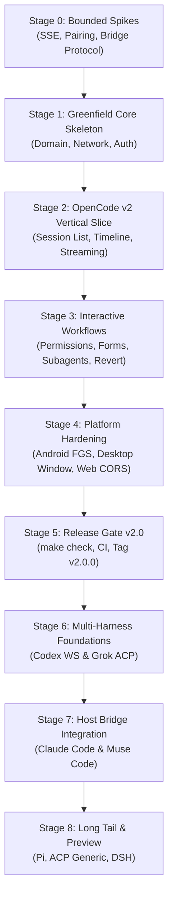

# CodeWalk v2 — Comprehensive Independent Implementation Plan

## 1. Status, Objective, Architectural Recommendation, and Intended Final Behavior

### 1.1 Status and Baseline
CodeWalk 1.265.0 (`14fbf519`) is a production Flutter/Dart client exclusively supporting OpenCode v1.x. Analysis of the local repository inventory reveals approximately 157.7k lines of hand-written Dart across 448 files, where the presentation layer accounts for 83% of the codebase. Two monoliths—`ChatProvider` (~22.8k LOC across 30 part files) and `ChatPage` (~27.5k LOC across 30 part files)—couple the entire user interface to OpenCode v1 wire models (`ChatEvent`, 12 v1 Part types, `ToolState`, `prompt_async`). The codebase contains 25 distinct v1 workarounds, including dual-SSE deduplication, 120ms polling loops on text deltas, optimistic message reconciliation via fuzzy text/attachment matching, and hidden-session shell scripts for titles, file writes, and host quota scraping.

OpenCode v2 (released stable at 2.0.0 on 2026-09-11; latest npm 2.0.22, commit `05018b88`) represents a complete, breaking protocol redesign. All endpoints reside under `/api/*`, authentication is mandatory HTTP Basic with one-time pairing tokens, sessions run under a shared background service on port 49374 (`0xc0de`), the global SSE event stream (`/api/event`) is live-only without `Last-Event-ID` replay, and prompting is natively asynchronous with explicit `steer` and `queue` delivery.

### 1.2 Core Objective
Deliver CodeWalk v2 as a multi-platform, multi-harness client supporting OpenCode v2 natively, while designing a robust, scalable architecture for OpenAI Codex, Claude Code, Pi, Muse Code, Grok Build, and DeepSeek Harness (`dsh`). CodeWalk v2 drops OpenCode v1 backwards compatibility entirely; legacy v1 maintenance moves to a dedicated git branch (`v1-legacy`).

### 1.3 Architectural Recommendation for Open Decisions

#### Connection Architecture (D01: 1D) — Hybrid Architecture
- **Direct Official Connection for Network-Native Harnesses**: CodeWalk connects directly via HTTP/SSE or WebSocket to harnesses providing official, persistent, authenticated network servers:
  1. *OpenCode v2*: Connects directly to `opencode service` / `opencode serve` via HTTP Basic + SSE at `/api/*`.
  2. *Grok Build*: Connects directly to `grok agent serve --bind <host>:<port> --secret <token>` via WebSocket speaking ACP v1.
  3. *OpenAI Codex (Direct TCP mode)*: Connects directly to `codex app-server --listen ws://<host>:<port> --ws-auth capability-token` via WebSocket when configured by the user.
- **Unified Host Bridge (`codewalk-bridge`) for Stdio/UDS Harnesses**: Harnesses lacking secure network listeners or requiring local process management (Claude Code TS SDK, Codex shared Unix Domain Socket, Muse Code MSP v1, Pi RPC, and DeepSeek `dsh`) execute on the host machine. A lightweight, headless daemon (`codewalk-bridge`) runs on the host, exposing an authenticated, multiplexed WebSocket/SSE API to CodeWalk clients. On desktop platforms running locally, CodeWalk manages this bridge or drives subprocesses directly; on mobile platforms (Android/iOS), the client connects to the bridge over the user's private network (Tailscale/SSH/VPN).
- **Consequential Alternative Evaluated**: *Universal Daemon for All Harnesses (including OpenCode)*.
  - *Tradeoff*: While a universal daemon provides a single wire format to the phone, it inserts an unnecessary translation layer, latency hop, and maintenance liability in front of OpenCode v2, which already provides an official, battle-tested HTTP/SSE service with pairing and multi-client state. Hybrid keeps OpenCode first-class and zero-overhead while giving stdio harnesses a first-class host environment.

#### Release Phases and Harness Rollout (D02: 2D)
- **Phase 1 (v2.0 — Core Foundation)**: Complete greenfield rewrite of the client core and presentation layers. Native OpenCode v2 support only. Deliver stable Android, Linux, macOS, Windows, and Web clients with paired authentication, SSE reduction, forms, staged revert, new permissions, background subagents, and cleanup of all 25 v1 workarounds.
- **Phase 2 (v2.1 — Network & Socket Expansion)**: Add OpenAI Codex (via shared daemon UDS over SSH proxy and direct `ws://` listener) and Grok Build (native ACP over WebSocket). Introduce the canonical multi-harness domain abstractions, capability negotiation engine, and unified session switcher.
- **Phase 3 (v2.2 — Managed Stdio via Host Bridge)**: Release `codewalk-bridge` supporting Claude Code (via official TypeScript `@anthropic-ai/claude-agent-sdk`) and Muse Code (via Muse Session Protocol v1). Deliver file checkpoint rewinds, quota windows, and multi-turn AskUserQuestion flows. Initial preview of iOS target.
- **Phase 4 (v2.3 — Long Tail & Preview Harnesses)**: Add Pi (via `pi --mode rpc`), the generic Agent Client Protocol (ACP) adapter for ecosystem agents (Gemini CLI, Cursor, Copilot CLI, Goose), and DeepSeek Harness (`dsh` ACP profile once stabilized beyond 0.2.0-rc).

#### Notifications and Background Delivery (D07: 7D)
- **Desktop (Linux/macOS/Windows)**: Native OS desktop notifications driven directly by the active SSE/WebSocket event feed.
- **Android**:
  - *In-App/Foreground*: Reactive local notifications.
  - *Background While Turn Active*: An explicit Android Foreground Service (`CodeWalkForegroundService`) maintains a low-power, lightweight SSE connection solely monitoring `session.execution.*`, `permission.asked`, and `form.created` with a 45-second idle watchdog matching OpenCode's 15-second heartbeat.
  - *Process Suspended/Killed*: Phase 1 relies on the Foreground Service. Phase 2 introduces an optional, self-hosted webhook/push bridge (integrating with `ntfy.sh`, Gotify, or private FCM) triggered by the host bridge or an OpenCode plugin on turn completion.
- **iOS**: iOS suspends background sockets within 30 seconds. Phase 1 limits iOS execution to active foreground sessions. Phase 2 enables background delivery via the optional push notification relay.

#### Daemon/Bridge Implementation Language (D15: 15D) — TypeScript (Node.js / Bun)
- **Recommendation**: Implement `codewalk-bridge` in **TypeScript targeting Node.js (≥20) or Bun**, distributable as a single executable binary via Bun compile or Node SEA (Single Executable Application), or via `npm install -g @verseles/codewalk-bridge`.
- **Technical Justification**:
  1. The official Claude Code Agent SDK (`@anthropic-ai/claude-agent-sdk`) is TypeScript-only. Driving Claude Code via Dart or Go requires reverse-engineering and continuously maintaining compatibility with the unpublished, rapidly shifting `stream-json` stdio protocol.
  2. The official Muse Code SDK (`@muse-code/sdk`) is TypeScript.
  3. The official ACP SDK (`@agentclientprotocol/sdk`) is TypeScript.
  4. Pi is native TypeScript with an official `RpcClient`.
  5. The Flutter client remains 100% pure Dart/Flutter; Dart AOT is suboptimal for the host bridge because wrapping three separate TypeScript SDKs across out-of-process Node shims creates fragile IPC-inside-IPC.

---

## 2. Decision Assessment (D01–D16)

| ID | Choice | Verdict | Evidence & Technical Argument | Concrete Alternative & Tradeoffs | Confidence & Verification |
|---|---|---|---|---|---|
| **D01** | 1D | **OPEN → Hybrid** | OpenCode v2 and Grok Build have native, authenticated network daemons. Claude, Muse, and Pi are stdio-only; Codex uses a local Unix socket (`0600`). Direct-only is impossible for stdio harnesses; universal daemon adds an unnecessary hop and failure point for OpenCode. | **Universal Daemon**: Route all traffic through a single daemon. *Benefit*: Single client protocol. *Cost*: Massive lag when upstream OpenCode releases updates; double serialization; daemon becomes single point of failure. | **High (Verified)**. Pinned in `11-opencode-v2-server-api.md`, `20-codex.md`, `21-claude-code.md`, `24-grok-build.md`. |
| **D02** | 2D | **OPEN → Phased (v2.0–v2.3)** | OpenCode v2 has 140 routes and 94 events. Combining the v2 migration with 6 external harnesses in a single release creates an unmanageable testing matrix and blocks shipping OpenCode v2 support. | **Big Bang Release**: Ship all 7 harnesses in v2.0. *Cost*: Indefinite delay; inability to validate harness edge cases; fragile initial release. | **High (Verified)**. Sizing in `00-codewalk-v1-inventory.md` (~158k LOC to refactor). |
| **D03** | 3A | **KEEP** | 83% of the existing 158k LOC is in presentation; `ChatProvider` (22.8k) and `ChatPage` (27.5k) are coupled to v1 wire schemas. Greenfield skeleton allows isolating clean domain entities and discarding 25 v1 workarounds while selectively copying reusable UI components (markdown, theme registry, syntax highlighting). | **In-place refactor**: Modify existing files. *Cost*: High risk of regression; tangled part-files; dead v1 code paths preserved inadvertently. | **High (Verified)**. Source audit in `00-codewalk-v1-inventory.md` §0–§4. |
| **D04** | 4A | **CHANGE (Add Pre-Flight Guard)** | OpenCode v2 routes (`/api/*`) return 200 HTML catch-all on OpenCode v1 servers. If v2 auto-updates over v1 via the app store/updater, users with v1 servers will experience silent, broken connections with no clear recovery path. | **Version-Guarded Migration**: Keep `com.verseles.codewalk`, but upon first launch of v2, inspect configured servers via `GET /api/info`. If a server fails or responds as v1, display a migration screen offering to download legacy v1.265.x or upgrade the server to v2. | **High (Verified)**. Upstream v2 server catch-all behavior confirmed in `10-opencode-v2-overview.md` §h. |
| **D05** | 5A | **KEEP (Refined Semantics)** | Baseline allow-all ON by default aligns with user preference and ADR-023 EXC-001. OpenCode v2 provides native server-side per-session allow-all (`PATCH /api/session/{id} {permissions:[{action:"*",resource:"*",effect:"allow"}]}`) which overrides agent deny rules and cascades to subagents. | **Strict Ask-Every-Time**: Default to prompting. *Cost*: Degrades mobile usability where interactive prompts block unattended runs. | **High (Verified)**. Pinned in `12-opencode-v2-events-and-schemas.md` §7.5 and `20-codex.md` §5. |
| **D06** | 6A | **KEEP** | OpenCode v2 exposes per-message/session tokens and cost, but no remaining quota endpoint. Codex, Claude, Muse, and Grok have native rate-limit/quota events. Host-side vendor scraping (v1's 1.7k LOC JS script) must not run in hidden shell sessions; if opted in, it must run securely in the host bridge. | **Remove Vendor Quota Scraping**: Only display native token/cost counters. *Benefit*: Eliminates brittle scraping of `auth.json`. *Cost*: Loses visibility into subscription tier resets. | **High (Verified)**. Upstream schemas in `12-opencode-v2-events-and-schemas.md` §10 and `23-muse-code.md`. |
| **D07** | 7D | **OPEN → Phased FGS & Push** | Mobile operating systems kill background sockets (iOS after 30s; Android Doze kills raw TCP). A client cannot rely on raw SSE for background delivery without an Android Foreground Service or APNs/FCM push. | **Polling-only via WorkManager**: Re-use v1's 3-minute poll. *Cost*: 3-minute alert latency; heavy battery drain; misses ephemeral event state. | **High (Verified)**. Mobile platform lifecycle constraints in Android/iOS specs. |
| **D08** | 8A | **KEEP** | Self-hosted networking (Tailscale, WireGuard, SSH, reverse proxy) eliminates third-party relay costs, respects user data privacy, and aligns with existing CodeWalk users who already use Tailscale or local LAN. | **Hosted Relay Service**: Build a centralized E2EE relay. *Cost*: Infrastructure hosting costs; maintenance overhead; regulatory compliance. | **High (Verified)**. Verified from existing architecture and user decision baseline. |
| **D09** | 9 | **KEEP (Gated Gates)** | Target Android, Linux, macOS, Windows, Web, and iOS. Web has strict CORS and cannot connect to Codex `ws://` (Origin 403); iOS requires adding an `ios/` runner directory and handling strict backgrounding; Android release builds must run on x86_64 CI runners. | **Drop Web & iOS**: Limit to Android & Desktop. *Cost*: Conflicts with explicit user baseline. | **High (Verified)**. Platform constraints documented in `AGENTS.md` and `20-codex.md`. |
| **D10** | 10A | **KEEP** | Fully aligns with official OpenCode v2 managed installation: download binary, verify SHA-256 against update API, execute `opencode service` on port 49374 with password auth and `opencode pair` token exchange. | **Package-manager only (npm/brew)**: Rely on system npm. *Cost*: Requires Node/npm on host; brittle postinstall scripts. | **High (Verified)**. Verified against official installer in `10-opencode-v2-overview.md` §a and `11-opencode-v2-server-api.md` §E. |
| **D11** | 11A | **KEEP** | Desktop manages the local service installation and updates via official scripts/npm; mobile connects as a remote client. | **Mobile self-contained runner**: Attempt Termux/chroot on Android. *Cost*: Termux is explicitly unsupported by OpenCode v2 (glibc dependency). | **High (Verified)**. Issue #47612 cited in `10-opencode-v2-overview.md` §a. |
| **D12** | 12B | **KEEP** | Deliver final documentation and plan in English. Baseline choice endorsed. | None needed. | **High (Process)**. |
| **D13** | 13A | **KEEP (Verified Parity)** | Essential capability: OpenCode v2 background service shares SQLite state across TUI, Web, and CodeWalk; Codex daemon shares threads across TUI and socket clients; Claude Code sessions are resumable via SDK `resume: sessionId`. | **Isolated CodeWalk-only Sessions**: Prefix session IDs and isolate them. *Cost*: Destroys the primary value proposition of terminal-mobile continuity. | **High (Verified)**. Verified in `11-opencode-v2-server-api.md` §1.1, `20-codex.md` §2.3, and `21-claude-code.md` §2.2. |
| **D14** | 14A | **KEEP** | Unified session list by host and project with clear harness badges (OpenCode, Codex, Claude, Grok, Muse, Pi) and dynamic UI capability masking (e.g. disabling file rewind for Codex; disabling staged revert for Pi). | **Separate Tabs per Harness**: Segment sessions by harness. *Cost*: Fractures project workspace mental model. | **High (Verified)**. Supported by common patterns in `31-multi-harness-clients.md`. |
| **D15** | 15D | **OPEN → TypeScript (Bun/Node)** | Claude Agent SDK, Muse SDK, and ACP SDK are all officially published in TypeScript. TypeScript gives 100% type safety against official SDKs with zero protocol reverse-engineering. | **Dart AOT Daemon**: Write bridge in Dart. *Cost*: Must maintain custom stdio stream-json parsers; fragile against daily CLI updates from Anthropic. | **High (Verified)**. Pinned package inspection in `21-claude-code.md` §1 and `23-muse-code.md` §2. |
| **D16** | 16A | **KEEP** | Process invariant. Independent planning without cross-helper collusion or coordination. | None. | **High (Process)**. |

### Recommended Changes for User Reconsideration
1. **D04 Migration Safeguard**: Rather than an immediate destructive overwrite via auto-update, v2 must ship with an internal **Server Compatibility Pre-Flight**. If the user updates CodeWalk on their phone but their desktop/server is still running OpenCode v1, CodeWalk v2 must detect the v1 signature (`GET /api/info` fails or `/global/health` succeeds), clearly inform the user that OpenCode v2 is required, and provide a one-tap link to download the standalone legacy v1.265.0 APK or view server upgrade commands (`opencode upgrade 2.0.22`).

---

## 3. Comprehensive Capability Matrix for All Seven Harnesses

| Feature Category | OpenCode v2 (`opencode`) | OpenAI Codex (`codex`) | Claude Code (`claude`) | Muse Code (`muse`) | Grok Build (`grok`) | Pi (`pi`) | DeepSeek Harness (`dsh`) |
|---|---|---|---|---|---|---|---|
| **Integration Surface** | Native HTTP/SSE (`/api/*`) | App-server v2 JSON-RPC (UDS / `ws://`) | Agent SDK TS / `stream-json` | Muse Session Protocol (MSP) v1 stdio | ACP over WebSocket (`grok agent serve`) | RPC mode JSONL stdio (`pi --mode rpc`) | ACP over stdio (`dsh --profile acp`) |
| **Source Pin / Spec** | `v2.0.21` / npm `2.0.22` (`05018b88`) | `rust-v0.160.0` / CLI `0.159.3` | SDK `0.3.287` / CLI `2.1.287` | MSP v1 / CLI `1.4.2` | CLI `1.0.46` (Apache-2.0) | `v1.0.0` (MIT) | `0.2.0-rc.2` (MIT) |
| **Connection Topology** | Direct HTTP/SSE (port 49374) | Direct WS or Bridge / SSH proxy | Host Bridge (`codewalk-bridge`) | Host Bridge (`codewalk-bridge`) | Direct WebSocket (`ws://`, port 2419) | Host Bridge (`codewalk-bridge`) | Host Bridge (`codewalk-bridge`) |
| **Session Discovery** | `GET /api/session` (full, cursor) | `thread/list`, `thread/read` | `listSessions()` in TS SDK | `session/list`, `session/resume` | ACP `session/list`, `session/resume` | `session_list` RPC / JSONL scan | ACP `session/list` (root sessions) |
| **External TUI Continuity** | **Native** (shared SQLite service) | **Native** (shared daemon on UDS) | **Native** (resumes via SDK `resume`) | **Native** (via `muse serve` session ID) | **Native** (via shared leader / serve) | **Native** (via JSONL session file) | Partial (resumes root by ID) |
| **Streaming Output** | `session.text.delta` / `ended` (authoritative) | `item/agentMessage/delta` | `content_block_delta` | `turn/item/delta` | ACP `session/update` delta | `text_delta` event | ACP `session/update` delta |
| **Reasoning / Thinking** | `session.reasoning.*` (typed) | `item/reasoning/delta` | `thinking_delta` | `item/reasoning` (MSP v1) | `x.ai/thought` extension | `thinking_delta` (`off`…`max`) | Unsupported in ACP profile |
| **Tool Execution Cards** | `session.tool.input.*`, `called`, `success` | `item/commandExecution/*` | `tool_use`, `tool_use_result` | `item/toolCall/*` | ACP `tool_call` / `tool_result` | `tool_call` / `tool_result` | ACP `tool_call` / `tool_result` |
| **Approvals / Allow-All** | Native session rule or client `once` | Native `approvalPolicy: "never"` | SDK `canUseTool` / `bypass` | Native `session/approve` (choices) | `--always-approve` flag | None (YOLO by design) | One-shot allow/reject |
| **Questions / Forms** | Native Forms API (`/api/session/{id}/form`) | `item/userPrompt` (experimental) | `AskUserQuestion` tool | `userInput/request` (typed) | `x.ai/ask_user_question` | Community extension only | Unsupported in ACP |
| **Subagents** | `subagent` tool (`background: true`) | Child threads / `spawnAgent` | Subagent tools (`task_*` events) | Subagent workers & reviewers | ACP subagents (draft) | Community `pi-subagents` (fragile) | Internal only; none in ACP |
| **Mid-Turn Steer / Queue** | Native `delivery: steer \| queue` | Native `thread/steer`, turn queue | Native queued input messages | Native `turn/steer`, `turn/queue` | `x.ai/interject`, queue | Native `steer` and `followUp` | Unsupported in ACP |
| **Undo / Redo / Rewind** | Staged revert (`revert/stage`, commit) | **Unsupported** (`rollback` removed) | File checkpoint rewind | Unsupported | `x.ai/rewind` extension | Session fork from cursor | Unsupported in ACP |
| **Quota & Rate Limits** | Tokens/cost; Go/Zen in error bodies | Account rate limit notifications | `rate_limit_event`, usage signals | 5-hour & weekly quota windows | `x.ai/billing`, `costUsdTicks` | Per-session cost stats | None exposed in ACP |
| **File Operations & Diff** | Read/find native; diff `/api/vcs/diff` | Read/write/search via app-server | `readFile`, structured patch | Read/write/diff via MSP | ACP fs / `x.ai/diff` | Stdio file read/write | Unsupported in ACP |
| **Terminal / PTY** | Ticketed WS (`/api/pty`) | `command/exec` PTY session | Bridge-owned PTY (`node-pty`) | User shell execution | ACP terminal / `x.ai/pty` | Bridge-owned PTY | Unsupported in ACP |
| **Slash Commands / Skills** | `/api/command`, `/api/skill` | Skills (`skill/list`), no slash | Slash commands + skills | Skills (`.agents/skills`), hooks | Skills, hooks, custom commands | Custom extensions | None in ACP |

---

## 4. Architecture and Interfaces

### 4.1 Proposed Directory and Module Layout
CodeWalk v2 establishes a strict, uni-directional hexagonal architecture:
```
lib/
├── main.dart                                   # App bootstrap, logging, window manager, DI
├── core/
│   ├── di/injection_container.dart             # get_it service registrations
│   ├── network/                                # HTTP, SSE, and WebSocket client primitives
│   │   ├── http_client.dart                    # Dio wrapper with auth & location interceptors
│   │   ├── sse_stream_client.dart              # Single sequenced SSE parser (handles :heartbeat)
│   │   └── websocket_client.dart               # Robust WebSocket channel with auto-reconnect
│   ├── storage/secure_storage_service.dart     # flutter_secure_storage wrapper
│   └── errors/app_failure.dart                 # Tagged failure hierarchy
├── domain/                                     # Pure Dart, zero Flutter/Dio dependencies
│   ├── entities/
│   │   ├── harness_type.dart                   # enum { openCode, codex, claude, muse, grok, pi, dsh }
│   │   ├── session.dart                        # Canonical Session entity
│   │   ├── message.dart                        # Canonical Message union (User, Assistant, System...)
│   │   ├── message_content.dart                # Union { text, reasoning, tool, diff, file }
│   │   ├── tool_execution.dart                 # Tool status, input, output, metadata
│   │   ├── interactive_request.dart            # Union { permission, form, question }
│   │   ├── subagent_task.dart                  # Child session linkage, background status
│   │   ├── quota_usage.dart                    # Tokens, money, rate-limit windows
│   │   └── capabilities.dart                   # HarnessCapabilities value object
│   ├── events/canonical_event.dart             # Canonical normalized event union
│   └── repositories/
│       ├── harness_repository.dart             # Primary port for driving any harness
│       ├── session_repository.dart             # Session CRUD and persistence
│       └── connection_repository.dart          # Host connection lifecycle & health
├── data/
│   ├── datasources/
│   │   ├── harness_remote_datasource.dart      # Abstract remote datasource interface
│   │   ├── opencode_v2_datasource.dart         # Direct OpenCode v2 HTTP + SSE implementation
│   │   ├── grok_acp_datasource.dart            # Direct Grok Build WebSocket ACP implementation
│   │   ├── codex_app_server_datasource.dart    # Direct Codex JSON-RPC WebSocket implementation
│   │   ├── bridge_remote_datasource.dart       # Multiplexed codewalk-bridge implementation
│   │   └── local_storage_datasource.dart       # Isar / SQLite / SharedPreferences storage
│   ├── models/
│   │   ├── opencode/                           # OpenCode v2 wire DTOs matching schemas
│   │   ├── codex/                              # Codex app-server v2 JSON-RPC DTOs
│   │   ├── acp/                                # ACP v1/v2 JSON-RPC DTOs
│   │   └── bridge/                             # Bridge wire envelopes
│   ├── reducers/
│   │   ├── opencode_v2_reducer.dart            # Port of client-solid-data.reference-reducer.ts
│   │   └── canonical_event_reducer.dart        # Folds CanonicalEvents into Session state
│   └── repositories/
│       ├── harness_repository_impl.dart        # Routes calls based on HarnessType
│       └── session_repository_impl.dart
└── presentation/                               # Mobile-first Material You Flutter UI
    ├── providers/                              # StateNotifier / ChangeNotifier controllers
    │   ├── connection_provider.dart            # Host connection & discovery state
    │   ├── session_list_provider.dart          # Unified project & session manager
    │   ├── active_session_provider.dart        # Timeline, streaming, input state
    │   ├── interactive_prompt_provider.dart    # Permissions and forms queue
    │   └── quota_provider.dart                 # Usage, cost, rate limits
    ├── pages/
    │   ├── app_shell_page.dart                 # Adaptive responsive navigation shell
    │   ├── onboarding/                         # Server discovery, QR pairing, manual setup
    │   ├── chat/                               # Main chat timeline & adaptive sidebars
    │   └── settings/                           # Harness, theme, and host configuration
    └── widgets/
        ├── timeline/                           # Text, reasoning, tool execution cards
        ├── composer/                           # Composer, steer/queue toggle, model selector
        ├── interactive/                        # PermissionDialog, DynamicFormWidget
        └── subagents/                          # BackgroundTaskBanner, SubagentTreeSheet
```

### 4.2 Canonical Domain Envelopes and Event Model

To prevent wire protocol leaks into the presentation layer, all harnesses normalize their inbound stream into a `CanonicalEvent`:

```dart
// lib/domain/events/canonical_event.dart
sealed class CanonicalEvent {
  final String id;
  final String sessionId;
  final DateTime timestamp;
  final Map<String, dynamic>? rawProvenance;

  const CanonicalEvent({
    required this.id,
    required this.sessionId,
    required this.timestamp,
    this.rawProvenance,
  });
}

final class SessionExecutionChangedEvent extends CanonicalEvent {
  final ExecutionState state; // idle, busy, retry
  final String? outcome;       // succeeded, failed, interrupted
  final AppFailure? failure;
  const SessionExecutionChangedEvent({
    required super.id,
    required super.sessionId,
    required super.timestamp,
    required this.state,
    this.outcome,
    this.failure,
    super.rawProvenance,
  });
}

final class ContentDeltaEvent extends CanonicalEvent {
  final String messageId;
  final ContentType contentType; // text, reasoning, toolInput
  final String delta;
  final int ordinal;
  const ContentDeltaEvent({
    required super.id,
    required super.sessionId,
    required super.timestamp,
    required this.messageId,
    required this.contentType,
    required this.delta,
    required this.ordinal,
    super.rawProvenance,
  });
}

final class ContentSettledEvent extends CanonicalEvent {
  final String messageId;
  final ContentType contentType;
  final String finalContent;
  final int ordinal;
  const ContentSettledEvent({
    required super.id,
    required super.sessionId,
    required super.timestamp,
    required this.messageId,
    required this.contentType,
    required this.finalContent,
    required this.ordinal,
    super.rawProvenance,
  });
}

final class InteractiveRequestEvent extends CanonicalEvent {
  final InteractiveRequest request; // PermissionRequest or FormRequest
  const InteractiveRequestEvent({
    required super.id,
    required super.sessionId,
    required super.timestamp,
    required this.request,
    super.rawProvenance,
  });
}

final class SubagentProgressEvent extends CanonicalEvent {
  final String childSessionId;
  final String parentToolCallId;
  final SubagentStatus status; // running, completed, failed, cancelled
  final String? finalOutput;
  const SubagentProgressEvent({
    required super.id,
    required super.sessionId,
    required super.timestamp,
    required this.childSessionId,
    required this.parentToolCallId,
    required this.status,
    this.finalOutput,
    super.rawProvenance,
  });
}
```

### 4.3 Harness Capability Contract
Each adapter advertises its exact capabilities to the presentation layer:

```dart
// lib/domain/entities/capabilities.dart
class HarnessCapabilities {
  final bool supportsForms;              // OpenCode v2 forms, Claude AskUserQuestion
  final bool supportsAllowAll;           // Native or client-simulated YOLO mode
  final bool supportsSteerQueue;         // Mid-turn steering vs queuing
  final bool supportsFileRewind;         // Claude checkpoints, OpenCode staged revert
  final bool supportsSubagents;          // Async child sessions
  final bool supportsBackgroundTasks;    // Detachable background tasks
  final bool supportsQuotaWindows;       // Muse/Codex rate-limit windows
  final bool supportsReasoningEffort;    // Model variants / thinking levels
  final bool supportsNativeTerminal;     // Ticketed PTY or bridge-managed PTY

  const HarnessCapabilities({
    required this.supportsForms,
    required this.supportsAllowAll,
    required this.supportsSteerQueue,
    required this.supportsFileRewind,
    required this.supportsSubagents,
    required this.supportsBackgroundTasks,
    required this.supportsQuotaWindows,
    required this.supportsReasoningEffort,
    required this.supportsNativeTerminal,
  });
}
```

### 4.4 State Machines and Resilience

#### Session Reducer and Gap-Free Reconnect
OpenCode v2 publishes ephemeral deltas and durable events over `/api/event`. CodeWalk implements the official reference reducer algorithm (from `client-solid-data.reference-reducer.ts`):
1. **Initial Connect**: Issue `GET /api/info` to verify v2 compatibility. Subscribe to `GET /api/event`. Wait for the first frame: `server.connected`.
2. **State Hydration**: Concurrently fetch:
   - `GET /api/session/active` (determines running sessions and active execution states).
   - `GET /api/session/{id}` (authoritative session metadata, revert status, costs, tokens).
   - `GET /api/session/{id}/message?order=desc&limit=50` (projected messages).
   - `GET /api/session/{id}/inbox` (queued or steering user inputs).
   - `GET /api/session/{id}/permission` & `GET /api/session/{id}/form` (active interactive prompts).
3. **Delta Streaming**:
   - `session.text.started`: Appends an empty text part to the target assistant message.
   - `session.text.delta`: Appends text chunk to the active part; throttles UI repaint to 16ms (mobile) or 60ms (desktop).
   - `session.text.ended`: Authoritatively overwrites the text part with the full string, eliminating all delta drop/reorder issues.
4. **Heartbeat and Reconnection**:
   - The SSE stream emits `: heartbeat\n\n` comments every 15 seconds.
   - CodeWalk arms a 45-second watchdog timer reset by any received byte. If the timer expires (or the socket errors), CodeWalk terminates the socket, initiates exponential backoff (1s, 2s, 4s... max 30s), and re-runs State Hydration upon re-establishing the connection.
   - If `Last-Sequence-Number` was tracked, CodeWalk queries `GET /api/experimental/session/{id}/log?after=<seq>&follow=false` to rapidly catch up without re-fetching full message lists.

#### Optimistic Send and Ambiguous Mutation Handling
- In OpenCode v1, sending messages relied on `prompt_async`, which lacked Turn/Message IDs and required fuzzy content matching.
- In OpenCode v2, `POST /api/session/{id}/prompt` accepts a client-minted `id: "msg_..."`. CodeWalk generates this ID locally:
  1. The user message is optimistically appended to the local timeline immediately in state `pending`.
  2. The HTTP prompt request is dispatched with `id: msg_...`, `delivery: "steer" | "queue"`.
  3. Upon HTTP 200/204 response, the item transitions to `enqueued`.
  4. When the SSE stream emits `session.inbox.delivered`, the message is marked `delivered`.
  5. If the network drops before the HTTP response returns, the client re-submits the exact same client ID upon reconnect. Because the server identifies messages idempotently by `id`, duplicate messages are prevented.

---

## 5. User Experience and Behavior

### 5.1 Mobile-First Material You & Responsive Desktop/Web Layout
- **Mobile (Android & iOS)**:
  - Bottom navigation bar: Sessions (Drawer/Sheet), Active Chat, Workspaces/Files, Quota/Settings.
  - Material 3 dynamic color theming based on system wallpaper or user-selected brand seed.
  - Keyboard-aware composer: interactive form sheets and permission cards collapse gracefully into dismissible chips above the composer when the software keyboard opens.
  - Floating status pills display running subagent counts and background task execution.
- **Desktop (Linux, macOS, Windows) & Web**:
  - Three-pane responsive layout:
    - Left Pane: Project and session tree, filtered by host, with harness badges (`OpenCode`, `Codex`, `Claude`, etc.) and search.
    - Center Pane: Main chat timeline, tool execution summaries, collapsible reasoning traces.
    - Right Pane (Collapsible): Workspace file tree, staged diff viewer (`revert/stage`), active PTY terminal, or subagent inspector.
  - Keyboard shortcuts for power users: `Ctrl/Cmd+Enter` (Send), `Ctrl/Cmd+Shift+Enter` (Queue turn), `Ctrl/Cmd+K` (Quick session search), `Ctrl/Cmd+B` (Background running task).

### 5.2 Onboarding, Installation, and Pairing Flow
1. **First-Launch Wizard**:
   - Detects local platform.
   - Desktop: Offers "Managed Local OpenCode" (downloads official v2 binary, verifies SHA-256, configures `opencode service` on port 49374) or "Connect to Remote Server".
   - Mobile: Prompts to "Scan QR Code" or "Enter Server URL".
2. **Pairing Mechanics (`opencode pair`)**:
   - The user executes `opencode pair` in their terminal (or desktop CodeWalk displays the QR code).
   - Mobile camera scans `http://<host>:49374/auth/connect/<code>`.
   - The client immediately calls `GET /auth/connect/<code>` with `Accept: application/json`.
   - The server validates the single-use 5-minute code and returns `{"token": "<expires>.<hmac>"}`.
   - CodeWalk persists the token securely in `flutter_secure_storage` and uses it as the HTTP Basic password (`opencode:<token>`) for all subsequent calls. The token is valid for 30 days.

### 5.3 Asynchronous Subagents and Child Task Presentation
- In OpenCode v2, subagents run in foreground (blocking) or background (non-blocking) child sessions (`subagent` tool with `background: true`).
- **Visual Representation**:
  - While running in the background, a compact sticky banner appears at the top of the parent chat: `Subagent [Reviewer] running... [Inspect] [Stop]`.
  - Tapping **Inspect** opens a side-by-side view (desktop) or pushes a nested child sheet (mobile) showing the live streaming timeline of the child session (`parentID == parent.id`).
  - Child sessions feature an explicit header banner: `Child of [Session Title] • Return to Parent`.
  - When the subagent completes, the parent session receives a synthetic message containing `<subagent sessionID="..." state="completed">`. CodeWalk styles this as a distinct, interactive "Subagent Completed" card displaying duration, tokens used, and a button to view the full child transcript.
- **Backgrounding Foreground Work**:
  - If a subagent or long-running shell task was started synchronously, CodeWalk exposes a "Send to Background" button in the tool card, calling `POST /api/session/{id}/background`.

### 5.4 Interactive Forms & Permissions
- **Permissions**:
  - When `permission.asked` arrives, CodeWalk displays a non-modal permission banner.
  - Displays the action (`shell`, `edit`, `read`), resource path, and diff preview for edits.
  - Actions:
    - **Allow Once**: Calls `reply {decision: "once"}`.
    - **Always Allow for Project**: Calls `reply {decision: "always"}` (saves pattern to project).
    - **Reject**: Calls `reply {decision: "reject", message: "optional user feedback"}`.
  - When **Allow-All** is toggled ON in session settings, CodeWalk issues `PATCH /api/session/{id}` with `{permissions: [{action: "*", resource: "*", effect: "allow"}]}`, natively instructing the server to allow all operations without network round-trips.
- **Forms (Questions)**:
  - OpenCode v2 replaces v1 questions with typed **Forms** (`form.created`).
  - CodeWalk renders a dynamic Material 3 form supporting `string`, `multiselect`, `number`, `boolean`, and conditional `when` visibility rules.
  - Form answers are serialized to `POST /api/session/{id}/form/{formId}/reply` as `{answer: {q0: "val", q1: ["a", "b"]}}`.

---

## 6. Rewrite, Reuse, and Discard Map

### 6.1 Discarded Modules (v1-Only Workarounds Removed)
The following files and subsystems from CodeWalk v1 are completely eliminated:

| Existing Module / File Path | Reason for Discard | Upstream v2 / Multi-Harness Reality |
|---|---|---|
| `lib/presentation/providers/chat_provider/chat_provider_event_reducer_helpers.dart` (lines 163–330) | **Dual SSE & FNV Hash Deduplication** | OpenCode v2 has a single global SSE stream (`/api/event`). Dual stream deduplication is dead code. |
| `lib/presentation/providers/chat_provider/chat_provider_message_merge_ops.dart` (lines 197–338) & `message_reconciliation.dart` | **Optimistic Echo Reconciliation by text hash** | v2 prompts accept client-minted `id: msg_...`, eliminating fuzzy content matching. |
| `lib/presentation/providers/chat_provider/chat_provider_event_reducer_session_ops.dart` (lines 550–770) | **120ms Debounced Re-fetch on Text Delta** | v2 SSE deltas are authoritative and followed by full `text.ended`. HTTP re-fetching during streaming is eliminated. |
| `lib/presentation/services/chat_title_generator.dart` & `chat_provider_auto_title_ops.dart` | **Hidden-Session Title Generator (`_title_gen`)** | OpenCode v2 generates session titles natively and emits `session.renamed`. Hidden session workarounds are deleted. |
| `lib/data/datasources/quota_remote_datasource.part.js.dart` (1,742 LOC) | **Injected Host JS Scraper via `/shell`** | Arbitrary Base64 JS injection into host `auth.json` via hidden sessions is eliminated. Replaced by native API signals and host bridge. |
| `lib/presentation/services/workspace_file_operations_service.dart` (lines 664–743) | **Hidden-Session File Write via Shell Scripts** | v1 lacked file writing. v2 provides `/api/fs/read` and `/api/experimental/fs/write`; host bridge handles external harness writes. |
| `lib/presentation/widgets/session_todo_list_widget.dart` | **v1 Todo Panel** | OpenCode v2 removed the todo tool and endpoints entirely. Handled via standard task/markdown rendering. |
| `lib/presentation/providers/chat_provider/chat_provider_abort_policy_ops.dart` (lines 3–17) | **String-matching Abort Suppression** | v2 provides typed `POST /api/session/{id}/interrupt` and `session.execution.interrupted` events. String matching is deleted. |

### 6.2 Selectively Reused Modules
The following UI and utility subsystems are preserved, decoupled from v1 models, and reused in v2:

| Existing Module / File Path | Reused Capabilities | Refactoring Required for v2 |
|---|---|---|
| `lib/presentation/theme/opencode_web_theme_registry.dart` (2,657 LOC) | 37 OpenCode Web theme presets, token colorizers | None. Extract into pure presentation theme package. |
| `lib/presentation/widgets/chat_message/chat_message_text_part.dart` & `math_markdown.dart` | Markdown rendering, LaTeX math syntax, code blocks | Decouple from v1 `MessagePartModel`; bind to canonical `ContentBlock.text`. |
| `lib/presentation/widgets/mermaid_diagram_widget.dart` | Mermaid diagram rendering | Retain as-is for rendering architectural diagrams in assistant turns. |
| `lib/presentation/services/speech_input_service*.dart` & `speech_model_residency_controller.dart` | Voice STT engines (Sherpa ONNX, native, Moonshine) | Retain completely. Interface directly with composer input controller. |
| `lib/presentation/services/read_aloud_service.dart` & `tts/*` | TTS audio playback (Edge TTS, ElevenLabs, OpenAI) | Retain completely. Stream audio from assistant final message blocks. |
| `lib/presentation/widgets/app_tab_strip.dart` (1,118 LOC) | Browser-like multi-session tabs and Ctrl+Tab switcher | Decouple from `ChatProvider` state; bind to `SessionListProvider`. |
| `lib/core/auth/oauth_token_storage.dart` | Encrypted storage of credentials | Migrate storage keys to namespaced v2 structure (`server_tokens_v2`). |

### 6.3 Local Storage Migration and Rollback Plan
- **Storage Namespace**: CodeWalk v2 isolates its persistent store by using database namespace `codewalk_v2.db` (or SharedPreferences key prefix `cw_v2_`). It does not modify or overwrite `codewalk_v1` preference files.
- **Rollback Strategy**: If a user experiences issues and chooses to reinstall legacy v1.265.x from GitHub Releases, all v1 caches, profiles, and settings remain completely intact on the device.
- **One-Way Import**: Upon first run of v2, CodeWalk inspects v1 server profiles and migrates server URLs and display names into v2 profile definitions, while flagging that v2 pairing must be completed.

---

## 7. Ordered Implementation Stages and Dependencies



### Stage 0: Bounded Spikes (Week 1)
- **Spike 0.1 (OpenCode v2 Auth & Pairing)**: Validate `POST /api/pair` -> redeem `GET /auth/connect/{code}` -> verify 30-day token authentication against local `opencode serve`.
- **Spike 0.2 (OpenCode v2 SSE Parser & Watchdog)**: Validate parsing single-stream `GET /api/event` with `: heartbeat` comment handling and simulated 4096-event buffer overflow disconnect.
- **Spike 0.3 (Claude TS SDK Headless Bridge)**: Stand up a 100-line Node.js script driving `@anthropic-ai/claude-agent-sdk` streaming input `query()` and forwarding NDJSON over WebSocket.

### Stage 1: Greenfield Core & Domain Skeleton (Week 2)
- Initialize clean `lib/` directory structure.
- Implement `core/network/` (Dio wrapper, SSE parser, WebSocket manager).
- Implement pure domain entities: `Session`, `Message`, `CanonicalEvent`, `InteractiveRequest`, `HarnessCapabilities`.
- Implement `get_it` dependency injection container.
- *Validation Gate*: Unit tests for SSE stream framing, JSON-RPC codecs, and domain entity immutability.

### Stage 2: OpenCode v2 Vertical Slice (Weeks 3–4)
- Implement `OpenCodeV2RemoteDataSource` covering `/api/session`, `/api/session/{id}/prompt`, and `/api/event`.
- Port `client-solid-data.reference-reducer.ts` into Dart `OpenCodeV2Reducer`.
- Build Material You Chat Page with live streaming text, reasoning bubbles, and tool cards.
- Implement composer with client-minted `id: msg_...` and `steer` / `queue` toggle.
- *Validation Gate*: End-to-end integration test against live `opencode serve` running in mock environment; stream 1000 tokens without UI drop or lockup.

### Stage 3: Interactive Workflows & Advanced Features (Weeks 5–6)
- Implement interactive Dynamic Form renderer for `form.created` (string, multiselect, booleans).
- Implement Permission Request banner and native session-level allow-all PATCH.
- Implement subagent tracking: inspect `Session.Info.parentID`, render background task pill, support navigation to child session.
- Implement staged revert UI: `POST revert/stage`, diff inspection, `revert/commit`.
- *Validation Gate*: Contract test verifying question answering, permission rejection with feedback, and child subagent completion synthetic events.

### Stage 4: Platform Hardening & Mobile Services (Week 7)
- Android: Implement `CodeWalkForegroundService` for SSE liveness monitoring during active turns.
- Desktop: Integrate system tray, window chrome titlebar, and managed OpenCode v2 binary supervisor.
- Web: Verify CORS headers and browser EventSource / WebSocket compatibility.
- iOS: Configure `ios/` workspace, safe area insets, and foreground pause handlers.
- *Validation Gate*: `make check` passing 100%; Android release APK built via GitHub Actions; Web build verified via `make test-web`.

### Stage 5: v2.0 Release Gate & Publication (Week 8)
- Complete doc sync (`BEHAVIOR.md`, `CODEBASE.md`, `ADR.md`).
- Ship CodeWalk v2.0.0 (OpenCode v2 pure core).

### Stage 6: Codex & Grok Multi-Harness Expansion (v2.1 — Weeks 9–10)
- Implement `CodexAppServerDataSource` for direct TCP WebSocket and SSH proxy UDS.
- Implement `GrokAcpDataSource` for `grok agent serve` WebSocket ACP.
- Implement unified session switcher with harness badges.

### Stage 7: Host Bridge & Claude / Muse Integration (v2.2 — Weeks 11–12)
- Publish `@verseles/codewalk-bridge` on npm.
- Implement Claude Code adapter via bridge TS SDK.
- Implement Muse Code adapter via MSP v1 stdio.
- Add file checkpoint rewind and 5-hour quota windows to UI.

### Stage 8: Long Tail & Final Polish (v2.3 — Weeks 13–14)
- Implement Pi RPC adapter.
- Implement generic ACP adapter for Gemini CLI, Copilot CLI, and Cursor.
- Evaluate DeepSeek `dsh` stability.

---

## 8. Testing and Validation Plan

### 8.1 Concrete Contract Fixtures and Edge Cases
1. **SSE Overflow & Reconnection Race**:
   - *Test Scenario*: Simulate server dropping client due to 4096 event queue overflow (`EventFeed.SubscriberOverflow`).
   - *Verification*: Client detects socket closure, reconnects with exponential backoff, issues State Hydration (`GET /api/session/active`, `GET /api/session/{id}/message?order=desc&limit=50`), and seamlessly rejoins active streaming without duplicate messages or stuck "busy" states.
2. **Authoritative `text.ended` Overwrite**:
   - *Test Scenario*: Feed malformed or out-of-order `session.text.delta` events ("world ", "hello "), followed by authoritative `session.text.ended` ("hello world").
   - *Verification*: Reducer replaces interim buffer with authoritative text; final message displays "hello world".
3. **External TUI Mutation Conflict**:
   - *Test Scenario*: While CodeWalk is viewing session A, an external terminal TUI executes a turn, switches the model (`session.model.selected`), and spawns a background subagent.
   - *Verification*: CodeWalk receives durable events on the global SSE feed, updates session model badge, displays the incoming turn, and shows the subagent progress pill in real time.
4. **Interactive Prompt Multi-Client Race**:
   - *Test Scenario*: Server emits `permission.asked`. The user clicks "Allow" in the terminal TUI.
   - *Verification*: Server emits `permission.replied`. CodeWalk's in-app permission banner automatically dismisses without throwing errors or requiring user interaction.
5. **Background Subagent Early-Completion Workaround**:
   - *Test Scenario*: Subagent triggers nested background work (testing for upstream bug #48826).
   - *Verification*: Client verifies child `Session.Info.outcome` and awaits authoritative parent synthetic message before marking task as settled.

### 8.2 Validation Commands and Release Gates
- **Focused Unit & Reducer Tests**:
  ```bash
  export PATH="$HOME/flutter/bin:$PATH" && flutter test test/unit/reducers/opencode_v2_reducer_test.dart
  export PATH="$HOME/flutter/bin:$PATH" && flutter test test/unit/network/sse_stream_client_test.dart
  ```
- **Targeted Static Analysis**:
  ```bash
  export PATH="$HOME/flutter/bin:$PATH" && flutter analyze lib/core lib/domain lib/data
  ```
- **Full Project Quality Gate (`make check`)**:
  ```bash
  export PATH="$HOME/flutter/bin:$PATH" && make check
  ```
  *(Verifies analyzer budget < 337 issues, runs all unit/widget tests with coverage gate ≥ 35%).*
- **Web Verification**:
  ```bash
  export PATH="$HOME/flutter/bin:$PATH" && make test-web
  ```
- **Android Release Build**:
  - Run via GitHub Actions workflow (`release.yml`), as Android release APK builds are not supported on ARM64 Linux hosts.

---

## 9. Risks, Mitigations, Assumptions, and Execution Start

### 9.1 Technical Risks and Mitigations

| Risk | Severity | Root Cause | Concrete Mitigation Strategy |
|---|---|---|---|
| **Upstream API Churn in OpenCode v2** | High | v2 OpenAPI spec declares `"version": "0.0.1"` and marks several endpoints experimental. | Strict layer separation: all v2 DTOs reside in `data/models/opencode/`. Domain layer deals solely with `CanonicalEvent` and `Session`. Upstream route/schema changes require updates in datasource models only. |
| **Android Background Socket Drop** | High | Android Doze mode suspends app network access after periods of screen-off. | Execute turns under `CodeWalkForegroundService` with a pinned notification while session execution is active (`session.execution.started`). |
| **Codex WebSocket Origin Rejection** | Medium | Codex app-server rejects HTTP requests carrying `Origin` header with HTTP 403. | Flutter Web build cannot connect directly to Codex `ws://`. Route Web traffic through a reverse proxy (Caddy/Nginx) that strips `Origin`, or use the host bridge. |
| **Claude Agent SDK Policy & Token Constraints** | High | Anthropic terms prohibit collecting or storing claude.ai OAuth tokens; SDK requires local host runtime. | CodeWalk never touches claude.ai OAuth tokens. Bridge executes locally under user's own `claude auth login` or user-provided `ANTHROPIC_API_KEY`. |
| **Version Skew Between CLI and Daemon** | Medium | Codex and OpenCode auto-update background services independently of user CLI. | Client probes `/api/info` (OpenCode) or `initialize` (Codex) dynamically on connect and negotiates supported features rather than assuming CLI version equals daemon version. |

### 9.2 Strict Execution Prerequisites & Initial Commands
Before executing code modifications or refactoring:
1. Ensure git worktree is clean on `main` following tag `v1.265.0` (`14fbf519`).
2. Create and push maintenance branch for legacy v1:
   ```bash
   git branch v1-legacy && git push origin v1-legacy
   ```
3. Source environment and verify Flutter SDK availability:
   ```bash
   source ~/paths && export PATH="$HOME/flutter/bin:$PATH" && flutter --version
   ```
4. Verify local OpenCode v2 test instance availability on port 49374:
   ```bash
   curl -s -u opencode:<password> http://127.0.0.1:49374/api/info
   ```
5. Initialize clean Stage 1 directory structure under `lib/core/`, `lib/domain/`, and `lib/data/`.
