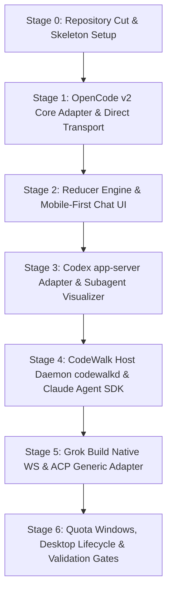

# CodeWalk v2 Architecture & Implementation Plan

## 1. Status, Objective, Architectural Recommendation & Intended Final Behavior

### 1.1 Status & Objective
CodeWalk v1.265.0 is a Flutter client tightly coupled to OpenCode v1.x (158k Dart LOC, 83% presentation, with massive god objects `ChatProvider` ~22.8k LOC and `ChatPage` ~27.5k LOC). OpenCode v2 introduces a completely redesigned HTTP/SSE contract under `/api/*` (port 49374, live-only volatile SSE, flat typed messages, structured forms, and async background subagents).

The objective of CodeWalk v2 is to rewrite the client from the ground up to:
1. Provide first-class, exclusive support for **OpenCode v2** (OpenCode v1 is frozen on a legacy maintenance branch).
2. Establish a modular, capability-driven multi-harness architecture integrating **OpenCode v2, OpenAI Codex, Claude Code, Grok Build, Pi, Muse Code, and DeepSeek Harness (`dsh`)**.
3. Eliminate all v1-specific workarounds (shell-session workarounds, optimistic polling, unsequenced SSE deduplication, and direct Dio calls from UI).
4. Deliver a responsive, mobile-first Material You experience across Android, Linux, macOS, Windows, Web, and iOS.

### 1.2 Architectural Recommendation: The Hybrid Host Bridge Pattern
Connecting a mobile/web client to multiple autonomous coding harnesses presents fundamental transport and lifecycle challenges:
- **OpenCode v2** exposes an HTTP/SSE service (`opencode service` on port 49374) protected by Basic Auth and one-time token pairing.
- **Grok Build** provides a native ACP-over-WebSocket server (`grok agent serve --bind IP:PORT --secret TOKEN`).
- **Codex app-server** runs a shared multi-client daemon listening exclusively on a local Unix Domain Socket (`app-server-control.sock`), or a standalone `--listen ws://` server that forbids cross-origin browser requests (403 on `Origin`).
- **Claude Code, Pi, Muse Code, and DeepSeek (`dsh`)** do not expose a public remote network daemon. Claude Code runs via stdio stream-json or the TypeScript Agent SDK; Muse Code runs `muse serve` over stdio; Pi runs `pi --mode rpc` over stdio; `dsh` runs `--profile acp` over stdio.

Therefore, a pure "direct-only" connection architecture cannot support Claude Code, Pi, Muse, or local Codex daemon sharing without a host process. Conversely, forcing OpenCode v2 or Grok Build through a mandatory custom wrapper adds an unnecessary hop and point of failure when their official servers already provide network endpoints.

**Recommendation:** A **Hybrid Architecture with a Unified CodeWalk Host Daemon (`codewalkd`)**:
1. **Direct Connection Mode:** CodeWalk connects directly via HTTP/SSE or WebSocket to native servers when available (standalone OpenCode v2 service and Grok Build WS).
2. **Host Bridge Mode (`codewalkd`):** For hosts running Claude Code, Pi, Muse, shared Codex UDS, or when a user wants a single unified endpoint. `codewalkd` is a lightweight host daemon that manages harness child processes, terminates TLS/auth, multiplexes stdio/UDS to WebSocket, logs ordered events for replay across mobile reconnects, and hosts local PTYs/file search.

### 1.3 Daemon Implementation Runtime (D15)
To support the official TypeScript Claude Agent SDK (`@anthropic-ai/claude-agent-sdk`), the Muse Code SDK (`@muse-code/sdk`), Pi SDK/RPC, and ACP adapters, `codewalkd` should be implemented in **TypeScript targeting Node.js / Bun**. 
- **Rationale:** The richest harness surfaces (especially Claude Agent SDK and Muse SDK) are first-party TypeScript libraries. Implementing the bridge in Go, Rust, or Dart would require reverse-engineering and maintaining raw, rapidly churning stdio JSON protocols without official bindings. Packaging `codewalkd` as a single executable via Bun or Node single-executable applications (SEA) gives zero-dependency deployment on desktop.

---

## 2. Decision Assessment (D01–D16)

| ID | Choice | Verdict | Evidence & Argument | Concrete Alternative & Tradeoffs | Confidence | Verification Step |
|---|---|---|---|---|---|---|
| **D01** | 1D (Open) | **Recommend Hybrid Bridge** | OpenCode v2 and Grok Build have native TCP listeners, but Claude Code, Pi, Muse, and Codex shared UDS daemon require local process/socket supervision. A pure direct client cannot reach stdio harnesses; a universal proxy introduces needless overhead for OpenCode. | Hybrid: CodeWalk connects directly to OpenCode v2 and Grok WS; uses `codewalkd` for stdio harnesses, Codex UDS, and mobile event replay. | High | Test direct OpenCode v2 HTTP/SSE and Grok WS from Flutter; benchmark bridge latency. |
| **D02** | 2D (Open) | **Recommend 3-Phase Rollout** | Attempting all 7 harnesses in v2.0 creates unacceptable release risk. OpenCode v2 contract churn is active (~daily releases). | **Phase 1 (v2.0):** OpenCode v2 + Codex app-server.<br>**Phase 2 (v2.1):** Claude Code (Agent SDK) + Grok Build (native WS).<br>**Phase 3 (v2.2):** Pi (RPC), Muse (MSP v1), DSH (ACP). | High | Verify Phase 1 stability before starting bridge plugins for Phase 2/3. |
| **D03** | 3A (Baseline) | **Keep** | Total rewrite with a clean skeleton in the same repo (`lib/` replacement) while branching legacy `v1`. The v1 codebase is 83% leaky presentation with 17k lines of obsolete v1 workarounds; refactoring in place would be slower and more error-prone. | None needed. Clean slate enables strict domain typing, modular reducers, and Riverpod/Bloc. | Very High | Verify Git branch `v1-maintenance` cut before deleting obsolete v1 files. |
| **D04** | 4A (Baseline) | **Keep (with Warning)** | Keeping `com.verseles.codewalk` preserves the user install base and automatic updates. However, auto-updating v1 users to v2 when v2 drops OpenCode v1 support will break existing v1 server setups. | Add an explicit pre-flight migration dialog on first launch of v2 explaining OpenCode v2 requirement and offering a one-tap link to download the legacy v1 APK/binary. | High | Test APK upgrade over v1.265.0; verify SharedPreferences / Hive database clean migration. |
| **D05** | 5A (Baseline) | **Keep (Refined)** | Power users expect "allow-all" by default. In OpenCode v2, this maps to ordered permission rules (wildcard allow). In Codex, it maps to `approval_policy: "never"`. In Claude Code, it maps to `permissionMode: "bypass"`. In Grok, `--always-approve`. | Keep allow-all ON by default, but provide granular per-session toggle chips in the UI header and strictly respect harness capabilities (e.g. Pi has no native approvals). | High | Audit permission mapping per harness in contract tests. |
| **D06** | 6A (Baseline) | **Keep** | Native quota/usage signals (Codex rate-limit windows, Claude token usage, Muse 5h windows, OpenCode context cost) provide immediate in-context value. Vendor usage APIs (e.g. Anthropic/OpenAI console scraping) are brittle and should remain experimental opt-in. | Keep native quota parsing core; isolate vendor usage scrapers behind an experimental feature flag in Settings. | High | Validate OpenCode v2 token usage events vs Codex rate limit events. |
| **D07** | 7D (Open) | **Recommend Local + Webhook Push** | Mobile background restrictions (Android Doze, iOS background execution limits) kill raw persistent TCP/SSE sockets after minutes. Without a proprietary relay, CodeWalk cannot deliver APNs/FCM directly. | **Local Notifications:** Foreground service with persistent notification on Android while tasks run.<br>**User Push Webhooks:** Support user-configured NTFY, Gotify, or Pushover webhooks sent by `codewalkd` / OpenCode hooks on turn completion. | High | Verify Android WorkManager + foreground service keep-alive under battery saver. |
| **D08** | 8A (Baseline) | **Keep** | User-managed network (LAN, Tailscale, WireGuard, SSH tunnel, reverse proxy) aligns with privacy and zero-infrastructure hosting costs. Avoids legal and operational liabilities of running a multi-tenant relay. | Keep. Document Tailscale and SSH tunnel setup guides directly in onboarding. | Very High | Test embedded Tailscale Flutter plugin vs system VPN. |
| **D09** | 9 (Baseline) | **Keep (Tiered Gates)** | Supporting Android, Linux, macOS, Windows, Web, and iOS is required by user. Web has CORS and Origin header constraints (`Origin` rejected by Codex WS); iOS requires APNs certificates and sandbox work. | **Tier 1 (Release Gate):** Android, Linux, macOS, Windows.<br>**Tier 2 (Continuous):** Web (requires CORS proxy or direct HTTP).<br>**Tier 3 (Follow-up):** iOS (requires physical signing and testflight pipeline). | Medium | Verify ARM64 Linux build constraints (use GitHub Actions for release APK builds per project rules). |
| **D10** | 10A (Baseline) | **Keep** | Desktop managed OpenCode v2 setup downloads official binary from `https://opencode.ai/files/bin/` or npm `@opencode/cli`, verifies SHA-256, and controls `opencode service` (port 49374) with auto-pairing. | Standardize on official binary download + SHA-256 check; fallback to npm/bun if available. | High | Test `opencode service` lifecycle management from Dart `Process.start`. |
| **D11** | 11A (Baseline) | **Keep** | Desktop manages harness installations via official CLIs; Android/iOS act as remote clients connecting to desktop/server hosts. | Keep desktop as the orchestrator/host manager; mobile devices are pure remote clients. | High | Validate desktop UI for harness status and installation management. |
| **D12** | 12B (Baseline) | **Keep** | Final plan delivered in English. | Baseline directive. | Very High | N/A |
| **D13** | 13A (Baseline) | **Keep (Essential)** | Ability to discover and attach to external sessions started in terminal/TUI is critical. OpenCode v2 stores sessions in SQLite (`opencode.db`) and lists all via `GET /api/session`; Codex daemon shares threads across UDS; Claude Code logs sessions in `~/.claude/projects/`. | Core requirement. Implement session discovery provider that polls/subscribes to host session lists and detects external updates. | High | Test attaching to an OpenCode v2 CLI terminal session from CodeWalk. |
| **D14** | 14A (Baseline) | **Keep** | Unified session list by host/workspace, distinct visual harness badges, and adaptive UI that hides/disables capabilities not supported by the active session's harness. | Use strict capability bitmasks / interfaces (`SupportsRollback`, `SupportsReasoningEffort`, `SupportsSubagents`). | Very High | Design badge and capability registry in domain layer. |
| **D15** | 15D (Open) | **Recommend TypeScript / Node (or Bun)** | Evaluated Dart AOT, Go, Rust, TS/Bun. Claude Agent SDK and Muse SDK are TypeScript. Writing bridges in Go/Rust requires reimplementing raw protocols. TS/Bun enables native SDK usage and rapid adaptation to upstream protocol changes. | Implement `codewalkd` in TypeScript, packaged with Bun into single binary for Linux/macOS/Windows. | High | Spike Bun standalone binary compilation with `@anthropic-ai/claude-agent-sdk`. |
| **D16** | 16A (Process) | **Process Only** | Independent read-only helper execution. | Follow payload instructions. | Very High | N/A |

### 2.1 Recommendations for User Reconsideration
1. **D04 (Automatic Migration to v2 over App ID `com.verseles.codewalk`):**
   - *Issue:* Thousands of existing CodeWalk v1 users connect to OpenCode v1.x servers. When v2 updates automatically, all connections to v1 servers will immediately break with protocol mismatch errors (as v2 drops v1 support completely).
   - *Recommendation:* While keeping the app ID, v2 must include a **v1 Detection & Fallback Banner** on the connection screen. If the target server responds to `/info` or `/event` with v1 shapes, CodeWalk should display a friendly warning with a direct download button for the standalone legacy v1 APK (`codewalk-v1-legacy.apk`).
2. **D09 (Simultaneous Release of Web and iOS):**
   - *Issue:* iOS requires Apple Developer account provisioning, background mode entitlements, and APNs for remote push. Web suffers from browser CORS and WebSocket `Origin` restrictions (specifically, Codex app-server explicitly rejects any connection containing an `Origin` header with HTTP 403).
   - *Recommendation:* Release Desktop (Linux, macOS, Windows) and Android as **v2.0**. Ship Web as a companion beta with a documented CORS/reverse-proxy guide, and schedule iOS for **v2.1** once core multi-harness state engines stabilize.

---

## 3. Capability Matrix for All 7 Named Harnesses

| Feature Area | OpenCode v2 | OpenAI Codex | Claude Code | Grok Build | Pi | Muse Code | DeepSeek (`dsh`) |
|---|---|---|---|---|---|---|---|
| **Integration Surface** | HTTP REST + SSE (`/api/*`) | App-server v2 JSON-RPC (UDS / WS) | TS Agent SDK (`query()`) / stdio NDJSON | Native ACP over WebSocket (`serve`) | `pi --mode rpc` JSONL stdio | MSP v1 JSON-RPC stdio (`muse serve`) | ACP v1 stdio (`--profile acp`) |
| **Source Pin / Version** | 2.0.22 (npm `@opencode/cli`) | rust-v0.160.0 / CLI 0.159.3 | SDK 0.3.287 / CLI 2.1.287 | 1.0.46 (`@xai-official/grok`) | v1.0.0 (`@earendil-works/pi`) | 1.4.2 (`@muse-code/sdk`) | 0.2.0-rc.2 (`@deepseek-ai/dsh`) |
| **Remote Transport** | Native HTTP/SSE (port 49374) | Native WS (separate proc) or Bridge (UDS) | Bridge required (`codewalkd`) | Native WebSocket (port 2419) | Bridge required (`codewalkd`) | Bridge required (`codewalkd`) | Bridge required (`codewalkd`) |
| **Streaming Text & Reasoning** | Native (`text.delta`, `reasoning.delta`) | Native (`item/textDelta`, `item/reasoningDelta`) | Native (`text_delta`, `thinking_delta`) | Native ACP (`session/update`) | Native (`delta`, `thinking` levels) | Native (`turn.deltas`, reasoning stream) | Native ACP text delta |
| **Tool Calls & Outputs** | Native (`tool.input.*`, `tool.output`) | Native (`command/exec`, diffs, tool items) | Native (`tool_use`, `tool_use_result`, patches) | Native ACP tool calls | Basic RPC tool events | Native (`toolCall`, structured results) | Basic ACP tool calls |
| **Approvals & Sandboxing** | Ordered rules, `once\|always\|reject` | `item/commandExecution/requestApproval` | `canUseTool` callback (`allow\|deny\|always`) | `session/request_permission` | None (YOLO by default) | Server-minted approval choices | ACP standard allow/reject |
| **Questions & Forms** | Native typed **Forms** API | Experimental elicitation | `AskUserQuestion` tool interaction | `x.ai/ask_user_question` | Via extension UI sub-protocol | `userInput/request` | Unsupported |
| **Mid-Turn Steer & Queue** | Native (`delivery: steer\|queue`) | Native mid-turn steering | Native queued messages | `x.ai/interject` + queue | Native steer & follow-up queue | Native steer & queue/unqueue | Unsupported |
| **Subagents & Background** | Native (`subagent` tool, `background: true`) | Native child threads | Native background tasks & subagent transcripts | Native subagents | Community extension (buggy in 1.0) | Native subagents & reviewers | Unsupported |
| **Plan / Todo Systems** | Session todo state removed in v2 | Native plan items & collaboration mode | Model-dependent (TodoWrite tool) | Standard ACP todo extension | Extension only | Native goals & todo list | Unsupported |
| **File Undo / Rewind** | Revert stage/commit/clear | **Removed in 0.156.0** (No undo) | Native file checkpoint rewind | `x.ai/rewind` | Session tree fork/clone | Git-based rollback | Unsupported |
| **Quota & Rate Limits** | Cost / token usage events | Primary/secondary rate-limit windows | Native plan quota & token usage | `costUsdTicks` via CLI helper | Per-session cost stats | 5-hour & weekly subscription windows | Token counts only |
| **Session Discovery & Resume** | SQLite listing, attach to active | Shared UDS daemon lists all threads | Lists `~/.claude/projects/` sessions | Native `sessions list`, WS resume | Resume by session file/cursor | List & resume by cursor | Deterministic `session/list` |
| **PTY / Interactive Terminal** | Native PTY with network tokens | `command/exec` PTY API | Host bridge terminal | `x.ai/terminal` | Host bridge terminal | User shell execution | Unsupported |
| **Effort / Model Switching** | Per-session agent/model select | Per-thread model & reasoning effort | `applyFlagSettings` (model/effort) | Per-turn model & effort flag | Thinking levels (`off` to `max`) | Per-turn model & effort | Route select only |

---

## 4. Architecture & Interface Design

### 4.1 System Topology
```
+-------------------------------------------------------------------------------+
|                             CodeWalk Client (Flutter)                         |
|  - Material You UI (Adaptive Mobile/Desktop)                                  |
|  - Unified Session Manager & Unified Timeline Reducer                         |
|  - Harness Capability Registry & Connection Manager                           |
+-------------------+-----------------------------------+-----------------------+
                    |                                   |
         Direct HTTP/SSE / WS                   WebSocket (WSS)
                    |                                   |
                    v                                   v
+------------------------------------+   +-------------------------------------+
|      Official Standalone Hosts     |   |      CodeWalk Host Daemon (codewalkd)|
|  - OpenCode v2 (`opencode service`)|   |  - Process Supervisor & Bridge Engine|
|  - Grok Build (`grok agent serve`) |   |  - Auth & TLS Termination            |
|                                    |   |  - Sequenced Event Replay Buffer     |
+------------------------------------+   +---+-------------+-------------+-----+
                                             |             |             |
                                             v             v             v
                                       +-----------+ +-----------+ +-----------+
                                       |Claude SDK | |Codex UDS  | |Pi / Muse  |
                                       |Subprocess | |Socket     | |Stdio Child|
                                       +-----------+ +-----------+ +-----------+
```

### 4.2 Proposed Directory & File Layout (`lib/`)
The new skeleton replaces the bloated monolithic classes with a modular, feature-first Clean Architecture:
```
lib/
├── core/
│   ├── capabilities/          # HarnessCapability flags & feature gating
│   ├── network/               # HTTP client, SSE connection, WebSocket engine
│   ├── storage/               # SecureStorage, Hive/Isar for offline caching
│   ├── theme/                 # Material You dynamic theming, desktop chrome
│   └── errors/                # Typed failure hierarchy
├── data/
│   ├── adapters/              # Harness protocol adapters
│   │   ├── base_harness_adapter.dart
│   │   ├── opencode_v2/       # OpenCode v2 HTTP + SSE adapter
│   │   ├── codex/             # Codex app-server JSON-RPC adapter
│   │   ├── claude/            # Claude Code bridge client
│   │   ├── grok/              # Grok Build ACP WebSocket adapter
│   │   ├── pi/                # Pi RPC adapter
│   │   ├── muse/              # Muse MSP adapter
│   │   └── acp_generic/       # Generic ACP fallback adapter (dsh, etc.)
│   ├── datasources/           # Local persistence and remote connection factories
│   └── models/                # Wire DTOs with JSON serialization
├── domain/
│   ├── entities/              # Canonical immutable domain entities
│   │   ├── session.dart       # Unified session model
│   │   ├── timeline_item.dart # Union: Message, ToolCall, Reasoning, Form, Plan
│   │   ├── permission_rule.dart
│   │   ├── quota_usage.dart
│   │   └── harness_info.dart
│   └── repositories/          # Interface definitions for session and agent control
└── presentation/
    ├── app.dart               # App entry point, routing, lifecycle
    ├── state/                 # Riverpod or BLoC state providers (no 22k LOC files!)
    │   ├── session_list_state.dart
    │   ├── active_session_state.dart
    │   ├── timeline_reducer.dart  # Pure functional event-sourcing reducer
    │   ├── permission_state.dart
    │   └── host_connection_state.dart
    ├── pages/
    │   ├── home/              # Workspace & unified session list
    │   ├── chat/              # Chat page, responsive layout
    │   ├── terminals/         # PTY terminal viewer
    │   └── settings/          # Host management, harness installs, quotas
    └── widgets/
        ├── composer/          # Input bar, steer/queue toggle, model/effort picker
        ├── timeline/          # Virtualized message list, reasoning accordion
        ├── forms/             # OpenCode v2 structured forms & question dialogs
        └── subagents/         # Child thread badges, tree view, background task pills
```

### 4.3 Canonical Event Envelope & Typed Domain Models
All wire protocols are normalized into a unified, sequenced `TimelineEvent`:
```dart
/// Unique provenance tracking for multi-harness events
class EventProvenance {
  final String harnessId;      // 'opencode', 'codex', 'claude', etc.
  final String hostId;
  final String rawEventType;
  final DateTime timestamp;
  final Map<String, dynamic>? rawPayload; // Raw inspection preserved
  const EventProvenance({...});
}

/// Unified Timeline Item Union
sealed class TimelineItem {
  final String id;
  final String sessionId;
  final int sequence;
  final EventProvenance provenance;
  const TimelineItem({required this.id, required this.sessionId, required this.sequence, required this.provenance});
}

class TextMessageItem extends TimelineItem {
  final String role; // 'user', 'assistant', 'system'
  final String content;
  final bool isStreaming;
  const TextMessageItem({...});
}

class ReasoningBlockItem extends TimelineItem {
  final String thought;
  final bool isStreaming;
  final Duration? duration;
  const ReasoningBlockItem({...});
}

class ToolCallItem extends TimelineItem {
  final String callId;
  final String toolName;
  final Map<String, dynamic> arguments;
  final ToolCallStatus status; // pending, approved, executing, completed, failed
  final dynamic result;
  final String? error;
  const ToolCallItem({...});
}

class InteractiveFormItem extends TimelineItem {
  final String formId;
  final String title;
  final List<FormFieldDefinition> fields;
  final FormStatus status; // pending, submitted, cancelled
  const InteractiveFormItem({...});
}

class SubagentTaskItem extends TimelineItem {
  final String taskId;
  final String subagentType;
  final String description;
  final bool isBackground;
  final TaskStatus status; // running, completed, failed
  final String? childSessionId;
  const SubagentTaskItem({...});
}
```

### 4.4 Pure Event-Sourced Reducer
Following the pattern established by OpenChamber and official reference reducers, session state is updated purely via an event-sourcing reducer:
```dart
TimelineState timelineReducer(TimelineState current, TimelineEvent event) {
  switch (event) {
    case TextDeltaEvent e:
      return current.updateStreamingText(e.itemId, e.delta);
    case TextEndedEvent e:
      return current.finalizeText(e.itemId, e.finalContent);
    case ToolStartedEvent e:
      return current.upsertToolCall(e.toolCall);
    case SubagentStatusEvent e:
      return current.updateSubagent(e.taskId, e.status);
    case FormRequestedEvent e:
      return current.addForm(e.form);
    // Deterministic state updates without side-effects
  }
}
```

### 4.5 Capability Handling
Every adapter declares its capabilities via an immutable bitmask / value object:
```dart
class HarnessCapabilities {
  final bool supportsReasoningStream;
  final bool supportsForms;
  final bool supportsSteerQueue;
  final bool supportsBackgroundTasks;
  final bool supportsFileUndo;
  final bool supportsTerminalPTY;
  final bool supportsGranularPermissions;
  final bool supportsRateLimitWindows;
  
  const HarnessCapabilities({
    required this.supportsReasoningStream,
    required this.supportsForms,
    required this.supportsSteerQueue,
    required this.supportsBackgroundTasks,
    required this.supportsFileUndo,
    required this.supportsTerminalPTY,
    required this.supportsGranularPermissions,
    required this.supportsRateLimitWindows,
  });
}
```
The UI inspects `activeSession.capabilities`:
- If `supportsSteerQueue == false`, hide the Steer/Queue toggle switch.
- If `supportsForms == false` and harness sends a raw prompt, render fallback dialog.
- If `supportsFileUndo == false`, disable the Revert / Rollback button.

---

## 5. UX & Behavioral Specifications

### 5.1 Responsive Design & Mobile-First Material You
- **Adaptive Layout:** 
  - *Mobile (< 600dp):* Bottom navigation bar, slide-over drawer for session list, full-screen composer with expandable toolbar, modal bottom sheets for forms and subagent details.
  - *Desktop / Tablet (>= 600dp):* Permanent left navigation rail, two-pane or three-pane split (Sessions | Chat | Context/Terminal/Diff), multi-window support for desktop.
- **Dynamic Color (Material 3):** Strict adherence to Material You palette generation from system accent (Android 12+) or user-selected brand seed on Desktop/iOS.

### 5.2 Session Management & External Session Attachment (D13, D14)
- **Unified Session Browser:** Displays sessions grouped by Host and Project/Repository.
- **Visual Badges:** Each session item features an explicit harness badge:
  - 🔵 **OpenCode v2**
  - 🟢 **OpenAI Codex**
  - 🟣 **Claude Code**
  - 🟠 **Grok Build**
  - 🔴 **Pi / Muse / DSH**
- **External Session Ownership:**
  - Sessions started outside CodeWalk (e.g. via terminal CLI) are detected automatically.
  - CodeWalk attaches as an observer. If the user sends a message, CodeWalk acquires client lock (or submits via async queue).
  - Terminal session presence is indicated with an "Active in Terminal" status indicator.

### 5.3 Asynchronous Subagents & Background Work
- In OpenCode v2, subagents can run with `background: true`.
- **UI Treatment:** 
  - Background subagents are displayed as **Collapsible Task Cards** directly in the conversation stream, with live progress spinners.
  - Tapping a card opens a dedicated **Child Session Sheet/Pane**, showing the subagent's nested tool calls, thoughts, and outputs without polluting the parent conversation timeline.
  - Background processes expose an explicit **Cancel Task** button.

### 5.4 Forms & Interactive Approvals (OpenCode v2 & Claude Code)
- Replaces v1's primitive question modals with structured Material 3 Forms (single-choice chips, multi-select checkboxes, text inputs).
- Auto-approve behavior (D05): When `Allow-All` is active, tool approval requests are intercepted and resolved with `always` (or harness equivalent) silently, logging a subtle audit chip in the timeline. Questions and Forms are **never** auto-answered.

### 5.5 Disconnect Handling, Mobile Reconnect & Offline Buffering
- Mobile connections frequently drop due to OS sleep.
- When connection drops: UI transitions to `Reconnecting...` without wiping existing messages.
- Upon reconnect: CodeWalk issues a catch-up query using the last known event sequence ID (`after_seq`).
- On `codewalkd` / OpenCode v2, missed events are replayed in order. If replay buffer has expired, CodeWalk refetches the canonical session transcript.

---

## 6. Rewrite, Reuse & Discard Map

### 6.1 Discard Entirely (Legacy v1 Technical Debt)
1. **God Providers & Part Files:** Delete `lib/presentation/providers/chat_provider.dart` and its 27 `part of` files (~22.8k LOC).
2. **Monolithic Page:** Delete `lib/presentation/pages/chat_page.dart` and its 29 `part` files (~27.5k LOC).
3. **v1 Workaround Services:**
   - Obsolete shell session workarounds (`ChatTitleGenerator` hidden shell hack, quota calculation via background shell).
   - Dual SSE streams and manual deduplication hacks (`dio_sse_adapter_stub.dart` duplicate refetch logic).
   - Optimistic message reconciliation heuristics (`message_reconciliation.dart` content-matching guesswork).
   - Direct `Dio` calls scattered across 26 presentation files.
4. **V1 Contract Models:** Delete all models reflecting OpenCode v1 wire formats (`MessagePartModel`, v1 `ToolState`, legacy session JSON).

### 6.2 Selectively Reuse (Refactor into Clean Modules)
1. **Core Utilities:** Dynamic theme generator, localization catalogs (`l10n`), window management chrome for desktop (`desktop_window_chrome.dart`).
2. **Terminal Rendering:** The vendored `xterm` package integration and terminal display widgets (`lib/presentation/widgets/terminal/`), updated to bind to the new PTY token streams.
3. **Markdown & Syntax Highlighting:** AST-based code block renderers, diff visualizers, and copy-to-clipboard widgets (`lib/presentation/widgets/chat_message/code_block.dart`).
4. **Settings Entities:** Experience settings, local storage wrappers (sanitized of v1 keys).

### 6.3 Proposed Clean Implementation Files
- `lib/data/adapters/opencode_v2/opencode_v2_adapter.dart`: Official OpenCode v2 HTTP + SSE client.
- `lib/data/adapters/codex/codex_app_server_adapter.dart`: App-server JSON-RPC client.
- `lib/data/adapters/claude/claude_bridge_adapter.dart`: Bridge client for Claude Agent SDK.
- `lib/data/adapters/grok/grok_acp_ws_adapter.dart`: Grok Build WebSocket client.
- `lib/presentation/state/timeline_reducer.dart`: Pure functional event-sourcing reducer.
- `lib/presentation/state/session_notifier.dart`: Scoped session state management using Riverpod.

---

## 7. Ordered Implementation Stages & Dependencies



### Stage 0: Repository Cut & New Skeleton
- **Goal:** Isolate legacy v1 on branch `v1-maintenance` and initialize clean modular skeleton in `main`.
- **Tasks:**
  - Create and push branch `v1-maintenance` at HEAD `14fbf519`.
  - Remove deprecated v1 presentation and data files.
  - Setup new `lib/` directory structure with Riverpod, updated dependencies in `pubspec.yaml`.
  - Establish base domain entities (`Session`, `TimelineItem`, `HarnessCapabilities`).
- **Validation:** `flutter analyze lib/core lib/domain` passes with 0 warnings.

### Stage 1: OpenCode v2 Core Adapter & Direct Transport (Vertical Slice 1)
- **Goal:** Connect directly to local or remote `opencode service` (v2.0.22), authenticate, stream chat, and execute tools.
- **Tasks:**
  - Implement Basic Auth + Token pairing client for `/api/*`.
  - Implement `/api/event` SSE subscriber with heartbeat monitoring.
  - Implement prompt dispatch with `delivery: steer|queue`.
  - Parse typed flat messages and stream deltas (`text.delta`, `reasoning.delta`, `tool.input.*`).
- **Validation:** Integration tests against live OpenCode 2.0.22 service instance.

### Stage 2: Event Reducer & Mobile-First Chat UI (Vertical Slice 2)
- **Goal:** Deliver fully functional chat screen with Material You responsive design.
- **Tasks:**
  - Build `timelineReducer` with event-sourcing and seq-ordered catch-up.
  - Implement Virtualized Timeline with message cards, collapsible reasoning blocks, and tool status chips.
  - Implement Material 3 Interactive Form dialog for OpenCode v2 questions.
  - Implement Allow-All auto-approval logic (D05).
- **Validation:** Unit tests for reducer event streams; widget tests for chat screen rendering across phone and desktop breakpoints.

### Stage 3: Codex app-server Integration & Background Tasks
- **Goal:** Support OpenAI Codex app-server v2 protocol and subagent presentation.
- **Tasks:**
  - Implement JSON-RPC 2.0 client over WebSocket / stdio.
  - Map Codex thread/turn items to canonical `TimelineItem`.
  - Implement Collapsible Task Cards for background subagents and child thread navigation.
  - Map Codex rate-limit windows to Quota UI.
- **Validation:** Contract tests using recorded Codex app-server JSON-RPC mock fixtures.

### Stage 4: `codewalkd` Host Daemon & Claude Code Agent SDK
- **Goal:** Enable Claude Code and stdio harness execution via host bridge.
- **Tasks:**
  - Implement `codewalkd` in TypeScript (Node/Bun) wrapping `@anthropic-ai/claude-agent-sdk`.
  - Implement WebSocket transport between CodeWalk and `codewalkd` with auth token.
  - Map `canUseTool` callbacks to CodeWalk approval stream.
  - Implement file checkpoint rewind and context usage metrics.
- **Validation:** End-to-end multi-turn conversation driving Claude CLI subprocess through `codewalkd`.

### Stage 5: Grok Build WS & Generic ACP Adapter
- **Goal:** Integrate Grok Build and ACP long-tail harnesses (Pi, Muse, DSH).
- **Tasks:**
  - Implement Grok Build WebSocket client with `server-key` bearer auth.
  - Map ACP v1 events and `_x.ai/*` extensions to canonical models.
  - Add Pi RPC and Muse MSP bridge plugins in `codewalkd`.
- **Validation:** End-to-end tests with `grok agent serve` mock server.

### Stage 6: Hardening, Desktop Lifecycle & Final Verification
- **Goal:** Desktop managed installation, packaging, and full test gates.
- **Tasks:**
  - Implement Desktop managed installer for `opencode service` (D10).
  - Finalize Android background foreground service and local notifications (D07).
  - Run full test gates: `make check`, `make test-web`, platform builds.
- **Validation:** Green CI across Linux, macOS, Windows, and Android.

---

## 8. Testing & Validation Strategy

Normal validation must avoid calling `make precommit` directly (per project rules). Targeted validation is applied during iteration, followed by full project gates.

### 8.1 Focused Adapter Contract Tests
- Every adapter must have mock wire fixtures:
  - `test/unit/adapters/opencode_v2_test.dart`: Replays `/api/event` SSE streams with interleaved subagents and backpressure disconnects.
  - `test/unit/adapters/codex_app_server_test.dart`: Replays JSON-RPC frames including `item/commandExecution/requestApproval` and `rateLimits`.
  - `test/unit/adapters/claude_bridge_test.dart`: Validates `canUseTool` roundtrips and thinking deltas.
  - `test/unit/adapters/grok_acp_test.dart`: Validates ACP WebSocket frames and `x.ai/*` extensions.

### 8.2 Reducer Concurrency & Edge Case Suite
- **Sequence Race Testing:** Push out-of-order text deltas and verify reducer sorts by sequence number.
- **Reconnect Recovery:** Simulate network drop during active turn, reconnect after 5s, issue `after_seq` catchup, and verify 0 lost tokens.
- **Subagent Lifetime Edge Cases:** Verify nested background tasks that finish before parent does not cause crash or early termination.
- **Malformed Payloads:** Verify graceful degradation when harness returns unknown JSON-RPC methods or experimental flags.

### 8.3 Project Validation Gates
1. **Targeted Checks (During Iteration):**
   ```bash
   export PATH="$HOME/flutter/bin:$PATH" && flutter analyze lib/core lib/data lib/domain
   export PATH="$HOME/flutter/bin:$PATH" && flutter test test/unit/
   ```
2. **Release Gates:**
   ```bash
   export PATH="$HOME/flutter/bin:$PATH" && make check
   export PATH="$HOME/flutter/bin:$PATH" && make test-web
   ```
3. **Android Release APK:**
   - Per project instructions, Android APK builds are unreliable on ARM64 Linux hosts. The release APK must be built and validated via **GitHub Actions** CI.

---

## 9. Risks, Mitigations & Execution Start

### 9.1 Risk Register
| Risk | Severity | Mitigation Strategy |
|---|---|---|
| **OpenCode v2 Contract Churn** | High | Pin to `@opencode/cli` 2.0.22. Encapsulate all wire knowledge inside `opencode_v2_adapter.dart`. Avoid leaking raw DTOs into domain or UI. |
| **Claude Code Policy & Identity Constraints** | High | CodeWalk will **never** collect, proxy, or store claude.ai OAuth tokens. The user signs in locally on the host (`claude auth login`) or provides their own `ANTHROPIC_API_KEY`. |
| **Mobile Connection Drops & Event Loss** | High | Implement sequential event logging (`seq`) and catch-up querying (`after_seq`). Use Android foreground service while turns are executing. |
| **Codex Origin Header Rejection** | Medium | Flutter Web cannot connect directly to Codex standalone WS. Web clients must connect through `codewalkd` or a reverse proxy that strips/rewrites the `Origin` header. |
| **Scope Creep from 7 Harnesses** | Medium | Strictly enforce phased rollout (D02): OpenCode v2 + Codex in Phase 1; Claude + Grok in Phase 2; Pi + Muse + DSH in Phase 3. |

### 9.2 Execution Start & Strict Prerequisites
1. **Prerequisite 1:** Confirm `v1-maintenance` branch is created and pushed at commit `14fbf519`.
2. **Prerequisite 2:** Verify Flutter SDK environment (`export PATH="$HOME/flutter/bin:$PATH"`).
3. **First Files to Create:**
   - `lib/core/capabilities/harness_capabilities.dart`: The capability contract.
   - `lib/domain/entities/session.dart` & `timeline_item.dart`: The canonical data models.
   - `lib/data/adapters/base_harness_adapter.dart`: The adapter interface.
   - `lib/data/adapters/opencode_v2/opencode_v2_adapter.dart`: The primary OpenCode v2 engine.
