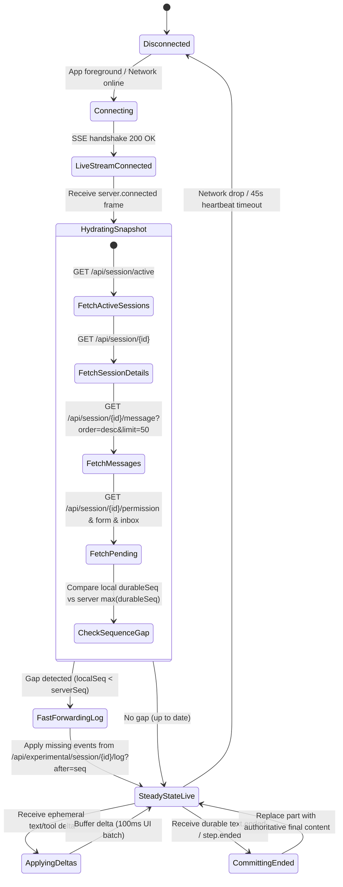
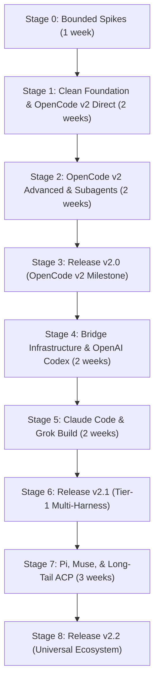

# CodeWalk v2 — Comprehensive Independent Planning Deliverable

**Role:** Independent Planning Helper  
**Work Item:** `codewalk-v2-plan`  
**Working Directory:** `/home/ubuntu/MEGA/WORK/codewalk`  
**Repository Revision:** `14fbf519` (following release `v1.265.0`)  
**Date:** 2026-10-02  

---

## 1. Status, Objective, Architectural Recommendation, and Intended Final Behavior

### 1.1 Objective and Scope
CodeWalk v2 is a total architectural reinvention of the CodeWalk client. It discontinues OpenCode v1 compatibility completely (delegating legacy v1 support to frozen CodeWalk v1.x maintenance builds) and establishes exclusive, native support for **OpenCode v2** alongside a unified multi-harness architecture spanning **OpenAI Codex**, **Claude Code**, **Pi**, **Muse Code**, **Grok Build**, and **DeepSeek Harness (`dsh`)**, with standard **Agent Client Protocol (ACP)** integration for the broader ecosystem.

The design eliminates the ~158k LOC monolith of v1, replaces the dual-god-object architecture (`ChatProvider` ~22.8k LOC, `ChatPage` ~27.5k LOC), removes ~25 brittle v1-only workarounds (content-based optimistic message matching, multi-minute status polling, duplicate SSE deduplication rings, shell-scripted file writes, base64 Node credential extraction), and provides a clean, responsive, reactive client built on Flutter for Android, Linux, macOS, Windows, Web, and iOS.

### 1.2 Architectural Recommendation for Open Decisions
1. **Connection Topology (D01 / 1D — Recommended: Direct-First Hybrid Architecture):**
   - **Direct Official Surface for Network-Reachable Servers:** OpenCode v2 natively exposes a secure HTTP/SSE service (`opencode service` on port 49374) with Basic auth and expiring token pairing. Grok Build natively provides `grok agent serve` with WebSocket ACP. For these harnesses, CodeWalk connects **directly** without requiring an intermediary proxy.
   - **Lightweight Host Bridge (`codewalk-bridge`) for Stdio/UDS Harnesses:** Claude Code (Agent SDK / stream-json), OpenAI Codex (Unix Domain Socket shared daemon `app-server-control.sock`), Pi (`pi --mode rpc` JSONL stdio), Muse Code (`muse serve` stdio MSP), and generic ACP stdio agents run exclusively as local subprocesses or owner-only Unix domain sockets. A phone or web browser cannot bind to a remote Unix socket or pipe stdio across a network without an intermediary. A thin, unopinionated daemon (`codewalk-bridge`) runs on the host machine where the code and CLI binaries reside, exposing authenticated WebSocket/SSE endpoints for remote clients.
   - **Cohesive Domain Contract:** In the Flutter client, both direct servers and bridged harnesses implement the exact same `HarnessSessionDriver` interface. The presentation and state layers never know whether an event stream arrived directly from `opencode service` or via `codewalk-bridge`.

2. **Rollout Phases (D02 / 2D — Recommended: Phased Delivery v2.0 → v2.1 → v2.2):**
   - **Phase 1 (v2.0 — OpenCode v2 Core):** The foundation. New clean-slate skeleton, direct OpenCode v2 HTTP/SSE client, durable session log catch-up, typed flat message model, async prompt pipeline (`steer`/`queue`), ordered permission rules, interactive forms (replacing questions), background subagents, terminal PTY, responsive Material You UI on all 6 targets.
   - **Phase 2 (v2.1 — Bridge & Tier-1 Major Harnesses):** Rollout of `codewalk-bridge`, native OpenAI Codex app-server v2 driver (attaching to the shared daemon), native Claude Code driver (wrapping `@anthropic-ai/claude-agent-sdk`), native Grok Build WebSocket driver (`grok agent serve`). Unified multi-harness session explorer with provider badges and capability gating.
   - **Phase 3 (v2.2 — Extended Ecosystem & Long-Tail ACP):** Pi RPC driver, Muse Code Session Protocol v1 driver, generic ACP stdio adapter (connecting Cursor, Gemini CLI, Copilot CLI, Kimi, Qwen), and experimental DeepSeek `dsh` ACP preview.

3. **Notification and Background Delivery (D07 / 7D — Recommended: Tri-Level Delivery & Snapshot Reconnect):**
   - **Level 1 (In-App & Foreground Pinned):** High-priority local heads-up notifications and Android foreground service keep live SSE/WebSocket streams connected while user is multi-tasking.
   - **Level 2 (Host-Side Webhook / Self-Hosted Push Gateway):** When remote mobile clients disconnect or are suspended by the OS (iOS background suspension after ~30s, Android Doze), `codewalk-bridge` and OpenCode v2 lifecycle events trigger configured user notification webhooks (such as [ntfy.sh](https://ntfy.sh), Gotify, Pushover, or generic webhooks).
   - **Level 3 (Authoritative Resume-Hydration):** Absolute rule: *the client never assumes it received background notifications.* On foregrounding, CodeWalk executes bounded catch-up via `/api/experimental/session/{id}/log?after=<seq>` (OpenCode) or state reconciliation (Codex/Claude), immediately reconciling unread turns, pending permissions, and completed tasks.

4. **Daemon Implementation Runtime (D15 / 15D — Recommended: TypeScript / Node or Bun):**
   - Claude Code's most capable, officially maintained surface is `@anthropic-ai/claude-agent-sdk`, published exclusively for TypeScript/Node (>= 18) and updated near-daily. Pi provides official TypeScript `RpcClient`. OpenCode v2 itself is written in TypeScript/Node.
   - Writing the bridge in Go, Rust, or Dart would require reverse-engineering and manually maintaining raw `stream-json` parsing, private control-request state machines, hook callbacks, and in-process MCP routing for Claude Code amidst rapid upstream protocol churn.
   - To make installation frictionless for users, `codewalk-bridge` can be compiled into a single self-contained executable binary for all platforms using `bun build --compile` or distributed via `npm install -g codewalk-bridge`.

### 1.3 Intended Final Behavior
The user opens CodeWalk v2 on Android, iOS, Desktop, or Web. The interface opens instantly to a **Unified Project & Host Workspace**. Sessions are grouped by host/workspace directory. A status badge indicates the active harness (`OpenCode`, `Codex`, `Claude`, `Grok`, `Pi`, `Muse`).
- In an **OpenCode v2** session: Streaming text and reasoning deltas render smoothly with 100ms debouncing. When the agent delegates to background subagents, child session indicators show live progress and allow deep-linking into the child's transcript. Permission prompts present ordered rules (`once`, `always`, `reject`), with `always` persisting at the project level. Question tools render as structured, multi-field interactive Forms.
- In an **OpenAI Codex** session: CodeWalk connects seamlessly to the user's shared `codex` daemon over UDS (via bridge or SSH). Turns started in the terminal TUI appear live in CodeWalk; approvals requested by the TUI can be answered from the phone, and vice-versa.
- In a **Claude Code** session: The user controls local Claude runs with full `canUseTool` approval dialogs, file checkpoint rewinds, and tool diff views, while strictly respecting Anthropic's user-owned local credential model.
- Unsupported actions are cleanly disabled with helpful tooltips rather than failing at runtime. Reconnecting after a tunnel drop or subway ride instantly catches up missed events using sequence-numbered logs without transcript corruption or duplicate messages.

---

## 2. Decision Assessment (D01 – D16)

The following table evaluates each decision independently based on verified technical evidence, architectural feasibility, and risk analysis.

| ID | Choice | State | Verdict | Evidence and Technical Argument | Concrete Alternative & Tradeoffs | Confidence & Verification |
|---|---|---|---|---|---|---|
| **D01** | 1D | Open | **Recommend Hybrid Bridge** | OpenCode v2 (`/api/*` on 49374) and Grok (`grok agent serve` on 2419) have native network servers. Codex, Claude, Pi, and Muse are stdio or local UDS only. A pure direct architecture cannot reach Codex/Claude/Pi on mobile. A universal proxy forces unnecessary overhead on OpenCode. Hybrid achieves direct efficiency where possible and bridges local-only harnesses. | Alternative: Universal Daemon for all harnesses. *Pros:* Single connection target for mobile. *Cons:* Added latency, proxy overhead on OpenCode v2, extra maintenance. | High. Verified against OpenCode v2 source (`event-feed.ts`), Codex UDS (`app-server-daemon`), and Claude SDK. |
| **D02** | 2D | Open | **Recommend Phased Rollout** | OpenCode v2 is stable (2.0.22). Claude SDK (0.3.287) and Codex app-server (0.160.0) are actively used in production by third parties. Pi 1.0.0 and Muse 1.4.2 are young (late Sept 2026). Grok is WebSocket-ready. DSH is a fast-changing preview (0.2.0-rc.2). Staging: v2.0 (OpenCode v2), v2.1 (Codex, Claude, Grok), v2.2 (Pi, Muse, ACP, DSH). | Alternative: Big-bang release with all 7 harnesses. *Pros:* Broadest marketing headline. *Cons:* Unmanageable release delays, testing matrix explosion. | High. Pinned release dates and maturity tags in dossiers `10`, `20`, `21`, `22`, `23`, `24`, `25`. |
| **D03** | 3A | Baseline | **Keep (Endorse)** | CodeWalk v1 has ~158k LOC where OpenCode v1 models and Dio calls leak across 83% of the presentation layer. Trying to refactor in-place while keeping v1 working would result in messy conditional branching. A clean skeleton in the same repo, branching `v1` for maintenance and cherry-picking reusable UI widgets (Markdown, diff viewer, theme tokens), is the cleanest, lowest-risk path. | Alternative: In-place migration with runtime adapters. *Cons:* Retains god-object baggage (`ChatProvider`), risk of regression. | High. Verified via codebase inspection (`plan/00-codewalk-v1-inventory.md`). |
| **D04** | 4A | Baseline | **Keep with Caution** | Keeping `com.verseles.codewalk` preserves the installed user base, Play Store listing, and app identity. However, replacing v1 with v2 means existing local caches and server connection configs will be replaced. Because v2 cannot talk to v1 servers, users whose servers are still on v1 will get connection errors until they update OpenCode to v2. | Alternative: New app ID `com.verseles.codewalk2`. *Pros:* Side-by-side v1/v2 installation. *Cons:* Fragmentation, loses Play Store updates and app ratings. *Recommendation:* Keep 4A, but add an upfront "OpenCode v2 Required" detection screen. | High. Android package management and auto-update semantics are standard. |
| **D05** | 5A | Baseline | **Keep with Native Delegation** | In v1, allow-all was an aggressive client-side auto-reply (`EXC-001`). In v2, OpenCode supports native server-side wildcard rules (`PATCH /api/session/{id}` with `[{action:"*",resource:"*",effect:"allow"}]`), which propagate to subagents and prevent race conditions. Codex supports execution policies (`accept-for-session`). Claude SDK supports `permissionMode: "bypass"`. Keep allow-all ON by default as requested, but implement it natively at the server/harness level rather than through brittle client auto-replies. | Alternative: Require manual approval for destructive shell/write actions. *Pros:* Safer. *Cons:* Conflicts with explicit user preference for uninterrupted agent execution. | High. Verified against OpenCode v2 `packages/schema/src/permission.ts` and Codex `app-server` schemas. |
| **D06** | 6A | Baseline | **Keep (Endorse)** | OpenCode v2 publishes cost and token usage on `session.step.ended` and `session.usage.updated`, but provides no remaining-quota API. Codex emits rate-limit objects (`primary_window`, `secondary_window`). Claude emits rate-limit events. Muse MSP emits 5-hour and weekly quota windows (`usage/read`). Native signals must be parsed per harness, with host-side vendor queries kept as experimental opt-in. | Alternative: Mandatory host-side scraping of `auth.json`. *Cons:* Extremely fragile, breaks on token rotation, leaks secrets across networks. | High. Verified against OpenCode v2 `11-server-api.md`, Codex `20-codex.md`, Muse `23-muse-code.md`. |
| **D07** | 7D | Open | **Recommend Tri-Level Delivery** | Background execution on mobile without push infrastructure is severely constrained. Direct SSE drops when the OS suspends the app. Recommended: (1) Local foreground service on Android during active runs, (2) User-configured webhooks/ntfy/Gotify via bridge for background notifications, (3) Sequence-log catch-up upon reconnect. | Alternative: Central CodeWalk Push Relay server. *Cons:* Requires hosting proprietary cloud servers, handling user privacy, and storing credentials. | High. Mobile OS background limits (Android Doze, iOS BackgroundTasks) are strict platform constraints. |
| **D08** | 8A | Baseline | **Keep (Endorse)** | Operating strictly over user-owned networks (LAN, Tailscale, WireGuard, SSH tunnel, TLS reverse proxy) aligns with developer privacy and avoids central server hosting costs and liabilities. | Alternative: Hosted relay service (like Happy or Paseo). *Pros:* Easier NAT traversal. *Cons:* Third-party trust, server maintenance, recurring hosting costs. | High. User privacy and operational simplicity. |
| **D09** | 9[all] | Baseline | **Keep with Clear Platform Gates** | Supporting Android, Linux, macOS, Windows, Web, and iOS is technically feasible with Flutter. However, platform capabilities vary: Web cannot do raw TCP/UDS and enforces CORS; iOS restricts background execution; ARM64 Linux cannot reliably build Android APKs. Document explicit build/test gates per platform. | Alternative: Mobile-only (Android/iOS). *Cons:* Loses desktop companion and web dashboard users. | High. Validated against Flutter cross-platform support matrix and project constraints. |
| **D10** | 10A | Baseline | **Keep (Endorse)** | Managed desktop OpenCode v2 installation downloading official binaries from `https://opencode.ai/files/bin/<version>/opencode-<target>`, verifying SHA-256 against `https://opencode.ai/update/api/latest/cli`, and managing `opencode service` on port 49374 is standard, secure, and officially supported. | Alternative: Spawning ad-hoc `opencode serve` per workspace. *Cons:* Orphaned processes, port conflicts, bypasses shared multi-client state. | High. Verified in `10-opencode-v2-overview.md` and `11-opencode-v2-server-api.md`. |
| **D11** | 11A | Baseline | **Keep (Endorse)** | Desktop acts as the primary host manager, downloading and managing official CLI binaries/daemons (npm, curl scripts). Android and iOS act as remote clients connecting to the host. Web connects to desktop or remote host via reverse proxy. | Alternative: Android running Node/binaries via Termux internally. *Cons:* Flaky, high battery drain, poor user experience. | High. Matches standard remote client architecture (OpenChamber, Happy, Reemoat). |
| **D12** | 12B | Baseline | **Keep (Process)** | The final `v2-plan.md` must be written in English. | None. Standard project instruction. | Process. |
| **D13** | 13A | Baseline | **Keep (Critical Feature)** | External session discovery and continuation is vital. In OpenCode v2, all sessions are persisted in `~/.local/share/opencode/opencode.db` and exposed via `GET /api/session`; TUI, Web, and CodeWalk share them live. In Codex, `codex app-server daemon` shares thread state across TUI and RPC clients. In Claude, local history in `~/.claude/` is readable and resumable. | Alternative: CodeWalk-exclusive session silo. *Cons:* Defeats the purpose of pair programming across terminal and mobile. | High. Verified in OpenCode v2 source and Codex daemon architecture. |
| **D14** | 14A | Baseline | **Keep (Endorse)** | Unified session explorer grouped by project/host, displaying harness badges (OpenCode, Codex, Claude, etc.) and hiding/disabling unsupported capabilities per harness. Avoids UI confusion while providing a single pane of glass. | Alternative: Disjointed tab per harness. *Cons:* Cluttered navigation, poor cross-harness project overview. | High. Standard UI pattern in multi-model tools. |
| **D15** | 15D | Open | **Recommend TypeScript / Node** | Writing `codewalk-bridge` in TypeScript/Node allows direct consumption of `@anthropic-ai/claude-agent-sdk`, `@earendil-works/pi-coding-agent`, and official ACP packages. Distributable as a zero-dependency binary via Bun compilation (`bun build --compile`) or standard npm. | Alternative: Dart AOT bridge. *Cons:* Zero ecosystem libraries for Claude/Codex protocols; massive ongoing reverse-engineering burden. Alternative: Go/Rust. *Cons:* Requires maintaining custom bindings for rapidly changing TS SDKs. | High. TypeScript is the native lingua franca of modern agent SDKs. |
| **D16** | 16A | Baseline | **Keep (Process)** | Consult all eligible helpers independently within a 60-minute budget; full plan preserved by the orchestrator. | None. Standard helper planning protocol. | Process. |

### 2.1 Recommended Changes for User Reconsideration
1. **Migration Guard on App Update (D04):** Although the user baseline selected replacing v1 directly under `com.verseles.codewalk`, we strongly recommend introducing an **in-app migration detection check**. When CodeWalk v2 launches against an existing saved v1 server profile, instead of crashing or showing opaque SSE 404/200 HTML errors, it should display: *"This server is running OpenCode v1. CodeWalk v2 requires OpenCode 2.0.20+. Please upgrade your server or download legacy CodeWalk v1 from GitHub Releases."*
2. **Native Policy Delegation over Client Auto-Reply (D05):** In v1, allow-all was an aggressive client-side polling auto-reply. In v2, we should delegate allow-all to the server via `PATCH /api/session/{id}` permissions. If the client is disconnected or in the background, the agent does not hang waiting for a client reply.
3. **Decoupled Push Notification Webhooks (D07):** Rather than attempting complex background TCP sockets on mobile (which Android and iOS terminate), provide native webhook/ntfy.sh support in `codewalk-bridge` and OpenCode v2 hooks so users receive instant push alerts on their phones without battery drain.

---

## 3. Comprehensive Capability Matrix for All Seven Harnesses

The table below contrasts the 7 candidate harnesses across 16 critical feature areas. Every capability is categorized as:
- **Native (N):** Officially supported first-class API/event in the protocol.
- **Bridge (B):** Feasible via host-side daemon or bridge adapter.
- **Extension (E):** Vendor-specific protocol extension or hook.
- **Unsupported (-):** Not supported by the protocol/CLI; client must disable or stub.
- **Experimental (X):** Unstable, preview flag required, or subject to breaking changes.

| Feature Area | OpenCode v2 | OpenAI Codex | Claude Code | Pi | Muse Code | Grok Build | DeepSeek `dsh` |
|---|---|---|---|---|---|---|---|
| **Upstream Version Pinned** | 2.0.22 (npm `@opencode/cli`) | 0.160.0 (Rust CLI & daemon) | 2.1.287 / SDK 0.3.287 | 1.0.0 (`@earendil-works/pi`) | 1.4.2 (`@muse-code/sdk`) | 1.0.46 (`@xai-official/grok`) | 0.2.0-rc.2 (`@deepseek-ai/dsh`) |
| **Primary Integration Surface** | Direct HTTP/SSE (`/api/*`) | App-server JSON-RPC via UDS | TS Agent SDK (`query()`) | RPC Mode JSONL (stdio) | Muse Session Protocol (stdio) | ACP over WebSocket (`ws://`) | ACP Profile stdio |
| **Network Reachability** | Native (`:49374`, Basic auth) | Bridge / SSH to UDS (`:ws` 403s Origin) | Requires Host Bridge | Requires Host Bridge | Requires Host Bridge | Native (`ws://:2419` + secret) | Requires Host Bridge |
| **1. Streaming Text & Reasoning** | **N** (batched deltas + `ended`) | **N** (item deltas + reasoning) | **N** (content blocks + thinking) | **N** (message chunks + thinking) | **N** (turn deltas + reasoning) | **N** (ACP agent updates) | **N** (ACP chunk updates) |
| **2. Approvals & Permissions** | **N** (ordered rules: once/always/reject) | **N** (accept/session/decline/amend) | **N** (`canUseTool` allow/deny/edit) | **-** (YOLO by default; extension only) | **N** (server-minted choices) | **N** (ACP permissions) | **X** (simple allow/reject) |
| **3. Questions & Forms** | **N** (Typed Forms `q0..qN`) | **E** (`requestUserInput` RPC) | **N** (`AskUserQuestion` tool) | **E** (extension-UI sub-protocol) | **N** (`userInput/request`) | **E** (`x.ai/ask_user_question`) | **-** (Unsupported) |
| **4. Subagents & Background Tasks** | **N** (subagent tool `background: true`) | **N** (child threads via subagents) | **N** (`task_*` background tasks) | **-** (1.0 regression in subagents) | **N** (multi-agent workers/reviewers) | **E** (`x.ai/subagents`) | **-** (Unsupported) |
| **5. Quota, Cost & Token Usage** | **N** (cost USD + tokens per step) | **N** (rate-limit windows + tokens) | **N** (usage breakdown + rate-limit) | **N** (cost stats per session) | **N** (5-hour + weekly quota windows) | **E** (`x.ai/usage` ticks) | **-** (Unsupported) |
| **6. Session Discovery & Resume** | **N** (shared SQLite DB, `/api/session`) | **N** (daemon shared threads) | **B** (read `~/.claude/` history) | **N** (session-dir tree / fork) | **N** (list, resume-by-cursor, fork) | **N** (ACP session list/resume) | **X** (list only, no load/replay) |
| **7. Fork & Branching** | **N** (`POST /api/session/{id}/fork`) | **N** (`thread/fork` RPC) | **N** (SDK session fork) | **N** (session clone/fork) | **N** (`session/fork`) | **E** (`x.ai/session/fork`) | **-** (Unsupported) |
| **8. File Operations (FS)** | **N** (read/list/find; **no write**) | **N** (fs read/write/watch) | **B** (bridge-provided fs) | **B** (bridge-provided fs) | **N** (file read/search) | **E** (`x.ai/fs`) | **-** (Unsupported) |
| **9. Undo / Redo / Revert** | **N** (staged revert: stage/commit/clear) | **-** (`/undo` & rollback removed) | **N** (file checkpoint rewind) | **-** (Unsupported) | **-** (Unsupported) | **E** (`x.ai/rewind`) | **-** (Unsupported) |
| **10. Steer / Queue / Mid-Turn** | **N** (`delivery: steer \| queue`) | **N** (steer + experimental queue) | **N** (queued mid-turn messages) | **N** (steer + follow-up queue) | **N** (steer/queue/unqueue) | **E** (`x.ai/interject`) | **-** (Unsupported) |
| **11. Slash Commands & Custom** | **N** (`/api/command`) | **-** (skills replace commands) | **N** (slash commands discovery) | **N** (slash commands RPC) | **N** (slash command registry) | **-** (Unsupported) | **-** (Unsupported) |
| **12. Skills & Extensions** | **N** (`/api/skill`) | **N** (app-server skills) | **N** (skills discovery) | **N** (skills directory) | **N** (skills inspect/enable) | **E** (`x.ai/skills`) | **-** (Unsupported) |
| **13. Terminal (PTY / Shell)** | **N** (PTY over WS token + Shell API) | **N** (PTY command API) | **B** (bridge-provided PTY) | **-** (Unsupported) | **N** (user shell execution) | **E** (`x.ai/terminal`) | **-** (Unsupported) |
| **14. Stop / Interrupt / Cancel** | **N** (`POST /session/{id}/interrupt`) | **N** (`turn/interrupt`) | **N** (`interrupt()` with receipt) | **N** (`abort` command) | **N** (`turn/interrupt` + retract) | **N** (ACP cancel) | **X** (Process kill) |
| **15. Attachments (Images, PDFs)** | **N** (files in prompt payload) | **N** (data URLs only; no http urls) | **N** (image content blocks) | **N** (image inputs) | **N** (image inputs) | **N** (ACP embedded context) | **X** (local images only) |
| **16. Model & Effort Selection** | **N** (`POST /model`, `POST /agent`) | **N** (models + reasoning effort) | **N** (model + `applyFlagSettings`) | **N** (model + thinking levels `off..max`)| **N** (model + reasoning effort) | **N** (model + effort flags) | **X** (route config only) |

---

## 4. Architecture and Interfaces

### 4.1 Proposed Directory and File Layout (`lib/`)

```
lib/
├── main.dart                                    # Clean bootstrap, zone guard, root provider setup
├── core/
│   ├── di/injection_container.dart             # GetIt dependency graph
│   ├── network/
│   │   ├── http_client.dart                    # Configured Dio with timeouts and token interceptors
│   │   ├── sse_client.dart                     # Custom resilient SSE parser (LF bytes, no 16MB leak)
│   │   └── websocket_client.dart               # Reconnecting WebSocket transport
│   ├── storage/
│   │   ├── secure_storage.dart                 # Tokens, server passwords
│   │   └── app_database.dart                   # Local Drift/SQLite: host profiles, session metadata, cached unreads
│   ├── theme/                                  # Material You dynamic color, responsive tokens
│   └── utils/                                  # Loggers, platform helpers, cancellable tasks
├── domain/                                     # PURE DART: Zero Flutter / Dio imports
│   ├── entities/
│   │   ├── host_profile.dart                   # Connection config (direct URL or bridge, credentials)
│   │   ├── session_identity.dart               # {hostId, workspaceDir, sessionId, harnessType}
│   │   ├── canonical_message.dart              # Flat typed message model (User, Assistant, Synthetic, etc.)
│   │   ├── message_content.dart                # TextPart, ReasoningPart, ToolCallPart (with state lifecycle)
│   │   ├── permission_request.dart             # Normalized permission request (rules, decisions, scope)
│   │   ├── form_request.dart                   # Interactive question/form definition and user inputs
│   │   ├── harness_capabilities.dart           # Strongly typed feature flags per session/host
│   │   └── usage_metrics.dart                  # Unified tokens, USD cost, rate-limit windows
│   ├── events/
│   │   └── canonical_event.dart                # Sealed class hierarchy of unified harness events
│   └── drivers/
│       └── harness_session_driver.dart         # Pure interface implemented by all harness adapters
├── data/
│   ├── datasources/
│   │   ├── opencode_v2_remote_datasource.dart  # Direct OpenCode v2 HTTP + SSE (/api/*)
│   │   ├── bridge_remote_datasource.dart       # WebSocket connection to codewalk-bridge
│   │   └── local_storage_datasource.dart       # Drift database implementation
│   ├── reducers/
│   │   ├── canonical_session_reducer.dart      # Event fold: updates session timeline & execution state
│   │   └── opencode_event_mapper.dart          # Translates 94 OpenCode v2 events → CanonicalEvent
│   └── drivers/
│       ├── opencode_v2_driver.dart             # Implements HarnessSessionDriver for OpenCode v2
│       ├── codex_bridge_driver.dart            # Implements HarnessSessionDriver for Codex via bridge
│       ├── claude_bridge_driver.dart           # Implements HarnessSessionDriver for Claude via bridge
│       ├── grok_acp_driver.dart                # Implements HarnessSessionDriver for Grok WebSocket
│       └── generic_acp_driver.dart             # Implements HarnessSessionDriver for Pi/Muse/ACP
└── presentation/
    ├── app.dart                                # MaterialApp.router with responsive layout scaffolding
    ├── router/app_router.dart                  # GoRouter declarative navigation
    ├── state/
    │   ├── host_provider.dart                  # Manages known hosts, health checks, pairing
    │   ├── session_list_provider.dart          # Aggregates external and internal sessions by project
    │   ├── active_session_provider.dart        # Stream-based provider driving the active chat view
    │   └── terminal_provider.dart              # PTY session state
    ├── pages/
    │   ├── workspace_explorer_page.dart        # Host list, project picker, multi-harness session tree
    │   ├── chat_page.dart                      # Clean ~400 LOC scaffold hosting modular widgets
    │   ├── session_history_page.dart           # Archive, search, filter
    │   └── settings_page.dart                  # Connection profiles, allow-all policies, theme
    └── widgets/
        ├── chat/
        │   ├── timeline_view.dart              # Optimized CustomScrollView with sliver list
        │   ├── message_bubble.dart             # User, assistant, system message cards
        │   ├── streaming_text_view.dart        # Debounced markdown renderer with syntax highlighting
        │   ├── reasoning_fold.dart             # Collapsible thinking bubble with step duration
        │   ├── tool_call_tile.dart             # Tool status (streaming, running, completed, failed)
        │   ├── background_subagent_card.dart   # Child session status, task progress, jump button
        │   └── permission_dialog.dart          # Interactive approval card (once, always, reject)
        ├── composer/
        │   ├── chat_composer.dart              # Input field, attachments, steer/queue toggle
        │   └── model_effort_selector.dart      # Dropdown for model, agent, and reasoning effort
        └── forms/
            └── dynamic_form_view.dart          # Dynamic form fields (q0..qN) for OpenCode/Claude questions
```

### 4.2 Canonical Domain Event Envelope
Every event from every harness is normalized into a sealed `CanonicalEvent` with immutable raw provenance:

```dart
sealed class CanonicalEvent {
  final String id;
  final String sessionId;
  final DateTime timestamp;
  final int? sequenceNumber; // Non-null on durable logs
  final Map<String, dynamic> rawPayload; // Full raw provenance

  const CanonicalEvent({
    required this.id,
    required this.sessionId,
    required this.timestamp,
    this.sequenceNumber,
    required this.rawPayload,
  });
}

// Concrete event examples
class TextDeltaEvent extends CanonicalEvent {
  final String messageId;
  final int ordinal;
  final String delta;
  const TextDeltaEvent({...required this.messageId, required this.ordinal, required this.delta});
}

class TextEndedEvent extends CanonicalEvent {
  final String messageId;
  final int ordinal;
  final String authoritativeText;
  const TextEndedEvent({...required this.messageId, required this.ordinal, required this.authoritativeText});
}

class ToolExecutionEvent extends CanonicalEvent {
  final String messageId;
  final String toolCallId;
  final String toolName;
  final ToolExecutionStatus status; // streaming, running, completed, failed
  final Map<String, dynamic>? parsedInput;
  final dynamic output;
  final String? errorMessage;
  const ToolExecutionEvent({...});
}

class PermissionRequestedEvent extends CanonicalEvent {
  final String requestId;
  final String action;
  final List<String> resources;
  final List<String>? saveRules;
  const PermissionRequestedEvent({...});
}

class ChildSubagentSpawnedEvent extends CanonicalEvent {
  final String childSessionId;
  final String agentName;
  final String taskDescription;
  final bool isBackground;
  const ChildSubagentSpawnedEvent({...});
}
```

### 4.3 Harness Capability Negotiation Contract
To avoid leaking harness-specific checks into presentation widgets, capabilities are expressed as a strongly typed domain contract:

```dart
class HarnessCapabilities {
  final bool supportsSteer;
  final bool supportsQueue;
  final bool supportsForms;
  final bool supportsFileRewind;
  final bool supportsBackgroundSubagents;
  final bool supportsPtyTerminal;
  final bool supportsReasoningEffort;
  final bool supportsNativeAllowAll;
  final bool supportsUsageMetrics;

  const HarnessCapabilities({
    required this.supportsSteer,
    required this.supportsQueue,
    required this.supportsForms,
    required this.supportsFileRewind,
    required this.supportsBackgroundSubagents,
    required this.supportsPtyTerminal,
    required this.supportsReasoningEffort,
    required this.supportsNativeAllowAll,
    required this.supportsUsageMetrics,
  });

  // Pre-configured capabilities per harness
  static const opencodeV2 = HarnessCapabilities(
    supportsSteer: true,
    supportsQueue: true,
    supportsForms: true,
    supportsFileRewind: true,
    supportsBackgroundSubagents: true,
    supportsPtyTerminal: true,
    supportsReasoningEffort: false,
    supportsNativeAllowAll: true,
    supportsUsageMetrics: true,
  );

  static const codex = HarnessCapabilities(
    supportsSteer: true,
    supportsQueue: true,
    supportsForms: false,
    supportsFileRewind: false,
    supportsBackgroundSubagents: true,
    supportsPtyTerminal: true,
    supportsReasoningEffort: true,
    supportsNativeAllowAll: true,
    supportsUsageMetrics: true,
  );

  static const claudeCode = HarnessCapabilities(
    supportsSteer: false,
    supportsQueue: true,
    supportsForms: true,
    supportsFileRewind: true,
    supportsBackgroundSubagents: true,
    supportsPtyTerminal: true,
    supportsReasoningEffort: true,
    supportsNativeAllowAll: true,
    supportsUsageMetrics: true,
  );
}
```

### 4.4 History Hydration, Gap Recovery, and Event Reducer State Machine
OpenCode v2 global SSE (`GET /api/event`) is volatile by contract (dropped if >4096 events behind; no replay). To guarantee zero lost messages and zero transcript corruption:



**Reducer Invariants:**
1. **Delta Coalescing:** Ephemeral `session.text.delta` events append to an in-memory buffer. The UI rebuilds at a throttled 60fps (16ms) on mobile and 100ms on desktop.
2. **Authoritative Replacement:** When `session.text.ended` arrives, the accumulated buffer is replaced in its entirety by `event.data.text`. This completely cures any dropped deltas or network stuttering.
3. **Idempotent Insertion:** Messages are indexed by server ID (`msg_...`). Duplicate inserts are dropped.
4. **Optimistic Turn Admission:** Prompts dispatched via `POST /api/session/{id}/prompt` enter the timeline immediately in an `optimistic` state with a client UUID. When `session.inbox.enqueued` arrives with the server's `inboxID`, the optimistic item binds to the inbox ID. When `session.inbox.delivered` arrives, it transitions into the permanent timeline.

---

## 5. User Experience and Behavior

### 5.1 Mobile-First Material You & Responsive Desktop/Web Layout
- **Mobile (Android, iOS):** Bottom-navigation bar (Workspaces, Active Chat, Background Tasks, Settings). Dynamic Color (Material You M3) adapting to the system palette on Android 12+. Swipe-to-dismiss for background task sheets. Full tactile haptics on tool completions and approvals.
- **Desktop (Linux, macOS, Windows) & Web:** Multi-pane master-detail layout:
  - Left Rail (Collapsible): Hosts, Workspaces, and Sessions with harness badges.
  - Center: Message timeline with virtualized smooth scrolling.
  - Right Drawer (Contextual): Active Subagent Transcripts, File Changes / Diffs, Persistent PTY Terminal.
  - Window Chrome: Native desktop window styling with custom minimize/maximize/close on Windows/Linux, native traffic lights on macOS.

### 5.2 Onboarding, Discovery, Pairing, and Authentication
1. **Direct OpenCode v2 Pairing Flow:**
   - User clicks **Add Host** → Selects **OpenCode v2**.
   - Input: Host URL (e.g. `http://neo.tailscale:49374` or `https://opencode.mydomain.com`).
   - If user has pairing code: CodeWalk redeems `GET /auth/connect/{code}` (with `Accept: application/json`), receives the 30-day bearer token, and stores it in secure storage.
   - Alternatively: Direct Basic Auth entry (user `opencode`, password `OPENCODE_SERVER_PASSWORD`).
   - CodeWalk performs verification check against `GET /api/info`.
2. **Bridge Pairing Flow (Codex / Claude / Multi-Harness):**
   - User installs `codewalk-bridge` on the host: `npm install -g codewalk-bridge` and runs `codewalk-bridge start`.
   - The CLI prints a QR code and a pairing link: `codewalk://pair?host=192.168.1.50:48500&key=sec_987xyz`.
   - On mobile, scanning the QR code immediately establishes the authenticated WSS connection and registers the host.

### 5.3 External Session Discovery and Co-Existence (D13)
When terminal users start runs outside CodeWalk:
- **OpenCode v2:** Sessions are stored in the host's central SQLite database. `GET /api/session` returns all active and past sessions. When a CLI user launches `opencode run` or interactive TUI, CodeWalk receives `session.created` on `/api/event` and immediately displays the session in the active project list. The mobile user can watch the CLI turn progress in real time.
- **OpenAI Codex Daemon:** The shared daemon on `app-server-control.sock` tracks all threads. CodeWalk attaches to running threads, streams deltas simultaneously with the terminal TUI, and shares approval state.
- **Claude Code:** Sessions stored in `~/.claude/` are indexed by the bridge. Resuming a session in CodeWalk spawns the session runner with the corresponding session ID.

### 5.4 Asynchronous Child Subagents & Background Tasks
- OpenCode v2 introduces the `subagent` tool with native `background: true` execution, and detaches shell jobs via `POST /api/session/{id}/background`.
- **UI Presentation:** Background child sessions do not pollute the main chat timeline with raw intermediate tool logs. Instead, they render as an interactive **Subagent Mission Card**:
  - Displays: Agent name, task summary, execution spinner, elapsed time, and live status badge (`running`, `completed`, `failed`).
  - Expanding the card or tapping **Inspect** opens a slide-over modal containing the child session's full independent message timeline.
  - Interrupting the main session gives the option to cancel running background children via `POST /api/session/{childId}/interrupt`.

### 5.5 Interactive Forms vs Legacy Questions
- OpenCode v1's raw question tool is replaced in v2 by structured **Forms** (`/api/session/{id}/form`).
- When a form is asked (`form.created`), CodeWalk renders an embedded Material card with typed input fields (`q0..qN`), single/multi-choice radio buttons, or free text.
- Submitting replies via `POST /api/session/{id}/form/{formId}` cleanly advances the agent loop.

### 5.6 Composer: Steer, Queue, and In-Flight Interruption
- The composer bar includes an execution state pill:
  - When the agent is **BUSY**: The submit button transforms into a split action: **Steer** (send immediately to interrupt/adjust the current turn) or **Queue** (enqueue for the subsequent turn).
  - Tapping **Stop** issues `POST /api/session/{id}/interrupt` with reason `"user"`.
  - Queued prompts display in a docked "Next Up" drawer above the keyboard, where they can be edited or cancelled before being admitted into the turn.

---

## 6. Rewrite, Reuse, and Discard Map

### 6.1 What to Discard (Obsolete v1 Baggage Removed)
1. **`ChatProvider` & `ChatPage` God-Objects (~50k LOC):** Completely discarded. Replaced by decoupled domain use cases and modular Flutter state providers.
2. **Content-Based Optimistic Bubble Matching:** In v1, CodeWalk guessed which server bubble matched an optimistic send by substring comparison. Discarded in favor of v2 inbox IDs and deterministic server message IDs.
3. **Multi-Minute Status Polling (`/session/status`):** In v1, CodeWalk polled status after sending. In v2, `session.execution.*` events provide instant push state.
4. **Dual SSE Connections & Deduplication Ring:** In v1, CodeWalk maintained two SSE connections to work around dropped events. Discarded; v2 uses a single global SSE stream with sequence-logged catch-up.
5. **Hidden Shell Sessions for File Operations & Quotas:** In v1, CodeWalk spawned hidden shell jobs to write files and ran Node scripts to inspect `auth.json`. Discarded; file browsing uses official `/api/fs/*` endpoints; quotas use native protocol usage data.
6. **Triple Android Completion Detectors:** In v1, three overlapping services fought to monitor completion. Replaced by a single clean Foreground Service + optional webhook notifications.

### 6.2 What to Reuse Selectively (from v1 Inventory)
- **`lib/presentation/theme/` (selective):** Color schemes, typography scales, syntax highlighting themes, and app icon assets.
- **Markdown & Code Rendering Widgets:** Reusable parts of `lib/presentation/widgets/chat_message/` that parse code blocks, diffs, and markdown styling (decoupled from v1 model types).
- **Desktop Window Chrome:** `DesktopWindowChromeController` and window management logic (minimize, maximize, drag regions).
- **Tailscale Integration Helper:** The embedded/local Tailscale network resolver logic in `core/network/tailscale/` (adapted to clean Dio/WSS).

### 6.3 What to Write New
- **Full Domain Layer:** Pure Dart entities (`canonical_message.dart`, `session_identity.dart`, `harness_capabilities.dart`).
- **OpenCode v2 HTTP/SSE Engine:** Clean `Dio` client configured for `/api/*`, Basic auth, pairing tokens, and custom SSE parser supporting 15s heartbeats and gap detection.
- **Universal Multi-Harness Bridge Client:** WebSocket transport handling bidirectional JSON-RPC for bridged harnesses (Codex, Claude, Grok, Pi, Muse).
- **Form Renderer & Dynamic Form State:** Interactive widget rendering `FormInfo1` and submitting `FormAnswer2`.
- **Subagent Manager & Navigation:** Deep-linking state tracking parent-child session hierarchies.

### 6.4 Coordinated Updates to Project Documentation and ADRs
- **`ADR.md` Updates:**
  - Create **ADR-045**: *Migration to OpenCode v2 Protocol and Multi-Harness Driver Architecture*. Formally supersedes v1 assumptions in ADR-023.
  - Update **ADR-023**: Mark v1 endpoint tables as legacy; document v2 `/api/*` contract and the new `HarnessSessionDriver` abstraction.
  - Update **ADR-029 (Quotas)**: Replace legacy shell/auth.json extraction with native event-based token/cost signals.
  - Revise **EXC-001 (Allow-All)**: Transition from client auto-reply once to native server ruleset `PATCH /api/session/{id}`.
- **`BEHAVIOR.md` Updates:** Rewrite sections on onboarding, message reconciliation, and subagent navigation to reflect v2 mechanics.
- **`CODEBASE.md` Updates:** Re-map entry points, providers, and data sources to the clean-architecture layout.

---

## 7. Ordered Implementation Stages and Dependencies

The implementation is broken into tightly bounded, vertical milestones. Each stage contains clear validation gates.



### Stage 0: Bounded Validation Spikes (Week 1)
- **Spike 0.1 (OpenCode v2 SSE & Replay):** Validate Dart SSE parser against live `opencode service` (port 49374). Confirm 15s heartbeat comment handling and gap catch-up via `/api/experimental/session/{id}/log`.
- **Spike 0.2 (Codex UDS over SSH/Proxy):** Verify connecting to `$CODEX_HOME/app-server-control/app-server-control.sock` via `codex app-server proxy` stdio pipe and WebSocket Upgrade.
- **Spike 0.3 (Claude SDK Bridge):** Spin up minimal Node/Bun bridge wrapping `@anthropic-ai/claude-agent-sdk`, verify `canUseTool` round-trip to Flutter client.

### Stage 1: Clean Foundation & Direct OpenCode v2 Client (Weeks 2–3)
- Create clean repository skeleton on `main` (branching `v1` for maintenance).
- Implement `core/network/`, `data/datasources/opencode_v2_remote_datasource.dart`, and domain event models.
- Build onboarding: URL entry, `opencode pair` one-time code redemption, 30-day token persistence.
- Implement session list and active session view with flat message timeline and 100ms delta coalescing.
- *Validation Gate:* Pass unit tests on OpenCode v2 event reducer fixtures. Connect to live OpenCode 2.0.22, create session, stream prompt, observe complete turn.

### Stage 2: OpenCode v2 Advanced Capabilities (Weeks 4–5)
- Implement asynchronous prompt pipeline: `steer`, `queue`, and `interrupt`.
- Implement Ordered Permissions (`once`, `always`, `reject`) and server-side allow-all policy.
- Implement Interactive Forms (`form.asked`, `form.replied`).
- Implement Background Subagents: mission card in timeline, deep-link to child transcript, child cancellation.
- Implement PTY WebSocket terminal tab.
- *Validation Gate:* Run complete agentic workflow involving tool execution, background subagents, and user forms. `make check` passing.

### Stage 3: CodeWalk v2.0 Release Gate (Week 6)
- Polish Material You UI on Android, macOS, Linux, Windows, and Web.
- Build signed Android APK and desktop binaries.
- Execute full regression suite. Publish **CodeWalk v2.0.0 (OpenCode v2 Exclusive)**.

### Stage 4: Bridge Infrastructure & OpenAI Codex Driver (Weeks 7–8)
- Implement `codewalk-bridge` in TypeScript (Node/Bun). Package as standalone executable.
- Implement `CodexBridgeDriver` in Flutter.
- Connect to shared Codex daemon: list shared threads, stream turn deltas, handle approvals, inspect rate-limit windows.
- Unified session list displaying OpenCode and Codex sessions side by side.
- *Validation Gate:* Start run in Codex terminal TUI, see live turn stream in CodeWalk, approve command from CodeWalk, see terminal resume.

### Stage 5: Claude Code & Grok Build Drivers (Weeks 9–10)
- Integrate Claude Agent SDK into `codewalk-bridge`. Implement `canUseTool` approval dialogs, file checkpoint rewind, and AskUserQuestion.
- Implement direct `GrokAcpDriver` in Flutter connecting to `grok agent serve` over WebSocket.
- *Validation Gate:* Verify Claude Code permission round-trips and file rewind; verify Grok Build turn execution over WebSocket. Publish **CodeWalk v2.1.0**.

### Stage 6: Extended Ecosystem — Pi, Muse, & ACP (Weeks 11–13)
- Implement Pi RPC driver over bridge (`pi --mode rpc`).
- Implement Muse Session Protocol driver (`muse serve`).
- Implement generic ACP stdio driver for Cursor, Gemini CLI, Copilot CLI.
- Evaluate DeepSeek `dsh` ACP preview stability. Publish **CodeWalk v2.2.0**.

---

## 8. Testing and Validation Plan

### 8.1 Contract Fixtures and Reducer Edge Cases
Unit tests must use serialized golden JSON fixtures captured from upstream wires (located in `test/fixtures/`):
1. **OpenCode v2 Golden Fixtures:**
   - Text and reasoning streaming: `started` → 10x `delta` → `ended`.
   - Tool execution: `tool.input.started` → `delta` → `ended` → `called` → `progress` → `success` / `failed`.
   - Form lifecycle: `form.created` → `form.replied` → continuation turn.
   - Background subagents: parent session receives `session.tool.progress` with child session ID, child emits events, parent receives synthetic completion.
2. **Reducer Race Condition Tests:**
   - *Reconnect Gap:* Simulate dropped SSE connection during active turn. Verify reducer calls `/log?after=seq` and correctly reconciles without duplicate messages.
   - *Delta After Ended:* Simulate out-of-order network arrival where a delayed `delta` arrives after `ended`. Verify authoritative `ended` content is preserved.
   - *Simultaneous Approvals:* Simulate user approving on terminal while phone prompt is open. Verify phone receives `permission.replied` and cleanly dismisses modal.

### 8.2 Platform-Specific Validation Matrix
- **Android:**
  - Test foreground service persistence when app is minimized during a 5-minute build turn.
  - Verify back-gesture navigation from child subagent transcript to parent chat.
  - Verify Material You dynamic theming on Android 12, 13, 14, 15.
- **Desktop (Linux, macOS, Windows):**
  - Verify managed OpenCode v2 binary download, SHA-256 verification, and `opencode service` supervisor launch.
  - Verify PTY resize events on window maximize/restore.
- **Web:**
  - Verify CORS handling when connecting to remote OpenCode v2 instance.
  - Verify WebSocket fallback where raw TCP/UDS is unavailable.
- **iOS:**
  - Verify graceful stream disconnect on background suspension; verify immediate log catch-up on foregrounding.

### 8.3 Target Validation Commands
Normal validation must avoid running `make precommit` directly. Use targeted, quiet commands:
```bash
# Set up Flutter environment
export PATH="$HOME/flutter/bin:$PATH"

# 1. Focused Unit & Reducer Tests
flutter test test/unit/data/reducers/canonical_session_reducer_test.dart
flutter test test/unit/data/datasources/opencode_v2_remote_datasource_test.dart

# 2. Targeted Static Analysis
flutter analyze lib/domain/ lib/data/ lib/presentation/

# 3. Web Test Gate
flutter test -d chrome test/widget/chat_page_test.dart

# 4. Final Full Project Validation Gate (before release commit)
make check
```

---

## 9. Risks, Mitigations, Assumptions, and Execution Start

### 9.1 Technical Risks and Mitigations

| Risk | Impact | Likelihood | Mitigation Strategy |
|---|---|---|---|
| **Upstream OpenCode v2 Rapid Churn** | Breaking changes in `/api/*` endpoints or event schemas. | High | Pin `@opencode/cli` version in managed install. Use defensive schema parsing with fallback for unknown events. |
| **Volatile Global SSE Buffer Overflow** | Slow clients or long sleep drops connection (>4096 events). | Medium | Implement 45s heartbeat watchdog. On reconnect, immediately reconcile via `/api/experimental/session/{id}/log` and active session APIs. |
| **Mobile Background Stream Termination** | OS suspends app after ~30s in background, missing live events. | High | Never promise live background streaming. Use Android Foreground Service when pinned. Rely on host-side notification webhooks and snapshot re-hydration on resume. |
| **Claude Code Policy / Token Restrictions** | Account suspension if client violates Anthropic terms. | Medium | Never collect, store, or forward claude.ai OAuth tokens. Require user to authenticate on host CLI. Offer API-key mode as first-class option. |
| **Codex Daemon UDS Access on Remote Devices** | Remote phones cannot bind local Unix sockets. | Certain | Route Codex RPC through `codewalk-bridge` over authenticated WebSocket. |
| **Android APK Build Issues on ARM64 Linux** | CI/local build failures when building APK on ARM64 host. | Known | Follow project rule: compile and release Android APKs strictly on GitHub Actions x86_64 runners; use local ARM64 Linux only for `make check` and tests. |

### 9.2 Key Assumptions and Fallback Verification
1. **Assumption:** OpenCode v2 will maintain `opencode service` on port 49374 as its primary shared background service.  
   *Fallback if false:* If changed, detect running service via `~/.local/state/opencode/service.json` or fallback to managed `opencode serve --port 4096`.
2. **Assumption:** Codex shared daemon `app-server-control.sock` remains compatible with standard JSON-RPC 2.0.  
   *Fallback if false:* Fall back to spawning dedicated `codex app-server --listen ws://127.0.0.1:PORT` processes with capability tokens.
3. **Assumption:** DeepSeek `dsh` preview will stabilize its ACP profile.  
   *Fallback if false:* Defer `dsh` in v2.0/v2.1; offer its web interface via reverse-proxy link until ACP profile matures.

### 9.3 Execution Start: Prerequisites and First Actionable Steps
Before modifying files or writing new code:
1. **Repository Setup:** Verify branch strategy. Create clean maintenance branch `git branch v1-maintenance` from HEAD `14fbf519` to preserve v1 codebase.
2. **First Files to Create:**
   - `lib/domain/entities/session_identity.dart` and `canonical_message.dart`: Establish core domain models free from v1 baggage.
   - `lib/core/network/sse_client.dart`: Clean, resilient SSE event stream parser.
   - `lib/data/datasources/opencode_v2_remote_datasource.dart`: First network adapter for OpenCode v2.
   - `test/fixtures/opencode_v2/`: Populate serialized wire fixtures for test-driven development.
3. **First Validation Command:**
   ```bash
   export PATH="$HOME/flutter/bin:$PATH" && flutter test test/unit/data/datasources/opencode_v2_remote_datasource_test.dart
   ```
