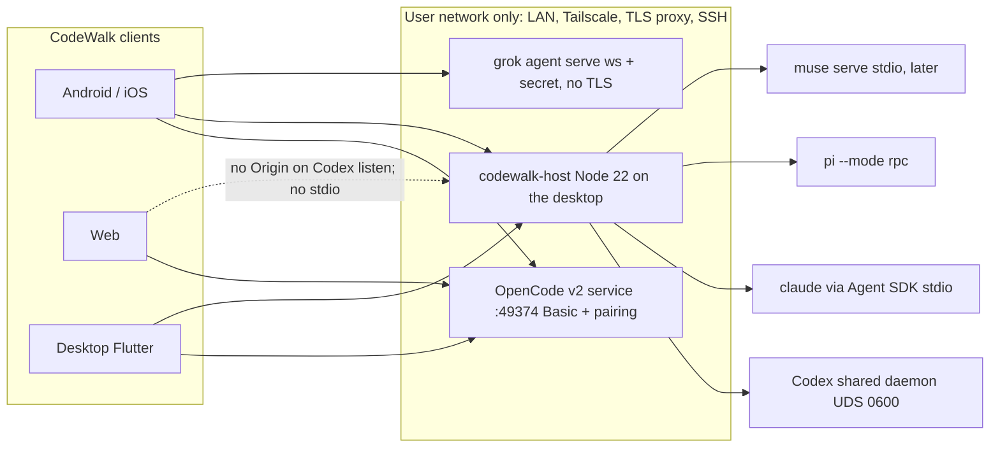

# CodeWalk v2 — implementation plan

Status: planning-only. Evidence is the 2026-10-02 research pack plus targeted reads of `plan/02-decisions.md`, `plan/README.md`, `plan/00`, `plan/10`–`plan/13`, `plan/11` transport/auth, `plan/12` permissions/subagents, `plan/20`–`plan/25`, `plan/30`, `pubspec.yaml`, and `Makefile`. No files were modified. Claims below are tagged **verified** when they come from those dossiers’ source pins, and **unverified** when they are still an inference or an unread raw section.

## 1. Status, objective, architecture, intended behavior

### Objective

Ship a maintainable Flutter client that speaks **OpenCode v2 only**, then attaches additional harnesses through their **official** protocols. OpenCode v1 stays on a future `v1` branch and a manual download. The phone is a client. It is never the parent of a stdio agent.

### Architectural recommendation (D01, D15)

**Hybrid. Harness-native transports. A small CodeWalk host where the phone cannot be the process parent. Not a universal daemon. Not an OpenCode impersonation layer.**



Three rules keep this from becoming a second protocol:

1. **OpenCode is reached directly.** `GET /api/info`, Basic user `opencode`, pairing token as the password, global `GET /api/event`. The desktop app may install and start `opencode service`. It must not wrap those HTTP calls in a private facade. Verified: `plan/11` §1.1–1.2, `plan/10`.
2. **The host is a process owner and a byte pipe, not a semantic translator.** For Codex it proxies the shared-daemon WebSocket-over-UDS. For Claude, Pi, and Muse it owns the official SDK or stdio session and forwards **documented** messages plus a thin envelope (`seq`, pending-request id, host health). It does not expose `/session` or `/event` shaped like OpenCode. That pattern exists in the wild (`vacp_bridge` in `plan/30` §2.3) and is rejected.
3. **Capability flags hide controls.** A missing undo, archive, quota, or approval API stays hidden. It is not emulated with git, shell, or a fake session.

**Daemon language: TypeScript on Node 22 LTS, desktop-only.** Android, iOS, and Web never run it.

Why Node, not Dart AOT or Go/Rust:

- Claude’s complete control surface is `@anthropic-ai/claude-agent-sdk` (0.3.287 ↔ CLI 2.1.287). The dossier says a non-TS host can drive raw stream-json, but that means reimplementing MCP routing, hook ids, and the initialize handshake, and the wire is only semi-public (`plan/21` §0.4, §2.1).
- Muse’s official client is `@muse-code/sdk`. Pi’s official client is the TypeScript `RpcClient`. ACP’s maintained SDK is `@agentclientprotocol/sdk`. Codex is JSON-RPC and needs no SDK.
- `dart_acp_sdk` 0.1.1 is cited in `plan/30` §1.3 as experimental. `plan/21` §8.12 says a quick search found no Dart ACP SDK. **Treat Dart ACP as unverified and do not depend on it.**
- Go/Rust would make a nicer Windows service and a smaller binary. They would also fork three official SDKs. Revisit only if a Node host spike misses the memory budget below.
- Bun is not the default. Claude’s documented runtime is Node ≥18. A Bun spike can come after the Node host is proven.

**Consequential alternative, labeled for discussion, not adopted:** one Rust host that speaks raw stream-json, Pi JSONL, Muse JSON-RPC, and Codex UDS, with no Node. Smaller install, worse protocol drift. Rejected until Node RSS or Windows service integration fails the spike in stage 0.

### Intended behavior

A user updates in place (`com.verseles.codewalk`, version **2.0.0**, build number **strictly greater than `1790827338`**). First launch detects an OpenCode v1 server (`GET /api/info` missing or HTML 200 on old paths — verified catch-all in `plan/11` §1.1) and tells them to upgrade the server or download legacy CodeWalk. It does not speak v1.

On a desktop, CodeWalk downloads the official OpenCode v2 binary, checks SHA-256 from the update API, and uses `opencode service` on port **49374** with a password and one-time pairing. Phone, Web, and iOS connect over a network the user already has. There is no CodeWalk relay.

The session list is per host and per project. OpenCode sessions started in the TUI appear because they live in the shared service. Codex sessions started in the TUI appear only after the host is attached to the **shared** daemon socket, not to a private `codex app-server --listen`. Claude transcripts can be listed from disk. A Claude TUI session is **not** live-controlled. Continuing it starts an SDK resume and warns that the terminal must not hold the same session.

Allow-all, as shipped, auto-replies the harness’s **non-override** accept (`once` on OpenCode). It does not, by default, install OpenCode’s `*/* allow` session rule, which overrides agent `deny` rules and is inherited by children (`plan/12` §7.5). That stronger switch exists, off, and is labeled as an override.

Streaming updates the timeline from deltas. `ended` / `item/completed` replaces the text. Reconnect refetches the projection. It does not poll a turn to completion. Permissions, forms, and child sessions that need a human show in the parent thread and as a local notification **only while a connection is actually alive**. The app does not promise delivery after the OS suspends it.

Unsupported controls are absent, not disabled-and-lying. Pi has no permission system. OpenCode has no remaining-quota API and no verified archive route. Codex has no file undo. PDF attach is per harness.

### Blockers that are exact, not vague

- **No blocker** for an OpenCode-v2-only 2.0.0 if stage-0 pairing and reducer spikes pass.
- **Codex live attach from a browser is blocked** by Origin → 403 on `--listen ws://` (`plan/20` §0.4). Web Codex waits until the host terminates a browser-safe socket. That is a product limit, not a prompt to bypass Origin checks.
- **Claude live attach to a TUI session is not a protocol feature** (`plan/21` §3.6, §4). Do not build it.
- **iOS and Web cannot install or spawn harnesses.** They are connect-only.
- **Android release APKs are not built on this ARM64 host.** CI or a non-ARM64 runner builds them (`AGENTS.md`, `Makefile` `android` target).

## 2. Decision assessment D01–D16

| ID | Baseline | Verdict | Evidence and argument | Alternative | Confidence | Verification |
| --- | --- | --- | --- | --- | --- | --- |
| D01 | Open: connection architecture | **Recommend hybrid** | OpenCode is already a shared HTTP service (`plan/11` §1). Codex’s shared sessions exist only on a 0600 UDS (`plan/20` §2). `--listen ws://` is a different process and does not share those sessions. Claude, Pi, and Muse are stdio. A universal daemon either impersonates OpenCode or drops fields. Pure direct leaves the phone unable to parent stdio. | Universal daemon that normalizes everything to one WebSocket schema. Fewer client transports, permanent semantic loss, fights D13. | High | Stage-0: pair to `opencode service`; proxy one Codex UDS frame; spawn one Claude `query()`. |
| D02 | Open: rollout | **Recommend named releases below, not the rejected bundle** | Updater replacement (D04) requires the first binary to be a usable OpenCode client. Codex external sessions are essential (D13) but need a host. Claude has policy risk and no shared daemon. Grok is the only extra harness with its own WebSocket. dsh is a preview with no `session/load` (`plan/25`). | Ship all seven in 2.0.0. Delays the updater cutover and forces stubs. | High on order, medium on calendar | Each release has the acceptance list in §7. |
| D03 | 3A same repo, new skeleton, `v1` branch | **Keep** | v1 is ~158k LOC with ChatProvider ~22.8k and ChatPage ~27.5k (`plan/00` §0, §4). Wire types reach 26 presentation files that call Dio. A new skeleton in this repo keeps CI, signing, and app id. A second tree inside `lib/` would ship two protocols under one updater. | New repository. Loses signing history and makes the updater story worse. | High | Cut `v1` from `14fbf519` / tag `v1.265.0` before the first v2 commit on `main`. |
| D04 | 4A same app id, updater replaces v1 | **Keep, with a mandatory detector** | Product preference. Feasible if 2.0.0 speaks OpenCode v2 and refuses v1. Risk: a v1-only user updates into a client that cannot see their server, because old routes return HTML 200 (`plan/11` §1.1). No selected updater guard. | New application id. Avoids stranding, splits installs, contradicts the selected updater path. | High on the risk, high that the detector is enough | Spike: point 2.0 at a v1 server and at a v2 server. Confirm detection. Confirm Android `versionCode` > `1790827338`. |
| D05 | 5A allow-all on, global and per session | **Change the mechanism. Keep the preference.** | User wants fewer prompts. Official OpenCode apps auto-reply `once`. `PATCH` with `{action:"*",resource:"*",effect:"allow"}` overrides agent `deny`, including `.env` and `external_directory`, and children inherit it (`plan/12` §7.5). Codex `approvalPolicy: never` is a different thing from sandbox off. Claude `bypassPermissions` refuses as root and still blocks some actions (`plan/21` §3.4). Pi has no permission system (`plan/22`). | Keep the label “allow-all” but implement it as the wildcard rule. Matches the words “native server-side policy” and weakens safety versus the official apps. | High | Read `plan/12` §7.5 against a live 2.0.22 `permission.asked` for an agent that denies `edit`. Confirm `once` still asks internally and the deny never emits `asked`. |
| D06 | 6A native signals + experimental vendor opt-in | **Keep, with a hard ban on the v1 probe** | Codex `account/rateLimits/read` and Claude `rate_limit_event` are native. OpenCode has cost/tokens and no remaining-quota route (`plan/10` §f, `plan/12` §10). Muse has `usage/read`. The v1 quota path shells `node -e` against `auth.json` (`plan/01` §2.8, ADR-029). That must not return. Vendor opt-in means a user-toggled call through the official CLI on the host, never a copied OAuth token. | Drop the opt-in entirely. Safer, loses a feature the user asked to keep experimental. | High | Grep the v2 tree for `auth.json` and `CW_QUOTA_JSON` before 2.0.0; expect zero. |
| D07 | Open: notifications | **Recommend local-while-connected, then optional user webhook. No CodeWalk push.** | No harness has a third-party push API we may use. Claude push is Remote Control only (`plan/21` §4). D08 forbids a CodeWalk relay. Android can hold one foreground service. iOS cannot keep SSE in the background. Web service workers cannot reliably reach a private LAN host. v1’s three detectors exist because v1 had no replay and no push (`plan/00` §3 item 23). | FCM/APNs via a CodeWalk server. Better iOS delivery, contradicts D08, holds attention metadata on our infra. | High | Stage 0 note in the iOS spike: background fetch must be documented as best-effort, not a gate. |
| D08 | 8A user network, no hosted relay | **Keep** | Matches every official remote story we are allowed to use (OpenCode bind + CORS, Codex SSH proxy, Grok `ws://` plus the user’s TLS). Cost is honest: iOS background and Web private-host access are weaker. | Hosted relay with E2E, as Happy does. Out of the selected direction. | High | Docs and onboarding must not offer a CodeWalk tunnel URL. |
| D09 | Android, Linux, macOS, Windows, Web, iOS | **Keep, with gates** | OpenCode HTTP works from all six if the user provides a reachable, authenticated, CORS-correct endpoint. Local install is desktop-only (D11). Web cannot attach Codex directly. iOS has no `ios/` tree today (`plan/00` §1.1). macOS sandbox vs managed install is **inferred**, not verified. | Drop Web or iOS from 2.0.0. Shrinks the matrix the user already selected. Do not. Ship them as connect-only. | Medium on iOS signing, high on the capability split | `make test-web` for the client. iOS build only on macOS CI. Do not treat a green Linux `make check` as an iOS or Web facility proof. |
| D10 | Desktop official binary, SHA-256, `opencode service` :49374 | **Keep** | Verified port `0xc0de` = 49374, password required, pairing 5 min / token 30 days (`plan/11` §1). v1 managed install used `opencode serve` on 4096 with no password (`plan/00` §0). Do not reuse that path. Prefer the versioned binary plus SHA-256 over `curl \| bash` as the only path. The installer script rejects `windows-arm64` (`plan/10` §a); that target uses the zip. | npm global `@opencode/cli` only. Easier, but the user selected the verified binary. npm remains the fallback when the zip target is missing. | High | Spike: install pinned 2.0.22, `sha256sum`, `opencode service start`, `GET /api/info` with Basic. |
| D11 | Desktop installs daemon and harnesses; Android connects | **Keep, refine consent** | Official installers exist for Codex, Claude, Pi, Grok (`plan/20` §5, `plan/21` §5, `plan/22`, `plan/24`). Claude policy forbids a modified binary and in-app OAuth (`plan/21` §6). Silent install of every harness on first desktop launch is a bad reading of D11. OpenCode install can be part of onboarding. Each other harness is an explicit “Install with the official installer” action. iOS and Web never install. | Android sidecar via Termux. OpenCode v2 has no official Android target (`plan/10` §a). Out of scope. | High | Installer spike per OS for OpenCode only in 2.0.0. Other installers land with their release. |
| D12 | English plan | **Process-only, keep** | This document is English. | — | High | — |
| D13 | List and continue external sessions | **Keep the goal. Narrow the promise.** | OpenCode: shared service, list + live attach, multi-client. Codex: `thread/list` + `thread/resume` replays pending approvals (`plan/20` §2.4). Claude: `listSessions` is history. Live TUI control is not supported. SDK sessions are hidden from the terminal picker by default; overriding `CLAUDE_CODE_ENTRYPOINT` may misrepresent identity (`plan/21` §3.6). | Claim “continue” means live attach for all three. False for Claude. | High | Codex spike: start a thread in the TUI, resume it from a second client, answer an approval, confirm `serverRequest/resolved`. Claude spike: `listSessions` only. |
| D14 | Unified list, badge, hide unsupported | **Keep** | This is how capability flags stay honest. Do not show a Codex “New chat” row until that adapter’s create path is tested. A “coming later” row is a lie if it looks tappable. | One composer that errors at send time. Worse on mobile. | High | Widget test: Pi session has no approval toggle; OpenCode session has no quota-remaining chip. |
| D15 | Open: host language | **Recommend Node 22 + TypeScript** | See §1. Dart AOT matches the app language and loses the SDKs. Rust/Go match Grok/Codex implementations and still would not embed them. | Dart AOT host. One toolchain, high protocol risk. | Medium-high | Stage-0 host spike: RSS under 150 MB idle with one Claude query and one Codex proxy. If it cannot, reopen D15 before R2. |
| D16 | All helpers, two at a time, 60 min | **Process-only** | Scheduling does not change the architecture above. | — | High | — |

### Changes to put in front of the user

These are not silent edits to the baseline.

1. **D05 mechanism.** Keep “don’t prompt by default.” Do **not** implement that default as OpenCode’s project-wide `*/* allow` rule. Ship client auto-`once` (and the Codex/Claude equivalents that do not disable the sandbox). Put “Override agent safety rules” behind a second, off, confirmed switch. Effect: safer default, still no approval spam. The stronger switch remains available per session.
2. **D11 consent.** Do not auto-install Codex, Claude, Pi, Muse, or Grok on first launch. Install OpenCode v2 as part of desktop onboarding. Other harnesses get an explicit install action. Effect: matches Claude’s “user logs in on the host” rule and avoids surprise global packages.
3. **D13 wording in the UI, not a reversal.** “Continue” on a Claude transcript means “resume via the SDK on this host,” with a warning if a terminal may hold it. It does not mean live attach. Effect: the essential feature ships without a false control.
4. **D04 mitigation, not a new app id.** First-run screen when the saved server is v1, plus a visible link to the legacy download. Effect: the updater can still replace the package without silently bricking v1-only users.

No other selected answer should change.

## 3. Capability matrix

Versions pinned in the pack: OpenCode **2.0.21** source / **2.0.22** npm; Codex CLI **0.159.3** schema, daemon **0.160.0**; Claude Agent SDK **0.3.287** / CLI **2.1.287**; Pi **1.0.0**; Muse **1.4.2**; Grok **1.0.46**; dsh **0.2.0-rc.2**. ACP stable line is schema **v1.24.1**. ACP v2 and the remote-transport RFD are draft. Do not target them in R1–R4.

Legend: **N** native official API. **H** host must do it (process, filesystem, or forward). **B** bridge/extension, not stable protocol. **E** experimental or version-skewed. **U** unsupported — hide it. **P** preview, do not ship.

| Area | OpenCode v2 | Codex app-server | Claude Code | Pi RPC | Muse MSP | Grok ACP+WS | dsh ACP |
| --- | --- | --- | --- | --- | --- | --- | --- |
| Reach from phone | N HTTP `:49374` | H UDS proxy or SSH `app-server proxy`. `--listen` is not the shared daemon | H SDK stdio. No official third-party daemon | H stdio. Experimental pi-server is not a target | H stdio. No network in MSP v1 | N `ws://` + secret, no TLS. User supplies the tunnel | H stdio. P |
| External session list | N shared DB | N `thread/list` on the shared daemon | H `listSessions` disk history. Not live | H session files via RPC `switch_session` / tree. Confirm paths in spike | N session list in MSP | N `session/list` + `x.ai/*` | U no `session/load` |
| Live attach / multi-client | N several clients, one service | N `thread/resume` rejoins; approvals replay; `serverRequest/resolved` | U for a TUI already running. SDK owns its subprocess | One RPC process per session. Second client needs the host to already own it | One connection per `muse serve` process | N serve keeps state across reconnects. Leader mode details unverified | U |
| Create / resume / fork / delete | N | N including archive | N SDK. Fork has no undo history | N fork/clone/tree | N | N plus `x.ai` fork/rename/delete | U load/fork/delete |
| Archive | **U** on HTTP. `time.archived` exists on the schema; `PATCH` has no `time.archived` (`plan/11` ~L825, inferred). Hide | N `thread/archive` cascades | N `deleteSession` only as delete, not archive | Unverified file-level | Unverified; do not invent | Unverified; hide until `x.ai` method is pinned | U |
| Send | N `POST …/prompt` returns inbox item. Idempotent `id` | N `turn/start` | N streaming input | N `prompt`, wait for `agent_settled` | N `sendUserTurn` | N `session/prompt` | N thin prompt |
| Steer / queue | N `delivery: steer\|queue`, inbox PATCH | N `turn/steer`. Queue is E | N mid-turn push. `priority: now` only is documented. Take-back is raw and unstable | N `steer` / `follow_up` | N steer/queue/unqueue | B `x.ai` interject/queue. Extensions may change | U |
| Stop | N `…/interrupt` | N `turn/interrupt` | N `interrupt()`. Bug: interrupt just after a user message can be ignored on later turns (`plan/21` §3.5) | N `abort` | N | N `session/cancel` | N cancel notification only |
| Streaming text / reasoning | N `session.text.*` / `reasoning.*`. Deltas ~100 ms. `ended` is authoritative | N item deltas; completed item wins | N `stream_event` if `includePartialMessages` | N RPC events | N deltas | N `session/update` chunks | N ACP chunks, thin |
| Tools | N tool input/called/success/failed | N command, fileChange, mcp | N `tool_use` + `tool_use_result` | N tool events | N | N ACP tool calls | N ACP, no rich metadata |
| Subagents | N child sessions, `background: true`, synthetic parent wake. Nested background can finish early (#48826) | N child threads. Direct input to sub-agents rejected | N background by default. `stopTask`. Text needs `forwardSubagentText` | U in baseline. Community extension is not the product | N | B `x.ai` subagents | U on the thin ACP profile even if the product has them |
| Approvals | N ordered rules, last match wins. Reply `once\|always\|reject` | N server requests. `acceptForSession` is not project-wide forever | N `canUseTool`. `always` is a rule suggestion, hide when suppressed | U by design. `--approve` is a process flag, not a toggle | N server-minted choices | N ACP permission. `--always-approve` is process-level and may be locked by managed config | N one-shot allow/reject only |
| Allow-all default implementation | Auto-reply `once` while connected. Wildcard PATCH is a separate override | `approvalPolicy: never` does **not** imply sandbox off. Keep sandbox visible | `setPermissionMode('bypassPermissions')` only after confirm and `allowDangerouslySkipPermissions`. Not as root | Tell the user Pi does not ask. Do not show a fake switch | Map to the protocol’s disable-approval if the schema names it; else auto-reply. Do not send `--yolo` by default | Do not pass `--always-approve` unless the user confirms. Enterprise lock must surface as an error | Auto-reply allow is the only “allow-all,” and it is still one-shot per prompt |
| Questions | N forms, keys in the answer object. Not v1 questions | E `requestUserInput` | N AskUserQuestion via `canUseTool` | B extension UI only | N `userInput/request` | B `x.ai/ask_user_question` | U |
| Plans / todos | U todo tool removed. Do not fake a task list | N `turn/plan/updated`. Plan mode is E | N TodoWrite / Task tools, **off by default on newer models** unless env opt-in | U | N | N ACP `plan` update if emitted. Per-kind emission partially unverified | U |
| Quota vs tokens | Tokens/cost N. Remaining quota U. Go/Zen errors only inside `error.response.body` | N rate-limit windows on ChatGPT auth | N `rate_limit_event`. Experimental pull API. Policy gray on displaying plan quota | N per-session cost stats. No vendor quota | N 5-hour and weekly windows | B billing extension. Pin before showing | U |
| Files list/read | N `/api/fs/list`, `find`, `read` | N `fs/readDirectory`, `readFile` | H plus `readFile()` | H. RPC has no client file picker | H unless MSP exposes it. Unverified; host lists | B `x.ai` fs | U client→agent listing |
| File write | E `POST /api/experimental/fs/write`. If the spike fails, editor is read-only. No shell writes | N `fs/writeFile` | H upload then `@path` | H | H | B `x.ai` fs | U |
| Undo / redo | N stage / commit / clear. Needs git snapshots. Not v1 revert/unrevert | U file undo. Conversation fork only. `thread/rollback` removed | Partial `rewindFiles` (not Bash, not subagent edits). No redo | U unless extension | Unverified. Hide | B rewind extension. Pin before showing | U |
| Slash commands | N `GET /api/command` + `POST …/command` | U server registry. Client maps a few to RPCs | N send `/name`. Hide terminal-only | N Pi slash list, client-side | Unverified registry. Hide until pinned | B extensions | U |
| Skills | N `/api/skill`, prompt `skills[]` | N `skills/list`, invoke `$name` | N init `skills`, Skill tool | U as a first-class registry | CLI skills. Protocol pin required | B | U |
| @ mentions | N `file://` and `data:`. No http(s). Host `find` for the picker | N `fuzzyFileSearch` | H fuzzy search. CLI expands `@path` | H | H | B fuzzy search extension | U |
| Terminal | N PTY with a one-time ticket. Experimental persistent PTY | N `command/exec` **dies when the connection closes** | H node-pty. Not in the SDK | U interactive PTY in baseline RPC | N user shell capability if granted | B PTY extension | U |
| Attachments | N images PNG/JPEG/GIF/WebP, 20 MiB. **PDF not sent** | N data-URL images. HTTP URLs rejected | N image blocks. Other files uploaded by the host | N images on `prompt` | Unverified size limits | N image blocks in code; advertised caps unverified | U rich attach |
| Model / agent / effort | N session `POST …/agent` and `…/model` with variant. Not per prompt | N model + `reasoningEffort` on the thread/turn | N `setModel`, `applyFlagSettings({effortLevel})` | N `set_model`, thinking `off…max` | N model + reasoning effort | N `session/set_config_option` | U modes |
| Errors / retry | N structured session errors, `session.retry.scheduled`. Do not parse English | N `error` notification + JSON-RPC `-32001` overload | N typed assistant errors, `system/api_retry` | N `success:false` responses | N JSON-RPC errors, 10 MiB frame cap | N JSON-RPC | N JSON-RPC |
| Push | U | U | U for us | U | U | U | U |

Integration choice, so the matrix does not get implemented as seven equal adapters:

- **R1:** OpenCode native HTTP only.
- **R2:** Codex native JSON-RPC through the host UDS proxy. Do not use `@agentclientprotocol/codex-acp` for this. The ACP adapter drops rate limits and the shared-daemon semantics D13 needs.
- **R3:** Claude native SDK inside the host. Do not use `claude-agent-acp` as the primary path. It loses quota events and some task controls (`plan/21` §1).
- **R4:** Grok native ACP-over-WebSocket, including `x.ai/*` only when `initialize` advertises them. Pi native RPC through the host. ACP is the long-tail slot, not the Codex/Claude slot.
- **Unscheduled:** Muse MSP through the host after a distribution/license spike. dsh only after it grows `session/load` and leaves preview, or not at all.

## 4. Architecture and interfaces

### 4.1 Layout

New tree on `main` after the `v1` branch cut. Do not keep v1 sources compiling in the same package.

```
lib/
  main.dart
  app/                      # MaterialApp, router, DI, theme bootstrap
  domain/
    identity.dart           # HostId, ProjectKey, SessionKey
    capabilities.dart
    timeline.dart           # Item, Turn, Delivery
    approvals.dart
    usage.dart
    envelope.dart
  application/
    timeline_reducer.dart   # pure
    connection_machine.dart
    turn_machine.dart
    outbox.dart
  adapters/
    opencode/               # HTTP + SSE only
    codex/                  # JSON-RPC client
    claude/                 # maps host events, no CLI parsing in Flutter
    acp/                    # Grok and any later stdio ACP
    pi/
    host_client/            # talks to codewalk-host, not to harnesses
  data/                     # local only: profiles, drafts, tabs, settings, outbox
  presentation/             # widgets, no Dio, no wire JSON
host/                       # Node 22, published with the desktop app
  src/server.ts             # loopback HTTP + WS, pairing token
  src/codex_proxy.ts        # UDS WebSocket byte proxy
  src/claude_owner.ts
  src/pi_owner.ts
  src/acp_owner.ts          # later
test/fixtures/adapters/    # recorded frames, not live servers
```

Delete the idea of 31 pass-through use cases. The application layer is the reducer and the outbox. Repositories that only forward a method are not recreated.

### 4.2 Identity and storage

```dart
class SessionKey {
  final String hostId;      // app-local uuid for a paired endpoint
  final String harness;     // opencode | codex | claude | pi | muse | grok | acp
  final String rawId;       // server id, never used alone as a map key
}
class ProjectKey {
  final String hostId;
  final String harness;
  final String rawProject;  // OpenCode projectID, or Codex cwd, or Claude encoded cwd
}
```

Scope for drafts, tabs, and caches is `hostId/harness/projectKey`, replacing `serverId::directory`. v1 snapshots are not loaded as messages. On first 2.0 launch, copy **draft text only** into the new store and leave v1 keys untouched so a downgrade to the legacy APK still has them.

Secrets: pairing token and host bearer go to `flutter_secure_storage`. Do not put them in shared preferences. Do not read `~/.claude/.credentials.json` or Codex auth files.

### 4.3 Envelope and provenance

```dart
class Envelope {
  final SessionKey session;
  final String? streamSeq;     // OpenCode durable.seq, Codex notification order, host seq
  final String type;           // open string
  final Object? domain;        // null if unknown
  final Map<String, Object?> raw;
  final String adapter;        // "opencode-2.0.22"
  final bool ephemeral;        // deltas, permissions, forms
}
```

Unknown `type` is stored on the raw log and ignored by the renderer. It is not dropped, so a later adapter revision can replay it. Adapters may add domain items. They may not rename another harness’s id into an OpenCode id.

### 4.4 Capability set

Negotiated at connect, cached with the adapter version, invalidated when `/api/info` or `initialize.userAgent` changes.

```dart
class Capabilities {
  final bool liveAttach;
  final bool historyOnlyResume;
  final bool steer, queue, interrupt;
  final bool approvals, allowAllAutoOnce, allowAllOverridesDeny;
  final bool forms, plans;
  final bool tokens, vendorQuota;
  final bool fileRead, fileWrite, fileSearch;
  final bool revertStage, fileRewind, conversationFork;
  final bool pty;              // and whether PTY dies on disconnect
  final bool skills, slashRegistry, mentions;
  final bool backgroundChildren, nestedBackgroundReliable;
  final bool archive, delete, fork;
  final bool images, pdf;
  final Set<String> experimental;
}
```

The UI binds visibility to this object. A global “allow-all” preference is stored locally and applied only through the fields the harness actually has.

### 4.5 OpenCode adapter (the R1 contract)

Transport: one `Dio` in the adapter, nowhere else. SSE is a single `GET /api/event` with `Authorization: Basic` or `?auth_token=` for clients that cannot set headers (verified alternative in `plan/11` §1.2). Heartbeat is an SSE comment every 15 s, not a JSON event. A stall of 45 s (three missed comments) reconnects. Overflow (`4096`) reconnects the same way. There is no second stream and no dedupe ring.

Reconnect, in order:

1. Wait for `server.connected`.
2. `GET /api/session/active`.
3. For the open session: `GET /api/session/{id}`, messages `order=desc&limit=50` with cursor, inbox, permission, form.
4. Optional: experimental `GET /api/experimental/session/{id}/log?after={lastDurableSeq}&follow=false` for missed durable events. If it 404s or errors, skip it. Do not fail the session.
5. Apply live deltas only after the snapshot. `text.ended` / `reasoning.ended` replace the part. Mid-gap text renders as incomplete until `ended` or the snapshot.

Do not poll `/api/session/status`. `session.status` and `session.idle` are declared and unpublished (`plan/12` §5). Busy is `session.execution.started`. Idle is `succeeded`, `failed`, or `interrupted`. `interrupted` with `reason: shutdown` is not idle: the managed service may resume the turn. A foreground `opencode serve` does not. Say so in the UI if the user connected to a non-service process.

Send path:

```dart
// POST /api/session/{id}/prompt
// { id: clientId, text, files, delivery: steer|queue, resume: true }
// 200 -> inbox item. Show that id. Do not match by text.
// timeout after the socket accepted the body -> state DeliveryUnknown
// then GET inbox + messages once. If the id is there, adopt it.
// If it is absent, keep the outbox row and let the user retry.
// Never synthesize a completedTime.
```

Model and agent are `POST /api/session/{id}/model` and `…/agent` before the prompt, not fields on the prompt. A variant is `model.variant`.

Permissions: child `permission.asked` is shown on the parent if `parentID` matches, and on the child page. Reply `once` for allow-all. `always` means project-wide for every pattern in `save` — the button text must say that. `reject` without `message` ends the turn. `reject` with `message` feeds the model and still rejects every other pending request in that session (`plan/12` §7.4). Pending requests die on location reload. Refetch on reconnect. Do not keep a 256-tombstone heuristic.

Forms replace questions. Renderer is data-driven from field type (`string`, `number`, `integer`, `boolean`, `multiselect`, `external`). Answers are the form’s keys, not a `List<List<String>>`.

Subagents: discover by `parentID`, tool metadata `sessionID`, and `GET /api/session/active`. Cancel is `POST /api/session/{child}/interrupt`. Backgrounding the parent’s blocking tools is `POST /api/session/{parent}/background`. Because of #48826, a parent tool `completed` is not proof the child finished. The child row stays “running” until the child’s `session.execution.*` or `Session.Info.outcome` says otherwise. Show a small “upstream may report this early” note only when a child still has active background work. Do not invent a polling loop around it; one refetch of that child on the suspicious completion is enough.

Files: read and find are stable. Write uses experimental `POST /api/experimental/fs/write` only after the stage-0 spike records a success and a clean error. Otherwise the editor is read-only. No hidden shell session. No title session. Titles come from `session.renamed`.

Undo: `POST …/revert/stage`, user confirms, `POST …/revert/commit`, or `DELETE …/revert` to cancel the stage. This is not redo of an arbitrary edit. Label it “Stage rollback” / “Commit rollback” / “Discard staged rollback.”

Archive: hidden until a route is verified. Delete stays.

Share: hidden. v2 does not support it (`plan/10` §g).

### 4.6 Host protocol (only for non-OpenCode)

Loopback by default. The desktop Flutter app connects to `127.0.0.1`. Remote clients use the user’s tunnel. Auth is a bearer minted by a pairing code on the desktop, 5-minute single use, stored like the OpenCode token. This is our token for our host. It is not a vendor token.

```ts
// WS text frames, JSON
type HostFrame =
  | { kind: "ready"; hostVersion: string; adapters: AdapterHello[] }
  | { kind: "event"; adapter: string; session: string; seq: number; raw: unknown }
  | { kind: "request"; id: string; adapter: string; session: string; name: string; raw: unknown }
  | { kind: "rpc"; id: string; method: string; params: unknown };
```

`seq` is a host ring plus a disk log per session, capped (propose 2 000 frames or 8 MB, drop oldest ephemeral deltas first, never drop the last snapshot pointer). The phone sends `resumeFrom`. The host replies with the gap or `gap_too_large` plus a snapshot instruction. That log is for **our** disconnects. It is not a second source of truth ahead of Codex or Claude.

Codex proxy mode is different: frames are passed through unmodified. The Flutter Codex adapter speaks app-server JSON-RPC. The host does not interpret approvals. Multi-client behavior stays Codex’s.

Claude owner mode: one long-lived `query()` per CodeWalk session. Options that must be explicit: `permissionMode`, `includePartialMessages: true`, `enableFileCheckpointing: true`, `perTaskStopAffordance: true`, `env` spread from `process.env`. Do not pass `--bare`. Do not read OAuth files. Login is `claude auth login` on the host, or `ANTHROPIC_API_KEY` the user sets in the environment. The host reports `claude auth status --json` booleans only (`loggedIn`, `authMethod`, `subscriptionType`), never tokens.

### 4.7 State machines

Connection: `idle → pairing → authed → live → degraded → live`. Degraded means the heartbeat was missed or the SSE socket failed. The composer shows “Reconnecting.” Sends stay in the outbox. They are not failed until the server rejects them.

Turn, OpenCode: `idle → admitted (inbox id) → running (execution.started) → needsAction (permission or form) → idle (succeeded | failed | interrupted)`. `retry.scheduled` is a substate of `running`, not a third status enum copied from v1.

Optimistic UI: the outbox row is visible immediately with the client id. It is replaced when the inbox event or the HTTP body carries that id. If another client inserts a message, it appears from the event stream. We do not reconcile by fuzzy text windows.

Multi-client conflict: if we show an approval and `permission.replied` or Codex `serverRequest/resolved` arrives, dismiss the sheet. If our reply returns 409 or “already resolved,” dismiss and do not toast an error. Session delete from elsewhere removes the row. We do not recreate it.

Version drift: persist `adapterVersion` next to the cache. On mismatch, drop the in-memory timeline and refetch. Do not migrate event types in place.

### 4.8 What the client must not do

- No content-hash optimistic match (`plan/00` §3 item 7).
- No fabricated `completedTime`.
- No English-string abort detection. The v1 matcher treats `"retry"` as abort (`plan/00` §3 item 9). That bug dies with the matcher.
- No `__codewalk` agent in server config.
- No OpenChamber `/api/quota`.
- No `node -e` against `auth.json`.
- No dual SSE.
- No presentation import of adapter wire types. Tool cards key off a normalized `ToolKind` (`shell`, `read`, `edit`, `search`, `subagent`, `other`) plus the raw name as a subtitle.

## 5. UX and behavior

Mobile first. One column, bottom composer, session list as a drawer or a previous route. Desktop and Web widen into a list plus timeline, not a different information architecture. Material You via `dynamic_color` where the platform gives a seed; otherwise the existing theme seeds. RTL locales stay.

### Onboarding

1. Choose a host: this computer, or a URL the user already reaches.
2. Desktop “this computer”: install OpenCode v2 if `opencode` is missing or `/api/info` is not v2, verify SHA-256, `opencode service start`, show the pairing QR from `opencode pair` or redeem `POST /api/pair` locally and display our own QR that encodes the connect URL plus the one-time code. The phone redeems `GET /auth/connect/{code}` with `Accept: application/json` and stores the token.
3. Remote: user pastes `https://…` or `http://100.x.y.z:49374`. App probes `/api/info`. HTML or connection refused gets a specific screen, not a generic offline.
4. v1 server: “This is OpenCode 1. CodeWalk 2 cannot use it.” Link to the legacy download. Button to retry after they upgrade the server.
5. Other harnesses are not in this wizard in 2.0.0.

### Sessions

Grouped by project, then host. Badge is the harness name, not a color alone. Create asks for harness only among adapters with `create == true`. Children are nested under the parent, not mixed into the root list. Opening a child is a normal session route with a parent crumb. “Also running in another client” is a caption when Codex `thread/loaded/list` or OpenCode `GET /api/session/active` says so. It is not an ownership lock. Either client may reply to an approval. First reply wins.

Claude rows from disk show “History.” The action is “Resume here,” not “Attach.” The confirm sheet says the terminal must not be in that session (`session_held_by_background`).

### Composer

- Send while idle enqueues a prompt.
- Send while running uses steer if the capability is on, otherwise it is disabled with “This agent cannot be steered.”
- A secondary action queues when `queue` is true (OpenCode `delivery: queue`, Codex experimental queue only if `experimentalApi` was accepted).
- Model, agent, and effort are session state. Changing them calls the session endpoint and shows `agent-switched` / `model-switched` rows. They are not sticky secret fields on the next POST.
- Slash palette comes from the harness registry. Commands the server will reject (`/theme`, `/login` on Claude) are omitted. OpenCode `/init` is a command now, not a route.
- `@` opens the harness file finder (`/api/fs/find` or Codex `fuzzyFileSearch`). Selecting inserts a `file://` URI or a path the harness documents. It does not invent an http URL.
- Attachments: images where `images` is true. PDF only where `pdf` is true. OpenCode hides PDF. Size cap is shown before upload (OpenCode 20 MiB).
- Drafts are local, per `SessionKey` or per “new chat” slot. They survive process death. They are not server messages.

### Approvals and forms

A bottom sheet, not a new route, so the timeline stays visible. Copy states the scope: “Once,” “Always for this project” (OpenCode `always`), “Allow for this thread” (Codex `acceptForSession`). Reject-with-note is the default reject, because a bare reject ends the OpenCode turn. Forms render every field type, including `external` as “Open link” via `url_launcher`. Dismiss cancels the form. Questions are never auto-answered, even when allow-all is on. That preserves the v1 product rule and matches “a human must answer.”

### Background children

Parent timeline shows a compact row: title, agent, running/finished, last line if we have it. Tap opens the child. Stop on that row calls interrupt on the child only. “Move to background” calls the parent background endpoint and only exists for OpenCode. Codex and Claude already background by their own rules; the button is hidden there. Cancellation of the parent does not promise to stop background children on OpenCode (inferred in `plan/12` §11.4). The UI says “Background tasks keep running” when the user stops the parent.

### Quotas and usage

Two chips, never one blended number.

- “Context” from the harness context/token API (OpenCode session tokens plus model limit, Codex `thread/tokenUsage/updated`, Claude `getContextUsage()`).
- “Cost” when the harness reports a dollar figure. Label it “estimate” for Claude subscription notional cost.
- “Plan window” only when a native quota event exists (Codex, Claude `rate_limit_event`, Muse). OpenCode shows nothing here. Go/Zen limit text comes from the structured error body, not from a scraped dashboard.
- Experimental vendor usage is a settings toggle, default off, host-only, and unavailable on Web/iOS unless the host is connected. It never displays a token.

### Notifications (D07 recommendation)

| Surface | When it fires | When it must not |
| --- | --- | --- |
| In-app attention dot | Permission, form, turn end, error, on any connected host | — |
| Desktop tray | Same, app unfocused | — |
| Android local notification | Same, only while the single dataSync foreground service holds the SSE/WS. User turns the service on per host. Stopping it stops notifications | No WorkManager “did the turn finish?” poll. No second SSE in the service. No overlay in 2.0 |
| iOS | Local notification only if the system delivered a background wake and the socket is up. Settings copy: “iOS may not deliver alerts while CodeWalk is suspended.” | No claim of reliable background. No APNs via us |
| Web | `Notification` API while the tab is open | No service-worker promise for a LAN host |
| User webhook | R2+, optional URL the user runs (ntfy, Gotify). Payload is “needs you” plus session title, no message body by default | Not a CodeWalk server |

v1 Android Auto and the overlay engine are deferred, not ported. They depended on the triple detector stack.

### Disconnect and process death

- Client dies: outbox drafts remain. On launch, reconnect, refetch, drop ephemeral deltas.
- OpenCode service dies: sessions remain on disk. Managed service may resume a turn interrupted with `shutdown`. Show “Server restarted” from the synthetic text if it arrives. Do not auto-retry the user’s prompt.
- Host dies: Codex threads keep running on the Codex daemon if the TUI or daemon still holds them. Claude SDK subprocess dies with the host. The UI says “Host stopped. Claude sessions in CodeWalk were interrupted. Terminal sessions were not.”
- PTY: Codex `command/exec` and a non-persistent OpenCode PTY are connection-scoped. Leaving the terminal page asks before disconnect, or we accept the kill. Do not pretend the shell survives.

### Accessibility and l10n

Keep the 14 locales, but do not regenerate the whole catalog in the first patch. Add keys for the new screens. Server text stays untranslated. Touch targets stay 48 dp. Approval actions have names that include the scope (“Allow once”, not “OK”). Streaming regions are live regions with a polite throttle (1 update / 500 ms) so a screen reader is not spammed by 100 ms deltas.

## 6. Rewrite, reuse, discard

### Keep, after a move into `presentation/` or `data/`

| Keep | From | Why |
| --- | --- | --- |
| Markdown, math, Mermaid, highlight | `presentation/widgets/chat_message/`, `flutter_markdown_plus`, `flutter_math_fork` | Rendering, not protocol |
| Theme and Material You | `presentation/theme/` | App-local |
| l10n ARB files | `lib/l10n`, `l10n.yaml` | Keys change; catalogs stay |
| Draft and tab persistence idea | `chat_provider_draft_part.dart`, session tabs | New schema, same UX |
| Secure storage, Dio **factory** | `core/network`, `core/auth` | Auth header helper only. OAuth-to-OpenCode is not how v2 pairs |
| Tailscale transport | `core/tailscale`, `third_party/tailscale` | Optional path for Android/desktop. Not a requirement. iOS/Web/Windows stay unverified — hide the toggle there until a build proves it |
| STT/TTS, tray, window chrome | existing services | App-local. API STT stays off on Web |
| xterm | `third_party/xterm` | Only when `pty` is true |
| Export / share sheet | existing share flow | Exports the local projection to markdown. No server share URL |
| File viewer UI | read-only widgets | Writes go through the adapter or stay disabled |
| SWR cache, payload store limits, generation guards | ADR-016 patterns | Still useful. New keys |

### Rewrite

| v1 | v2 |
| --- | --- |
| `lib/presentation/providers/chat_provider.dart` and `chat_provider/` | `application/timeline_reducer.dart` + a small `SessionController` per open session |
| `lib/presentation/pages/chat_page.dart` and `chat_page/` | `presentation/session/` split by widget, not `part of` one class |
| `lib/data/datasources/chat_remote_datasource.dart` | `adapters/opencode/` |
| `lib/domain/entities/chat_message.dart` (12 v1 part types) | `domain/timeline.dart` |
| `lib/domain/repositories/chat_repository.dart` | No 25-method pass-through. Adapter interface with the capability set |
| Onboarding | Pairing flow, not URL + optional basic password as the happy path |
| `LocalOpencodeServerRuntime*` | `adapters/opencode/installer.dart` calling the official binary and `opencode service` |
| Permission and question widgets | Approval sheet + form renderer |
| Session list | Host / project / harness |

### Discard

These are the v1-only workarounds in `plan/00` §3. They do not come back under new names.

- Dual SSE and the FNV dedupe ring.
- Send-completion watcher (2 s × 90, 1 s × 120).
- Refetch-on-every-delta.
- Optimistic `local_user_*` text matching.
- Fabricated completion timestamps and synthetic abort messages.
- Abort suppression by English substring.
- Busy/idle disagreement heuristics.
- History by growing `limit` with no cursor. v2 has cursors (`plan/10` §c).
- Hidden `_title_gen` sessions, shell file mutations (ADR-043), shell quota probe (ADR-029).
- `__codewalk` config agent.
- 25-turn diff scan. Use `GET /api/session/{id}/diff`.
- Child-session regex on `<task id>`. Use `parentID` and tool metadata.
- Three Android completion detectors, overlay isolate, car reply poller (deferred, not rewritten in 2.0).
- v1 route fallbacks (`/path`, `/app`, `/permission/:id/reply`, `/global/health`).
- Share URL actions.
- Todo panel for OpenCode.
- Client-side context math as the source of truth when the server sends tokens.

### App id, version, legacy download

- `applicationId` / bundle id stays `com.verseles.codewalk`.
- `pubspec.yaml` `version:` becomes `2.0.0+<N>` with `N > 1790827338`. The current value is `1.265.0+1790827338`.
- Tag `v1.265.0` is the legacy release. The `v1` branch starts at `14fbf519`. GitHub release asset name should include `legacy` so the in-app link is stable.
- v2 settings: “OpenCode 1 servers need CodeWalk 1” plus that URL. No in-app downgrade.
- Data: new preference prefix `cw2/`. Do not delete v1 keys on upgrade, so a manual reinstall of v1 still sees profiles. Do not read v1 message caches into the v2 timeline.
- Rollback of the app is “install the legacy APK/desktop zip.” Rollback of a bad 2.0 server install is `opencode uninstall` by the user, not by us on failure. Our installer must be idempotent and must not remove a v1 binary it did not write. The v2 installer overwrites `~/.opencode/bin/opencode` (`plan/10` §a). The UI must say that before install.

### Docs and ADRs the orchestrator should update after implementation, not during this plan

- New ADR: v2 is contract-first against OpenCode v2; other harnesses use their own contracts; impersonation is forbidden.
- New ADR exception only if the user rejects the D05 mechanism change and demands wildcard-allow as the default. Rationale, risk, flag, and a regression test would be required. I recommend not taking that exception.
- Retire ADR-029 and ADR-043 as implemented behavior once the shell paths are gone.
- ADR-023’s principle stays. Its v1 route table does not. Replace `CONTRACT_MATRIX.md` and `ai-docs/opencode_*.md` with a v2 matrix generated from fixtures, not from the v1 snapshots.
- `BEHAVIOR.md` is rewritten from the shipped v2 behavior after the code exists. Do not write it from this plan ahead of the code.
- `CODEBASE.md` after the tree exists.

## 7. Implementation stages

### Stage 0 — spikes, before the skeleton is considered locked

Bounded, no UI polish. Each spike is a throwaway under `tool/spikes/` or a test, deleted or moved into `test/fixtures/` when done.

1. Pair to a local `opencode service`, redeem a code with `Accept: application/json`, hold SSE through one prompt, one permission, one form, one background subagent. Record the frames.
2. Confirm experimental file write against 2.0.22. If it fails or is undocumented in behavior, R1 ships read-only files.
3. Confirm there is still no archive HTTP field on `PATCH /api/session/{id}`.
4. Codex: `daemon start`, connect to the UDS, `thread/list`, resume a TUI thread, receive a replayed approval. Separately confirm `--listen ws://` from a browser-like client gets 403. Do not “fix” that.
5. Claude: `listSessions` and one `query()` with `permissionMode: "default"`. Confirm the host does not read the credentials file.
6. Desktop install: SHA-256 of one official binary on Linux arm64. Windows and macOS are CI spikes, not this host.
7. Node host idle RSS with the Codex proxy only. Budget: under 80 MB. With one Claude SDK session: under 200 MB. If Claude blows the budget, R3 stays behind a flag; D15 is not reopened unless the proxy alone is heavy.

Exit: a one-page spike note in the PR description. Failures change the capability defaults, not the architecture.

### R1 — 2.0.0, the updater cutover (OpenCode v2 only)

Depends on spikes 1–3 and 6.

Vertical slice: pair → list sessions started in the TUI → open one → stream a turn → approve once → answer a form → interrupt → stage a revert → see a background child and open it.

Also in R1: drafts, tabs, themes, l10n for the new screens, markdown rendering, image attach, file browse/read, desktop install, Android/desktop/Web connect, iOS connect-only shell, local notifications while connected, v1-server detector, legacy download link.

Not in R1: Codex, Claude, Pi, Muse, Grok, dsh, overlay, Android Auto, file write unless spike 2 passed, archive, share, vendor quota, PTY beyond a read-only “open terminal” if the ticket flow is not tested. Prefer hiding PTY until the ticket WebSocket is tested on one desktop target.

Acceptance:

- A session created in `opencode` TUI appears in CodeWalk without a refresh button, via SSE `session.created` or the list fetch on connect.
- A prompt’s bubble id equals the inbox id. No text matching.
- Disconnect mid-delta, reconnect, and the final text equals `session.text.ended` or the message GET, not a concatenation of stale deltas.
- Allow-all replies `once` and does not PATCH `*/* allow`.
- A v1 base URL never shows a composer.
- `make check` green. Web connect covered by `make test-web` plus a manual CORS note. Android APK from CI, not from this ARM64 machine.

### R2 — Codex on the shared daemon

Depends on R1 and spike 4. Host ships inside the desktop build.

Acceptance:

- TUI thread is listed and resumed. An approval answered in the TUI dismisses in CodeWalk.
- Phone reaches the host through Tailscale or SSH, not through `chatgpt.com` remote-control.
- Web does not offer Codex until a browser-safe host socket exists. If it does not exist in R2, Web hides the harness. That is correct, not a miss.
- No file-undo button.
- Rate-limit chip uses `account/rateLimits/read`, not a scraped endpoint.

### R3 — Claude Code

Depends on R2 host and spike 5. Policy strings from `plan/21` §6 are shown before the first session: user logs in on the host or sets an API key; CodeWalk does not offer Claude login; usage bills the user; Anthropic prefers API keys for third-party tools.

Acceptance:

- History list works. Resume creates an SDK session and warns about terminal ownership.
- `bypassPermissions` is off unless the user confirms, and it is not offered when the host is root.
- Interrupt is retried once if the known bug still reproduces (re-send after the next `system/init`).
- No credential file is read. A test double asserts the host process never opens `.credentials.json`.

### R4 — Grok and Pi

Grok: connect to a user-started `grok agent serve` over the user’s `wss` proxy. We do not generate a world-reachable bind. Secret stays in secure storage. Extensions not in `initialize` stay hidden.

Pi: host spawns `pi --mode rpc`. UI copy states there are no approvals. Thinking level and steer/follow-up are the features worth the adapter. No subagent UI.

### Unscheduled

- Muse: closed CLI, Meta account, MSP is rich but distribution on Linux arm64 must be re-checked (`plan/23` says the launcher supports `aarch64_linux` while the product page says Mac and Windows). Do not schedule until an official binary is pinned and the license for bundling a downloader is clear.
- dsh: defer. Thin ACP, no history replay, preview breaking changes (`plan/25`).
- ACP long tail (Gemini CLI, Copilot, Goose): one generic ACP owner in the host after Grok has shaken out the ACP client. Not a release promise.
- Android Auto, overlay, worktrees UI, multi-device selection sync.

### Minimum that still honors the user’s platforms

2.0.0 includes all six targets as **OpenCode clients**. It does not include all seven harnesses. Cutting a platform to make the calendar easier would violate D09. Cutting harnesses from 2.0.0 does not.

## 8. Testing and validation

Do not run the suite in this planning task. The orchestrator runs it after implementation.

Fixtures, checked in from stage 0 recordings, not from production hosts:

- OpenCode: `server.connected`, text started/delta/ended, reasoning, tool streaming → running → completed, execution started/succeeded/failed/interrupted, permission asked/replied, form created/replied, inbox enqueued/delivered/cancelled, child `session.created` with `parentID`, synthetic subagent completion, revert staged/cleared/committed.
- Malformed JSON frame, unknown event type, missing `sessionID`, HTML 200 body on `/api/info` (v1 detector), `401`, `503 service_starting`.
- Delta gap: snapshot has empty text part, then `ended` replaces it. A test that concatenates deltas after `ended` fails.
- Overflow: client treats a dropped socket as degraded and refetches. It does not assume sequence continuity on `/api/event`.
- Ambiguous prompt: HTTP timeout, inbox contains the id, outbox adopts it. HTTP timeout, inbox empty, outbox stays retryable. No second bubble.
- Two clients: fixture where `permission.replied` arrives before our POST returns. Sheet closes. No error toast.
- Nested background: fixture shaped like #48826 (parent tool completed, child still active). Row stays running.
- Allow-all: recorded reply body is `{decision:"once"}` and no PATCH follows.
- Wildcard override: only when the second switch is on, and the confirm dialog was accepted. A test locks the copy.
- Codex: approval replay on resume; `serverRequest/resolved`; Origin rejection fixture for the Web adapter (must not connect).
- Claude: `listSessions` mapped as history-only; `canUseTool` round-trip; credential path denylist.
- Multi-host: two host ids, same raw session id, caches do not mix.
- Upgrade: v1 preference keys remain; v2 does not render them as sessions.

UI: one widget test for the approval sheet scope labels, one for a hidden PDF button on an OpenCode capability set, one for a Pi session with no approval control, one for the v1-server screen. Accessibility: approval buttons have semantic labels. Performance budget: timeline reducer handles 2 000 items without a frame over 16 ms in a widget benchmark on desktop; on a phone-class test, virtualize and do not build every tool card. Battery: the Android foreground service is opt-in; a test asserts it is not started on launch.

Commands, when the orchestrator validates:

- Focused: `export PATH="$HOME/flutter/bin:$PATH" && flutter test test/application test/adapters test/widget/session`
- Web: `make test-web`
- Gate before the 2.0.0 commit: `make check`
- Android APK: CI, or a non-ARM64 runner, `HEY_CAPTION="OpenCode v2 pairing" make android` only when a signed build is requested. Not on this ARM64 host as a release path.
- iOS: macOS CI `flutter build ios --no-codesign` at minimum; TestFlight is a separate signing task.
- Desktop: `make desktop` on each OS runner.
- Do not use `make precommit` as the normal gate.
- Host: `node --test host/test` after the host exists. No npm install from this planning task.

Code review happens after a coherent implementation stage, not on this plan.

## 9. Risks, assumptions, unresolved items, sources, start

### Risks and mitigations

| Risk | Mitigation |
| --- | --- |
| Updater strands v1 users | Detector + legacy download. Do not ship 2.0.0 without both. |
| OpenCode API churn (OpenAPI says experimental, near-daily releases) | Pin the installer. Tolerate unknown events. Refetch on version change. Do not vendor a generated client we cannot regenerate; hand-write the subset R1 calls, with fixture tests. |
| #48826 false child completion | Do not trust parent tool status alone. |
| D05 wildcard override if implemented literally | Mechanism change in §2. If rejected, ADR exception before coding it. |
| Claude policy shift | Settings disclosure. API-key path always available. No token handling, so a policy change cannot turn us into a credential broker. |
| Codex protocol weekly drift and daemon/CLI skew | Negotiate against the daemon `userAgent` / `daemon version`, not the CLI on PATH. Unknown methods stay unused. |
| Codex ToS if we ever proxy commercially | No CodeWalk relay. Local and open-source use matches the documented tolerance (`plan/20` §6). Do not use the ChatGPT remote-control URL. |
| Web CORS and mixed content | Onboarding checks an exact origin. Document `opencode service set cors`. |
| iOS background | Copy is honest. No fake push. |
| macOS sandbox blocks managed install | **Unverified** (`plan/00` §1.1 inferred). Spike on a macOS runner before promising desktop install there. Fallback: user installs with the official script, CodeWalk only pairs. |
| Experimental file write disappears | Read-only editor. Already the fallback. |
| Node host on Windows services | OpenCode has its own service. Our host can be a tray child in R2. A Windows service is not required for correctness. |

### Assumptions, and what to do if they are false

| Assumption | If false |
| --- | --- |
| `GET /auth/connect/{code}` with non-HTML Accept returns `{token}` on 2.0.22 | Spike 1 fails. Stop R1 pairing UI. Use password entry as a temporary path only if Basic still works. Do not scrape the HTML page. |
| Official apps’ auto-`once` is the right default for “allow-all” | If the user insists on wildcard PATCH, file the ADR exception and default that switch off anyway until they confirm. |
| Shared Codex daemon is reachable via UDS proxy without losing multi-client replay | If the proxy breaks replay, R2 does not ship. Do not fall back to a private `--listen` and call it “external sessions.” |
| Claude `listSessions` sees TUI transcripts | If it only sees SDK sessions, the history screen says so. Do not tail `~/.claude/projects` JSONL as a second unofficial source in R3. A later spike can consider it as observation-only. |
| `dart_acp_sdk` is unnecessary | Already the plan. If Node is rejected, re-read pub.dev before writing a Dart ACP client. |
| iOS can open a WebSocket to a Tailscale or LAN host the user configured | If the iOS network extension story fails, iOS remains URL + TLS proxy only. Tailscale toggle stays off. |

### Unresolved questions

1. Windows service-file path for `opencode service` on a non-MSYS install. Spike on a Windows runner.
2. Whether `POST /api/experimental/fs/write` is safe enough to show in 2.0.0.
3. Whether any HTTP field sets `time.archived`. Until then, archive is hidden.
4. macOS entitlements versus spawning `opencode` and writing `~/.opencode`.
5. Grok WebSocket auth from a browser (header vs `?server-key=`). Android/desktop can set a header. Web may need the query form. Confirm before any Web Grok button.
6. Muse Linux arm64 binary actually runs. Not a 2.0 question.
7. Claude interrupt bug #98713 still open on the pinned CLI at implementation time.
8. Whether displaying Claude `rate_limit_event` is considered “offering rate limits.” Show it as the user’s own plan meter, with the disclosure, or hide it if counsel disagrees. Default: show, labeled as the account’s own window, not as a CodeWalk quota.

### Source references

- Decisions: `plan/02-decisions.md`. Index: `plan/README.md`.
- v1 inventory and contract: `plan/00-codewalk-v1-inventory.md` §0, §3, §5; `plan/01-codewalk-v1-opencode-contract.md` §2.8.
- OpenCode v2: `plan/10-opencode-v2-overview.md`; `plan/11-opencode-v2-server-api.md` §1 and the experimental write row; `plan/12-opencode-v2-events-and-schemas.md` §1, §5, §7.4–7.5, §11; `plan/13-opencode-v2-vs-v1-diff.md`.
- Official docs and source pins inside those dossiers: `https://opencode.ai/v2/docs/`, branch `v2` at `8a8bd622` (2.0.21) and npm `2.0.22`.
- Codex: `plan/20-codex.md` §0, §2, §3.12, §6, §7. Schema from CLI 0.159.3. Daemon README at rust-v0.160.0.
- Claude: `plan/21-claude-code.md` §0, §3.4–3.7, §4, §6.
- Pi, Muse, Grok, dsh: `plan/22-pi.md`, `plan/23-muse-code.md`, `plan/24-grok-build.md`, `plan/25-deepseek-dsh.md`.
- ACP: `plan/30-acp-and-unifying-protocols.md` §0 and §2. Stdio is the stable transport.
- App version: `pubspec.yaml` line 19. Validation: `Makefile` lines 266–291, 334. Project rules: root `AGENTS.md` (no `make precommit` as the normal gate; Android APK not on ARM64).

### Execution start

Prerequisites before the first code edit:

1. Create the maintenance branch `v1` at `14fbf519` (tag `v1.265.0`). Do not commit the plan folder as app code.
2. Finish spikes 1 and 3. They decide pairing and archive.
3. Only then add `lib/domain/` and `lib/adapters/opencode/` on `main`, with the fixture reducer test as the first test.

First implementation files, in order: `lib/domain/envelope.dart`, `lib/domain/capabilities.dart`, `lib/application/timeline_reducer.dart`, `test/fixtures/adapters/opencode/text_delta_then_ended.json`, `lib/adapters/opencode/sse_client.dart`. No presentation file until the reducer passes the fixture list in §8.

First command for the orchestrator, after those files exist: `export PATH="$HOME/flutter/bin:$PATH" && flutter test test/application/timeline_reducer_test.dart`.