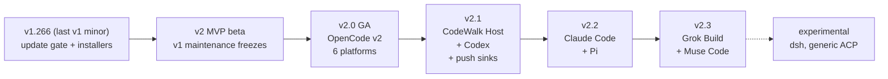
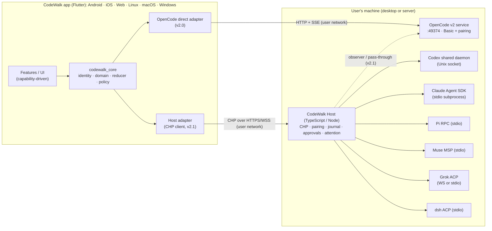
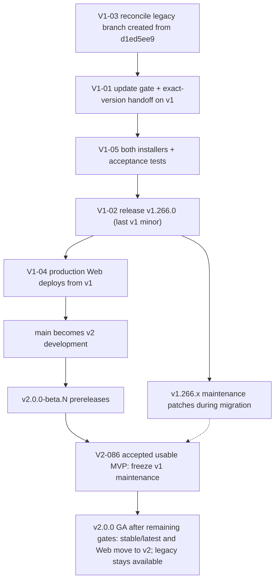

# CodeWalk v2 — Implementation Plan

> **Status:** Option A confirmed; the one-unit execution contract is in §§11.5 and 20. On 2026-10-03, `main` was at `8280ea80`, retaining the legacy reference tree; local `v1` was at `cb582cf9`, descending from its creation point `d1ed5ee9`. Reconcile live refs, Issues and publication evidence before acting; these snapshots are not checkout instructions or completion claims.
> **Inventory baseline:** repository revision `14fbf519`, CodeWalk `1.265.0+1790827338`. Legacy maintenance has since advanced; do not infer the current release or branch state from this inventory baseline.
> **Evidence snapshot:** 2026-10-02; Codex server/transport facts rechecked on 2026-10-03 against CLI/source 0.160.0 (§3.3). Upstream projects change weekly; every pinned fact below must be re-checked by the spike that owns it before code depends on it.
> **Inputs:** the research pack in `plan/` (dossiers `00`–`31` plus raw evidence folders), the historical decision round `plan/02-decisions.md`, sixteen original planner reports in `plan/helper-plans/`, and a subsequent twelve-helper readiness assessment reconciled against local evidence. Current decisions are in §2, not in the historical answers or helper proposals.
> **Language:** English (decision D12). The product discussion happened in Portuguese; decisions are recorded here in English with their intent.

---

## Table of contents

0. [How to use this document](#0-how-to-use-this-document)
1. [Executive summary](#1-executive-summary)
2. [Decision record (D01–D16)](#2-decision-record-d01d16)
3. [Verified facts that shape the design](#3-verified-facts-that-shape-the-design)
4. [Non-negotiable invariants](#4-non-negotiable-invariants)
5. [Intended product behavior](#5-intended-product-behavior)
6. [Architecture](#6-architecture)
7. [Harness capability matrix](#7-harness-capability-matrix)
8. [Rewrite, reuse, discard](#8-rewrite-reuse-discard)
9. [Transition: legacy, versions, data, branches](#9-transition-legacy-versions-data-branches)
10. [Documentation and ADR plan](#10-documentation-and-adr-plan)
11. [Delivery plan: release train, gates, spikes](#11-delivery-plan-release-train-gates-spikes)
12. [Work breakdown: GitHub milestones and issues](#12-work-breakdown-github-milestones-and-issues)
13. [Testing and validation](#13-testing-and-validation)
14. [Risks and mitigations](#14-risks-and-mitigations)
15. [Assumptions, open questions, prerequisites](#15-assumptions-open-questions-prerequisites)
16. [Out of scope and deferred](#16-out-of-scope-and-deferred)
17. [Changing this plan](#17-changing-this-plan)
18. [Glossary](#18-glossary)
19. [Evidence index](#19-evidence-index)
20. [Execution start](#20-execution-start)

---

## 0. How to use this document

**Purpose.** This is the single source of intent for CodeWalk v2. Implementation details will change as spikes and real code produce evidence. To make that safe, every important rule states **why** it exists. When a detail must change, keep the intent, change the detail, and record the change (§17).

**Authority and live state.** Applicable project rules govern execution; §2 and §17 govern current product intent. Pinned official contracts and the owning spike govern upstream facts. `plan/02-decisions.md`, original helper reports and older summaries are historical inputs, not newer decisions. GitHub Issues are the canonical task tracker. This document defines scope, dependencies and acceptance; its checklist does not replace live Issue state. The orchestrator's Task Memory is its recovery mechanism, not another backlog.

**Execution boundary.** Select one dependency-ready, bounded Issue or child Issue under §11.5. Planning estimates are not execution units. A plan item that mentions a commit, push, installer, release or deploy does not itself authorize that action; follow the authorization already granted for the active task and applicable project rules. Technical choices that preserve decisions and invariants belong to the orchestrator; consequential changes follow §17.

**Normative words.**

- **MUST** — an invariant. Changing it requires updating this plan and, where an ADR exists, the ADR flow.
- **SHOULD** — the default. Deviating requires a short written reason in the issue or PR.
- **MAY** — an allowed option.

**Evidence tags.**

- **[V]** verified in pinned upstream source, official documentation, or this repository.
- **[H]** reported by one or more planner reports and not independently re-verified.
- **[I]** inference from verified facts.
- **[U]** unverified; the named spike owns the verification and the fallback.

**Identifiers.** Decisions `D01`–`D16`; release gates `G1`–`G5`; spikes `SP-01`…; work items `V1-xx`, `V2-xxx`, `V21-xxx`, `V22-xxx`, `V23-xxx`, `BL-xx` (backlog). Child IDs append a stable letter, such as `V2-005A`. Section 12 maps these IDs to GitHub Issues; retain parent IDs when splitting work.

**Reading order for a new contributor.** §1 → §2 → §4 → §6.2 (patterns) → the work item you are taking in §12 → the sections it references.

---

## 1. Executive summary

CodeWalk v2 is a rewrite of the client on a new skeleton inside this repository. It speaks **OpenCode v2 only**; OpenCode v1 support stays with legacy CodeWalk v1. It is designed **from day one** to host several coding harnesses, even though only OpenCode ships in v2.0.

The seven key outcomes:

1. **OpenCode v2, direct.** The app connects straight to the official OpenCode v2 service (`/api/*`, pairing, one live event stream). No extra software is required for OpenCode users in v2.0.
2. **Multi-harness by design.** Ports and adapters, a canonical event model, and capability descriptors exist from the first commit. OpenCode is simply the first adapter. Five release gates (G1–G5) prevent the code from becoming "OpenCode-shaped" again, which is what happened to v1.
3. **Hybrid topology (D01).** OpenCode connects directly; Codex, Claude Code, Pi, Muse, Grok, and dsh are reached through the **CodeWalk Host**, a small TypeScript/Node service on the user's machine. Codex already has a native authenticated app-server; the host remains the chosen integration route for protocol translation, continuous approvals, attention, and push. The host translates every native protocol into **one** CodeWalk protocol. Additional direct adapters require the rule in §6.12 and a separate architecture decision. The path toward "everything through the host" stays open.
4. **Release train (D02).** v2.0 OpenCode → v2.1 Host + Codex → v2.2 Claude Code + Pi → v2.3 Grok Build + Muse Code. DeepSeek Harness (`dsh`) remains experimental.
5. **"Allow all" stays ON by default (D05)** for every session, as in v1. Underneath, it approves each request **once**, like the official OpenCode clients, so agent restrictions and the user's deny rules keep working and no permanent rules are written. Users can switch a session to another mode when the harness supports it.
6. **Transition (D04).** Same application ID. The last planned v1 minor includes the update warning, user choice, and channel-aware desktop installers. v1 patches continue during migration; v1 maintenance freezes when the product owner accepts a usable v2 MVP. Promoting v2 to stable is a separate GA milestone. Legacy v1 remains available.
7. **Honest capabilities.** What a harness cannot do is hidden or disabled with a reason. CodeWalk never emulates missing upstream features with hidden sessions, shell scripts, or credential scraping (v1 did all three).



---

## 2. Decision record (D01–D16)

Each decision lists what was decided, why, what was rejected, and when to revisit it. "Product owner" refers to the user who answered the decision round.

| ID | Topic | Final decision (short) | Who decided |
|---|---|---|---|
| D01 | Connection architecture | Hybrid: OpenCode direct; CodeWalk Host translates all other harnesses; direct adapters allowed for future harness servers; path to universal gateway preserved | Product owner (option A + clauses) |
| D02 | Release phases | v2.0 OpenCode only, with gates G1–G5; v2.1 Host + Codex; v2.2 Claude + Pi; v2.3 Grok + Muse; dsh experimental | Product owner ("A with gates") |
| D03 | Rewrite strategy | New skeleton in this repo; legacy `v1` branch now; `main` retains v1 reference code until validated replacement/cutover; selective reuse | Product owner (option A); initial main contents delegated to orchestrator |
| D04 | App identity and legacy | Same app ID; last v1 minor with update warning and user choice; patches until accepted v2 MVP, then freeze; legacy stays downloadable | Product owner (option C; MVP-freeze refinement) |
| D05 | Allow-all | ON by default for all sessions; automatic one-time approval; switchable modes per harness capability | Product owner (refined) |
| D06 | Quotas and usage | Native signals first; experimental opt-in vendor usage connectors run only on the host | Product owner (baseline kept, narrowed) |
| D07 | Notifications | v2.0 local while connected + one Android monitor; v2.1 host attention inbox + user-chosen push sinks + Web Push; no CodeWalk-operated push | Delegated → orchestrator |
| D08 | Networking | User-managed LAN, VPN/Tailscale, TLS reverse proxy, SSH tunnel; no CodeWalk relay | Product owner (baseline kept) |
| D09 | Platforms | Android, Linux, macOS, Windows, Web, iOS, with explicit capability tiers | Product owner (baseline kept) |
| D10 | Managed OpenCode install | Desktop downloads the official v2 binary, verifies SHA-256, uses `opencode service` (port 49374, password, pairing) | Product owner (baseline kept, refined) |
| D11 | Host/harness installs | Desktop installs and updates through official channels, with explicit consent; mobile and Web connect only | Product owner (baseline kept, refined) |
| D12 | Plan language | English | Product owner |
| D13 | External sessions | Essential; capability-specific levels (live shared vs. history resume) | Product owner (baseline kept, qualified) |
| D14 | Unified session list | One list by host/project with harness badges; unsupported controls hidden or disabled with a reason | Product owner (baseline kept) |
| D15 | Host runtime | TypeScript on a pinned Node.js LTS (≥ 22.19), bundled with the desktop host | Delegated → orchestrator |
| D16 | Planning process | Process-only; 16 helpers, full plans preserved in `plan/helper-plans/` | Product owner |

### D01 — Connection architecture: hybrid with a translating host

**Decision.** The app has exactly two kinds of adapters in the first releases:

1. **OpenCode direct adapter** — speaks the official OpenCode v2 HTTP/SSE contract.
2. **Host adapter** — speaks the CodeWalk Host Protocol (CHP, §6.11) to a CodeWalk Host, which internally drives Codex, Claude Code, Pi, Muse, Grok, and dsh through their native official surfaces.

**Why.**

- OpenCode v2 already ships an authenticated, shared, network-reachable service [V]. Forcing it through another process adds installation burden for every OpenCode user and delays v2.0.
- Native integration surfaces differ: Codex has an authenticated WebSocket app-server, while its default shared daemon listens on an owner-only Unix socket; Claude Code's rich surface is an in-process SDK; Pi, Muse, and dsh speak stdio [V]. Codex goes through the host by architectural choice, not because it lacks a server: the host reaches the shared daemon, translates its protocol, and provides the same continuous approval/attention pipeline as the other harnesses. A dedicated Codex listener is a distinct topology (§3.3), not an automatic attachment to existing daemon sessions.
- The host must **understand** these protocols anyway — to answer approvals while the phone sleeps (D05) and to raise attention items (D07). Translating once in the host avoids parsing every protocol twice (TypeScript and Dart).
- Codex's protocol changes almost weekly; Claude's SDK ships near-daily [V]. A fix in the host ships through npm; a fix in the app needs app-store review (iOS can take days).
- The app keeps two adapters instead of seven.

**Clauses added by the product owner.**

1. **Future direct adapters.** "Other harnesses may get their own servers or daemons in the future." Any harness that later ships an official, authenticated, multi-client network server MAY get a direct adapter in the app, under the rule in §6.12. The host MAY also connect to such a server.
2. **Universal-gateway path preserved.** Because the host already speaks CHP, it can later also pass OpenCode through (the v2.1 OpenCode observer is the first step). Moving to "everything through the host" MUST remain possible without rewriting the app.

**Alternatives rejected.**

- *Universal gateway* (one planner): one client protocol and uniform 24/7 approvals and notifications, but every OpenCode user would have to install the host already in v2.0, including on remote servers, and v2.0 would wait for the host. Kept as a future option, not the starting point.
- *Byte-pipe host* (app translates all seven protocols): every protocol change would require an app release, and the host would still need to parse protocols for approvals and attention.

**Revisit if** host adoption after v2.1 is close to universal and maintaining two connection paths costs more than it saves, or if OpenCode adds capabilities that only a host can deliver.

### D02 — Release phases: v2.0 OpenCode only, with five gates

**Decision.** v2.0 = complete OpenCode v2 client on all six platforms (iOS subject to prerequisites, §15). v2.1 = CodeWalk Host + Codex (+ OpenCode observer and push sinks). v2.2 = Claude Code + Pi. v2.3 = Grok Build + Muse Code. dsh stays experimental.

**Why.**

- The v1 updater will offer v2 to every v1 user (§3.2). v2.0 therefore must be a complete OpenCode client; half a multi-harness client is worse than a whole OpenCode client.
- OpenCode v2 is already the default OpenCode installation; its users currently have no working CodeWalk.
- The host is the riskiest component (packaging a Node runtime for Linux/macOS/Windows on x64 and ARM64, pairing, security). Separating it from the OpenCode migration prevents one risk from delaying the other.
- Codex goes first among host harnesses because its shared daemon already provides files, search, terminals, rate limits, and live multi-client sessions; it exercises the host with the fewest host-provided gap services. Claude Code needs the host to provide file listing, search, git and terminals, plus a policy gate, so it follows. Pi pairs naturally with Claude (both are host-spawned stdio processes needing the same gap services). Grok and Muse are younger and extension-heavy. dsh cannot replay history through its public surface.

**The product owner's concern and the answer.** Shipping OpenCode first must **not** produce an OpenCode-shaped design that causes rework and bugs when the next harness arrives. Gates G1–G5 (§11.2) make that a release blocker: real Codex and Claude recordings MUST fit the canonical model without schema changes before v2.0 ships, a fake harness with different capabilities MUST run on the same screens, and CI MUST reject UI code that knows which harness it is talking to.

**Rejected.** v2.0 with Codex (+2–3 engineering weeks before the first release, host becomes a launch prerequisite); v2.0 with Codex and Claude previews (more delay and policy risk).

**Revisit if** spikes SP-02/SP-03 show Codex or Claude are much cheaper than expected, or user demand for Claude Code is urgent.

### D03 — New skeleton, same repository

**Decision.** Build v2 on a new skeleton in this repository. Preserve v1 on a `v1` maintenance branch. Reuse leaf widgets and services selectively (§8).

**Why.** v1's `ChatProvider` (~22.8k lines in ~30 `part` files) and `ChatPage` (~27.5k lines in ~30 files) embed OpenCode v1 wire types and recovery heuristics; 26 presentation files call Dio directly; presentation is ~83% of ~158k lines [V `plan/00`]. Incremental migration would drag 25 v1-only workarounds into a protocol that no longer needs them.

**Refinements (option A confirmed).** The legacy `v1` branch was created from `d1ed5ee9` (CodeWalk 1.265.0 plus planning); implement the transition minor and later maintenance patches on that line. Verify ancestry rather than requiring its live tip to equal the creation point. Do not recreate or rewind an advanced branch, including from the future transition tag. Keep the v1 source/tests/tooling in `main` as a temporary reference for selective porting, not as a commitment to incremental migration or dual-runtime support. Separate production Web from `main` before publishing the v2 rewrite (§9.5); the assessed `web-pages.yml` deploys on every push to `main` [V].

### D04 — Same app ID; last v1 minor asks the user

**Decision (option C, product owner).** Keep `com.verseles.codewalk`. Publish the last planned v1 minor whose updater, when it finds CodeWalk 2, shows a **clear warning that the next version changes everything** (it requires OpenCode 2 servers; v1 servers stop working) and lets the user choose: update now, stay on CodeWalk 1, or decide later. Both desktop installers honor that choice. Continue v1 maintenance patches during migration, then freeze v1 when the product owner accepts a usable v2 MVP (§9.6). Legacy v1 remains downloadable; MVP acceptance does not promote v2 to stable.

**Why.** Users must not be silently moved into an app that cannot talk to their servers. The product owner prefers giving the user an explicit, informed choice over creating a second app identity.

**Consequences that MUST be handled** (§9):

- Users who never install the transition minor before v2.0 ships will still be offered v2 by the older updater, which picks the GitHub `releases/latest` APK [V]. Mitigations: ship the transition minor early (before v2.0 betas); start the v2.0.0 release notes and announcement with the OpenCode 2 requirement; v2 detects v1 servers and links the legacy build.
- v1 and v2 cannot coexist on one Android device (same ID).
- Android build codes are epoch-based with a branch-local floor [V `Makefile:10,21–25`]. Verify increasing codes across **both** release lines, including concurrent builds; a branch-local floor alone is not a global ordering guarantee. A later-built, higher-code legacy APK can be a rollback path if v1 data is intact, but a frozen v1 APK is not guaranteed to install over a newer beta or GA build. Do not promise one-tap APK rollback after the freeze or create routine v1 rebuilds just to keep that promise.

**Rejected.** A separate legacy app ID (`com.verseles.codewalk.legacy`, would allow coexistence but adds an identity and starts the legacy app empty); same ID without any warning.

### D05 — "Allow all" ON by default, implemented as one-time automatic approval

**Decision (product owner).** The existing "Allow all" toggle stays and stays **ON by default**, for **all sessions**, including sessions started in a terminal. Users can switch a session to any other mode the harness supports. Questions and forms are never answered automatically.

**Mechanism.** "Allow all" answers each permission request **once**, automatically — the same mechanism the official OpenCode TUI and web app use for their auto-accept mode [V `plan/12` §7.5]. Additional modes:

| Mode | Meaning | Availability |
|---|---|---|
| **Ask** | Every request is shown to the user. | All harnesses with approvals |
| **Allow all** (default) | CodeWalk approves each request once, automatically. Includes `.env` reads and access outside the project. | All harnesses with approvals |
| **Unrestricted** | The harness's own bypass (OpenCode session wildcard rule, Codex `never` + full access, Claude `bypassPermissions`). Overrides agent restrictions. Explicit, per session, with a warning. | Where the harness offers it |
| **Native modes** | Harness-specific modes such as Claude "accept edits" or "plan", Codex sandbox levels. | Where offered |

**Why "once" instead of the server-side wildcard the product owner first chose.** In OpenCode v2, session rules are evaluated after agent rules and the last match wins, so a session-level `*:*:allow` **overrides agent deny rules** (for example, the read-only `plan` agent becomes able to edit) and is **inherited by child sessions** [V `permission.ts` via `plan/12` §7.2, §7.5]. Replying "once" preserves those protections, writes no permanent rules (v1's `always` reply would, in v2, persist approvals project-wide for every session [V]), and behaves the same across harnesses. The wildcard remains available as the explicit **Unrestricted** mode.

**Why it applies to terminal sessions too.** The product owner's reasoning: "Allow all" is about authorization; what a harness asks for, and what it shows (for example, files hidden by `.gitignore`), is the harness's decision. CodeWalk authorizes. Users who want different behavior switch that session's mode.

**Known limitation and its fix.** Without the host, automatic approval happens only while a CodeWalk client is connected (foreground app or the Android monitor). From v2.1, the host's OpenCode observer answers 24/7 and becomes the only automatic responder (§6.11.6).

### D06 — Quotas and usage

**Decision.** Use native usage signals first. Experimental, opt-in vendor usage connectors run **only on the host**, never in the app, never via hidden shell sessions, and never by reading or forwarding provider credentials (no Claude OAuth tokens, no `auth.json` scraping, no token refresh write-back).

**Why.** v1's quota probe ran JavaScript through hidden shell sessions and refreshed tokens in host files [V `plan/00` §2.10, ADR-029]. That is fragile and, for Anthropic, contrary to published policy [V `plan/21` §6].

**Consequence.** OpenCode exposes tokens, cost, and context limits but no remaining-quota API [V]. In v2.0 (no host), provider quota bars for OpenCode disappear; limit errors still show the provider's window name and reset time when present. The connector framework arrives with the host in v2.1 (`V21-011`).

### D07 — Notifications and background delivery (delegated; decided)

**Decision.**

- **v2.0:** local notifications while a client is connected (all platforms); one opt-in Android monitor that holds the single event stream while tracked work is running, plus a sparse catch-up check; iOS and Web are foreground-only.
- **v2.1:** the host keeps a durable **attention inbox** and delivers through user-chosen sinks — ntfy, UnifiedPush, generic webhook — and **Web Push** (VAPID keys generated by the host).
- **Not planned:** a CodeWalk-operated push service. Native iOS notifications while the app is closed would require an APNs sender holding the publisher's credentials, which conflicts with D08. iOS users can use the ntfy app or an installed Web app (Web Push) [H: WebKit documents Web Push for Home Screen web apps; verify in spike].

**Why.** No harness offers a push API usable by third parties. Detection (host) and delivery (device) are separate problems; v1's three overlapping Android detectors (in-app SSE, foreground service, WorkManager plus probe) show the cost of mixing them [V `plan/00`].

### D08 — Networking

**Decision.** Users connect over their own network: LAN, VPN/Tailscale, TLS reverse proxy, or SSH tunnel. CodeWalk operates no relay. The host binds to loopback by default; remote exposure is an explicit user action.

**Why.** Keeps session content off CodeWalk infrastructure and matches the official guidance of OpenCode and Codex [V].

### D09 — Platforms

**Decision.** Android, Linux, macOS, Windows, Web, and iOS stay in scope, with explicit capability tiers (§5.1). iOS is new work (there is no `ios/` directory today [V]) and its distribution depends on an Apple Developer account (§15).

### D10 — Managed OpenCode installation (desktop)

**Decision.** The desktop app downloads the official OpenCode v2 binary for the platform from the official update metadata, verifies its SHA-256 and size, runs it as the shared `opencode service` (default port 49374, password, pairing), and pairs locally.

**Refinements (adopted).**

1. **Adopt before install.** If a compatible v2 service is already running (registration file `~/.local/state/opencode/service.json` holds `{id, version, url, pid, password}` [V `plan/13`]), use it. Never stop or replace a service the user started.
2. **v1 present → stop and ask.** The v2 installer writes to the same `~/.opencode/bin` path as v1 and migrates the shared history database [V `plan/10`, `plan/11` §E]. Explain this, offer a backup, and require explicit confirmation.
3. **Fresh install uses the official layout,** so the user's terminal `opencode` and the service run the same binary and `opencode upgrade` keeps working.
4. **Pin a tested version window** (for example, minimum 2.0.20, tested 2.0.21–2.0.22). Never auto-upgrade past it; show "update available" from OpenCode's own update event.
5. **Select artifacts from metadata, not from GitHub "latest"** (GitHub's latest release is still a v1 build [H]). Windows ARM64 artifacts exist in the metadata even though the curl installer rejects that target [V].
6. **Reconfiguring the service restarts it** (hostname, CORS); warn first, because running turns are interrupted (the managed service resumes them) [V `plan/12` §5].

**Why.** These refinements keep the official installation path while preventing data loss and silent replacement of the user's tools.

### D11 — Host and harness installation (desktop)

**Decision.** The desktop app installs and updates the CodeWalk Host and supported harnesses through official channels, always with explicit consent, showing the exact source and version. Harnesses that self-update (Codex daemon, Claude Code, OpenCode) keep their own updaters; CodeWalk shows compatibility and offers to run the official update command. Updates never interrupt a running turn. Mobile and Web never install anything; they show copyable setup instructions and a pairing QR.

**Why.** Several official installers are `curl | sh` or `irm | iex`; running them silently from an app is a supply-chain and consent problem. Claude's policy requires the user to log in through Anthropic's own flow on the host [V].

### D12 — English plan

This document is in English. The app keeps its 14 locales.

### D13 — External sessions (essential), with honest levels

**Decision.** Listing and continuing sessions started outside CodeWalk is essential, but "continue" means different things per harness, and the UI MUST say which:

| Harness | Discover | Continue | Live attach to a running terminal session |
|---|---|---|---|
| OpenCode | Shared service lists all sessions | Yes, natively | **Yes** — by default every local OpenCode client, including the TUI, uses one shared per-user service [V docs] |
| Codex | `thread/list` on the shared daemon | `thread/resume` | **Yes** — via the shared daemon; pending approvals are replayed on rejoin [V] |
| Claude Code | SDK `listSessions` (local history) | SDK resume / fork | **No** — history resume only; never spoof the TUI identity [V] |
| Pi | SDK session manager (host) | `switch_session` / fork | **No** — history resume only |
| Muse | `session/list` | `session/resume` (writer lease) | Lease-dependent; `sessionInUse` blocks [V] |
| Grok | `session/list` + extensions | `session/load` | Only when both clients use the same `serve`/leader [H] |
| dsh | Root sessions only | Resume without transcript replay | **No** |

Unsafe concurrent writing (two writers on one Claude or Pi transcript) MUST be prevented: when CodeWalk cannot establish that a session is idle, it offers "read history" and "fork" instead of "continue".

### D14 — Unified session list

**Decision.** One list grouped by host and project, with a text harness badge (no vendor logos, for trademark caution) and an ownership label. Creation asks for the harness only when more than one is available. Every control is driven by capabilities (§6.7).

### D15 — Host runtime (delegated; decided)

**Decision.** TypeScript on a **pinned Node.js LTS ≥ 22.19** (Pi's SDK requirement), bundled with the desktop host package so users never manage Node themselves. Published also as an npm package for headless hosts. Bun or Node single-executable packaging is evaluated in the packaging spike (`V21-001`), not assumed.

**Why.** The richest official integration surfaces are TypeScript: Claude Agent SDK, Muse SDK, Pi `RpcClient`, the ACP SDK; Codex publishes generated TypeScript types [V]. Dart AOT, Go, or Rust would require re-implementing these control protocols or running a Node sidecar anyway. Sixteen of sixteen planners reached the same conclusion; the reasons above, not the count, decide it.

### D16 — Planning process

Sixteen helpers produced independent plans (full texts in `plan/helper-plans/`). Their findings were verified before adoption (§3). Process-only; no product consequence.

---

## 3. Verified facts that shape the design

### 3.1 OpenCode v2 contract (pins: source v2.0.21 `8a8bd622`; npm 2.0.22 `05018b88`)

| # | Fact | Consequence | Source |
|---|---|---|---|
| 1 | All routes are under `/api/*`. Unknown paths return the web app's HTML with status 200. | Detect v2 only with authenticated `GET /api/info` (validate JSON + version). A JSON `/global/health` means v1. | [V `plan/11` §1.1] |
| 2 | Authentication is always on: HTTP Basic, user `opencode`, password = service password or a pairing token. Pairing codes are single-use, expire in 5 minutes; redeemed tokens last 30 days; rotating the password revokes all tokens. | Pairing is the mobile onboarding. Store tokens in secure storage; show "pair again" on 401. | [V `plan/11` §1.2; `auth.ts`, `pairing.ts`] |
| 3 | One shared per-user service, default port 49374; every local client, including the TUI, discovers or starts it by default. | External OpenCode sessions are live-shared (D13). | [V `plan/10` docs-cli] |
| 4 | One global SSE stream `GET /api/event`: `data:` frames, comment heartbeats every 15 s, no replay, subscriber dropped when > 4,096 events behind, first event `server.connected`. | One stream per endpoint; buffer + hydrate on every reconnect; never assume continuity. | [V `plan/12` §1; `event-feed.ts`] |
| 5 | Streaming: `session.text/reasoning/tool.input.{started,delta,ended}`; deltas batched ~100 ms; `ended` carries authoritative content. | Deltas are provisional; `ended` replaces. | [V `plan/12` §4] |
| 6 | Execution state: `session.execution.{started,succeeded,failed,interrupted}`, `session.retry.scheduled`; `GET /api/session/active` lists executions owned by **this** process. `session.status` and `session.idle` are declared but have no publisher. | Never depend on `session.status`. `interrupted{reason: shutdown}` is not "idle": the managed service may resume it. | [V `plan/12` §5; `plan/11`] |
| 7 | `POST /api/session/{id}/prompt {id?, text, files, agents, skills, metadata, delivery: steer\|queue, resume}` returns the durable inbox item. The `id` (`msg_…`) is the idempotency key: re-posting the same id returns the existing admission; a conflicting payload returns 409. | Client-minted ids replace v1's content matching; retries with the same id are safe. A secondary source (Paseo) advises against client ids → SP-01 confirms. | [V `session.ts:392–410`; `plan/11` §A7] [U SP-01] |
| 8 | Model and agent are **session** selections (`POST …/model`, `POST …/agent`); the variant lives on the model reference. | Apply selection before sending; show changes as timeline rows. | [V `plan/11`] |
| 9 | Permissions: rules `{action, resource, effect}`; agent rules then session rules; last match wins; built-in defaults `*:*:allow`, `external_directory:*:ask`, `read:*.env:ask`. Replies `once \| always \| reject` (+ optional message). `always` persists project-wide approvals. `reject` rejects the other pending requests of the same session **with or without a note**; a note lets the model continue, while no note ends the step. Child sessions ask with their own session id. | D05 mechanism; explain rejection's batch scope and surface child requests in the parent. | [V `plan/12` §7; `core/permission.ts:276–295`] |
| 10 | Questions are **forms** (`form.created/replied/cancelled`), typed fields, conditional visibility; dismissing without a message ends the step. | Generic form renderer; questions never auto-answered. | [V `plan/12` §8; `form.ts`] |
| 11 | Subagents: `subagent` tool, `background: true`, child sessions with `parentID`, synthetic parent message `{source: "subagent", childID, …}` that can wake the parent; `POST …/background` moves **all** blocking work of a session to the background; open bug #48826 reports nested background work complete too early. | Background Work tray; child state from the child's own events; never infer completion from the parent. | [V `plan/12` §11; `plan/10` §e] |
| 12 | Revert: `revert/stage` (409 while running; may apply file changes immediately when files are included), `DELETE …/revert` clears (redo), `revert/commit` (or automatic on the next prompt); needs git snapshots. | Preview before staging; label actions by effect. | [V `session.ts:531–564`; `plan/11`] |
| 13 | `PATCH /api/session/{id}` accepts only `title`, `metadata`, `permissions`. | No native archive; CodeWalk archive is a local "hide". | [V `session.ts:358–374`] |
| 14 | Files: list, find (name fuzzy), read. `POST /api/experimental/fs/write` writes a raw body to an absolute path or a path relative to the location — **"not confined to the location"**, experimental. Entry listings expose path/type, not symlink targets. No content or symbol search. | Lexical validation alone cannot prove physical containment. Saves require the flag **and** a containment mechanism verified by SP-01; otherwise write is unavailable. Rename/delete/new file wait for the host (v2.2). | [V `fs.ts:75–89`, `schema/filesystem.ts:18–20`] |
| 15 | Attachments: images PNG/JPEG/GIF/WebP (≤ 20 MiB); **PDF, AVIF, BMP, audio, video are not included in the model request**. | PDF attach disabled for OpenCode with an explanation ("export a page as an image"). | [V `docs-attachments.md:69–72`] |
| 16 | No todo tool or endpoint in v2; titles are native (`session.renamed`); no share; config writes only via `PATCH /api/experimental/config` for `shell`. | Drop todo panel, title generator, share, OpenCode defaults editor for OpenCode. | [V `plan/12`, `plan/11` §3] |
| 17 | No remaining-quota API; tokens and cost per step/session; model `limit.context`; typed provider errors (`provider.rate-limit`, `provider.quota` with body, `provider.auth`). | Usage vs quota separation (§5.9). | [V `plan/11` §D, `plan/12` §10] |
| 18 | `GET /api/credential` returns secret values to any authenticated client. | The app MUST never call it. | [V `plan/11` §1.7] |
| 19 | Location scoping: `location[directory]` or `x-opencode-directory`; `POST /api/session` takes `location.directory` in the body and otherwise falls back to the service's working directory (the user's home). | Always send `location.directory` on create. | [V `plan/11` §A6] |
| 20 | PTY uses a short-lived ticket on a WebSocket; persistent PTY is experimental. Experimental durable session log `GET /api/experimental/session/{id}/log?after=` with a `log.synced` watermark; durable sequence numbers are per aggregate and may have gaps. | Terminal via ticket; durable log optional behind a flag. | [V `plan/11` §A12, `plan/12` §1.4] |
| 21 | Distribution: npm `@opencode/cli`; official binaries via update metadata with per-target `{url, sha256, size}`; installer `curl -fsSL https://opencode.ai/v2/install \| bash` writes to `~/.opencode/bin` (same as v1) and rejects `windows-arm64` although the zip exists; Termux is unsupported. | D10 refinements. | [V `plan/10` §a, `docs-install-script.md:10,637`] |

### 3.2 Repository facts

| Fact | Consequence | Source |
|---|---|---|
| Updater reads GitHub `releases/latest`, takes the first `.apk`, and its `Semver` strips prerelease/build metadata before comparing. | v1 users are offered v2 automatically; v2 betas compare equal to finals. The transition minor (D04) and a new v2 updater fix both. | [V `lib/presentation/services/update_check_service.dart:5–23,156–190`] |
| Android build code = `date +%s + 2001` (minimum: previous + 1 on that line). | Keep the scheme, but verify global ordering across both lines; a frozen legacy APK may not install over a newer v2 build. | [V `Makefile:10,21–25`] |
| `release.yml` publishes every `v*` tag with `prerelease: false`. | Needs prerelease support for v2 betas and `make_latest: false` for legacy releases after v2 GA. | [V `.github/workflows/release.yml:276`] |
| `web-pages.yml` deploys `build/web` to Cloudflare Pages on push to `main` (`--branch=main`). | v2 development on `main` would replace production Web; split deployments first (§9.5). | [V `.github/workflows/web-pages.yml`] |
| macOS release build is sandboxed (`com.apple.security.app-sandbox = true`). | Managed installation and process supervision on macOS need a non-sandboxed, notarized distribution or a separately installed host. | [V `macos/Runner/Release.entitlements`] |
| ADRs run up to ADR-057; ADR-023 (OpenCode contract) spans `ADR.md:1103–1255`; EXC-001 (auto-approve) at line 1213. | New ADRs start at ADR-058. | [V `ADR.md`] |
| No `ios/` directory. | iOS is new work with signing prerequisites. | [V `plan/00` §1.1] |

### 3.3 Other harnesses (summary; details in §6.13 and §7)

- **Codex:** app-server v2 JSON-RPC with native stdio, Unix-socket, and WebSocket transports; shared per-machine daemon auto-started by the TUI since 0.157.0, owner-only Unix socket with WebSocket framing; `codex app-server proxy` bridges stdio to it. A separate `--listen ws://` process does not automatically join the default daemon's live sessions, but the TUI can explicitly connect to that listener via `codex --remote`. Daemon version can differ from the CLI's (0.160.0 vs 0.159.3 observed in the original capture) [V `plan/20`; server/transport clarification below].
- **Claude Code:** Agent SDK 0.3.287 / CLI 2.1.287; no third-party network daemon; `canUseTool` callback, permission modes (pass explicitly; the SDK default changed), AskUserQuestion, background tasks, file checkpoints (Write/Edit only), `rate_limit_event`; SDK sessions are hidden from the terminal `/resume` picker by default; users authenticate on the host; credentials must never be collected or forwarded [V `plan/21`].
- **Pi:** `pi --mode rpc` strict LF JSONL; one active session per process; no permission system by design; completion is `agent_settled`; session listing via the SDK `SessionManager`, not RPC [V `plan/22`].
- **Muse Code:** MSP v1 over `muse serve` stdio; server-minted approval choices with requirement guards, user input, todos/goals/subagents, 5-hour/weekly usage windows, `sessionInUse` leases, UUIDv7 command ids, 10 MiB frame cap; closed CLI, Developer Preview, redistribution unclear [V `plan/23`].
- **Grok Build:** ACP v1 + `x.ai/*` extensions over `grok agent serve --bind … --secret …` (WebSocket, no TLS) or stdio; state survives reconnects; rewind is conversation-only [V `plan/24`].
- **dsh:** thin ACP v1 stdio profile; resume without transcript replay; one prompt at a time; `never` approval policy means reject [V `plan/25`].
- **ACP:** v1 stable (schema 1.24.1); v2 draft; stdio is the only stable transport; official TypeScript SDK; community Dart packages exist but are not needed because ACP runs in the host [V `plan/30`].

#### Codex server/transport clarification (2026-10-03, CLI/source 0.160.0)

These are distinct official surfaces, confirmed by the installed CLI help and the pinned `rust-v0.160.0` source [V; links in §19]:

| Surface | Verified behavior | Consequence for CodeWalk |
|---|---|---|
| `codex app-server --listen …` | Conversation/thread/turn JSON-RPC over `stdio://`, `unix://[PATH]`, or `ws://IP:PORT`. WebSocket auth supports `capability-token` (token file or SHA-256 digest) and `signed-bearer-token` (HS256 JWT). Non-loopback binds require auth in 0.160.0. | Codex already has a native authenticated network server; the host can consume that official protocol. Native listener schemes do not include `wss://`; remote transport protection follows D08. |
| `codex app-server daemon` / `proxy` | Manage the shared local background server / bridge stdio to its Unix control socket. | Preferred host attachment for the user's existing daemon/TUI sessions; a new WebSocket listener is not the same running server. |
| `codex --remote` | The TUI accepts `ws://`, `wss://`, and Unix-socket endpoints plus `--remote-auth-token-env`. Official docs show the TUI connecting to a separately started app-server listener. | A TUI and another client can target the same dedicated listener. Live session sharing, approval resolution, and reconnect behavior for that setup still require SP-02 evidence [U]. |
| `codex remote-control` | First-party paired-device remote access through OpenAI's relay. | Not a third-party replacement for app-server; private relay integration remains out of scope (§16). |
| `codex exec-server` | Execution-environment service for commands and filesystem operations, distinct from the thread/turn protocol. | Not the conversation API to use for the Codex adapter. |

**Version-specific limits.** The 0.160.0 WebSocket listener rejects every request carrying an `Origin` header with HTTP 403, so browser clients cannot connect directly. Auth is checked at the WebSocket upgrade. Rolling documentation still describes unauthenticated non-loopback connections during rollout, but the pinned source requires auth; use the tested version's behavior. OpenAI documents the WebSocket transport as experimental and unsupported for production workloads [V].

**Architecture consequence (product owner, 2026-10-03).** Keep D01/D02: Codex ships through the CodeWalk Host in v2.1. These findings refine the host's upstream connection options and the SP-02 checks; they do not introduce a direct Codex adapter or change the release train. The host remains responsible for canonical protocol translation, approvals while clients sleep, attention/push delivery, and the app-facing browser-compatible transport.

### 3.4 Corrections to earlier summaries

1. OpenCode **has** an experimental file-write endpoint, and it is **not** confined to the project (the research index said "no write endpoint").
2. OpenCode **does not send PDFs** to the model (three planner reports said it depended on the model).
3. Windows ARM64 OpenCode artifacts **exist** (the index said they did not); only the curl installer rejects that target.
4. A legacy APK built after a v2 release **can** install over v2 (one report said it could not).
5. ADR-045 already exists; new ADRs start at ADR-058 (one report proposed "ADR-045").
6. Codex **has** a native authenticated WebSocket app-server. A dedicated listener does not automatically share the default daemon's live sessions, but the TUI can point to it with `--remote`; "no server" and "no possible TUI sharing" are both overstatements. The CodeWalk Host remains the chosen integration route (§3.3, D01).

---

## 4. Non-negotiable invariants

These MUST hold in every release. Each line says why.

1. **No wire types above the adapters.** Widgets and controllers consume domain types only. *Why:* v1's wire leakage is the root cause of its coupling.
2. **No harness-name branching in UI.** Screens ask capabilities ("supports undo?"), never identity ("is this OpenCode?"). Enforced by CI (gate G4). *Why:* new harnesses must not require UI edits for basic behavior.
3. **No hidden sessions, shell scripts, or fake agents to emulate missing features.** *Why:* v1 used them for titles, file writes, quotas, and selection sync; they were fragile and leaked state into the user's workspace.
4. **Never read, store, or forward provider credentials** (Claude OAuth, Codex auth files, OpenCode `GET /api/credential`). *Why:* policy (Anthropic forbids intermediating credentials) and security.
5. **Never send `always` automatically.** Automatic approval uses one-time replies. *Why:* in v2, `always` persists project-wide rules for all sessions.
6. **Never answer questions, forms, plan approvals, or interaction-required requests automatically**, in any mode. *Why:* they need human judgment, not authorization.
7. **Never match messages by content or time.** Correlate by native ids or client-minted idempotency keys. *Why:* identical prompts are legitimate; v1's matching caused duplicates.
8. **Never silently resend a mutation whose delivery is uncertain** unless the harness guarantees idempotency for that operation (OpenCode prompt ids do). *Why:* duplicate turns cost money and change code.
9. **Unknown events and items never crash a reducer and never become plain assistant text.** They render as a neutral "unsupported item" with diagnostics. *Why:* upstream adds event types weekly.
10. **The UI never claims a capability the harness does not provide** (no fake archive, fake undo, fake live attach, fake queue). *Why:* honesty prevents data loss and user confusion.
11. **Connection state and execution state are separate.** A disconnect never marks a turn as finished or failed. *Why:* the agent keeps running on the host.
12. **Every cache, draft, tab, and notification is keyed by the full session identity** (host + harness instance + native id). *Why:* native ids collide across hosts and harnesses.
13. **Host binds loopback by default; long-lived credentials never appear in URLs.** *Why:* the host can execute code on the user's machine.
14. **Any intentional divergence from an official upstream contract needs an ADR exception** (rationale, risk, rollback/flag, regression tests). *Why:* ADR-023's contract-first principle stays.

---

## 5. Intended product behavior

### 5.1 Platforms and tiers

| Capability | Android | Linux / macOS / Windows | Web | iOS |
|---|---|---|---|---|
| Connect to OpenCode (URL, QR, link, password) | Yes | Yes | Yes, HTTPS or localhost only; OpenCode CORS must allow the origin (`opencode service set cors <origin>`) | Yes; App Transport Security and Local Network permission to verify (SP-05) |
| Managed OpenCode install (D10) | No | Yes (macOS needs a non-sandboxed notarized build or a separate host, SP-06) | No | No |
| CodeWalk Host install (v2.1) | No | Yes | No | No |
| Connect to a CodeWalk Host (v2.1) | Yes | Yes | Yes (via host-issued WebSocket ticket) | Yes |
| Terminal (PTY) | Yes | Yes | If SP-04 passes | Yes |
| Background delivery | Opt-in monitor while work runs; sparse catch-up | Tray process while running | Tab only (v2.1: Web Push) | Foreground only (v2.1: ntfy app or Web Push via installed web app) |
| Embedded Tailscale | Yes (existing) | Linux/macOS yes; Windows no (existing) | No | Deferred |
| Voice (STT/TTS) | Existing engines | Existing engines | Browser speech only | Platform engine (verify plugins, SP-05) |
| Self-update | APK updater | Install scripts / updater | n/a | App Store / TestFlight |

### 5.2 Connecting

1. **Chooser.** "Connect to OpenCode" (scan QR, paste link, or URL + password) · "Set up on this computer" (desktop only) · from v2.1 "Add a CodeWalk Host".
2. **Pairing.** `opencode pair` (or the desktop app) shows a QR / link `…/auth/connect/<code>`. The app redeems it with `Accept: application/json`, stores the 30-day token in secure storage, and shows "Paired · expires in N days". A deep link `codewalk://pair?…` opens the flow. On 401: "Pairing expired — pair again". Self-renewal with the current token is [U SP-01]; fallback: warn 7 days before expiry.
3. **Compatibility check on every new endpoint.** v2 within the tested window → proceed. Newer than tested → proceed with an "untested version" chip. v1 → full-screen explainer: "This server runs OpenCode 1. CodeWalk 2 needs OpenCode 2." with two actions: server upgrade instructions and the legacy CodeWalk download. Unreachable → transport help (TLS, CORS, VPN).
4. **Managed setup (desktop).** Adopt existing v2 service → else install (D10) → `opencode service start` → read credentials through official commands/registration file (never scrape logs) → pair locally → "Use from my other devices" is a separate explicit step that changes the bind address and shows a pairing QR (warn: restarts the service).

### 5.3 Sessions and external ownership

- **Grouping:** host → project (canonical directory) → sessions; children nested under their parent; filters Active / Archived (local) / All; search uses the server where available.
- **Row content:** title (native), harness badge (text), activity (running, needs you, retrying, idle, unknown), unread (OpenCode: server `time.viewed` vs `time.idle` via `POST …/view`), background-work count, ownership label.
- **Ownership labels:** *Live shared* (OpenCode service, Codex daemon) · *Owned by this host* · *Saved history* · *Running elsewhere* · *Ownership unknown*.
- **Opening a session never starts a turn, changes its model, or stops another client.** It loads a bounded page and subscribes.
- **Actions** come from capabilities: *Open live*, *Continue*, *Read history*, *Fork from here*, *Hide in CodeWalk* (local archive), *Delete* (native; shows that children are deleted too).
- **Creating:** choose project (and harness when more than one is available), optional model/agent/effort. OpenCode `POST /api/session` always sends `location.directory`.

### 5.4 Permissions ("Allow all" and modes)

- **Global default:** "Allow all" ON (D05). New installs default ON. Migration preserves a v1 user's explicit OFF choice.
- **Per session:** a mode chip shows the **effective** mode; tapping shows the modes this harness supports (§2 D05 table) with one-line explanations. If the desired mode is unavailable (for example, Pi has no approvals), the chip says why ("Pi does not ask for approval").
- **Approval card** (Ask mode, or requests that are never automatic): action, resources, owning (child) session, diff preview when supplied, and only the choices the harness offers. OpenCode labels: **Allow once** · **Always for this project** (only when the request carries save patterns; shows them) · **Reject with note** (default reject; the model continues) · **Reject and stop** (ends the step). Both reject choices also reject the other pending requests of that same session; explain that batch scope and reconcile every resolved card, including child-origin cards.
- **Child requests** surface in the parent session with an origin badge, as the official web app does.
- **Multi-client:** first reply wins; a late reply that gets "not found / already resolved" dismisses the card silently ("answered elsewhere").
- **Unrestricted:** confirmation dialog explaining it overrides agent restrictions and is inherited by children; OFF removes only the rule CodeWalk added and warns if someone else changed the rules meanwhile (no compare-and-set exists [V]).

### 5.5 Chat lifecycle

- **Send (idle):** the bubble appears immediately with state *Sending*, becomes *Sent* when the server admits it (inbox item), *Delivered* when the turn picks it up. The draft is kept until admission.
- **Send while running:** split action **Steer** (default; delivered at the next step) / **Queue** (next turn). Queued items appear as chips above the composer with cancel and delivery-mode switch. For harnesses with one prompt at a time (dsh) the composer offers "Stop and send".
- **Stop:** interrupts the current turn only. The Background Work tray keeps showing work that continues. A separate "Stop all background work" exists where supported.
- **Uncertain delivery:** OpenCode retries automatically with the same id (idempotent). Other harnesses show "Delivery not confirmed" with **Check again** and **Send again (may duplicate)**.
- **Retries:** show attempt and countdown from the harness's retry event; never start a second retry from the client while the harness retries.
- **Errors:** typed cards (auth, quota, rate limit, context overflow, network, content filter, tool failure, version) with one recovery action each; user-initiated stops are not errors.
- **Disconnect:** banner with cause and "last synced" time; timeline marked stale; composer keeps the draft; sends wait in the outbox (admitted only after reconnect).
- **Turn end:** a compact outcome marker (succeeded / failed with error card / interrupted). "Server restarted, resuming" for OpenCode `interrupted{reason: shutdown}`.

### 5.6 Questions and forms

A form card (bottom sheet on phones when long) renders every field type the harness declares (string, number, integer, boolean, single/multi select, custom answers, external links, secret input), conditional visibility, required fields, and validation. Answers keep native keys and types (never comma-split free text). "Dismiss" explains whether it ends the step. Forms remain visible even when the composer or terminal panel is hidden. A form resolved elsewhere closes with "answered elsewhere".

### 5.7 Subagents and background work

- **Timeline card** for each delegation: agent, description, live state, elapsed time, last activity line; tap opens the child session with a "Back to parent" breadcrumb that restores the parent's scroll position.
- **Background Work tray** (header chip "2 running" → sheet on phones, side pane on wide screens): running children and background shells first, then recent; each row has Open and Stop (when supported); "Stop all background work" with its scope explained.
- **Completion:** the parent's synthetic completion message renders as a compact "Subagent finished → open" row (never hidden, never shown as a user bubble).
- **Honest completion:** a child's state comes from its own execution events and the active list, never from the parent's tool result. When OpenCode bug #48826 may apply (nested background work), the row says "may still be working" until the child is observed idle. "Response ready — background work continues" replaces a misleading "done".
- **Move to background:** offered only where supported; for OpenCode labeled "Move all running work to background" (session-wide, no per-child endpoint).
- **Child input:** the child's composer is enabled only when the harness accepts direct input to children (Codex may reject it).

### 5.8 Agent task lists and plans

Shown only when the harness provides structured data (Codex plan updates, Claude task/todo tools when enabled, Muse todos/goals, Grok plan). OpenCode v2 has none: no task panel for OpenCode sessions, and CodeWalk never parses prose into tasks.

### 5.9 Usage versus quota

Four separate concepts, each with source and freshness:

1. **Context** — current model-context occupancy (OpenCode: last step's total tokens vs the model's `limit.context`; estimates labeled).
2. **Tokens** — per turn/session, with cache and reasoning breakdown.
3. **Cost** — amount and currency; "estimate" when notional (Claude subscriptions); cumulative totals never summed twice (Claude's `total_cost_usd` is cumulative).
4. **Quota** — account windows/credits when the harness reports them (Codex rate limits, Claude `rate_limit_event`, Muse windows). OpenCode: only from structured limit errors (window name, reset time); otherwise "not exposed by OpenCode".

Unknown is shown as unavailable, never as zero. Quota never blocks sending.

### 5.10 Commands, skills, mentions, attachments

- **One palette** opened by `/`, with sections and source labels: CodeWalk actions (new session, switch, export…), harness commands, skills, extension commands. Commands the harness would reject (terminal-only) are hidden.
- **Skills** keep their native invocation (OpenCode `skills[]`, Codex `$name` + skill item, Claude `/name`, Pi `/skill:name`, Muse skill part); a listed skill is not necessarily an enabled one.
- **`@` mentions** insert typed tokens: file, agent, skill, resource. OpenCode receives structured file/agent attachments with mention ranges (an improvement over v1's plain text). Harnesses that only accept text paths get text, and the chip says so. Symbol search is removed.
- **Attachments:** picker, paste, drag-and-drop; gated per harness and model (MIME and size shown before upload). OpenCode: images only; PDF disabled with "convert a page to an image". Host harnesses (v2.1+) upload files to host storage and reference them natively. Phone-local paths are never sent as host paths.

### 5.11 Model, agent, variant, effort

Chips show the harness's own catalog and labels ("variant", "effort", "thinking"). No universal effort scale. For OpenCode, changes are session mutations applied and confirmed before the next send, shown as "model switched" rows; changes made by another client update the chips. The UI states when a change applies ("next turn", "next model call").

### 5.12 Files, terminal, undo

- **Files:** tree, quick open, viewer with highlighting, diff viewer (OpenCode `GET /api/session/{id}/diff?from&to` replaces v1's 25-call scan). OpenCode Save requires **Settings → Experimental → File writes** (default off) and a verified mechanism that keeps the resolved target inside the session directory, including symlinks/junctions and concurrent path changes. Rejecting `..` or an absolute path is only lexical protection; the phone cannot resolve remote symlinks. SP-01 owns proof of containment. If the official surface cannot establish it, keep `files.write` unavailable with an explanation even when the setting is ON; do not emulate it through hidden shell sessions. New/rename/delete files arrive with host workspace services (v2.2) or a future official endpoint.
- **Terminal:** OpenCode PTY via one-time ticket; reconnect resumes by cursor; leaving the terminal page asks before closing a connection-scoped terminal.
- **Undo, labeled by effect (never one generic "Undo"):**
  - OpenCode: **Revert to here** (preview first; conversation + files when requested) → banner **Restore** (clears the staged revert = redo) / **Apply** (commit; also automatic on the next prompt); disabled while running.
  - Claude (v2.2): **Rewind files to here** (dry-run preview; excludes shell and subagent edits) and **Branch conversation**.
  - Codex, Pi, Muse, Grok: **Branch from here** ("files unchanged").
  - No `git reset`/`checkout`-based undo, ever.

### 5.13 Notifications and attention

- One **attention model** feeds in-app badges, tabs, tray, local notifications, and (v2.1) push sinks.
- Categories: needs approval, question/form, error, finished (root sessions), background work needs attention. Child completion updates the tray quietly.
- Suppressed for the focused session; deduplicated by cause; a tap deep-links to the exact session and re-validates the request before enabling an approval button.
- Payloads carry no conversation content by default; titles only when the user opts in.
- Settings state the limits plainly ("iOS: alerts arrive only while CodeWalk is open, or through your notifier app").

### 5.14 App-local features kept

Drafts and input history, canned answers, tabs and MRU switcher, pins and recents, exports (Markdown/JSON), message image export and forwarding, themes (37 presets, dynamic color, contrast, density), 14 locales with RTL, accessibility (semantics, text scaling, keyboard navigation, reduced motion), voice input and read-aloud, desktop tray and window chrome, release history, sanitized logs, self-update. They are rebuilt on the new domain model and keyed by full session identity.

### 5.15 What changes for v1 users (release-note material)

- Servers must run OpenCode 2; v1 servers show an explainer and the legacy link.
- PDFs cannot be attached to OpenCode sessions (OpenCode does not send them to models).
- No share links; no OpenCode defaults editor; no todo panel for OpenCode; titles come from the server.
- Provider quota bars for OpenCode are gone until the host connectors (v2.1); limit errors still show reset times.
- File editor saves are experimental, off by default, and unavailable unless remote containment is verified; new/rename/delete files wait for v2.2.
- "Archive" becomes a local hide.
- Android overlay and Android Auto replies return in v2.1 on the new attention pipeline.
- Symbol search in `@` mentions is removed.
- Managed desktop install now uses the shared `opencode service` with password and pairing.

---

## 6. Architecture

### 6.1 Topology



- **v2.0** ships the left side plus the OpenCode direct adapter only.
- **v2.1** adds the host, its Codex adapter, the OpenCode observer, and the host adapter in the app.
- Every arrow crosses only the user's own network (D08).

### 6.2 Design patterns and why each exists

| Pattern | Where | Why it is here |
|---|---|---|
| **Ports and adapters (hexagonal)** | `HarnessAdapter`/`SessionHandle` ports in `codewalk_core`; OpenCode and Host adapters implement them | The UI and state never depend on a protocol. Adding a harness means adding an adapter, not editing screens. |
| **Anti-corruption layer per harness** | Inside each adapter (Dart for OpenCode; TypeScript in the host for the rest) | Upstream vocabularies (OpenCode parts, Codex items, Claude SDK messages, MSP revisions) stay at the edge; the domain keeps one vocabulary. |
| **Canonical event model + pure reducer** | `SessionEvent` union → `reduce(state, event) → (state, effects)` | Deterministic, replayable, property-testable state. Replaces v1's 22.8k-line mutable provider. Effects (refetch, rehydrate) run outside the reducer. |
| **Capability descriptors (data, not booleans or subclasses)** | `CapabilitySet` per host/session, refreshed on reconnect | The UI asks "what can this session do and with what semantics?"; differences such as "fork, files unchanged" are explicit. |
| **Optional facets** | `QueueFacet?`, `UndoFacet?`, `WorkspaceFacet?`… on the ports | A missing feature is a `null` facet (compile-visible), not a method that throws "unsupported". |
| **Command + receipt (outbox) with idempotency keys** | Every mutation carries a `CommandId`; receipts: accepted · rejected · duplicate · uncertain | Safe retries and honest "delivery not confirmed" states; no content matching. |
| **Explicit state machines** | Connection, execution, submission, interaction, work item, revert (§6.9) | Prevents v1's busy/idle heuristics and "stuck running" bugs. |
| **Strategy per harness** | Permission-mode mapping, file-write strategy, attachment encoding | The same user intent maps to each harness's native mechanism. |
| **Registry + compatibility table** | Adapter registry; `compat` table `{min, tested, knownBad}` per harness | Version drift becomes a visible "untested version" state instead of silent breakage. |
| **Open unions / forward-compatible enums** | All wire decoding | Unknown event types and enum values decode into `Unknown…` values instead of failing. |

**Deliberately not used:** a dynamic plugin runtime, a message broker, an ORM, pass-through "use case" classes per method, or a new state-management framework. *Why:* v1's problem was structure, not the `provider` package; extra frameworks add surface without solving it.

### 6.3 Repository layout

Dart 3.8 supports pub workspaces [V `pubspec.yaml` sdk ^3.8.1]. Packages enforce layering mechanically.

```text
pubspec.yaml                     # workspace root (app)
packages/
  codewalk_core/                 # pure Dart: identity, domain, events, reducer, capabilities, policy, errors
                                 #   MUST NOT import Flutter, dart:io, Dio, or any harness package
  codewalk_net/                  # transports: HTTP client, SSE parser (UTF-8 safe), WebSocket,
                                 #   auth decorators (Basic, pairing token, proxy auth, Tailscale)
  harness_opencode/              # OpenCode v2 wire DTOs, client, event decoder, projection, capabilities
  harness_host/                  # CHP DTOs + client + mapper (v2.1)
  xterm/  tailscale/             # moved from third_party/ (kept)
lib/                             # Flutter app
  app/                           # bootstrap, composition root (get_it only here), router (go_router), deep links
  features/                      # onboarding, hosts, sessions, chat, composer, interactions, work,
                                 #   files, terminal, usage, settings, voice, export, updater, migration
  platform/                      # android (monitor, overlay later), desktop (tray, window, managed install),
                                 #   web, ios, notifications, secure storage
  shared/                        # theme, markdown/math/mermaid rendering, widgets, l10n bridge
host/                            # CodeWalk Host (TypeScript), from v2.1
contracts/codewalk-host-v1/      # CHP JSON Schema + example frames (shared by host and app tests), from v2.0 (G5)
test/contract/fixtures/<harness>/<version>/   # recorded wire sessions + expected canonical output
tool/ci/                         # architecture/import rules, OpenAPI usage check, drift jobs
```

**Rules (CI-enforced, gate G4):** `codewalk_core` imports nothing platform- or protocol-specific; `package:dio` only in `codewalk_net`/`harness_*`; `features/` never imports `harness_*`; no `part of` files; no Dart file above 1,500 lines (exceptions need a recorded reason); no harness-name comparisons in `features/`; no `get_it` lookups inside widgets.

**Transitional enforcement scope.** `V2-020` establishes an explicit path manifest for the new `packages/codewalk_*`, `packages/harness_*`, `lib/app/`, `lib/features/`, `lib/platform/`, `lib/shared/` and temporary v2 entry point. G4 applies there from their first commit. Retained v1 reference paths are excluded temporarily, but new v2 code MUST NOT import them, directly or transitively; port a reusable leaf into a governed path with its tests instead. List generated and vendored files separately, with narrow reasons for any size-rule exclusion; never exclude authored v2 code wholesale. Remove the legacy exclusions at `V2-084`. CI must also discover tests in each new package and build the v2 entry point; passing the current root-only `make check` is not evidence that those packages or the v2 bootstrap were tested.

**State management:** keep `provider` with small `ChangeNotifier` controllers (one per open session, plus index, attention, usage, settings). Add `go_router` for routes and deep links (`codewalk://pair?…`, `codewalk://s/<host>/<session>`). Remove `dartz` (use a sealed `Result`). *Why:* minimal churn, explicit ownership, and v1 had no named routes or deep links.

### 6.4 Identity

```dart
extension type HostId(String value) {}            // CodeWalk-local UUID of a paired target:
                                                   // an OpenCode endpoint profile or a CodeWalk Host
extension type HarnessInstanceId(String value) {} // harness kind + installation/profile on that host
                                                   // (two CODEX_HOME folders are two instances)

final class SessionRef {                           // the ONLY key for caches, drafts, tabs, notifications
  const SessionRef(this.host, this.harness, this.nativeId);
  final HostId host;
  final HarnessInstanceId harness;
  final String nativeId;                           // ses_…, thread UUID, Claude session id, …
}

final class ProjectRef {
  const ProjectRef(this.host, this.canonicalDirectory, {this.upstreamProjectId});
  final HostId host;
  final String canonicalDirectory;                 // normalized with the HOST's rules (Windows case,
                                                   // UNC, separators); the phone never resolves symlinks
  final String? upstreamProjectId;
}
```

Rules: a URL is an alias, not an identity; a session that moves directories keeps its identity; fork lineage and parent/child lineage are separate fields; the same OpenCode service reached directly and through a host is linked only by explicit, verified aliasing (never by URL similarity); a copied host installation must not inherit the original's identity.

### 6.5 Canonical domain model (representative)

```dart
sealed class TimelineItem {
  ItemId get id; String? get turnId; ItemStatus get status; Provenance get source;
}
final class UserInput      extends TimelineItem { /* text, attachments, mentions, DeliveryState delivery, CommandId? commandId */ }
final class AssistantText  extends TimelineItem { /* text, complete, prefixMissing */ }
final class Reasoning      extends TimelineItem { /* text, complete (only what the harness exposes) */ }
final class ToolCall       extends TimelineItem { /* ToolKind kind, rawName, input, output, ToolDetail? detail, SessionRef? child */ }
final class ShellRun       extends TimelineItem { /* command, exitCode, OutputRef output */ }
final class Notice         extends TimelineItem { /* selection change, synthetic continuation, compaction, system */ }
final class TurnOutcome    extends TimelineItem { /* succeeded | failed(ErrorInfo) | interrupted(reason) */ }
final class UnknownItem    extends TimelineItem { /* rawType, fallbackText — rendered as a neutral chip */ }

enum ToolKind { shell, read, edit, write, search, fetch, webSearch, mcp, subagent, question, skill, other }

sealed class SessionEvent { EventMeta get meta; }   // meta: SessionRef, source cursor/seq, receivedAt, raw ref
// ItemUpserted(item) · ItemDelta(itemId, field, text) · ItemsRemoved(fromItemId)
// ExecutionChanged(ExecutionState) · RetryScheduled(attempt, at, ErrorInfo)
// PendingInputChanged(List<PendingInput>)   — steer/queue chips, level-set (replace, never merge)
// InteractionOpened(InteractionRequest) · InteractionResolved(id, by: self|elsewhere|policy|expired)
// WorkChanged(List<WorkItem>)               — background children and shells, level-set
// PlanChanged(PlanSnapshot) · UsageObserved(UsageObservation) · SelectionChanged(Selection)
// RevertChanged(RevertState) · SessionInfoChanged(SessionInfo) · ResyncRequired(reason) · UnknownEvent(raw)
```

**Reducer invariants.** Upserts are idempotent by stable id. A delta appends only to an open item of the current stream generation; a delta for a completed or unknown item is dropped. A completion (`ended`) replaces provisional content. A retry that reuses a message id starts a new generation. Level-set events replace collections. A snapshot never regresses state that newer events already established. The reducer returns effects (`Refetch`, `Rehydrate`, `Notify`) instead of performing I/O.

**Interactions.**

```dart
final class InteractionRequest {
  InteractionId id; SessionRef session; SessionRef? origin;  // origin = child session shown in a parent
  InteractionKind kind;            // permission | form | planApproval | elicitation | other
  String title; ToolDetail? subject; FormSpec? form;
  List<ApprovalChoice> choices;    // ordered, as offered by the harness; never invented
  bool autoApprovable;             // false for forms, plan approvals, interaction-required, unknown choice sets
}
final class ApprovalChoice { String id; String label; bool allows; Scope scope; bool acceptsNote; String? scopePreview; }
// Scope: once | session | persistentProject | persistentRule
```

**Usage and errors.**

```dart
final class UsageObservation {
  UsageScope scope;                // turn | session | sessionTree | account | model
  TokenBreakdown? tokens;          // input, output, reasoning, cacheRead, cacheWrite
  Cost? cost;                      // amount, currency, estimated, partial, cumulative
  ContextMeter? context;           // used, limit, measured | estimated
  List<QuotaWindow> windows;       // id, label, usedPercent (may exceed 100), resetsAt, source
  DateTime observedAt; UsageSource source; // native | hostConnector | estimate
}
final class ErrorInfo {
  ErrorKind kind;                  // auth | quota | rateLimit | contextOverflow | network | contentFilter
                                   // | permissionRejected | toolFailure | versionUnsupported | protocol | unknown
  bool retryable; DateTime? retryAt; String rawType; String rawMessage; ErrorAction? action;
}
```

### 6.6 Ports

```dart
abstract interface class HarnessAdapter {
  HarnessDescriptor get descriptor;                  // kind, version, stability, compat state
  Stream<ConnectionState> get connection;
  Future<CapabilitySet> capabilities({SessionRef? session});
  Future<Page<SessionSummary>> listSessions(SessionQuery query);
  Future<SessionHandle> open(SessionRef ref, OpenIntent intent);   // viewHistory | attachLive | continueInactive
  Future<SessionHandle> create(CreateSession request);              // commandId correlates; retry safety is operation-specific
  CatalogFacet get catalog;                          // models, agents, efforts, commands, skills
  WorkspaceFacet? get workspace;                     // files, search, terminal (null when absent)
}

abstract interface class SessionHandle {
  SessionRef get ref;
  Stream<SessionEvent> get events;
  Future<SessionSnapshot> snapshot({HistoryCursor? before, int limit = 50});
  Future<CommandReceipt> send(PromptDraft draft, {required CommandId id, Delivery? delivery});
  Future<CommandReceipt> interrupt(InterruptTarget target);         // turn | child | allBackground
  Future<CommandReceipt> respond(InteractionId id, InteractionResponse response);
  Future<CommandReceipt> select(SelectionChange change);            // model | agent | effort | permissionMode
  QueueFacet? get queue; UndoFacet? get undo; WorkFacet? get work; LifecycleFacet? get lifecycle;
  Future<void> detach();                             // stops observing; never stops the agent
}
```

An unavailable operation returns a typed `CapabilityUnavailable` **before** any mutation is sent; hiding the button is not the only enforcement.

**Retry contract by operation.** Record whether create, prompt, interrupt, interaction response, selection and workspace mutations have a verified same-command replay guarantee for the connected version. A command id alone does not confer idempotency. OpenCode's create input accepts a native session id, but the preserved protocol declaration does not establish replay/conflict semantics [V `protocol-groups/session.ts:220–235`]; SP-01 must test them separately from prompt admission. Preserve the original payload and correlation before a mutation. On uncertain delivery, replay only when that operation's guarantee has been demonstrated; otherwise reconcile from authoritative state and retain `uncertain` until resolved or the user deliberately resends. No automatic retry may create a second session or turn merely because prompt retries were safe.

### 6.7 Capability model

```dart
final class Capability {
  const Capability(this.support, {this.reason, this.semantics, this.constraints = const {}});
  final Support support;            // native | host | extension | experimental | unavailable | unknown
  final String? reason;             // shown on disabled controls
  final String? semantics;          // e.g. "conversation fork; files unchanged"
  final Map<String, Object> constraints; // e.g. {"maxBytes": 20971520, "mime": ["image/png", …]}
}
```

Capability names (grouped): `history.{list, read, resume, liveAttach, fork, archive, delete}`, `input.{steer, queue, cancelQueued, editQueued, images, documents}`, `approval.{interactive, allowAllOnce, unrestricted, nativeModes, sandboxSeparate}`, `forms`, `plan`, `work.{children, background, stopChild, moveToBackground, childInput}`, `undo.{conversation, files, redo}` (with mechanism stage | fork | rewindFiles | truncate), `files.{list, read, find, grep, write}` (stable | experimental), `terminal.{pty, persistent, userShell}`, `catalog.{models, agents, effort, commands, skills, mentions}`, `usage.{tokens, cost, context, quota}`.

**Effective capability** = intersection of: adapter support for the connected version; negotiated server features (OpenCode `/api/info` + route presence, Codex `initialize`, Claude `system/init`, Muse granted capabilities + schema fingerprint, ACP `agentCapabilities`); session ownership and state; selected model's modalities; administrator restrictions; client platform. **Unknown means unavailable** until verified; capabilities are never discovered by trying a mutation. A `method not found` or "requires experimental API" reply downgrades the capability and records a diagnostic.

### 6.8 Event envelope, ordering, reconciliation

```text
EventEnvelope {
  schemaVersion: 1
  stream:  { id, epoch, seq }        // CodeWalk ordering (host journal or client adapter) — NOT upstream causality
  session?: SessionRef
  source:  { harness, version, nativeType, nativeEventId?, nativeCursor?, aggregateId?, aggregateSeq?, durable }
  receivedAt
  event:   DomainEvent
  rawRef?                            // bounded, redacted diagnostic capture; disabled by default
}
```

- Sequence numbers travel as strings in JSON (64-bit precision on Dart Web and JavaScript).
- Upstream cursors stay opaque. OpenCode durable sequences are per aggregate and may skip internal records; a gap is not proof of a lost public event [V].
- On a gap in the **CodeWalk stream sequence**, or a discontinuity actually defined as loss by the native protocol, the consumer emits `ResyncRequired` and repairs from an authoritative snapshot. Do not treat allowed skips in an upstream per-aggregate sequence as missing public events; it never invents missing history.
- Multi-client: CodeWalk serializes its own mutations per session but never claims to lock other clients (TUI, IDE). Conflicts surface as "changed elsewhere" and trigger a refresh.

### 6.9 State machines

```text
Connection:  unpaired → authenticating → connecting → hydrating → live ⇄ degraded → reconnecting → hydrating
             terminal until the user acts: authRequired · incompatible
Execution:   unknown | idle | running | waitingForApproval | waitingForInput | retrying(at)
             | interrupting | interruptedPendingResume        (last outcome: succeeded | failed | interrupted)
Submission:  draft → sending → admitted(steer|queue) → delivered → settled
             sending → rejected | uncertain                   (uncertain → reconciled | resent by the user)
Interaction: pending → submitting → resolved(self | elsewhere | policy | expired) | failed (answer kept)
Work item:   queued → running ⇄ waiting → completed | failed | cancelled | unknown   (+ completionScope)
Revert:      none → staged → committed | cleared                (OpenCode)
```

A parent can be idle while children run. A disconnect changes connection confidence, never execution outcome.

### 6.10 OpenCode v2 adapter (v2.0)

**Connection and auth.** Endpoint profile = base URL + transport (plain, proxy auth, Tailscale) + credential (password or pairing token, in secure storage). Probe `GET /api/info` with auth; validate JSON shape and major version; handle `503 {code: service_starting | service_failed | service_stopping}` with `retry-after`. Web uses `fetch` streaming with the `Authorization` header (never `?auth_token=` in long-lived URLs); PTY uses its one-time ticket.

**Event stream and hydration (every connect and reconnect).**

1. Open `GET /api/event`, wait for `server.connected`, and buffer subsequent events (bounded).
2. Fetch `GET /api/session/active`; for each open session: session info, newest message page (`order=desc&limit=50`), inbox, pending permissions and forms (these lists are location-scoped: fetch per known directory).
3. Apply snapshots, then the buffered events through the reducer. Follow the official reference reducer's hydration protections, including the inbox→history promotion race [V `client-solid-data.reference-reducer.ts:593–640`]: never drop an admission observed live because two non-atomic reads missed it.
4. Optional, behind a flag: if the experimental durable log is available and a last durable sequence is known, apply `log?after=<seq>&follow=false` and treat `log.synced` as the watermark.
5. Text that was mid-stream during the gap shows "…" until its `ended` event (or the message fetch) replaces it.
6. Parse SSE in a background isolate on IO platforms; post at most one batch per 100 ms per session to the UI. *Why:* a janky UI must not let the subscriber fall 4,096 events behind and be dropped.
7. Watchdog: 45 s without bytes (three missed heartbeats) → reconnect. Backoff 1 s → 30 s with jitter; immediate retry on app resume or network change.

**Sending.**

- Mint a `msg_…` id in the official format (time-ordered; use a server-clock offset learned from event timestamps, because revert compares ids) and persist it with the draft before the request.
- `POST /api/session/{id}/prompt {id, text, files, agents, skills, delivery, resume}`; the response's inbox item is the admission.
- Timeout or disconnect after sending → retry with the same id and identical payload only after SP-01 verifies prompt replay for the connected version (bounded: 3 attempts with backoff); 409 means a conflicting payload → show the error, keep the draft. Otherwise use the uncertainty path below; create and other mutations follow their own guarantees (§6.6).
- If SP-01 shows client ids misbehave: omit `id`, correlate via `metadata.cw.commandId`, and resolve uncertainty by reading inbox and newest messages before allowing a manual resend.
- Default delivery is **steer**; queued items are listed from the inbox and can be cancelled (`DELETE`) or switched (`PATCH`).

**Selection.** Apply model/agent/variant with the session endpoints and wait for confirmation before sending; render selection changes as notices.

**Permissions.** Map modes per §2 D05 / §5.4. "Allow all" replies `once` to every `permission.asked` for every session the client observes (all sessions, per D05), except requests marked non-automatic. Unrestricted = `PATCH /api/session/{id} {permissions: […prior, {action:"*", resource:"*", effect:"allow"}]}` remembering exactly what CodeWalk added.

**Forms.** Map `form.created/replied/cancelled`; render every declared field type; question-tool forms use `q0…qN` keys, other forms use their own keys (do not hardcode `q*`); forms with a global owner (MCP elicitation) show their location.

**Children.** Discover by tool metadata `sessionID` (ephemeral, only while the foreground call runs), `GET /api/session?parentID=`, `GET /api/session/active`, and `session.created` with `parentID`. Stop a child with `POST /api/session/{child}/interrupt`. "Move all running work to background" = `POST /api/session/{id}/background`. Interrupting a parent stops foreground children only [I].

**Revert, fork, diff.** `revert/stage` after a preview (staging may apply files immediately), `DELETE …/revert` = restore, `revert/commit` = apply; 409 while running → "another client is running this session". Fork with `before` message. Diff with `GET /api/session/{id}/diff?from&to`.

**Files, terminal, shell.** List/find/read; experimental write only when both the setting and SP-01's containment requirement pass (§5.12); PTY via ticket; `!` shell mode via `POST /api/session/{id}/shell`.

**Never used.** `session.status`/`session.idle` (no publisher); `GET /api/credential` (returns secrets); v1 routes; share; todo; config writes beyond `shell`.

**Version policy.** `compat`: `min 2.0.20`, `tested 2.0.21–2.0.22` (update per release). Below min → blocked with upgrade instructions. Above tested → allowed with an "untested version" chip. A nightly CI job diffs the live `/openapi.json` of the latest release against the operations CodeWalk uses and opens an issue on change (`V2-056`).

### 6.11 CodeWalk Host (v2.1 and later)

#### 6.11.1 Responsibilities

- **Process owner and supervisor** for harnesses without a shared server (Claude SDK queries, Pi RPC, Muse MSP, ACP agents). Never stops externally owned services (OpenCode service, Codex daemon).
- **Translator**: native protocol → canonical events (CHP). Raw frames are kept only as bounded, redacted diagnostics.
- **Connection authority** for remote clients: pairing, device tokens, Origin checks, WebSocket tickets for browsers.
- **Replay buffer and command receipts** so phone disconnects lose nothing the host observed.
- **Sole automatic approval responder** for the sessions it can see, implementing D05 24/7.
- **Attention inbox** and push sinks (D07).
- **OpenCode observer / pass-through** (v2.1): watch-only subscription for attention and 24/7 approvals; optional same-origin pass-through for Web clients. Not a second OpenCode timeline implementation: the app keeps its Dart OpenCode adapter.
- **Workspace services** for harnesses that lack them (v2.2): files, search, git status/diff, uploads, PTY.

**Non-goals.** Not a database of record (harness stores stay authoritative), not a relay service, never a holder of provider credentials.

#### 6.11.2 CodeWalk Host Protocol (CHP) v1 — sketch, finalized in `V2-025`

- `GET /cw/v1/info` → host id, versions, harness list with install/auth state and compatibility.
- `POST /cw/v1/pair/claim` (code in the body) → per-device token (stored hashed on the host, revocable).
- `POST /cw/v1/ws-ticket` (authenticated) → single-use short-lived ticket for browser WebSockets.
- `GET /cw/v1/sessions?…`, `GET /cw/v1/sessions/{ref}/snapshot?before&limit` → canonical pages produced by the same mapper as live events, from the harness's own history.
- `POST /cw/v1/commands` → `{commandId, …}` → receipt `{state: accepted | rejected | duplicate | uncertain, nativeRef?}`; receipts kept 24 h; an acknowledgment means admitted, not finished; reconnect never replays mutations automatically.
- `POST /cw/v1/uploads` (binary, size-limited, content-addressed); workspace routes under `/cw/v1/workspace/…` (v2.2).
- `WS /cw/v1/events` frames: `hello {protocol, host, harnesses}` · `event {stream, seq, session, kind, at, data, source}` · `resync {session, reason}` · `ping/pong`. `subscribe {afterSeq}` replays from the live ring or answers `resync` so the client re-snapshots.

Default retention (tunable after measurement): live ring 2,000 events or 8 MiB per session; durable facts journal 24 h or 64 MiB per host; deltas are coalesced (about 50 ms) and not persisted once their item completes; approvals, forms and terminal states are never dropped to relieve pressure.

#### 6.11.3 Security

Loopback bind by default; remote exposure is explicit (`--bind`) and documented with VPN/TLS recipes. Pairing codes: single-use, 5 minutes. Origin allowlist and `Host` header validation (DNS-rebinding defense). No long-lived credentials in URLs, logs, or notification payloads. Workspace access confined to registered project roots with symlink-escape checks. No generic remote shell endpoint. Install recipes come only from a built-in allowlist, never from repository files or protocol payloads.

#### 6.11.4 Storage

SQLite (built-in `node:sqlite` if the pinned Node supports it reliably, otherwise a binding with tested prebuilds — decided in `V21-001`) for device registry, session index overlays (local archive, pins), command receipts, durable facts journal, attention inbox. One storage boundary; no second persistence system.

#### 6.11.5 Lifecycle and packaging

Single-instance lock; user-level service registration (`systemd --user`, launchd agent, Windows scheduled task/service); lazy spawn of harness processes; idle eviction only when the adapter can resume without losing running work; graceful stop sends interrupts first; orphan cleanup on start; resource caps. Bundled pinned Node runtime on desktop; npm package for headless servers. G5 establishes the app-facing schema in v2.0; SP-09 proves Linux x64/ARM64, macOS (signed/notarized), and Windows x64/ARM64 packaging, or the recorded npm-only fallback, before freezing the CHP **server implementation/distribution** in v2.1. Packaging does not become an implicit v2.0 prerequisite. If it exposes an app-facing contract defect, follow the schema's versioning rules and §17 rather than silently changing the published contract.

#### 6.11.6 Approvals with a host present

For an explicitly linked direct OpenCode profile and CodeWalk Host observer, `approval.hostResponder` is a **CodeWalk-owned** coordination signal delivered through the authenticated CHP connection, not an invented field in OpenCode `/api/info`. `V21-004`/`V21-007` must define the endpoint/observer identity, effective per-session mode and policy revision, activity renewal, expiry and restart epoch. Only a verified alias (§6.4) and a current activity signal suppress that CodeWalk client's automatic replies; URL similarity or an old cached flag does not.

The host is the sole automatic responder while its verified authority is current. Mode changes are submitted to that authority and acknowledged before the UI claims the new effective mode; an unavailable host leaves the requested change pending. When authority expires or the observer stops, clients resume the no-host behavior using the last acknowledged effective mode, reconciling pending requests first. A returning host renews authority before taking over. Native clients remain independent: first reply wins and late responses are dismissed as "already resolved". Prove phone + desktop + host behavior for Ask/Allow all, lost CHP connectivity, observer failure, restart, stale signals and native-client replies; do not promise globally atomic handover without upstream support.

### 6.12 Direct adapter rule (D01 clause)

A harness MAY get a direct adapter in the app (bypassing the host) only when **all** hold:

1. Its server is official and documented (not a community proxy).
2. It is authenticated and supports TLS or works through the user's tunnel without weakening auth.
3. It shares sessions with the harness's own clients (multi-client), so D13 holds.
4. Its protocol is stable or pinnable, and its event stream supports reconnect without silent loss (replay or authoritative snapshots).
5. Browser use is possible (CORS/Origin) or the harness is excluded from Web.

Otherwise the harness goes through the host. The host MAY still connect to such servers (for 24/7 approvals and attention). *Why:* every direct adapter is another protocol translated in Dart and released through app stores; it must buy real value. Grok's `agent serve` is a candidate once it meets the rule (today: no TLS, single shared secret).

### 6.13 Per-harness integration notes

**Codex (v2.1).** Attach to the **shared daemon** (start it with `codex app-server daemon start` if absent): either connect to its Unix socket with WebSocket framing or spawn the official `codex app-server proxy` and speak over its stdio (needed on Windows if Node cannot reach the socket path) [U SP-09/V21-005]. Never present a separately started `--listen ws://` server as an attachment to the default daemon's live sessions. Negotiate against the **connected app-server's** reported version (the daemon's when attached to it), not the CLI's. Route every notification by `threadId`. `thread/list` with explicit `sourceKinds` (cli, vscode, exec, appServer, subAgent) so terminal threads appear. Approvals: "Allow all" answers `accept` (never `acceptForSession` or policy amendments, which persist); Unrestricted = `approvalPolicy: "never"` plus an explicit, separate sandbox choice (`danger-full-access` shown in red); respect `configRequirements/read`. Wire enum spellings differ from docs (`on-request`, `workspace-write`) [V]. Steer with the expected active turn id; queue only when the experimental API is negotiated. Usage from `thread/tokenUsage/updated`; quota from `account/rateLimits/*` (sparse updates merged by window id; `ordinaryUsageAllowed: null` means unknown). No file undo (`thread/rollback` was removed); "Branch from here" = fork. `command/exec` terminals die with their connection; the host keeps that connection while phones come and go. Child threads may reject direct input (`canAcceptDirectInput`). Images as data URLs or host paths, never HTTP URLs. Use `clientInfo.name = "codewalk"`; local/open-source use only (no commercial relay) per Codex terms [V `plan/20` §6].

**Native listener option, still behind the host.** SP-02 also verifies a dedicated authenticated `codex app-server --listen ws://…` with the TUI explicitly using `codex --remote` (§3.3). If that option is supported later, the host connects to the selected app-server and negotiates its version; the app still speaks CHP. Keep daemon-attached and dedicated-listener sessions/ownership distinct, and never imply that the latter controls an already-running default daemon. Do not run the same live thread concurrently through independent app-server processes without verified ownership behavior [U SP-02].

**Claude Code (v2.2).** One long-lived `query()` in streaming-input mode per open session, inside the host, driving the user's installed, unmodified `claude` binary (`pathToClaudeCodeExecutable`; do not bundle the proprietary SDK/CLI until licensing is cleared, `V22-004`). Always pass `permissionMode` explicitly, `includePartialMessages: true`, `enableFileCheckpointing: true`, `perTaskStopAffordance: true` (only with a stop control in the UI), `forwardSubagentText: true`, and the user's environment. `canUseTool` and elicitation become interaction requests; AskUserQuestion and plan approval are never automatic; "Allow all" allows without `updatedPermissions` (no persistent rules); Unrestricted = `bypassPermissions` only if permitted (refused as root). External sessions: `listSessions` (+`getSessionMessages`) and resume when the transcript is idle; otherwise read-only/fork; never override `CLAUDE_CODE_ENTRYPOINT` to appear in the terminal picker. Interrupt race (#98713): if a stop is ignored, re-send it after the next `system/init` and show "stop requested". Usage: `total_cost_usd` is cumulative (never sum it); quota from `rate_limit_event`; experimental usage pull only behind the connector framework. Authentication only through Anthropic's official host flow or a user API key; CodeWalk never offers a Claude login or touches tokens; naming must not imply an official Anthropic product.

**Claude project activation.** The research snapshot records that SDK/headless execution skips the workspace trust dialog and can load project hooks/MCP [V `plan/21` §9; revalidate in SP-03]. Reading saved history does not authorize starting that runtime. Before the first activation of a new canonical project on that harness instance, obtain and persist the user's project-trust choice, explaining that project code/configuration can run. Keep trust separate from tool permission modes, including Allow all. If the required trust cannot be established, offer history reading without runtime activation; test this boundary with a disposable project's hooks/MCP before `V22-002`.

**Pi (v2.2).** One `pi --mode rpc` process per active session; strict LF-only JSONL framing (Unicode line separators inside strings are content); read stdout continuously (backpressure stalls Pi). Settled = `agent_settled`, not `agent_end`. Session listing via the SDK `SessionManager` in the host. No permission system: the mode chip reads "Pi does not ask for approval"; "Ask" is unavailable unless a future CodeWalk Pi extension provides gating. Steer / follow-up queues, `clear_queue`, abort; thinking levels `off…max`; `/skill:name`. Pass project trust explicitly at start.

**Muse Code (v2.3, after a distribution/licensing gate).** MSP v1 through `muse serve` (official TypeScript SDK where suitable); check the schema fingerprint on connect; every mutation carries a UUIDv7 `commandId` (safe same-command retry); approvals use server-minted choices and the current requirement id (a stage-one answer must never resolve stage two); `sessionInUse` → read-only until released; usage windows from `usage/read`/`usage/changed` (percentages may exceed 100); respect the 10 MiB frame cap including base64 overhead.

**Grok Build (v2.3).** ACP v1 through the official TypeScript SDK, plus a versioned `x.ai/*` extension profile enabled only for extensions advertised in `initialize`. Prefer a host-owned connection to a user-started `grok agent serve` (bound to loopback) or stdio. "Allow all" = `allow_once`; Unrestricted = always-approve/yolo where not locked by administrators (deny rules and hooks still apply). Rewind is conversation-only ("files unchanged").

**dsh (experimental).** Generic ACP profile; label "earlier transcript unavailable through this connection" on resumed sessions; one prompt at a time; host answers one-shot approvals; `never` policy = reject, not allow.

**Generic ACP agents (backlog).** Conservative capability defaults; ACP v2 only behind an experimental flag once it stabilizes.

### 6.14 Bounded polling (the only polling allowed)

| Purpose | Cadence | Stops when |
|---|---|---|
| Health of hosts without a live stream | 60 s while the host list is visible (5 min on cellular) | List hidden or app backgrounded |
| Degraded mode (stream cannot connect but HTTP works) | Repair reads at 5, 15, 30, 60 s; at most 10 min | Stream recovers, nothing active, or budget exhausted |
| Permission/form catch-up per known directory | On connect and on resume only | — |
| Android catch-up (monitor not running) | WorkManager ≥ 15 min, only while tracked work is active | No active work, Data Saver, or user disabled |
| External history index (host, harnesses without events) | File-system watch with 500 ms debounce; fallback 30 s while the list is visible | List hidden |
| Native quota reads | On opening the usage panel; minimum 60 s TTL | Panel closed |
| Experimental vendor connectors | ≥ 15 min while the usage panel is visible; honor `Retry-After` | Opt-out, auth failure, or panel closed |
| Background shell output | 1 s cursor reads while that output view is open | `shell` exits or view closed |

Everything else is event-driven. v1's send-completion watcher, 2 s status polling, and refetch-per-delta are deleted. Any adapter needing more polling must document the missing upstream signal, its scope, maximum duration, and cost.

### 6.15 Performance and battery budgets (targets to measure, not observed results)

- Cached session to first useful content: < 200 ms p95 on the reference Android device.
- Reducer batch: < 5 ms p95; UI flush at most once per frame, stream coalescing 50–100 ms.
- Resident timeline ≤ 500 items per session (pages of 50; LRU of open sessions); large tool output paged and decoded off the UI isolate above 256 KB.
- One OpenCode event stream per endpoint; zero network activity when backgrounded with nothing tracked.
- Android monitor battery and data cost measured over an 8-hour run before it is recommended in UI copy.
- Bandwidth checkpoint (G-BW, not a release gate): if SP-01 shows the unfiltered global stream is too expensive on cellular with several concurrent sessions, prioritize the host's OpenCode pass-through with server-side coalescing in v2.1. Record the measured device/network, session mix and decision threshold rather than presenting an unmeasured budget as passed.

### 6.16 Security and privacy rules

- Secrets only in platform secure storage (Keychain, Keystore, libsecret, DPAPI); Web keeps credentials in session memory by default.
- No credentials in URLs (except one-time tickets), logs, exports, or notifications.
- Never call `GET /api/credential`; never read harness credential files.
- Redact diagnostics; raw frame capture is opt-in, bounded (10 MiB), and excludes auth frames, attachment bodies, and secret form answers.
- Credentials are bound to their origin; never forwarded across redirects.
- Host workspace writes check root containment, symlinks, and an expected content hash; atomic replace; conflicts are reported, not overwritten.

---

## 7. Harness capability matrix

Legend: **N** native · **E** experimental upstream · **X** vendor extension · **H** provided by the CodeWalk Host · **P** partial · **L** CodeWalk-local only · **—** unavailable · **?** verify in the named spike.

| Capability | OpenCode v2 | Codex | Claude Code | Pi | Muse Code | Grok Build | dsh |
|---|---|---|---|---|---|---|---|
| Release | v2.0 | v2.1 | v2.2 | v2.2 | v2.3 | v2.3 | experimental |
| Surface | HTTP + SSE `/api/*` (direct) | app-server v2 JSON-RPC via shared daemon | Agent SDK in host | RPC JSONL stdio | MSP v1 stdio | ACP v1 + `x.ai/*` | ACP v1 stdio |
| Discover external sessions | N | N (`sourceKinds`) | N (local history) | H (SDK) | N | N/X | P (roots) |
| Live attach to a running terminal session | N | N | — | — | ? (lease) | ? (shared serve) | — |
| Streaming text / reasoning | N (`ended` authoritative) | N | N (main thread) | N | N | N | P (committed chunks) |
| Tool calls and output | N | N | N | N | N | N | P |
| Approvals | N once/always/reject | N accept/session/decline/cancel | N `canUseTool` | — (none by design) | N server-minted choices | N ACP options | P one-shot |
| Native unrestricted mode | N session wildcard | N `never` + full access (sandbox separate) | N `bypassPermissions` | inherent | N `allowAll` (policy may forbid) | N always-approve (deny rules remain) | — |
| Questions / forms | N forms | E user input | N AskUserQuestion, elicitation | X extension UI | N `userInput` | X `ask_user_question` | — |
| Agent task list / plan | — | N plan updates (plan mode E) | P (model-dependent) | — | N todos, goals | N plan | — |
| Subagents / background work | N children + background | N child threads | N tasks + stop | — | N | X | — |
| Steer / queue | N / N | N / E | N (mid-turn queue) | N / N | N / N | X / X | — / — |
| Stop | N | N | N (race #98713) | N | N | N | N |
| Undo files | N staged revert (git) | — | P rewind (Write/Edit only) | — | — | — | — |
| Conversation rewind / fork | N stage-commit-clear; fork | fork | fork / resume-at | fork | fork / retract | X rewind (files unchanged) | — |
| Redo | N (clear staged revert) | — | — | — | — | — | — |
| Slash commands | N | H (client-mapped) | N | N (extensions, templates) | — (skills only) | N/X | — |
| Skills | N | N | N | N | N | X | — |
| `@` file mentions | N structured | N search; text paths | H search; `@path` text | H | text `@path`; H search | X search | P resource links |
| File browse / read | N | N | P read; H list/search | H | H | X | H |
| File write | E (unconfined) | N | H | H | H | X | H |
| Terminal | N PTY (ticket) | N (connection-scoped) | H | H (bash N) | N user shell; H PTY | X | H |
| Images | N PNG/JPEG/GIF/WebP ≤ 20 MiB | N data/local | N | N | N | N (advertisement varies) | P |
| PDF | — (convert to image) | ? | ? | — | ? | ? | — |
| Model / effort | N model + variant (session) | N model + effort | N model + effort | N model + thinking | N model + effort | N | N config |
| Agent selector | N | — | N | — | — | P profiles | — |
| Tokens / cost / context | N | N tokens, context | N (cost estimate) | N | N | N/X | P |
| Quota windows | — (errors only) | N rate limits, credits | N `rate_limit_event` (+E pull) | — | N 5-hour, weekly | X billing (?) | — |
| Archive | L | N | L | L | L | L | L |
| Delete | N (children cascade) | N | N | — (L hide) | N | X | — |

Pins: OpenCode 2.0.21/2.0.22; Codex CLI 0.159.3, daemon 0.160.0; Claude SDK 0.3.287 / CLI 2.1.287; Pi 1.0.0; Muse 1.4.2 (MSP v1, fingerprint `sha256:61afea…68e2`); Grok 1.0.46 (registry 1.0.47); dsh 0.2.0-rc.2; ACP schema 1.24.1. Each harness's spike refreshes its column before its adapter is built.

---

## 8. Rewrite, reuse, discard

### 8.1 Component map (paths verified at `14fbf519`)

| Existing | Decision | Destination / reason |
|---|---|---|
| `lib/presentation/providers/chat_provider.dart` + ~30 parts | **Discard** | Replaced by `codewalk_core` reducer + per-session controllers. Most of it compensates for v1 protocol gaps. |
| `lib/presentation/pages/chat_page.dart` + ~30 parts | **Rewrite**, reusing leaf widgets | `lib/features/chat/` split by widget; no `part of`. |
| `lib/data/datasources/chat_remote_datasource.dart`, v1 models/entities, 31 pass-through use cases | **Discard** | `packages/harness_opencode/`, `packages/codewalk_core/`. |
| `lib/presentation/providers/app_provider.dart` (2.6k lines) | **Split** | Host/endpoint registry, onboarding, managed install controllers. |
| `lib/presentation/services/local_opencode_server_runtime_{io,stub,types}.dart` | **Rewrite**, keep the interface idea and diagnostics UX | `lib/platform/desktop/managed_opencode/` using `opencode service` (D10). |
| `lib/presentation/services/chat_title_generator.dart` | **Discard** | Native titles (`session.renamed`); first-prompt fallback where a harness has no titles. |
| `lib/presentation/services/workspace_file_operations_service.dart` (shell-gated writes) | **Discard mechanism** | Experimental OpenCode write (flagged) in v2.0; host workspace service in v2.2. |
| `lib/data/datasources/quota_remote_datasource.dart` + `quota_remote_datasource.part.js.dart` | **Discard** | Native usage; host connectors (`V21-011`). |
| `lib/presentation/services/permission_auto_approve_runtime.dart` + page-level approval drains | **Rewrite** | Policy engine in `codewalk_core`; host responder in v2.1. |
| `lib/presentation/services/android_background_alert_worker.dart`, `CodeWalkForegroundService.kt`, overlay SSE | **Consolidate** | One attention monitor (§5.13); overlay (`SessionOverlayService.kt`) and Android Auto return in v2.1 on top of it. |
| `lib/presentation/utils/tool_presentation.dart` (tool-name switch) | **Discard** | `ToolKind` classification inside adapters. |
| Markdown, math, HTML subset, Mermaid: `widgets/chat_message/chat_message_text_part.dart`, `utils/math_markdown.dart`, `utils/basic_html_markdown.dart`, `widgets/mermaid_diagram_widget.dart` | **Keep** | `lib/shared/rendering/`; bind to canonical items. |
| Scroll/viewport: `pages/chat_page/chat_page_scroll_coordinator.dart`, `chat_page_timeline_viewport.dart` | **Port with their tests** | The most polished v1 behavior; port invariants before deleting v1. |
| Diff and file viewers: `widgets/session_diff_viewer.dart`, `utils/diff_parser.dart`, `pages/chat_page/chat_page_file_viewer.dart` | **Keep UI** | New data sources. |
| Tabs: `widgets/app_tab_strip.dart`, `widgets/session_tab_strip.dart` | **Keep UI, rewrite state** | Keyed by `SessionRef`. |
| Themes: `lib/presentation/theme/*` incl. `opencode_web_theme_registry.dart` | **Keep** | Verify the theme-sync source still exists for v2; freeze the registry otherwise. |
| Voice: speech input services, `read_aloud_service.dart`, `services/tts/*` | **Keep** | Behind platform capability checks. |
| Exports: `session_export_service.dart`, `message_image_export_service.dart`, `forward_message_service.dart` | **Keep, adapt** | Built from canonical items; forwarding = a new explicit send. |
| Notifications/sound: `notification_service.dart`, `sound_service.dart` | **Keep shell, rewrite inputs** | Fed by the attention model. |
| Updater: `update_check_service.dart` | **Fix and keep** | Full semver incl. prerelease; channels; major filter (§9.3). |
| Network: `lib/core/network/dio_client.dart`, `lib/core/tailscale`, `third_party/tailscale`, OAuth proxy auth | **Keep and trim** | `packages/codewalk_net`; no global mutable "active server" client. |
| Terminal: `third_party/xterm`, terminal widgets | **Keep** | New ticket-based transport. |
| Payload/SWR caches (ADR-016) | **Keep pattern** | New keys and schema version. |
| `test/support/mock_opencode_server.dart` | **Replace** | `FakeOpenCodeV2Server` with fault injection (`V2-056`). |
| Settings entities (`lib/domain/entities/experience_settings.dart`) | **Migrate** | Import values into the v2 namespace (§9.4). |

### 8.2 The 25 v1-only workarounds (numbering of `plan/00` §3) [H mapping]

| # | Workaround | v2 disposition |
|---|---|---|
| 1–3 | Dual SSE + dedupe ring; degraded polling; post-reconnect recovery | One `/api/event`; watchdog; hydrate + optional durable log |
| 4 | Send-completion watcher (2 s × 90, 1 s × 120) | Inbox admission + execution events |
| 5–6 | Refetch on every delta; non-regressive merge | `ended` authoritative; reducer invariants |
| 7 | Optimistic echo matched by content | Client-minted message ids |
| 8–9 | Fabricated completion; abort suppression by English substring | Typed outcomes and errors |
| 10 | Busy/idle heuristics | `session.execution.*` + active list |
| 11 | History by growing `limit` | Cursor pagination |
| 12–13 | Global-event fallbacks; `session.next.*` refresh | Real reducers |
| 14 | Pending-question retries and tombstones | Forms + rehydrate |
| 15 | Legacy route fallbacks | Deleted |
| 16 | Config-write deferral | No config writes |
| 17 | Hidden sessions for titles, file operations, quotas | Native titles; flagged write / host services; native usage / host connectors |
| 18 | Fake `__codewalk` agent for selection sync | Deleted |
| 19 | 25-turn diff scan | `GET /api/session/{id}/diff` |
| 20 | Heuristic child resolver (regex / positional) | `parentID` + metadata |
| 21 | Command directory scan via `/file` | `GET /api/command` |
| 22 | Archive cascade | Local hide |
| 23 | Three Android completion detectors | One attention monitor |
| 24 | Client-side context and cost math over resident messages | Server totals |
| 25 | Unknown part rendered as text | Typed `UnknownItem` |

Bounded caches, generation guards, notification batching, and reconnect backoff remain: they solve general client problems, not v1 gaps.

### 8.3 Test lifecycle: incremental triage and final retirement audit

Each port, replacement or removal includes triage of the **affected** tests, fixtures, fakes and helpers. Record the disposition in the owning Issue, not a separate progress file; this is not a repository-wide cleanup prerequisite for every unit.

| Disposition | Evidence and action |
|---|---|
| **Keep** | The protected behavior/contract remains valid. Keep the regression and ensure the appropriate active suite discovers it. |
| **Adapt / port** | The invariant remains useful but its protocol, ownership, imports or harness changes. Link the old test/case to its v2 replacement and prove the retained behavior on the new package/entry point. |
| **Remove** | The assertion protects only retired v1 behavior or duplicates accepted replacement coverage. Record the obsolete behavior or replacement, check remaining consumers, and retire it with the validated code replacement or final cutover. A failing test alone is not obsolescence evidence. |

For each affected family, name its path/cases, disposition, reason, replacement or intentionally removed behavior, and validation result. Remove orphan fixtures/helpers/imports only after their last required consumer is migrated. Preserve reusable scroll/rendering/data-preservation regressions; legitimate v1-to-v2 import fixtures may remain with explicit provenance and purpose. Required live contract recordings are not discarded merely because a newer version exists.

`V2-020C` makes the retained legacy-reference and active-v2 test targets explicit during coexistence. `V2-044C`, `V2-056B` and `V2-071A` own their incremental test ports/retirements; the same rule applies to other affected implementation units. If a legacy test/helper still serves retained reference code, record its remaining consumer and retirement owner in `V2-084` rather than deleting it early. Preserve the maintenance suite on `v1`; main-side retirement is not authorization to remove legacy coverage there.

`V2-084` audits all remaining main-side test families before GA: every retained test has an implemented-v2 or explicit migration purpose; all obsolete v1-only cases, orphan support files and transitional legacy test targets are retired. Its acceptance records the final test-discovery map, replacement/retirement evidence and passing aggregate package/app/Web checks. Do not make checks green through blanket skips, tags, import exclusions or coverage-budget reductions that hide still-required regressions.

---

## 9. Transition: legacy, versions, data, branches

### 9.1 Sequence



The branch cut is historical preparation; reconcile its evidence before selecting the next item. The transition minor is developed/released on `v1`. Keep the unchanged v1 baseline in `main` until the production/preview split permits publishing the v2 rewrite.

### 9.2 Last v1 minor and its update gate (D04)

- When the v1 updater finds a release with a **higher major version**, it does not show the usual update prompt. It shows a full explanation: CodeWalk 2 requires OpenCode 2 servers; v1 servers stop working; what changes; link to the migration notes. Choices: **Update to CodeWalk 2** · **Stay on CodeWalk 1** · **Remind me later**.
- "Stay on CodeWalk 1" persists and switches the updater to v1-only mode: it lists releases (GitHub releases API, paginated) and considers only tags `v1.*`; it never offers v2 again unless the user changes it in Settings.
- Desktop install scripts MUST implement the equivalent major/channel selection and explicit migration contract below; `V1-05` is a release prerequisite, not an inspection-only task.
- Ship v1.266.0 before the first v2 beta, so most users have the gate before v2 exists.
- v1.266.0 is the last planned **minor**, not the last possible patch. Maintenance patches `v1.266.x` continue until the accepted MVP checkpoint (§9.6).

#### 9.2.1 CodeWalk desktop installer contract

This applies to `install.sh` and `install.ps1`, which install **CodeWalk**. It is separate from managed installation of the OpenCode server (`V2-075`). Both scripts currently select `/releases/latest` unconditionally [V `install.sh:91–95`, `install.ps1:324–328`].

- **Selection:** provide the same documented `stable`, `v1`, and `beta` choices in both scripts, with an explicit target-version input for app-driven updates. Environment inputs such as `CODEWALK_CHANNEL` / `CODEWALK_VERSION` must work with the existing pipe-to-shell / PowerShell entry points. Fix the exact interface in `V1-05`; do not require an interactive terminal to express a choice.
- **Defaults and persistence:** new installs use stable. Existing installs retain their permitted major and saved channel; a v1 install never crosses to v2 implicitly when stable/latest changes. A missing or unreadable installed version must not be treated as a fresh install when an existing bundle is present. Persist an explicit v1 choice across update and reinstall, while allowing a deliberate change later.
- **Resolution:** stable excludes drafts and prereleases; beta is explicit opt-in for v2 prereleases. The v1 selector traverses release-list pagination and chooses the highest compatible stable `v1.*` version by semantic ordering, including after GA and after the freeze. `/releases/latest` is repository-wide, not a branch or major selector. An explicit target tag must satisfy the approved major/channel policy.
- **Cross-major migration:** explain the OpenCode 2 requirement and require explicit consent before replacement. Without consent, non-interactive execution exits clearly and preserves the installation. The app passes the **exact approved release tag, channel, and migration choice** to the installer; showing a gate and then downloading a different latest release is not acceptable [V current desktop invocations omit these values in `settings_provider_update_install.dart:253,258`].
- **Deferred Windows apply:** preserve the approved version/channel through staging and restart; apply exactly the staged payload. `.pending-version` already records a target version, and `apply` currently bypasses release selection [V `install.ps1:247,298–319`]. Preserve that behavior. The restart/helper paths fetch the installer script again [V `install.ps1:290–295`, `settings_provider_update_install.dart:290–295`]; use a compatible pinned/local executor or enforce a stable staging contract so a later script cannot reinterpret the choice. Verify the actual `install.cat` routing before relying on a branch or tag URL [U `V1-05`].
- **Failure and data preservation:** no compatible release/asset, malformed metadata, network failure, or incompatible staged state must stop before replacement or restore the prior usable bundle. Never fall back silently to another major/channel. Keep existing user-data preservation, executable links, desktop integration, and restart behavior; test failures as well as happy paths.
- **README and tests:** document the supported commands, defaults, beta opt-in, v1 pin, and migration behavior when implemented. Extend existing Linux installer tests and add executable Windows acceptance tests; exercise the shared selection contract on macOS too. Use offline release/asset fixtures and isolated temporary install directories, not live updates of the developer's installed app.

### 9.3 v2 versioning and updater

- `pubspec.yaml` → `2.0.0+<epoch build code>`; never reset the build number (Android requires increasing version codes).
- v2 betas are tagged `v2.0.0-beta.N` and published with **`prerelease: true`, `make_latest: false`**. A beta suffix or a separate branch does not set these flags. The workflow and release tooling must support this **before the first beta**, not only at GA (`V2-077`).
- The v2 updater uses true semver ordering including prereleases, offers channels (stable / beta), ignores releases whose major is not 2, and keeps the existing What's-new parser of `CHANGELOG.md`.
- During migration, stable v1 patches remain eligible for latest; freezing v1 at MVP leaves the last stable v1 release in place. Only GA publishes **exactly `v2.0.0`** with `prerelease: false`, `make_latest: true` and moves the public stable channel to v2. Do not use a major-increment command to promote a version already set to `2.0.0-beta.N` or `2.0.0`; it can produce `3.0.0` instead.
- After v2.0.0 GA, any explicitly authorized legacy release sets `make_latest: false`. Determine release policy from the tag/version and an explicit promotion decision, not from a presumed branch name in a tag-triggered job.
- Serialize release publication across both lines or verify a shared highest published Android build code before assigning the next one. GA must upgrade devices running any published beta or v1 patch; test ordering without resetting the epoch-based scheme.

### 9.4 Local data migration

- v2 writes only a new namespace (`cw2.*` keys, `cw2.schema` version, new file payload directory). It never deletes v1 keys for at least two minor releases; the Android pre-engine preference purge list in `CodeWalkApplication.kt` is updated in the same change.
- **Import once, read-only, restartable:** appearance, locale, accessibility, shortcuts, voice settings and API keys (secure storage), notification preferences, canned answers, the v1 "Allow all" toggle value (preserve an explicit OFF), server profiles as **"needs OpenCode 2 check"** (credentials re-bound only to the same origin; port 4096 is never rewritten to 49374 automatically).
- **Not imported as truth:** v1 message caches, tabs and pins whose sessions cannot be mapped. Drafts that cannot be mapped go to a "Recovered drafts" list.
- A migration report (counts, unresolved items) is visible in Settings → About → Migration.
- **Rollback:** v1 keys remain intact, but Android install-over rollback also requires a compatible signature and a higher legacy build code; the frozen v1 artifact may not satisfy that. Document the limitation rather than promising rollback merely because data is preserved. The OpenCode server database is OpenCode's responsibility (back it up before a managed v1→v2 OpenCode upgrade; never run v1 and v2 binaries against the same database concurrently [H]).

### 9.5 Branches and Web deployment

- `v1` is the legacy maintenance branch, created from `d1ed5ee9` (v1.265.0 code plus the committed plan). Its tip may advance with authorized maintenance. The transition minor v1.266.0 and subsequent patches are developed/released there; normal maintenance freezes at the accepted v2 MVP (§9.6). The branch and its published artifacts remain available.
- `main` is the v2 development line, but initially keeps the complete current v1 source, assets, tests, and build/release tooling alongside the plan. This preserves reusable UI/services and regression evidence, and avoids breaking the existing CI/Web setup before its replacement is ready. Do not turn `main` into a plan-only tree. Establish the v2 skeleton (`V2-020`), port selected pieces with tests (§8), and remove superseded code through validated implementation stages/final cutover (`V2-084`).
- Default v2 work stays on `main`; legacy fixes and the transition minor belong on `v1`. The request to select `v1` applied to the 2026-10-02 preparation, not to every later task. Confirm the active task and checkout before editing. Branch role, not the presence of the v2 plan or temporarily shared source, determines which version is being changed.
- `web-pages.yml`: production deploy from `v1` until v2.0.0; `main` deploys to a preview alias. At GA: production from `main`, legacy Web kept at a stable alias (for example the `v1` Pages branch alias) [I: Cloudflare Pages branch aliases; verify].
- A temporary `lib/main_v2.dart` entry point MAY exist during development; at cutover (`V2-084`) the old v1 code is deleted from `main` and `main.dart` boots v2. Production never contains a v1/v2 runtime switch.

**Confirmed topology and initial-main decision.** The product owner selected A: `main` develops v2 and `v1` receives temporary legacy maintenance. No separate long-lived `v2` branch is needed. The orchestrator's delegated decision is to retain the current code in `main` as a temporary reference/reuse baseline: deleting it now would discard convenient test/reuse evidence and break the current build/deploy inputs before a v2 replacement exists. This does not approve further v1 product development on `main` or a runtime v1/v2 switch.

**Low-complexity working rule.** No recurring whole-branch merges between the rewritten v2 and v1. Port an applicable fix individually and validate it in each line. An optional **per-machine** Git worktree can keep v1 patch files/build outputs separate from daily v2 work; refs and external caches remain shared. Keep linked worktrees local rather than assuming their administrative paths are portable between synchronized machines.

### 9.6 Maintenance window and MVP freeze

- Publish v1.266.0 as the last planned minor with the gate and tested installers. Until a usable v2 MVP is accepted, release bounded v1 fixes as `v1.266.x`; new product work belongs to v2.
- `V2-086` is an explicit product-owner checkpoint: an installable opt-in beta demonstrates connection/pairing, session/history access, sending and streamed tools, permissions, stop/reconnect, and preservation/import of v1 settings on the agreed Android and desktop targets. Agree the exact platform/flow checklist before declaring the MVP accepted.
- After that acceptance, freeze routine v1 development and releases. Preserve its download and production Web until v2 GA. Any later critical exception requires an explicit decision; do not create an indefinite automatic maintenance commitment.
- The freeze does **not** waive G1–G5, remaining v2.0 scope, platform gates, or the reviewer loop. Beta feedback and the remaining work continue in v2; only GA promotes stable/latest and production Web.

---

## 10. Documentation and ADR plan

ADR work follows the project's ADR flow (`adrkeeper`); CODEBASE updates follow the `codemapper` flow; `BEHAVIOR.md` describes only implemented behavior and is updated as features land.

| Document | Action | When |
|---|---|---|
| ADR-058 "CodeWalk v2 architecture" | New: hybrid topology (D01 + clauses), ports and adapters, canonical model, capability model, contract-first per harness; scope the replacement of ADR-023's v1-specific invariants to v2, retaining its principle and the legacy reference contract | M0 (`V2-002`), before v2 code |
| ADR-059 "Permission modes in v2" | New: D05 semantics; supersedes EXC-001 (v1 `always` + remember); documents the exception "auto-approve ON by default" (official default is off, mechanism matches the official auto-accept) | M0 (`V2-003`) |
| ADR-060 "v1 → v2 transition" | New: D04 update gate and installer contract, versioning, data namespace, confirmed branch topology, Web split, patches until accepted MVP and freeze separate from GA | M0 (`V2-004`); update at `V2-086` |
| ADR-061 "CodeWalk Host and CHP" | New: host responsibilities, security, CHP v1, approval responder, attention inbox | v2.1 (`V21-012`) |
| Existing ADRs | Review each against v2 and mark superseded/revised with a pointer: candidates ADR-002 (scoping key), ADR-003 (dual SSE), ADR-009 (hidden-session titles), ADR-016 (caches, keep), ADR-019 (config deferral), ADR-029 (quota shell probe), ADR-031 (v1 revert), ADR-033 (proxy auth: must compose with mandatory upstream Basic auth), ADR-041 (delta reconciliation), ADR-043 (shell-gated file writes), ADR-049 (attention overlay), ADR-055 (Android Auto). Verify each ADR's actual scope during the review [H list]. | M0 + as features land |
| `CONTRACT_MATRIX.md` | Rewrite per harness and operation (used × tested × stability), generated from `used-operations` lists | v2.0 |
| `ai-docs/opencode_*.md` | Add pinned, explicitly versioned `opencode_v2_server.md`, `opencode_v2_web.md`, `opencode_v2_models.md` anchors and provenance using the research sources. Route ADR/project references by implementation line; label retained v1 anchors as legacy references during coexistence. v1-only optimistic-ID and `prompt_async` rules never govern v2. Refresh the v2 anchors at release; remove superseded main-side v1 references at cutover, preserving them on `v1` | `V2-002`, revalidated by the relevant SP-01 child before consumers; release audit `V2-083` |
| `BEHAVIOR.md` | Reset for v2 and grow stage by stage | v2.0 onward |
| `CODEBASE.md`, `README.md` | Regenerate when the structure exists; README explains client vs host vs harness setup and platform limits. Before the transition minor, document tested CodeWalk installer commands, stable/v1/beta selection and migration; update for GA and host setup as those ship | `V1-05`, v2.0, v2.1 |
| `CHANGELOG.md` | Keep machine-readable headings; v2.0.0 starts with an announcement line about the OpenCode 2 requirement | Releases |

---

## 11. Delivery plan: release train, gates, spikes

### 11.1 Release train

| Release | Scope | Ships when |
|---|---|---|
| **v1.266.0** (last planned v1 minor) | Update gate (D04), tested CodeWalk desktop installers, announcement | Before the first v2 beta |
| **v1.266.x** (temporary maintenance) | Bounded fixes while migrating; no new v1 product work | Until the product owner accepts the v2 MVP |
| **v2.0.0-beta.N / MVP** | Opt-in usable OpenCode v2 subset; explicit platform/flow acceptance; freeze routine v1 maintenance | `V2-086`; G1–G5 and beta publication controls pass; not a stable-channel promotion |
| **v2.0** | Complete OpenCode v2 client on Android, Linux, macOS, Windows, Web; iOS per prerequisites; managed desktop install; migration from v1; local notifications + Android monitor | Gates G1–G5 pass; platform gates pass; review loop clean |
| **v2.1** | CodeWalk Host (desktop + headless npm); Codex via shared daemon; OpenCode observer (24/7 "Allow all", attention); push sinks (ntfy, UnifiedPush, webhook, Web Push); Android overlay and Android Auto return; experimental usage connectors | Host packaging proven on all desktop targets; Codex live-attach acceptance passes |
| **v2.2** | Host workspace services; Claude Code; Pi | Claude licensing/policy gate passes |
| **v2.3** | Grok Build (ACP + extensions); Muse Code | Muse distribution gate passes; extension fixtures pinned |
| **Experimental** | dsh; generic ACP agents | Upstream adds history replay / stabilizes |

### 11.2 The five v2.0 gates (answer to "will v2.0 be OpenCode-shaped?")

The v2.0 release is **blocked** until all five pass. Each gate is a work item in §12. Keep these architecture gates for public MVP prereleases too: freezing v1 at the accepted MVP (§9.6) does not waive D02's safeguards or promote the beta to stable. GA additionally requires the remaining feature scope and platform/release gates.

| Gate | What must be true | Why it prevents rework | Work item |
|---|---|---|---|
| **G1** Real recordings | Recorded Codex and Claude sessions cover text, tools, approvals, questions, background work, usage and errors through the scenario matrix in §13.1; provenance and connected versions are recorded | The model is judged against reality, not against OpenCode alone; schema-derived examples cannot satisfy this gate | `V2-006`, `V2-007` |
| **G2** Two-adapter fit | Each recording maps to canonical expectations with frame-to-event traceability and reducer assertions for ownership, interactions, lifecycle and usage. Expectations validate against the canonical payload definitions; corresponding CHP frames validate against G5. Resolve missing concepts before the release revision freezes | Tests semantic fit, not just JSON shape; later adapters must reproduce these expectations without changing that release's model/schema | `V2-026` |
| **G3** Fake harness | A scripted fake adapter with a different capability set (no undo, no terminal, no queue, history-only external sessions, no forms) drives the same screens in widget tests | Proves the UI really follows capabilities | `V2-024` |
| **G4** Architecture rules in CI | Import boundaries, no harness-name branching in features, no `part of`, file-size limit on the explicitly governed new surface (§6.3); v2 cannot import retained legacy code | Stops coupling from creeping back without deleting the reference baseline prematurely | `V2-021` |
| **G5** Host protocol ready | CHP v1 JSON Schema, named canonical payload definitions and example frames exist and are validated by Dart tests; G2 and G5 refer to the same final schema revision | The v2.1 host adapter has an app-facing contract; server packaging remains a v2.1 gate, not an implicit v2.0 prerequisite | `V2-025` |

**Bandwidth checkpoint (G-BW, not a gate):** if `V2-005` measures that the unfiltered global event stream is too costly on cellular with several concurrent sessions, the OpenCode pass-through with coalescing moves to the top of v2.1.

### 11.3 Spikes (bounded investigations that produce evidence, fixtures, and a go/no-go)

| Spike | Question | Fallback if the answer is bad | Work item |
|---|---|---|---|
| SP-01 | OpenCode v2 live contract (pairing, stream, permissions, forms, children, revert, prompt and create retry guarantees, active list, durable log, physical fs-write containment, PDF, bandwidth, service credentials, CORS) | Downgrade the affected capability; use stable snapshots; uncertain non-idempotent mutations are reconciled rather than replayed; unavailable containment keeps write disabled | `V2-005` |
| SP-02 | Codex shared-daemon attach, TUI threads, approval replay, version skew; dedicated authenticated listener + explicit TUI `--remote`, auth/Origin and reconnect checks | Codex stays out until required live-attach acceptance passes; never present a dedicated listener as an attachment to the default daemon | `V2-006` |
| SP-03 | Claude SDK (stream capture, callbacks, external history, project trust before runtime activation, interrupt race, licensing question) | History-only external sessions; no runtime activation without project trust; API-key mode; load the SDK from the user's install | `V2-007` |
| SP-04 | Web transport (fetch streaming with auth, CORS, mixed content, PTY ticket) | Web limited to HTTPS endpoints; terminal hidden on Web | `V2-008` |
| SP-05 | iOS bring-up (project, plugins, build, ATS/local network, Keychain) | iOS ships as a build-only target until prerequisites exist | `V2-009` |
| SP-06 | macOS managed install vs sandbox and distribution | Connect-only macOS build; managed setup via the separate host (v2.1) | `V2-010` |
| SP-07 | Android monitor (foreground-service type, Android 15 `dataSync` timeout, battery) | Shorter monitoring windows; rely on host push in v2.1 | `V2-011` |
| SP-08 | Managed OpenCode lifecycle per OS (install, service registration, coexistence with v1/v2 installs) | Require a user-installed OpenCode on that OS; CodeWalk only pairs | `V2-012` |
| SP-09 | Host packaging (pinned Node runtime, SQLite, PTY, Unix socket/proxy on Windows, signing) | npm-only distribution with "requires Node 22"; drop PTY from first host release | `V21-001` |
| SP-10 | Muse distribution and licensing | Support user-installed Muse only, or defer | `V23-002` |
| SP-11 | Grok extensions and leader semantics | Expose only the verified ACP subset | `V23-001` |

### 11.4 Definition of done (every work item)

- Behavior matches this plan or the plan is updated first (§17).
- Relevant focused checks pass: Flutter analyze/tests for Dart/app code, host checks for host code, document/reference validation for static docs. Run `make check` at project validation gates, including stable code before its first commit; do not rerun automatically after reviewer micro-fixes unless they invalidate that check.
- Ports, replacements and removals include the affected test-family dispositions from §8.3, accepted replacement evidence and any justified retirement still owned by `V2-084`.
- Invariants in §4 hold; no new capability is claimed without a fixture.
- Docs touched by the change are updated (`BEHAVIOR.md` only for implemented behavior).
- The reviewer loop runs after each coherent code stage, before the stage is considered done; static docs-only work follows the project's exemption unless review was explicitly requested.
- Evidence names the commit/worktree state, tested package/entry point, fixture version/topology and required platforms. All applicable child outputs and parent criteria are accounted for; a prerequisite merely recorded as missing is not a passing check.

### 11.5 One-unit execution contract

**Unit and readiness.** The orchestrator executes one open, bounded Issue at a time, within the authorized milestone/task. A parent with children is an acceptance aggregate, not a multi-week execution unit. Choose a child whose listed dependencies have accepted evidence, whose resources are available and whose required human decision is settled. Prefer the smallest unit that unblocks the critical path; numeric ID or textual order is not scheduling authority. An `[U]` fact permits starting its owning investigation, not implementing its consumers as if the fact were verified.

Before starting, ensure the Issue contains:

| Field | Required content |
|---|---|
| Identity and intent | Stable plan/child ID, milestone, one observable output, relevant decisions/invariants |
| Inputs and scope | Accepted dependency artifacts, branch/implementation line, touched paths/interfaces, explicit exclusions |
| Resources and evidence | Required host/account/runner/device, connected version and topology, official anchors/fixtures, freshness check |
| Limits and validation | Time/cost budget for this unit, exact focused commands and working directories, required manual/platform checks, acceptance criteria |
| Recovery and authority | Stop conditions, permitted fallback, next resume action, user decisions/publication authorization still needed |

**Cycle.**

1. **Preflight:** reconcile the Issue and live branch/commit, existing changes and Git operations; confirm dependency outputs, resources and command scope. Never rewind a branch or overwrite another task's work to match a dated snapshot. If the unit is too broad for its budget or needs unlisted infrastructure, split it or repair its dependencies before editing.
2. **Execute:** produce only that output, following the inspected contract. Keep unrelated discoveries as follow-ups in Issues. Use the applicable research, URL, test, ADR/CODEBASE, reviewer and publication workflows; do not introduce another progress-file system.
3. **Stop or accept:** validate the unit and review a coherent code stage. On missing resources, failed assumptions, essential-check failure, conflict with existing work or a required product/MUST decision, preserve evidence and stop that path. Replan before repeating a failed core approach; after three failed fixes, request a decision rather than looping. A time/cost limit stops the unit unless an already-authorized budget permits extension.
4. **Record and resume:** record artifacts, commands/results, revision, fixture provenance, review outcome, limitations and the next bounded action in the Issue and existing recovery mechanism. On resume, reconcile these with live files; do not repeat an installation, release or uncertain mutation merely because its previous result is unclear.
5. **Finish:** accept only the evidence-backed output. A parent closes only when every child and parent criterion is accepted. Stop after this unit unless the user's active instruction authorizes selecting the next one. Issue closure and release/fix closure follow the project's tracker policy.

**Result states:** `accepted` (all applicable criteria passed), `delivered-awaiting-acceptance` (output ready, human/device/CI confirmation outstanding), `blocked` (named missing dependency/resource/decision), or `inconclusive` (experiment did not establish the fact). An approved capability downgrade/fallback is documented explicitly; it does not fabricate a passing test or waive a release gate. Use these distinctions in the Issue body, not a second tracker.

**Human control.** Ask only for a changed D-decision/MUST or ADR exception, consequential scope/platform/distribution tradeoff, risk/cost outside the agreed limits, trust/installation consent, required announcement/publication authorization, or MVP acceptance. Resolve reversible technical details inside the established contracts autonomously. Installation consent and project trust are product interactions; the orchestrator's publication authority is a separate execution boundary. An unavailable optional resource blocks its dependent unit, not independent documentary foundations.

---

## 12. Work breakdown: GitHub milestones and issues

**How to use this section.** Reconcile existing GitHub milestones/Issues by stable ID before creating any; do not duplicate already delivered preparation. Create missing milestone/Issue entries through the project issue workflow and copy their scope/acceptance. Store live status and evidence there. The overview below is a scope index, not a claim that all its unchecked preparation is still undone.

**Sizes (rough planning only):** **S** ≤ 2 days · **M** 3–5 days · **L** 1–2 weeks · **XL** > 2 weeks (split before starting).

**Decomposition and dependency semantics.** Split any item with multiple independent outputs or a scope exceeding one unit's declared budget, regardless of its size label. Required child tables below establish the initial boundaries; split later items just in time under the same rule. A child's **Depends on** cell is its complete start-dependency list; resources are recorded separately in its preflight. A parent's **Depends on** list states dependencies for parent acceptance and includes every mandatory child. Consumers may depend on a completed child producer without waiting for unrelated siblings. Keep additional live/platform/human acceptance criteria explicit in **Done when**, never hidden in a vague dependency. Add stable child suffixes and preserve all parent criteria when splitting; validate the resulting graph for missing IDs and cycles.

**Suggested labels:** `v2`, `milestone:v1.266|v2.0|v2.1|v2.2|v2.3`, `type:spike|feature|chore|docs|test`, `area:core|opencode|host|ui|platform|android|ios|web|desktop|release`, `gate` (for G1–G5).

### 12.0 Checklist overview

**Milestone v1.266 — Last planned v1 minor (transition)**
- [ ] V1-03 Reconcile the legacy `v1` branch and maintenance rules
- [ ] V1-01 Update gate for major versions in the v1 updater
- [ ] V1-05 Update both CodeWalk desktop installers and their acceptance tests
- [ ] V1-02 Release v1.266.0 with the CodeWalk 2 announcement
- [ ] V1-04 Split Web deployment (production from `v1`)

**Milestone v2.0 — OpenCode v2 client**
- Foundations: [ ] V2-001 · [ ] V2-002 · [ ] V2-003 · [ ] V2-004
- Spikes: [ ] V2-005 (SP-01) · [ ] V2-006 (SP-02, G1) · [ ] V2-007 (SP-03, G1) · [ ] V2-008 (SP-04) · [ ] V2-009 (SP-05) · [ ] V2-010 (SP-06) · [ ] V2-011 (SP-07) · [ ] V2-012 (SP-08)
- Core: [ ] V2-020 · [ ] V2-021 (G4) · [ ] V2-022 · [ ] V2-023 · [ ] V2-024 (G3) · [ ] V2-025 (G5) · [ ] V2-026 (G2) · [ ] V2-027 · [ ] V2-028
- OpenCode adapter: [ ] V2-040 · [ ] V2-041 · [ ] V2-042 · [ ] V2-043 · [ ] V2-044 · [ ] V2-045 · [ ] V2-046 · [ ] V2-047 · [ ] V2-048 · [ ] V2-049 · [ ] V2-050 · [ ] V2-051 · [ ] V2-052 · [ ] V2-053 · [ ] V2-054 · [ ] V2-055 · [ ] V2-056 · [ ] V2-060 (internal vertical slice)
- App, platforms, release: [ ] V2-070 · [ ] V2-071 · [ ] V2-072 · [ ] V2-073 · [ ] V2-074 · [ ] V2-075 · [ ] V2-076 · [ ] V2-077 · [ ] V2-078 · [ ] V2-079 · [ ] V2-080 · [ ] V2-081 · [ ] V2-082 · [ ] V2-083 · [ ] V2-084 · [ ] V2-085 · [ ] V2-086

**Milestone v2.1 — CodeWalk Host + Codex**
- [ ] V21-001 · [ ] V21-002 · [ ] V21-003 · [ ] V21-004 · [ ] V21-005 · [ ] V21-006 · [ ] V21-007 · [ ] V21-008 · [ ] V21-009 · [ ] V21-010 · [ ] V21-011 · [ ] V21-012

**Milestone v2.2 — Claude Code + Pi**
- [ ] V22-001 · [ ] V22-002 · [ ] V22-003 · [ ] V22-004 · [ ] V22-005

**Milestone v2.3 — Grok Build + Muse Code**
- [ ] V23-001 · [ ] V23-002 · [ ] V23-003 · [ ] V23-004

**Backlog (no milestone yet):** BL-01 … BL-10

---

### 12.1 Milestone v1.266 — Last planned v1 minor (transition)

#### V1-01 — Update gate for major versions in the v1 updater
- **Type / size / labels:** feature · M · `milestone:v1.266` `area:release`
- **Depends on:** V1-03 (local legacy branch creation and branch-role guidance)
- **Why:** D04 (option C). v1 users must not be moved silently into an app that cannot talk to OpenCode 1 servers; they decide with full information.
- **Scope:**
  - In `lib/presentation/services/update_check_service.dart`: when the newest release has a higher major version than the installed app, show a dedicated dialog instead of the normal update prompt.
  - Dialog content: CodeWalk 2 requires OpenCode 2 servers; v1 servers stop working; summary of what changes (§5.15); link to migration notes; choices **Update to CodeWalk 2** / **Stay on CodeWalk 1** / **Remind me later**.
  - "Stay" persists and switches the updater to v1-only mode: list releases via the GitHub releases API (paginated) and consider only `v1.*` tags. A Settings entry lets the user change this later.
  - Define the approved release-tag/channel/migration-choice handoff for desktop updates; `V1-05` implements and tests it in the app invocations and both installers.
  - Strings in all 14 locales (targeted ARB edits only).
- **Done when:**
  - [ ] Unit tests cover: 1.x → 1.y offered normally; 1.x → 2.y shows the gate; after "Stay", only 1.y is offered; after "Later", the gate returns after the configured interval.
  - [ ] Widget test for the dialog; manual check on Android and one desktop OS.
  - [ ] Focused analyze/tests pass; `make check` passes before the release.

#### V1-05 — Update both CodeWalk desktop installers and acceptance tests
- **Type / size / labels:** feature + test · M · `milestone:v1.266` `area:desktop` `area:release` `type:test`
- **Depends on:** V1-05A, V1-05B, V1-05C
- **Why:** A warning in the app does not protect desktop users if the installer resolves a different latest release or drops the user's legacy/beta choice. Both scripts currently use `/releases/latest`; this must be fixed before shipping the transition minor.
- **Scope:**
  - Implement §9.2.1 in `install.sh` and `install.ps1`: stable/v1/beta selection, explicit target tag, installed-major detection, saved choice, paginated semantic resolution, deliberate cross-major consent, and non-interactive behavior. Keep the interface aligned across scripts and usable through the current installation entry points.
  - Update desktop invocations in `lib/presentation/providers/settings_provider_update_install.dart` to pass the exact approved tag/channel/migration choice. Preserve this through Windows stage/restart/apply and a compatible pinned/local executor or a proven stable staging contract; never re-resolve the chosen target during apply.
  - Extend `test/unit/scripts/linux_installer_test.dart`; add executable Windows acceptance coverage on a Windows runner with mocked release/asset responses and isolated temporary install roots. Exercise shared selection behavior on macOS, and keep existing data-preservation, staging, integration, and rollback checks. Do not add a new test framework solely for this task if the existing harness can execute the cases.
  - Verify `install.cat` routing and direct-script/tag entry points; update `README.md` with commands that were actually tested, including v1 after GA and beta opt-in. Do not imply that a Git branch alone selects a release channel.
- **Done when:**
  - [ ] Offline fixtures cover multiple release pages, drafts/prereleases, semantic beta ordering (`beta.2` vs `beta.10`), fresh stable install, v1→v1 update, v1 pin after v2 GA, beta opt-in, explicit target, cross-major consent/cancellation, and existing bundle with unknown version.
  - [ ] App selection A remains target A when a newer release B appears before download; missing assets/API failure never cross a major/channel or damage the prior installation/data.
  - [ ] Windows applies exactly the staged version and retains the choice when the remote script/release list changes; incompatible staging fails without silently downloading another target.
  - [ ] Shell syntax and focused Flutter installer tests pass; Windows and macOS acceptance pass on their runners; tested README commands match the contract; `make check` passes at the transition-minor release gate.

| Child | Depends on | Bounded output and acceptance |
|---|---|---|
| V1-05A | V1-01 | Shared selection/consent/exact-tag handoff contract in both scripts and app invocations; offline pagination, semver, major/channel, unknown-install and failure-preservation fixtures pass on Linux; record the Windows executor inputs for B. |
| V1-05B | V1-05A | Windows staging/restart/apply preserves that contract and applies the approved payload under changed remote metadata/script; native isolated acceptance covers recovery and incompatible staging. |
| V1-05C | V1-05A, V1-05B | macOS shared selection acceptance, verified install.cat/direct entry points, tested README commands and final parent coverage audit; native runner evidence and the transition-minor check are linked. |

#### V1-02 — Release v1.266.0 with the CodeWalk 2 announcement
- **Type / size / labels:** chore · S · `milestone:v1.266` `area:release`
- **Depends on:** V1-01, V1-05
- **Why:** The gate only protects users who receive it before v2 exists.
- **Scope:** verify published/tracked legacy ref and passing checks, then use `ANNOUNCE="…" make release V=minor` only under the active release authorization. Announcement text (English, ≤ 300 characters) is separately approved by the product owner, for example: "CodeWalk 2 is coming: it requires OpenCode 2 servers. When it arrives, this version will ask before updating."
- **Done when:** [ ] intended legacy commit/tag released, CI green, What's-new shows the announcement; [ ] release authorization and approved text recorded. Later post-GA metadata/build-code policy is validated in V2-077, not a circular prerequisite for creating the legacy branch.

#### V1-03 — Reconcile the legacy `v1` branch and maintenance rules
- **Type / size / labels:** chore · S · `milestone:v1.266` `area:release`
- **Depends on:** —
- **Why:** Preserve a releasable v1 for users who stay (D03, D04).
- **Scope:** reconcile the local `v1` ref's ancestry from `d1ed5ee9` and branch roles in `AGENTS.md`. Creation/selection occurred on 2026-10-02; do not recreate or rewind an advanced ref or treat that old checkout request as a new instruction. Keep the reference source/tests/tooling in `main`. Record bounded maintenance and MVP freeze. If a ref is genuinely absent, resolve the task's branch authorization before creation; branch publication/tracking and CI proof remain prerequisites of the separately authorized release V1-02.
- **Done when:** [ ] option A and branch roles recorded; [ ] local `v1` ancestry and live ref evidence reconciled without changing existing work; [ ] `main` retains the reference tree; [ ] publication/tracking/CI state is recorded as verified or pending, without claiming local creation proves publication.

#### V1-04 — Split Web deployment
- **Type / size / labels:** chore · S · `milestone:v1.266` `area:web` `area:release`
- **Depends on:** V1-03, V1-02
- **Why:** `web-pages.yml` deploys production on every push to `main`; v2 development must not replace the production Web app.
- **Scope:** implement option A's production/preview split: production deploys from `v1`, `main` from a preview alias. Verify both workflow routing and the hosting production-branch setting, because the current workflow hardcodes the destination to `main`. Complete this before publishing rewritten v2 code from `main`; local branch creation by itself does not change production routing. Document the GA switch (production from `main`, legacy at a stable alias). MVP acceptance freezes v1 maintenance without switching Web production.
- **Done when:** [ ] a push to `main` changes only the preview; [ ] production still serves v1.

### 12.2 Milestone v2.0 — Foundations

#### V2-001 — Reconcile the versioned plan and research location
- **Type / size / labels:** docs · S · `milestone:v2.0` `type:docs`
- **Depends on:** —
- **Why:** The plan and its evidence must be versioned so intent survives implementation changes.
- **Scope:** verify the existing plan commit and tracked `plan/` research/README pointer; reconcile the corresponding Issue. Both are already evidenced in the 2026-10-03 local snapshot. Do not repeat the commit or ask a resolved location question merely because the scope index is unchecked. Any later relocation is a distinct explicit decision; commit new changes only when authorized.
- **Done when:** [ ] plan commit and research location/pointer verified; [ ] Issue evidence reconciled, or a concrete missing artifact identified before implementation proceeds.

#### V2-002 — ADR-058: CodeWalk v2 architecture
- **Type / size / labels:** docs · M · `milestone:v2.0` `type:docs`
- **Depends on:** V2-001
- **Why:** ADR-023 requires recorded contracts; v2 changes topology and the contract model.
- **Scope:** D01 with clauses, ports/adapters, model/capabilities, contract-first per harness and direct-adapter rule; version the v1/v2 obligation boundaries and G4's transitional scope. Add the pinned v2 official anchors and route ADR/project references under §10 before v2 consumers; retained legacy contracts remain explicitly labelled. Review each candidate ADR's actual scope before superseding it.
- **Done when:** [ ] ADR merged through the ADR flow; [ ] superseded scopes carry pointers; [ ] official v2 anchor paths/provenance and scoped legacy rules are unambiguous before v2 code.

#### V2-003 — ADR-059: permission modes in v2
- **Type / size / labels:** docs · S · `milestone:v2.0` `type:docs`
- **Depends on:** V2-001
- **Why:** D05 replaces EXC-001 and intentionally differs from the official default (auto-approve is off there).
- **Scope:** modes, default, mechanism (`once`), never-automatic list, Unrestricted semantics, host responder rule, regression tests list, rollback (per-session switch).
- **Done when:** [ ] ADR merged; [ ] EXC-001 marked superseded.

#### V2-004 — ADR-060: v1 → v2 transition
- **Type / size / labels:** docs · S · `milestone:v2.0` `type:docs`
- **Depends on:** V2-001
- **Scope:** update gate and CodeWalk installer contract, versioning, data namespace and importer, confirmed branch rules, Web split, temporary patches, accepted-MVP freeze separate from stable GA (§9).
- **Done when:** [ ] ADR merged.

#### V2-005 — SP-01: OpenCode v2 live contract capture
- **Type / size / labels:** spike · L · `milestone:v2.0` `area:opencode` `type:spike`
- **Depends on:** V2-005A, V2-005B, V2-005C, V2-005D, V2-005E
- **Resources:** disposable OpenCode host, user-authorized credentials/operations and the platform/network needed by the selected child; never production data.
- **Why:** Several design decisions rest on facts that must be observed live (§3.1 items marked [U]).
- **Scope:** record and answer pairing/renewal, info and full text/reasoning/tool turns; prompt **and create** replay/conflict/timeout behavior; inbox/history/reconnect; permissions (including same-session batch rejection with/without note), forms, children, interrupt, retry/quota and revert; active/TUI visibility; durable log; fs-write physical containment (real symlink/junction and concurrent path replacement, not names alone); PDF; cellular bandwidth with three concurrent sessions; official service-credential retrieval and CORS. Each child updates only the facts/compatibility entries it verified; absent containment keeps write unavailable.
- **Done when:** [ ] fixtures in `test/contract/fixtures/opencode/<version>/` with a README; [ ] a note answers every question with evidence; [ ] contradictions with §3.1 are reported and the plan updated (§17); [ ] the compatibility table is seeded.

| Child | Depends on | Bounded output and acceptance |
|---|---|---|
| V2-005A | V2-002 | Info/auth/pairing, token renewal and a full text/reasoning/tool turn with TUI visibility; sanitized observed fixtures and initial compatibility/anchor check. |
| V2-005B | V2-005A | Prompt and create replay/conflict/timeout matrix, steer/queue/cancel, active state, inbox/history promotion and reconnect/restart captures; classify retry safety per operation. |
| V2-005C | V2-005A | Permission once/always/reject, parallel same-session rejection with/without note, independent-session control and forms reply/dismissal; observed interaction fixtures. |
| V2-005D | V2-005B, V2-005C | Foreground/background/nested children, interrupt/retry/quota and revert stage/clear/commit with actual file effects; outcome/ownership fixtures. |
| V2-005E | V2-005B | Durable-log cursors, real filesystem escapes/TOCTOU, attachments/PDF, bandwidth with three concurrent sessions, service credentials and CORS; per-capability proof or explicit unavailable fallback, with measurements/provenance. |

#### V2-006 — SP-02: Codex recordings (gate G1)
- **Type / size / labels:** spike · M · `milestone:v2.0` `gate` `type:spike`
- **Depends on:** V2-001
- **Resources:** disposable project and machine with Codex CLI/daemon and user-established authentication; split capture/topology experiments under §11.5 before starting.
- **Why:** G1/G2 need real Codex data; v2.1 needs the attach method decided.
- **Scope:** start/attach the shared daemon (socket vs `app-server proxy`); `thread/list` including TUI threads (`sourceKinds`); resume a running TUI thread and observe approval replay; answer an approval from a second client and observe `serverRequest/resolved`; capture negotiated questions/user input, steer, interrupt, child/background work, plan updates, usage/rate limits and errors/retries; record daemon vs CLI version. Separately test an authenticated dedicated WebSocket listener with the TUI explicitly pointing to it through `codex --remote`: a second protocol client joins the same thread, answers an approval, disconnects/rejoins mid-turn, and observes the authoritative state. Record token/JWT auth, non-loopback auth enforcement, `Origin` rejection, connected-server version, and ownership/isolation from the default daemon. This evaluates host upstream transport options, not a direct app adapter. No production code.
- **Done when:** [ ] observed fixtures and the complete G1 scenario matrix in `test/contract/fixtures/codex/<server-version>/`, labeled by daemon vs dedicated-listener topology; [ ] note with the host attach recommendation for Linux/macOS/Windows and verified auth/browser/reconnect limits; [ ] dedicated-listener results distinguish supported live sharing from unverified behavior and never claim attachment to existing default-daemon sessions. Uncaptured required scenarios remain pending/inconclusive, not synthetic G1 passes.

#### V2-007 — SP-03: Claude Code recordings (gate G1)
- **Type / size / labels:** spike · M · `milestone:v2.0` `gate` `type:spike`
- **Depends on:** V2-001
- **Resources:** disposable project and machine with Claude Code logged in by the user (or user-established API-key mode); split captures under §11.5 and establish project trust before runtime activation.
- **Why:** G1/G2 need real Claude data; v2.2 needs ownership and licensing facts early.
- **Scope:** capture a streaming-input `query()` session: partial messages, tools, `canUseTool`, AskUserQuestion, background tasks/stop, usage/errors and interrupt race; history/ownership/resume/rewind; verify SDK/headless project hooks/MCP behavior and the history-only versus trusted-runtime activation boundary (§6.13). Record SDK terms relevant to redistribution as input to V22-004. The host never reads credential files.
- **Done when:** [ ] observed fixtures and complete G1 scenario matrix in `test/contract/fixtures/claude/<sdk-version>/`; [ ] ownership/trust rules and licensing question recorded. Missing required captures remain pending/inconclusive; a schema-derived transcript does not pass G1.

#### V2-008 — SP-04: Web transport
- **Type / size / labels:** spike · S · `milestone:v2.0` `area:web` `type:spike`
- **Depends on:** V2-005A
- **Scope:** Flutter Web `fetch` streaming SSE with an `Authorization` header in Chrome and Safari; `opencode service set cors <origin>`; mixed-content matrix (HTTPS page → HTTP LAN host); PTY ticket WebSocket.
- **Done when:** [ ] note with the supported Web configurations and onboarding copy; [ ] terminal-on-Web decision.

#### V2-009 — SP-05: iOS bring-up
- **Type / size / labels:** spike · M · `milestone:v2.0` `area:ios` `type:spike`
- **Depends on:** V2-001
- **Resources:** macOS runner for compilation; Apple account/signing/device for their separate device/distribution checks (§15.4).
- **Scope:** `flutter create --platforms=ios`; plugin audit (desktop-only plugins excluded); `flutter build ios --no-codesign`; ATS and Local Network permission against a plain-HTTP Tailscale/LAN host; Keychain; background/resume behavior.
- **Done when:** [ ] iOS compiles in CI; [ ] list of excluded plugins/features; [ ] distribution path decided (TestFlight or build-only).

#### V2-010 — SP-06: macOS managed install and distribution
- **Type / size / labels:** spike · S · `milestone:v2.0` `area:desktop` `type:spike`
- **Depends on:** V2-001
- **Scope:** sandboxed vs non-sandboxed notarized build; can the app download, verify, and run `opencode service`?
- **Done when:** [ ] decision: non-sandboxed notarized build with managed install, or connect-only macOS app plus a separately installed host.

#### V2-011 — SP-07: Android background monitor
- **Type / size / labels:** spike · S · `milestone:v2.0` `area:android` `type:spike`
- **Depends on:** V2-005B
- **Scope:** foreground-service type and Android 15+ `dataSync` time limit handling; holding one SSE stream; battery and data per hour; behavior over embedded Tailscale.
- **Done when:** [ ] service type chosen; [ ] timeout handling designed; [ ] measured budget recorded.

#### V2-012 — SP-08: managed OpenCode service lifecycle per OS
- **Type / size / labels:** spike · M · `milestone:v2.0` `area:desktop` `type:spike`
- **Depends on:** V2-005A, V2-010
- **Scope:** download from update metadata + SHA-256 + size; official layout; `opencode service start/status`; registration file and credential retrieval; adopt an existing v2 service; behavior with an existing v1 install (stop and ask); Linux x64/ARM64 locally, macOS and Windows (x64/ARM64) on CI runners.
- **Done when:** [ ] per-OS procedure and failure modes documented; [ ] fallback per OS decided.

### 12.3 Milestone v2.0 — Core

#### V2-020 — New workspace skeleton
- **Type / size / labels:** feature · L · `milestone:v2.0` `area:core`
- **Depends on:** V2-020A, V2-020B, V2-020C
- **Why:** Establish the layering of §6.3 before any feature code.
- **Scope:** pub workspace with `codewalk_core`, `codewalk_net`, `harness_opencode` (empty exports), `harness_host` placeholder; app bootstrap with composition root (`get_it` only there), `provider` controllers, `go_router` with deep links; theme, l10n bridge, and rendering carried over; temporary `lib/main_v2.dart`; CI runs analyze and tests for every package; new code does not use `dartz`.
- **Done when:** [ ] checks discover every package and explicitly exercise the v2 entry point; [ ] the six-platform evidence matrix records actual compiler results and outstanding prerequisites separately; [ ] missing platform evidence remains pending under §15.4, not an asserted successful build. This foundation output does not pass the later publication gate V2-078.

| Child | Depends on | Bounded output and acceptance |
|---|---|---|
| V2-020A | V2-002, V2-003, V2-004 | Package graph, empty exports, minimal v2 bootstrap and transitional enforcement manifest with §6.3 guards invoked by CI; package/entry-point smoke checks prove the graph without importing legacy code. First-commit guards are part of this output, not deferred to feature work. |
| V2-020B | V2-020A, V2-021 | Composition root/controllers/router with deep-link placeholders, theme/l10n and minimal rendering bridge; mobile/desktop bootstrap smoke tests pass. Full rendering/settings parity remains V2-071. |
| V2-020C | V2-020B, V2-009 | Aggregate package checks and explicit v2 CI/build targets; record compile results/prerequisites per platform and prove new-package test discovery. Identify retained legacy-reference versus active-v2 test targets and staged retirement ownership under §8.3; neither suite substitutes for the other. An unavailable signing/device resource is not a compile or distribution pass. |

#### V2-021 — Gate G4: architecture rules in CI
- **Type / size / labels:** test · S · `milestone:v2.0` `gate` `area:core`
- **Depends on:** V2-020A
- **Scope:** harden and test the V2-020A guards in `tool/ci/import_rules.dart` (or equivalent) against all §6.3 rules and the transitional manifest; planted-violation tests prove each check fails before feature consumers start.
- **Done when:** [ ] CI fails on each planted violation in governed paths, including direct/transitive imports of retained legacy code; [ ] the narrow generated/vendor exclusions and retained-baseline scope are tested; [ ] main passes without weakening authored-v2 rules.

#### V2-022 — Domain model in `codewalk_core`
- **Type / size / labels:** feature · L · `milestone:v2.0` `area:core`
- **Depends on:** V2-022A, V2-022B, V2-022C
- **Scope:** identity (§6.4), timeline items, session events, interactions, forms, work items, plans, usage, errors, capabilities (§6.5–6.7), ports (§6.6). Pure Dart, no I/O.
- **Done when:** [ ] unit tests for value semantics and decoding of unknown values; [ ] reviewed against G1 fixtures before G2.

| Child | Depends on | Bounded output and acceptance |
|---|---|---|
| V2-022A | V2-020A, V2-021 | Identity and ownership value types; pure-Dart value/collision tests, independently compilable without ports referencing future model definitions. |
| V2-022B | V2-022A | Canonical items/events, capabilities, interactions/forms/work/usage/error definitions and their ports; unknown-value/lifecycle tests and per-operation uncertain/retry/unavailable contract, with no wire/platform imports. |
| V2-022C | V2-022B, V2-006, V2-007 | Review the model against the observed G1 scenario matrix; document missing concepts and resolve them before G2, retaining fixture traceability. |

#### V2-023 — Reducer and session store
- **Type / size / labels:** feature · M · `milestone:v2.0` `area:core`
- **Depends on:** V2-022B, V2-005A
- **Scope:** `reduce(state, event) → (state, effects)` with the invariants of §6.5; session store per open session; LRU of open sessions; resident cap.
- **Done when:** [ ] property test: any prefix of a fixture + reconnect + hydration equals the full replay; [ ] duplicate, reordered, late-delta, and unknown-event cases pass.

#### V2-024 — Gate G3: fake harness adapter
- **Type / size / labels:** test · M · `milestone:v2.0` `gate` `area:core` `area:ui`
- **Depends on:** V2-024A, V2-024B
- **Scope:** scripted adapter with a capability set unlike OpenCode (no undo, no terminal, no queue, no forms, history-only external sessions, quota windows present); scenario scripts for streaming, approvals, errors, disconnects.
- **Done when:** [ ] the same chat, session, and composer screens pass widget tests with both the fake and OpenCode fixtures; [ ] no screen code changes were needed for the fake.

| Child | Depends on | Bounded output and acceptance |
|---|---|---|
| V2-024A | V2-022B, V2-023 | Scripted domain adapter and non-OpenCode capability scenarios; port/reducer tests pass without requiring screens that do not yet exist. |
| V2-024B | V2-024A, V2-060A | Run those scenarios through the actual shared session/chat/composer screens; widget tests prove hidden/unavailable controls and no harness-name branches. G3 passes only here, not when A alone is delivered. |

#### V2-025 — Gate G5: CHP v1 schema and examples
- **Type / size / labels:** feature · M · `milestone:v2.0` `gate` `area:core`
- **Depends on:** V2-022B
- **Scope:** `contracts/codewalk-host-v1/` JSON Schema with named canonical payload definitions plus CHP envelopes, commands, receipts, snapshots and capabilities. Reuse definitions rather than treating transport and domain as interchangeable; record which definition validates each expectation. Add examples, Dart validation and versioning rules.
- **Done when:** [ ] schema/examples merged and every example validated; [ ] the app-facing revision and canonical definition references are explicit; [ ] release evidence matches G2's final revision. Model/schema fixes invalidate earlier G2/G5 results and require revalidation, not a dependency cycle or premature Host implementation.

#### V2-026 — Gate G2: two-adapter fit
- **Type / size / labels:** test · M · `milestone:v2.0` `gate` `area:core`
- **Depends on:** V2-006, V2-007, V2-022, V2-023, V2-025
- **Why:** The core protection against an OpenCode-shaped model.
- **Scope:** map each recorded Codex/Claude scenario's frame ranges to expected canonical events, named payload definitions and reducer states. Assert ownership/approval scope, questions/background completion, unknowns and cumulative/partial usage semantics; list every loss or missing concept and fix the model before freezing the revision. Validate payloads and example CHP envelopes separately; a schema-valid hand-authored stream alone does not prove semantic fit. Full production adapters remain later work.
- **Done when:** [ ] frame-to-event mappings, schema validations and reducer assertions cover the G1 matrix; [ ] missing concepts resolved and review notes stored; [ ] the final G2/G5 revision is the same; [ ] these expectations become acceptance tests of V21-005 and V22-002 without later schema changes being silently accepted.

#### V2-027 — Local storage v2
- **Type / size / labels:** feature · M · `milestone:v2.0` `area:core`
- **Depends on:** V2-020A, V2-021, V2-004
- **Scope:** `cw2.*` namespace, schema version, payload store with ADR-016 limits, secure storage per endpoint, migration hooks (used by `V2-076`).
- **Done when:** [ ] tests for schema upgrades and corrupted payloads; [ ] v1 keys untouched.

#### V2-028 — Transport package
- **Type / size / labels:** feature · L · `milestone:v2.0` `area:core`
- **Depends on:** V2-028A, V2-028B, V2-028C
- **Scope:** `codewalk_net`: HTTP client per endpoint (no global active-server client), SSE parser (multi-line `data:`, comments, chunk-safe UTF-8, 16 MiB cap, isolate on IO), WebSocket client, Web `fetch` streaming, auth decorators (Basic/pairing token, proxy auth hook, Tailscale), backoff with jitter, watchdog.
- **Done when:** [ ] parser tests (split UTF-8, comments, oversize, EOF); [ ] Web and IO implementations pass the same suite.

| Child | Depends on | Bounded output and acceptance |
|---|---|---|
| V2-028A | V2-020A, V2-021, V2-005A | Per-endpoint HTTP/IO SSE framing and limits; split UTF-8, comments, multiline, oversize and EOF parser tests. |
| V2-028B | V2-028A, V2-008 | Web fetch streaming, WS and auth decorators with origin/redirect handling; IO/Web run equivalent framing/auth cases. |
| V2-028C | V2-028B | Reconnect watchdog/backoff, isolation/batching and bounded-buffer behavior; deterministic timing/overflow tests and package check aggregation. |

### 12.4 Milestone v2.0 — OpenCode adapter

#### V2-040 — Endpoint profiles, detection, version policy, v1 explainer
- **Type / size / labels:** feature · M · `milestone:v2.0` `area:opencode`
- **Depends on:** V2-028, V2-027, V2-005A
- **Scope:** profiles; authenticated `/api/info`; `503 service_*` handling; v1 detection (JSON `/global/health`) → explainer with server upgrade instructions and the legacy link; `compat` table and "untested version" chip.
- **Done when:** [ ] tests for HTML-200, v1 JSON, 401, 503 with `retry-after`, newer/older versions.

#### V2-041 — Pairing and authentication
- **Type / size / labels:** feature · M · `milestone:v2.0` `area:opencode`
- **Depends on:** V2-040, V2-027, V2-056A, V2-005A
- **Scope:** QR scan, pasted link, `codewalk://pair` deep link; redeem with `Accept: application/json`; store token; expiry display and re-pair; password entry; renewal only if SP-01 confirms it.
- **Done when:** [ ] pair-by-QR and by-password against the fake server and a live server; [ ] expired/revoked tokens lead to "pair again" without data loss.

#### V2-042 — Event stream, hydration, reconnect
- **Type / size / labels:** feature · L · `milestone:v2.0` `area:opencode`
- **Depends on:** V2-028, V2-040, V2-041, V2-023, V2-005B, V2-005D, V2-056A
- **Scope:** algorithm of §6.10 (buffer, hydrate, apply, incomplete prefix, isolate batching, watchdog, backoff). Optional durable log stays unavailable until V2-005E verifies its semantics; select a bounded implementation child with that prerequisite before enabling the flag.
- **Done when:** [ ] fixtures: drop mid-text, mid-tool, during a pending approval, during revert; overflow disconnect; server restart with `shutdown`; [ ] no duplicates and no stuck "running" after any of them.

#### V2-043 — Session index and lifecycle
- **Type / size / labels:** feature · M · `milestone:v2.0` `area:opencode` `area:ui`
- **Depends on:** V2-042, V2-027, V2-005B
- **Scope:** cursor-paged list across projects; children under parents; create with `location.directory`; rename; delete (children cascade warning); fork; unread via `POST …/view`; local hide (archive); ownership labels; sessions created in the TUI appear live.
- **Done when:** [ ] a session started in the TUI appears without manual refresh; [ ] widget tests for grouping and labels.

#### V2-044 — Timeline projection
- **Type / size / labels:** feature · L · `milestone:v2.0` `area:opencode` `area:ui`
- **Depends on:** V2-044A, V2-044B, V2-044C
- **Scope:** map flat messages and streaming events to canonical items; `ToolKind` classification; synthetic messages as notices; unknown items; port the scroll coordinator and viewport invariants with their tests.
- **Done when:** [ ] golden fixtures produce expected timelines; [ ] a 2,000-item total-history fixture scrolls within budget while at most 500 items remain resident, using pagination.

| Child | Depends on | Bounded output and acceptance |
|---|---|---|
| V2-044A | V2-042, V2-023 | Flat-history/live-event projection into canonical items; golden fixtures cover notices, unknown items and authoritative completion. |
| V2-044B | V2-044A, V2-043, V2-020B | Shared session/timeline screen wired only to the domain/controller; basic mobile/desktop widget tests and stable composer slot for sending. |
| V2-044C | V2-044B | Scroll/viewport invariants and bounded pagination ported with tests; 2,000 total versus 500 resident performance case. Record the affected legacy test dispositions and old-to-new regression mapping (§8.3); retire obsolete main-side cases/support only after replacement and consumer checks. |

#### V2-045 — Sending and outbox
- **Type / size / labels:** feature · L · `milestone:v2.0` `area:opencode`
- **Depends on:** V2-044B, V2-005B, V2-027
- **Scope:** `msg_` id minting with server-clock offset; persist before POST; states (§6.9); bounded same-id retry; 409 handling; steer/queue split control; inbox chips with cancel and switch; fallback path if SP-01 rejects client ids.
- **Done when:** [ ] timeout-after-admission fixture yields one message; [ ] identical prompts sent twice yield two messages; [ ] queue cancel racing delivery shows the real outcome.

#### V2-046 — Execution state, stop, retries
- **Type / size / labels:** feature · M · `milestone:v2.0` `area:opencode`
- **Depends on:** V2-042, V2-005D
- **Scope:** execution events + active list; stop the turn; retry countdown; `interrupted{shutdown}` as "resuming"; parent idle while children run.
- **Done when:** [ ] no state derived from `session.status`; [ ] fixtures for each outcome.

#### V2-047 — Permissions and modes
- **Type / size / labels:** feature · L · `milestone:v2.0` `area:opencode` `area:ui`
- **Depends on:** V2-047A, V2-047B
- **Scope:** global default "Allow all" (ON); per-session mode chip (Ask / Allow all / Unrestricted) with effective-mode display; automatic `once` replies for all observed sessions; never-automatic list; approval card with OpenCode choices and labels (§5.4); child requests in the parent; first-reply-wins handling; Unrestricted add/remove of only CodeWalk's rule with conflict warning.
- **Done when:** [ ] tests: no `always` is ever sent automatically; forms never auto-answered; two clients answering; reject with/without note; child request surfaced; Unrestricted removal preserves other rules.

| Child | Depends on | Bounded output and acceptance |
|---|---|---|
| V2-047A | V2-044B, V2-003, V2-005C | Policy/reply mapping with automatic once, never-automatic requests and first-reply-wins; tests include batch rejection with/without note and an unaffected different session. |
| V2-047B | V2-047A | Mode chip/cards, child-origin display and Unrestricted add/remove with conflict warning; effective-mode UI and multi-client widget/contract tests. |

#### V2-048 — Forms
- **Type / size / labels:** feature · M · `milestone:v2.0` `area:opencode` `area:ui`
- **Depends on:** V2-044B, V2-005C
- **Scope:** renderer for all field types, conditional visibility, required/validation, custom answers, external links, secret input, global-owner forms, dismiss semantics; answers preserved on network failure.
- **Done when:** [ ] fixtures for each field type; [ ] resolved-elsewhere closes the card.

#### V2-049 — Subagents and the Background Work tray
- **Type / size / labels:** feature · L · `milestone:v2.0` `area:opencode` `area:ui`
- **Depends on:** V2-043, V2-044B, V2-046, V2-005D
- **Scope:** discovery order (§6.10); timeline delegation cards; tray (sheet on phones, pane on wide screens); open child with parent breadcrumb and scroll restore; stop child; "move all running work to background"; synthetic completion rows; #48826 "may still be working" handling; child composer gated by capability.
- **Done when:** [ ] fixtures for foreground, background, nested background (early completion), parent interrupted with background children running; [ ] reconnect rebuilds child links from `parentID`.

#### V2-050 — Revert, fork, diff
- **Type / size / labels:** feature · M · `milestone:v2.0` `area:opencode` `area:ui`
- **Depends on:** V2-044B, V2-005D
- **Scope:** preview, stage, restore (clear), apply (commit), disabled while running (409 message); fork from a message; turn diff viewer via `GET …/diff?from&to`; capability hidden without git snapshots.
- **Done when:** [ ] fixtures for stage/clear/commit and 409; [ ] labels follow §5.12.

#### V2-051 — Files
- **Type / size / labels:** feature · M · `milestone:v2.0` `area:opencode` `area:ui`
- **Depends on:** V2-051A, V2-051B
- **Scope:** tree, quick open and viewer; conditional experimental write under §5.12, with lexical validation and separately proven remote physical containment; no rename/delete/new file.
- **Done when:** [ ] traversal/absolute/real-symlink/junction/concurrent-path-change cases evidence the actual boundary; [ ] write is off by default and unavailable if containment is unproved; [ ] the capability reason is tested rather than presenting lexical checks as containment.

| Child | Depends on | Bounded output and acceptance |
|---|---|---|
| V2-051A | V2-043 | Read-only tree/find/viewer; normal/unknown/binary/error fixtures and UI tests. Write investigation does not block this output. |
| V2-051B | V2-051A, V2-005E | Experimental setting/capability guard with verified containment or explicit unavailable fallback; real-path escape and unsupported-write tests, no shell emulation. |

#### V2-052 — Terminal and shell mode
- **Type / size / labels:** feature · M · `milestone:v2.0` `area:opencode`
- **Depends on:** V2-028, V2-008, V2-041, V2-044B, V2-045
- **Scope:** PTY via one-time ticket; reconnect by cursor; resize; extra keys; `!` shell via `POST …/shell`; Web per SP-04.
- **Done when:** [ ] terminal works on desktop and Android; [ ] ticket expiry handled.

#### V2-053 — Commands, skills, mentions, attachments
- **Type / size / labels:** feature · L · `milestone:v2.0` `area:opencode` `area:ui`
- **Depends on:** V2-045, V2-051A
- **Scope:** `/` palette with sources; command execution endpoint; skills attached structurally; `@` file/agent mentions with ranges via `fs.find`; image attachments with MIME/size checks; PDF disabled with explanation.
- **Done when:** [ ] request bodies match recorded fixtures; [ ] PDF selection shows the explanation instead of sending.

#### V2-054 — Model, agent, variant selection
- **Type / size / labels:** feature · M · `milestone:v2.0` `area:opencode` `area:ui`
- **Depends on:** V2-044B, V2-045, V2-005A
- **Scope:** catalog, favorites/recents (keep UI), session-level changes applied before send, notices for switches, external changes reflected.
- **Done when:** [ ] race test: model change during send applies to the intended session only.

#### V2-055 — Usage, context, errors
- **Type / size / labels:** feature · M · `milestone:v2.0` `area:opencode` `area:ui`
- **Depends on:** V2-044B, V2-005D
- **Scope:** context meter from the last step and `limit.context`; tokens and cost; typed error cards with recovery actions; quota shown only from structured limit errors; "not exposed by OpenCode" copy.
- **Done when:** [ ] cost sums every step once; [ ] unknown values never shown as zero.

#### V2-056 — Fake OpenCode v2 server and contract drift checks
- **Type / size / labels:** test · M · `milestone:v2.0` `area:opencode` `type:test`
- **Depends on:** V2-056A, V2-056B
- **Scope:** `FakeOpenCodeV2Server` (replaces `test/support/mock_opencode_server.dart`) replaying fixtures with fault injection (disconnect mid-delta, overflow, 503, 401, HTML-200, malformed JSON, oversize frame, duplicates); `used-operations` list checked against the pinned OpenAPI; nightly job against the latest OpenCode release (replaces `opencode-smoke.yml`'s v1 checks). V2-056B records the §8.3 disposition of old v1 adapter/smoke tests and support; retirement follows accepted v2 coverage and the last legacy-reference consumer.
- **Done when:** [ ] all adapter tests run against the fake; [ ] drift job opens an issue on changes; [ ] obsolete main-side adapter/smoke cases and orphan support are retired or have a named remaining consumer and V2-084 retirement owner, with replacement evidence linked.

| Child | Depends on | Bounded output and acceptance |
|---|---|---|
| V2-056A | V2-005A, V2-005B, V2-005C | Minimal fixture-backed fake for info/auth/pairing, session/history/inbox, interactions and SSE; prove deterministic replay and fault-injection controls before adapter consumers. |
| V2-056B | V2-056A, V2-005, V2-040, V2-041, V2-042, V2-043, V2-044, V2-045, V2-046, V2-047, V2-048, V2-049, V2-050, V2-051, V2-052, V2-053, V2-054, V2-055, V2-060 | Complete fault corpus/adapter test integration and used-operations/drift checks; record old-test-to-v2-coverage mappings and retire obsolete adapter/smoke cases/support under §8.3, retaining still-required legacy-reference consumers until V2-084. No consumer depends on this all-tests aggregate to start, avoiding a fake-server acceptance cycle. |

#### V2-060 — Internal vertical slice before feature expansion
- **Type / size / labels:** test · M · `milestone:v2.0` `area:core` `area:ui` `type:test`
- **Depends on:** V2-060A, V2-060B
- **Why:** Prove the composition of actual ports, storage, transport, reducer and shared screens before adding the remaining polish/features. This is private development validation, not permission for a public beta or a waiver of G1–G5.
- **Scope:** profile/pairing → existing session/history → persisted send/admission → streamed text/tool → permission reply → stop/reconnect. Compare the same screens with the scripted domain fake and fixture-backed OpenCode; repeat a minimal live flow on a disposable host.
- **Done when:** [ ] integrated fake tests cover a lost admission response, identical prompts, inbox promotion, interrupted stream and colliding native IDs across hosts; [ ] live smoke evidence records versions/target and remaining limitations; [ ] no harness-specific screen changes.

| Child | Depends on | Bounded output and acceptance |
|---|---|---|
| V2-060A | V2-020B, V2-024A, V2-027, V2-041, V2-043, V2-044B, V2-045, V2-046, V2-047, V2-056A | Integrated fake flow through real shared screens/controllers; fault/collision/widget tests pass on the supported development targets. |
| V2-060B | V2-060A, V2-005B, V2-005C | Minimal live smoke on a disposable host and agreed reference target; record pairing/send/approval/stop/reconnect results. Missing target resources stay pending, not a release or G3 pass. |

### 12.5 Milestone v2.0 — App features, platforms, release

#### V2-070 — Tabs, drafts, input history, canned answers
- **Type / size / labels:** feature · M · `milestone:v2.0` `area:ui`
- **Depends on:** V2-043, V2-044B, V2-045, V2-027
- **Scope:** port UI; state keyed by `SessionRef`; drafts survive process death; canned answers.
- **Done when:** [ ] existing widget tests for kept features pass after the port.

#### V2-071 — Rendering, themes, settings, shortcuts, logs, release history
- **Type / size / labels:** feature · M · `milestone:v2.0` `area:ui`
- **Depends on:** V2-071A, V2-071B, V2-071C, V2-071D
- **Scope:** markdown/math/HTML/Mermaid/code; 37 theme presets and Material You; settings shell; keyboard shortcuts; sanitized logs; release history parser.
- **Done when:** [ ] visual parity checklist signed off.

| Child | Depends on | Bounded output and acceptance |
|---|---|---|
| V2-071A | V2-020B, V2-044B | Canonical-bound markdown/math/HTML/Mermaid/code rendering with ported parser/widget/golden tests; no legacy imports. Record affected test dispositions and preserve reusable parser/rendering regressions; remove duplicate or obsolete main-side cases/helpers only with replacement and consumer evidence (§8.3). |
| V2-071B | V2-020B | Theme presets, Material You and density/contrast behavior; mobile/desktop theme golden and setting persistence tests. |
| V2-071C | V2-020B, V2-027 | Settings shell and keyboard action routing; focused widget/shortcut tests, with feature controls delegated to their owning items. |
| V2-071D | V2-071C | Sanitized diagnostics/release-history surfaces, existing archive parser contract and read-only settings integration; focused privacy/parser/UI tests and parent parity checklist. |

#### V2-072 — Voice
- **Type / size / labels:** feature · M · `milestone:v2.0` `area:ui` `area:platform`
- **Depends on:** V2-020B, V2-009
- **Scope:** STT/TTS services behind platform capability checks; Web uses browser speech only; iOS per SP-05.
- **Done when:** [ ] voice works on Android and desktop; [ ] unavailable engines are hidden with a reason.

#### V2-073 — Exports, image export, forwarding
- **Type / size / labels:** feature · S · `milestone:v2.0` `area:ui`
- **Depends on:** V2-044, V2-045, V2-071A
- **Scope:** Markdown/JSON export from canonical items (full paginated history); message image export; forward = new explicit send.
- **Done when:** [ ] export round-trip tests.

#### V2-074 — Attention model and notifications
- **Type / size / labels:** feature · L · `milestone:v2.0` `area:platform` `area:android`
- **Depends on:** V2-046, V2-047, V2-048, V2-011
- **Scope:** one attention model (categories, dedupe by cause, focus suppression); local notifications on all platforms while running; Android opt-in monitor holding the single stream while tracked work runs (handles the platform time limit) plus sparse catch-up; auto-approval from the monitor (D05); honest settings copy for iOS/Web; deep links into sessions.
- **Done when:** [ ] no duplicate notifications across reconnects; [ ] monitor stops when work ends; [ ] battery budget recorded.

#### V2-075 — Managed OpenCode install and update (desktop)
- **Type / size / labels:** feature · L · `milestone:v2.0` `area:desktop`
- **Depends on:** V2-012, V2-010, V2-041, V2-027
- **Scope:** D10 flow (adopt → install with SHA-256 → service → local pairing); v1-present confirmation with backup advice; "Use from my other devices" (hostname/CORS changes with restart warning, pairing QR); "update available" from server events with user-triggered `opencode upgrade` (never mid-turn, never beyond the tested window without a warning).
- **Done when:** [ ] tested on Linux and on macOS/Windows runners; [ ] hash mismatch fails closed; [ ] an existing user service is never stopped.

#### V2-076 — v1 → v2 data importer
- **Type / size / labels:** feature · M · `milestone:v2.0` `area:core`
- **Depends on:** V2-027
- **Scope:** §9.4 import list; "Recovered drafts"; migration report; Android pre-engine purge list update in `CodeWalkApplication.kt`.
- **Done when:** [ ] upgrade test from a real v1.266 install keeps settings and profiles; [ ] v1 keys untouched; [ ] importer is idempotent and restartable.

#### V2-077 — v2 updater and prerelease tooling
- **Type / size / labels:** feature · M · `milestone:v2.0` `area:release`
- **Depends on:** V2-020B, V1-05
- **Scope:** semver with prerelease ordering; stable/beta channels; ignore majors ≠ 2; keep both CodeWalk installers and app-driven exact-version handoff aligned with §9.2.1. Before the first beta, make release tooling/workflows publish `v2.0.0-beta.N` with `prerelease: true`, `make_latest: false`. Add explicit promotion to exactly `2.0.0`, not a major increment from a `2.x` version; stable GA uses `prerelease: false`, `make_latest: true`. Apply the post-GA legacy policy by tag/version, and verify global Android build-code ordering. Publish only the intended release commit/tag rather than unintentionally including another line's pending tags.
- **Done when:** [ ] tests: `2.0.0-beta.2 < 2.0.0-beta.10 < 2.0.0`; 1.x releases never offered to v2; [ ] beta is opt-in in both installers and the updater; [ ] fixtures/dry runs cover beta flags, exact GA promotion, legacy latest policy, targeted tag publication, and Android ordering across both lines.

#### V2-078 — Platform build gates in CI
- **Type / size / labels:** chore · M · `milestone:v2.0` `area:platform`
- **Depends on:** V2-020C, V2-009
- **Scope:** Android APK on an x64 runner (not ARM64 Linux); Linux, macOS, Windows builds on their runners; `make test-web` and Web build; iOS `flutter build ios --no-codesign` on macOS. While a temporary `main_v2.dart` exists, beta build jobs must explicitly select the v2 entry point and prove that the packaged app is v2; do not publish a v1 bootstrap with a v2 tag.
- **Done when:** [ ] package checks and explicit-v2 builds are green for every required publishable target; [ ] §15.4 links per-target compile/functional/device/signing/distribution evidence and approved tier/fallback; [ ] any missing required evidence blocks that target/checkpoint, and a known failed required check is never waived as a resource prerequisite. The MVP checklist may select its agreed Android/desktop targets, while iOS build-only and other explicitly approved limitations remain labelled; GA still requires its full platform/tier matrix.

#### V2-079 — Accessibility and localization pass
- **Type / size / labels:** chore · M · `milestone:v2.0` `area:ui`
- **Depends on:** V2-041, V2-043, V2-044, V2-045, V2-047, V2-048, V2-049, V2-050, V2-051, V2-052, V2-053, V2-054, V2-055, V2-070, V2-071, V2-072, V2-073, V2-074, V2-075, V2-076, V2-077, V2-081, V2-082
- **Scope:** new keys in all 14 locales (targeted edits, generated code in sync); semantics on approval/form/tray; screen-reader announcements throttled (completion, not every delta); 200% text; RTL (ar, ur); keyboard-only desktop flow; reduced motion.
- **Done when:** [ ] checklist complete; [ ] no missing keys in English and Portuguese, others tracked.

#### V2-080 — Performance and battery measurement
- **Type / size / labels:** test · M · `milestone:v2.0` `type:test`
- **Depends on:** V2-044, V2-074
- **Scope:** measure §6.15 budgets on a reference Android device and desktop; record results; fix or adjust with written reasons.
- **Done when:** [ ] results table committed; [ ] regressions tracked as issues.

#### V2-081 — Reverse-proxy authentication (Cloudflare Access) — may defer
- **Type / size / labels:** feature · M · `milestone:v2.0` `area:core`
- **Depends on:** V2-028, V2-008
- **Why:** Existing feature (ADR-033), but v1's proxy Bearer replaced Basic auth; v2 requires both layers.
- **Scope:** compose proxy auth with OpenCode Basic auth; per-platform support (verify Web/iOS).
- **Done when:** [ ] works on Android and desktop, or the issue moves to v2.1 with a recorded reason.

#### V2-082 — Embedded Tailscale transport
- **Type / size / labels:** feature · S · `milestone:v2.0` `area:platform`
- **Depends on:** V2-028, V2-041
- **Scope:** port the existing transport decorator for Android, Linux, macOS; hidden elsewhere with a reason.
- **Done when:** [ ] connection over embedded Tailscale works on Android.

#### V2-083 — Documentation for v2.0
- **Type / size / labels:** docs · M · `milestone:v2.0` `type:docs`
- **Depends on:** V2-001–V2-012, V2-020–V2-028, V2-040–V2-056, V2-060, V2-070–V2-082; only explicit recorded deferrals remove a prerequisite.
- **Scope:** audit implemented v2 behavior and complete its BEHAVIOR documentation; generate the per-operation CONTRACT_MATRIX; refresh the v2 anchors established in V2-002, not introduce them for the first time; CODEBASE flow; README setup/pairing/platform tiers/tested installers/channels/frozen legacy/rollback limits; release notes draft from §5.15. Route any remaining main-side legacy references explicitly until cutover.
- **Done when:** [ ] docs reviewed against implemented behavior.

#### V2-084 — Cutover
- **Type / size / labels:** chore · M · `milestone:v2.0` `area:release`
- **Depends on:** V1-04, V2-001–V2-012, V2-020–V2-028, V2-040–V2-056, V2-060, V2-070–V2-083, G1–G5; exclude only items explicitly deferred with a recorded reason. The release/checkpoint successors are not prerequisites of this cutover.
- **Scope:** delete superseded v1 code from `main` after validated replacements; `main.dart` boots v2; remove `main_v2.dart`, legacy G4 exclusions and obsolete v1 contract routing. Perform the final §8.3 test retirement audit: consolidate the Issues' keep/adapt-port/remove evidence, remove obsolete v1-only cases and orphan fixtures/fakes/helpers/imports after consumer checks, and retire transitional legacy test targets. Preserve useful v2 regressions, justified migration fixtures and the maintenance suite on `v1`. Reset the analyzer budget for the new tree (zero new warnings); run final aggregate package/app checks and `make test-web`; reviewer loop on the complete stage.
- **Done when:** [ ] no v1 code or routes remain on `main`; [ ] all remaining main-side test families have an implemented-v2 or explicit migration purpose, with dispositions/replacement evidence recorded; [ ] obsolete cases, orphan support and transitional legacy test targets are retired without hiding required regressions through skips/exclusions; [ ] final package/app/Web discovery and checks pass; [ ] gates and review clean.

#### V2-085 — The 2.0.0 GA release
- **Type / size / labels:** chore · S · `milestone:v2.0` `area:release`
- **Depends on:** V2-084, V2-077, V2-086, V1-02
- **Scope:** finish beta feedback and the remaining GA gates; use the explicit promotion path from V2-077 to publish exactly `v2.0.0` with an approved announcement starting with the OpenCode 2 requirement and stable/latest metadata. Do not run a major increment on a `2.x` version. Switch Web production (V1-04 procedure); frozen legacy remains downloadable and any authorized legacy exception uses `make_latest: false`.
- **Done when:** [ ] 2.0.0 published; [ ] v1.266 users see the gate; [ ] Web production serves v2 and legacy has its alias.

#### V2-086 — Usable MVP beta and v1 maintenance freeze
- **Type / size / labels:** test + chore · M · `milestone:v2.0` `area:release`
- **Depends on:** V1-04, V1-05, V2-040, V2-041, V2-042, V2-043, V2-044, V2-045, V2-046, V2-047, V2-060, V2-070, V2-071, V2-076, V2-077, V2-078, G1–G5
- **Sequencing:** this is an earlier acceptance checkpoint, despite its higher stable ID; it does not depend on GA or V2-084.
- **Why:** The product owner wants v1 fixes available during migration and routine v1 maintenance frozen once v2 is usable, rather than maintaining v1 until the complete v2.0 GA release.
- **Scope:** agree the MVP platform/flow checklist and §15.4 evidence before selecting the acceptance run; name any additional feature producers it needs (for example V2-048 if question/form flows are included). Under the active beta-publication authorization, publish an installable `v2.0.0-beta.N` as opt-in with the actual v2 entry point and G1–G5 passing; verify basic OpenCode flows, migration/data preservation, channel behavior and reconnect on the agreed Android/desktop targets; collect product-owner acceptance. Record the frozen v1 tag/commit and stop routine v1 development/releases while preserving downloads and production Web. Finish remaining features/GA gates in v2 while keeping G1–G5 green. A private V2-060 smoke, unavailable runner or pending owner acceptance is not this checkpoint.
- **Done when:** [ ] checklist agreed and evidenced; [ ] product owner accepts the usable MVP; [ ] freeze recorded with the final maintenance artifact; [ ] beta is not latest and does not replace Web production; [ ] no full-tree merges or runtime compatibility switch were introduced.

### 12.6 Milestone v2.1 — CodeWalk Host + Codex

#### V21-001 — SP-09 host packaging + host skeleton
- **Type / size / labels:** spike + feature · L · `milestone:v2.1` `area:host`
- **Depends on:** V2-002, V2-025
- **Scope:** TypeScript project in `host/`; pinned Node ≥ 22.19 bundled for Linux x64/ARM64, macOS (signed/notarized), Windows x64/ARM64; npm package for headless; evaluate Bun/Node single-executable; choose SQLite implementation; PTY dependency strategy; Unix-socket vs `codex app-server proxy` on Windows; idle memory and startup measured.
- **Done when:** [ ] packaging matrix proven or fallback chosen (npm-only); [ ] decision recorded before the CHP server is frozen.

#### V21-002 — CHP server, pairing, devices, tickets, origin policy
- **Type / size / labels:** feature · L · `milestone:v2.1` `area:host`
- **Depends on:** V21-001, V21-003, V2-025
- **Scope:** §6.11.2–6.11.3: `info`, pair/claim, device registry (hashed tokens, revocation), WebSocket tickets, Origin and `Host` checks, loopback default, events/commands/snapshots, receipts, replay ring and `resync`.
- **Done when:** [ ] host tests validate frames against the shared schema; [ ] security tests (unauthenticated WS rejected, wrong origin rejected, ticket single-use).

#### V21-003 — Host storage: journal, receipts, overlays
- **Type / size / labels:** feature · M · `milestone:v2.1` `area:host`
- **Depends on:** V21-001
- **Scope:** SQLite schema and migrations; retention limits; crash recovery tests.
- **Done when:** [ ] kill-and-restart tests keep receipts and facts consistent.

#### V21-004 — Approval responder and attention inbox
- **Type / size / labels:** feature · M · `milestone:v2.1` `area:host`
- **Depends on:** V21-002, V21-003, V2-003
- **Scope:** host D05 policy/attention pipeline and CodeWalk-owned authority signal under §6.11.6; policy revision/effective-mode acknowledgement, observer identity/activity/expiry/epoch, dedupe and durable attention.
- **Done when:** [ ] policy/authority tests cover Ask/Allow all, two clients, stale flags, expired activity and restart; [ ] late native replies are handled; [ ] attention survives disconnect/restart; [ ] OpenCode coordination is completed and live-tested in V21-007, without extending the official info schema.

#### V21-005 — Codex adapter
- **Type / size / labels:** feature · L · `milestone:v2.1` `area:host`
- **Depends on:** V21-005A, V21-005B
- **Scope:** §6.13 Codex notes: shared-daemon attach (preferred); consider a dedicated authenticated listener only with SP-02 evidence and explicit TUI attachment/ownership semantics, still through the host. Connected-server version negotiation, threads/turns/items mapping, approvals (no persistent variants for "Allow all"), Unrestricted with separate sandbox control, steer/interrupt, child threads, plan, usage and rate limits, skills, fuzzy search, fs, connection-scoped terminals kept by the host.
- **Done when:** [ ] the G2 canonical expectations for Codex pass as adapter tests; [ ] live acceptance: a TUI thread opens live in CodeWalk and an approval answered on the phone dismisses in the TUI.

| Child | Depends on | Bounded output and acceptance |
|---|---|---|
| V21-005A | V21-002, V2-006, V2-026 | Native host adapter/ports and version/topology handling; recorded G2 expectations pass, with policy/workspace features split further under §11.5 as needed. |
| V21-005B | V21-005A, V21-004, V21-006 | Live TUI/CodeWalk ownership and approval/reconnect acceptance through the actual app Host adapter; record connected version and target. B is not a prerequisite of building that app adapter. |

#### V21-006 — Dart host adapter and host onboarding
- **Type / size / labels:** feature · L · `milestone:v2.1` `area:core` `area:ui`
- **Depends on:** V21-002, V21-005A, V2-025
- **Scope:** `harness_host` package implementing the ports over CHP; "Add a CodeWalk Host" (QR/link pairing); host card with harnesses, versions, auth state; unified session list across direct OpenCode and host sessions; ownership labels.
- **Done when:** [ ] the same screens show Codex sessions with Codex capabilities and no UI code branching on harness.

#### V21-007 — OpenCode observer and optional pass-through
- **Type / size / labels:** feature · M · `milestone:v2.1` `area:host`
- **Depends on:** V21-004, V21-006
- **Scope:** watch-only subscription to OpenCode for attention and 24/7 "Allow all"; optional same-origin pass-through for Web clients (official payloads untouched); explicit aliasing between a direct profile and the host view of the same service.
- **Done when:** [ ] approvals answered while phones sleep; [ ] verified aliasing and activity/expiry/mode acknowledgement drive direct-client handover; [ ] phone + desktop + observer tests cover CHP loss, observer crash, restart, stale authority and native first replies; [ ] CodeWalk does not claim an upstream lock on native clients.

#### V21-008 — Push sinks
- **Type / size / labels:** feature · M · `milestone:v2.1` `area:host` `area:platform`
- **Depends on:** V21-004, V21-006
- **Scope:** ntfy, UnifiedPush, generic webhook, Web Push (VAPID, service worker in the Web app); content-free payloads by default; deep links.
- **Done when:** [ ] end-to-end delivery on Android (ntfy/UnifiedPush) and an installed Web app; [ ] iOS limitations documented.

#### V21-009 — Desktop host and harness install manager
- **Type / size / labels:** feature · M · `milestone:v2.1` `area:desktop` `area:host`
- **Depends on:** V21-001, V21-002, V21-006
- **Scope:** consent-based installation of the host and supported harnesses from an allowlisted recipe set; show source and version; detect user-owned installs; updates via official channels on request, never mid-turn; host as a user service.
- **Done when:** [ ] install/uninstall never touches user-owned installs; [ ] tested on three desktop OSes.

#### V21-010 — Android overlay and Android Auto on the attention pipeline
- **Type / size / labels:** feature · M · `milestone:v2.1` `area:android`
- **Depends on:** V2-074, V21-004, V21-006
- **Scope:** rebuild `SessionOverlayService` and Android Auto replies as consumers of the attention model; replies go through the outbox with idempotency.
- **Done when:** [ ] no independent polling or auto-approval in these surfaces.

#### V21-011 — Experimental vendor usage connectors
- **Type / size / labels:** feature · M · `milestone:v2.1` `area:host`
- **Depends on:** V21-002, V21-003
- **Scope:** connector framework (declared endpoint status, auth source, parser version, TTL, backoff, policy review date, kill switch); opt-in per provider; host-only; no Claude OAuth; no credential refresh or write-back; start with zero enabled private-endpoint connectors and add each one through review.
- **Done when:** [ ] framework merged with at least one reviewed connector or an explicit "none qualified" decision.

#### V21-012 — ADR-061, docs, release 2.1
- **Type / size / labels:** docs + chore · S · `milestone:v2.1`
- **Depends on:** V2-085, V21-001, V21-002, V21-003, V21-004, V21-005, V21-006, V21-007, V21-008, V21-009, V21-010, V21-011
- **Scope:** ADR-061 (host and CHP); README host setup; BEHAVIOR updates; release with announcement.
- **Done when:** [ ] released; docs match behavior.

### 12.7 Milestone v2.2 — Claude Code + Pi

#### V22-001 — Host workspace services
- **Type / size / labels:** feature · L · `milestone:v2.2` `area:host`
- **Depends on:** V21-002, V21-003, V2-025
- **Scope:** files list/search/read/write (root allowlist, symlink checks, expected-hash conflicts, atomic replace), git status/diff, uploads, PTY with snapshot-plus-cursor attach.
- **Done when:** [ ] traversal, symlink, stale-hash, binary, and oversize tests pass.

#### V22-002 — Claude Code adapter
- **Type / size / labels:** feature · L · `milestone:v2.2` `area:host`
- **Depends on:** V22-001, V22-004, V21-004, V21-006, V2-007, V2-026
- **Scope:** §6.13 Claude notes; policy disclosure/API-key mode; history/ownership rules and explicit project trust before runtime activation.
- **Done when:** [ ] G2 expectations pass; [ ] a test double proves the host never opens credential files; [ ] history browsing starts no runtime; [ ] disposable hooks/MCP tests prove untrusted projects do not activate; [ ] interrupt race handled.

#### V22-003 — Pi adapter
- **Type / size / labels:** feature · M · `milestone:v2.2` `area:host`
- **Depends on:** V22-001, V21-004, V21-006
- **Scope:** §6.13 Pi notes; "Pi does not ask for approval" disclosure; SDK session listing.
- **Done when:** [ ] LF framing and `agent_settled` tests pass; [ ] no fake approval toggle.

#### V22-004 — Claude licensing and policy gate
- **Type / size / labels:** chore · S · `milestone:v2.2`
- **Depends on:** V2-007
- **Why:** CodeWalk is dual-licensed (AGPL + commercial); the Claude SDK and CLI are proprietary; Anthropic's third-party rules change.
- **Scope:** legal check on loading vs bundling the SDK; current policy re-read; naming rules for the UI.
- **Done when:** [ ] written go/no-go with the chosen distribution mode.

#### V22-005 — Docs and release 2.2
- **Type / size / labels:** docs + chore · S · `milestone:v2.2`
- **Depends on:** V21-012, V22-001, V22-002, V22-003, V22-004
- **Done when:** [ ] released; docs match behavior.

### 12.8 Milestone v2.3 — Grok Build + Muse Code

#### V23-001 — ACP client and Grok profile (includes SP-11)
- **Type / size / labels:** feature · L · `milestone:v2.3` `area:host`
- **Depends on:** V21-002, V21-004, V21-006, V22-001
- **Scope:** official ACP TypeScript SDK; capability negotiation; `x.ai/*` extensions enabled only when advertised and pinned with fixtures; leader/shared-server verification; "Allow all" = `allow_once`.
- **Done when:** [ ] unknown extensions never break ACP v1 behavior; [ ] fixtures for every enabled extension.

#### V23-002 — SP-10 Muse distribution and licensing
- **Type / size / labels:** spike · S · `milestone:v2.3` `type:spike`
- **Depends on:** V2-001
- **Done when:** [ ] decision: install via official channel, user-installed only, or defer.

#### V23-003 — Muse adapter
- **Type / size / labels:** feature · L · `milestone:v2.3` `area:host`
- **Depends on:** V23-002, V21-002, V21-004, V21-006, V22-001
- **Scope:** §6.13 Muse notes (fingerprint, command ids, requirement guards, leases, usage windows, frame cap).
- **Done when:** [ ] official conformance transcripts and live captures pass.

#### V23-004 — Docs and release 2.3
- **Type / size / labels:** docs + chore · S · `milestone:v2.3`
- **Depends on:** V22-005, V23-001, V23-002, V23-003
- **Done when:** [ ] release authorized/published with passing target checks and approved announcement; [ ] docs match implemented capabilities and distribution decisions.

### 12.9 Backlog

| ID | Item | Trigger to schedule |
|---|---|---|
| BL-01 | dsh experimental profile (history limitation labeled) | Upstream adds transcript replay, or user demand |
| BL-02 | Generic ACP agents (registry onboarding) | Grok's ACP client is stable |
| BL-03 | Direct Grok adapter | `grok agent serve` meets §6.12 |
| BL-04 | Universal gateway mode (D01 path) | Host adoption near-universal; two paths too costly |
| BL-05 | Native iOS notifications while closed | Product decision on a publisher-operated APNs sender |
| BL-06 | In-app SSH tunnels | Platform libraries verified; user demand |
| BL-07 | Worktrees UI, MCP status, provider login flows | After v2.1 |
| BL-08 | Embedded Tailscale on iOS and Windows | Native build path proven |
| BL-09 | OpenCode file create/rename/delete | An official endpoint appears |
| BL-10 | CodeWalk Pi extension for approvals | Pi users ask for gating |

---

## 13. Testing and validation

### 13.1 Fixture corpus

- `test/contract/fixtures/<harness>/<version>/` — recorded wire sessions (sanitized), a README with capture method and version, and expected canonical output. Fixtures record whether they are observed or schema-derived.
- `contracts/codewalk-host-v1/` — CHP schema and examples, validated by both Dart and host tests.
- `FakeOpenCodeV2Server` — replays fixtures with fault injection.

**G1 minimum observed scenario matrix (Codex and Claude separately).** Each fixture README links a capture, version/topology, frame ranges, canonical mapping and reducer assertions. One recording can cover several rows; every row requires real observed input, not an example generated from the schema.

| Scenario | Required observed evidence | G2 semantic assertion |
|---|---|---|
| Text/reasoning stream | Partial text and authoritative completion, with reasoning when emitted | Final content replaces the incomplete prefix; late deltas do not corrupt it |
| Tool lifecycle | Tool start/input/output/success or failure | Stable identity, structured status and preserved bounded detail |
| Permission interaction | Native choices, response and resolution, including another client when supported | Scope/ownership retained; automatic approval cannot become persistent |
| Question/input | Negotiated question, elicitation or input interaction, answer and resolution | Typed fields and required user input survive normalization; never automatic |
| Child/background work | Delegation and completion/stop with parent/child ownership | Parent idle does not imply child completion; capabilities match controllability |
| Usage | Token/cost observation and native quota/rate-limit signals when available | Preserve source, cumulative/partial flags and unknowns; never fabricate zero or double-count |
| Error/retry/interrupt | Actual recoverable error or controlled tool failure plus retry/stop outcome | Connection uncertainty and execution outcome remain separate |

Record attach/history ownership and reconnect/snapshot provenance across these scenarios. If a required scenario cannot be captured on the pinned version/topology, mark it pending/inconclusive and investigate its fallback; do not silently pass G1. Schema-derived malformed/unknown/ordering variants remain useful additional tests, labelled separately. A new upstream version/topology or model/schema revision invalidates the affected evidence and its dependent gates, not unrelated captures. G2 reviews loss and reducer behavior; G5 validates named canonical definitions and CHP envelopes at the same final revision.

### 13.2 Required cases

| Area | Cases |
|---|---|
| Framing | UTF-8 split across chunks; SSE comments and multi-line data; JSONL with Unicode line separators inside strings; oversize and truncated frames |
| Ordering | Delta before start; late delta after `ended`; duplicates; verified retry reusing an id; older snapshot/live events and inbox promotion races; CodeWalk sequence gaps vs allowed upstream per-aggregate skips |
| Admission | Same prompt twice; timeout before/after admission; verified same-id prompt retry; create replay/conflict tested separately; non-idempotent mutations stay uncertain and reconcile; queue cancel racing delivery; restart with an uncertain send |
| Permissions | Two clients answer; TUI answers first; reject also resolves other pending requests of the same session with/without note, preserving another session; child request in parent; Allow all never sends `always`; forms never auto-answered; Unrestricted concurrent removal |
| Forms | Every field type; conditional fields; custom answers; secret fields; global owner; resolved elsewhere |
| Children | Parent idle with running child; nested background early completion; synthetic continuation after parent idle; stop child vs stop parent; reconnect rebuilds links |
| External sessions | TUI-created session before/after connect; live vs history-only labels; busy owner |
| Multi-host | Same native id on two hosts and two harnesses: no cross-talk in caches, drafts, tabs, notifications |
| Remote files | Real symlink/junction escapes and concurrent path replacement; lexical validation is not a containment proof; write stays unavailable without a verified boundary |
| Host authority (v2.1) | Verified alias, current policy/activity signal, acknowledged mode change, expiry, observer crash/restart, CHP loss and native first reply; no invented OpenCode info field |
| Claude trust (v2.2; spike in v2.0) | History-only browsing never starts the runtime; untrusted project cannot activate hooks/MCP; trust and tool modes remain separate |
| Upgrade | v1.266 → v2 import; v1 keys intact; later legacy APK install-over keeps v1 data |
| CodeWalk installers | Both scripts: offline pagination and semver fixtures; fresh stable install; saved v1 pin after GA; beta opt-in; exact approved tag survives a newer release appearing; cross-major consent/non-interactive refusal; unknown installed version; missing asset/API failure preserves prior bundle/data; Windows stage/apply retains target and survives a changed remote script; macOS exercises the same selection contract |
| Release transition | Real prerelease flags, beta excluded from latest, stable v1 patches until accepted MVP, freeze without GA promotion, exact `2.0.0` promotion, legacy exceptions do not displace v2 latest, increasing Android codes across both lines and actual v2 beta entry point |
| Web | CORS preflight with `Authorization`; rejected origin; mixed content; token never in URLs except tickets |
| iOS | Suspend/resume reconnect and hydrate; Local Network permission denied; no background promise |
| Accessibility | Semantics on cards and tray; 200% text; RTL; keyboard-only; throttled announcements |

### 13.3 Commands and gates

**Command map readiness.** The current root `make check` checks the retained v1 app; it does not prove packages or a v2 bootstrap that do not yet exist. V2-020A/C must add the package working-directory map, test discovery and explicit-v2 CI targets. Until those outputs exist, use only the exact commands for the current selected paths; do not call a legacy root pass a v2/package pass. The following package/host commands are templates for their implemented stage, not claims that those paths/scripts exist now.

**Test-target lifecycle.** During coexistence, label retained legacy-reference and active-v2 commands explicitly in the V2-020C map and record affected-family dispositions in each owning Issue (§8.3). Retire a test target only when its code/consumers are retired or its accepted replacement is covered. V2-084 removes the remaining obsolete main-side cases/support and transitional targets, then proves aggregate discovery of the retained v2/migration regressions; excluding failing required tests is not a retirement strategy.

```bash
# Pure-Dart package checks: process working directory = the selected package
# (for example packages/codewalk_core or packages/harness_opencode).
source ~/paths
export PATH="$HOME/flutter/bin:$PATH" && dart analyze
export PATH="$HOME/flutter/bin:$PATH" && dart test

# Flutter package checks: process working directory = that package.
export PATH="$HOME/flutter/bin:$PATH" && flutter analyze
export PATH="$HOME/flutter/bin:$PATH" && flutter test

# Focused app checks: process working directory = repository root.
export PATH="$HOME/flutter/bin:$PATH" && flutter analyze <touched paths>
export PATH="$HOME/flutter/bin:$PATH" && flutter test test/<touched area>

# CodeWalk installer changes (V1-05): existing Flutter-based shell fixtures
sh -n install.sh
export PATH="$HOME/flutter/bin:$PATH" && flutter test test/unit/scripts/linux_installer_test.dart
# Run the added Windows/macOS acceptance cases on native runners;
# record their exact commands in V1-05 when the harness is implemented.

# Validation gates: after V2-020C these targets aggregate package/app checks.
# Tests must import/bootstrap v2 explicitly while main.dart remains legacy.
export PATH="$HOME/flutter/bin:$PATH" && make check
export PATH="$HOME/flutter/bin:$PATH" && make test-web

# Host (v2.1+): process working directory = repository root, once scripts exist.
npm --prefix host run typecheck
npm --prefix host test
npm --prefix host run test:contract
```

- Android release APKs are built on GitHub Actions x64 runners (ARM64 Linux hosts are unreliable for APK builds). A testable APK for the product owner uses `HEY_CAPTION="<specific caption>" make android` on a supported host.
- iOS: `export PATH="$HOME/flutter/bin:$PATH" && flutter build ios --no-codesign` on a macOS runner; signed builds after the Apple prerequisite. V2-078 defines the explicit v2 build entry point for every target, including iOS.
- Desktop: build each OS on its own runner.
- `make precommit` is not the normal validation command.
- Run the reviewer workflow after a coherent code stage and its targeted checks. Static docs-only edits follow the project's exemption. Run `make check` at project validation gates, including stable code before its first commit; focused checks suffice for reviewer micro-fixes unless they invalidate that full check. Record exact commands, working directories, entry point and results in the Issue. Never report skipped/pending checks as passing.

---

## 14. Risks and mitigations

| Risk | Impact | Mitigation |
|---|---|---|
| OpenCode v2 API churn (OpenAPI version `0.0.1`, near-daily releases) | Broken features after upgrades | Pinned tested window, nightly drift job, tolerant decoding, experimental routes behind flags |
| Canonical model fits only OpenCode | Rework when adding harnesses | Gates G1–G5 block v2.0 |
| Users updated into v2 with v1 servers | Stranded users | Final v1 gate, early v1.266 release, v1 explainer with legacy link, announcement |
| Desktop installer discards the approved target/channel | User receives another version or unintended major | V1-05 before transition minor; exact app→installer handoff; persistent v1/beta choice; offline two-script acceptance; staged Windows contract |
| MVP freeze confused with GA or automatic legacy maintenance | Stable users receive an incomplete v2 or v1 work continues indefinitely | Separate V2-086 acceptance/freeze from V2-085 GA; preserve stable v1 until GA; explicit decision for any post-freeze exception |
| "Allow all" approves something the user would have refused in a terminal | Unwanted action | Product decision (D05); per-session Ask mode; agent deny rules preserved; never `always`; questions never automatic |
| Lost events after disconnect | Wrong or stuck state | Buffer + hydrate; authoritative `ended`; host replay (v2.1); explicit gaps |
| Global event stream bandwidth on cellular | Data and battery cost | SP-01 measurement; isolate batching; close stream when backgrounded and idle; host coalescing (G-BW) |
| Host packaging across OS/architectures | v2.1 delay | SP-09 first; npm-only fallback; PTY optional |
| Host as an attack surface | Remote code execution | Loopback default, pairing, hashed device tokens, Origin/Host checks, root allowlist, no generic shell |
| Anthropic policy or licensing changes | Claude integration blocked | V22-004 gate; API-key mode; never touch credentials; load the user's install instead of bundling |
| Codex protocol weekly drift; daemon/CLI skew | Broken Codex sessions | Negotiate against the daemon; regenerate fixtures per release; host updates via npm |
| macOS sandbox blocks managed install | No managed setup on macOS | SP-06; notarized non-sandboxed build or separate host |
| iOS distribution prerequisites missing | iOS not shippable | SP-05; build-only target until the Apple account exists |
| Experimental OpenCode file write changes or is unconfined | Data loss outside the project | Off by default and unavailable without verified remote physical containment; lexical checks are additional validation only; host workspace service in v2.2 |
| Losing v1 polish (scroll anchoring, tabs) during the rewrite | UX regressions | Port invariants and their tests before deleting v1 code |
| Scope creep from seven harnesses | Late releases | Release train; each harness behind its own gates |

---

## 15. Assumptions, open questions, prerequisites

### 15.1 Assumptions (each has a verification and a fallback)

| Assumption | Verified by | If false |
|---|---|---|
| Client-minted OpenCode prompt ids have verified same-payload replay | V2-005B | Omit ids if required; correlate via supported metadata; remain uncertain and reconcile before a deliberate manual resend |
| A supplied OpenCode session id makes create safely replayable | V2-005B, separately from prompt | Never automatically repeat uncertain create; reconcile the authoritative session/index outcome or request a deliberate new creation |
| Remote OpenCode write is physically confined to the project | V2-005E | Keep write unavailable even if the experimental setting is on; retain read-only browsing |
| A CodeWalk Host observer's approval authority is verifiable and live | V21-004, V21-007 | No suppression from an unverified/stale signal; use the last acknowledged mode and reconciled no-host behavior |
| Claude history access can remain separate from trusted runtime activation | V2-007, V22-002 | History-only without runtime activation; no trust bypass through Allow all |
| The TUI uses the shared OpenCode service by default | SP-01 (docs say yes) | Label TUI sessions "history only" when not shared |
| A pairing token can mint its successor | SP-01 | Re-pair every 30 days with a 7-day warning |
| Codex shared daemon reachable from Node on all OSes | SP-02, SP-09 | Use `codex app-server proxy`; Windows Codex waits |
| Claude `listSessions` includes TUI transcripts | SP-03 | History screen states its scope |
| A pinned Node runtime packages cleanly with SQLite and PTY | SP-09 | npm-only; PTY optional |
| Android foreground monitor fits platform limits | SP-07 | Shorter windows; host push in v2.1 |
| Web Push works for installed iOS web apps | V21-008 | ntfy app as the iOS path |
| macOS app can run a managed service | SP-06 | Connect-only macOS app + separate host |

### 15.2 Open questions for the product owner (not blocking v2.0 start)

1. **Apple Developer Program account:** available? It decides iOS TestFlight distribution and macOS notarization (needed for a non-sandboxed managed install).
2. **Cloudflare Access users:** is reverse-proxy authentication used enough to keep it in v2.0 (V2-081), or can it move to v2.1?
3. **Announcement texts** for v1.266.0 and v2.0.0 (required before each release).

The research pack and README are tracked under `plan/`; V2-001 reconciles this established location rather than reopening the initial question. Any unavailable account/runner/device affects the owning unit and its consumers, not unrelated foundation work.

### 15.3 Prerequisites

- A disposable machine running OpenCode 2.0.2x for SP-01 (never production data).
- Machines with Codex and Claude Code logged in by the product owner for SP-02/SP-03 (CodeWalk never handles those logins).
- CI runners: macOS (iOS/macOS), Windows, x64 Linux for Android APKs.

### 15.4 Platform and acceptance evidence matrix

This table specifies **required evidence**, not completed checks. Store each checkpoint's commit, v2 entry point, version/topology, runner/device, commands, result and links in V2-078 and the consuming Issue. Distinguish compilation, functional testing, signing and distribution; one does not establish another.

| Target | Compile/package evidence | Functional/device evidence | Signing/distribution and permitted tier |
|---|---|---|---|
| Android | Actual-v2 APK on x64 CI; global build-code/channel checks | Agreed reference device: pairing/send/permissions/stop/reconnect/import; background budget separately V2-074/080 | Installable APK before owner acceptance; no local ARM64 APK claim |
| Linux | Native runner app/package build, plus relevant ARM64 support checks | Desktop flow and installer/service lifecycle on declared architecture | Tested published artifact; unsupported optional host/runtime capability explicitly labelled |
| macOS | Native macOS runner app/package build | Desktop flow, installer and managed-service procedure on declared architecture | Signing/notarization requires Apple prerequisites; approved connect-only fallback from SP-06 is explicit |
| Windows | Native Windows runner app/package build | Desktop flow and staged installer/recovery/service acceptance | Tested artifact and declared architectures; no Linux-only shell test substituted for Windows acceptance |
| Web | Explicit-v2 build and browser test target | Chrome/Safari auth/stream/mixed-content matrix, responsive chat and suspend/reconnect | V1-04 preview/stable separation verified before publication; no closed-tab notification claim |
| iOS | No-codesign compile on macOS runner | Plugin exclusions, permission-denial and suspend/resume on available simulator/device; real-device gaps explicit | Signing/device/TestFlight require Apple resources; build-only tier stays build-only until those checks pass |

**Statuses:** `pass` with evidence; `pending-resource` naming the missing resource and next action; `fail` naming the failing check; `inconclusive` with the unresolved observation; or `approved-tier/fallback` linking the recorded platform/capability decision. The last status is not a successful missing test. Do not quietly downgrade a MUST, decision or required check; use §17.

Before V2-086, agree the exact Android/desktop MVP flow/target checklist and any separately labelled platform limitations. All G1–G5 and checks required by that checklist must pass; product-owner acceptance remains a separate recorded result. Before GA, complete the six-platform matrix at its approved tiers, required code checks, cutover and publication evidence. Missing optional signing/resources may retain an already permitted build-only tier; failed required compilation, tests or review corrections cannot be excused this way. Reuse evidence only when its code/entry point, native version, topology and platform assumptions remain valid.

---

## 16. Out of scope and deferred

- OpenCode v1 support in v2 (legacy only).
- A CodeWalk-hosted relay or push service (D07/D08).
- Live control of an already-running Claude Code or Pi terminal session (no official surface).
- Spoofing client identities or using private relay APIs (Codex remote-control, Claude Remote Control).
- ACP v2 (draft) and ACP remote transports (work in progress upstream).
- Universal gateway mode (preserved as BL-04).
- Items in §12.9 until their triggers occur.

---

## 17. Changing this plan

Implementation will contradict some details. When it does:

1. **Record the evidence** in the issue (fixture, log, link).
2. **Find the decision or rule** it affects (D-id, §4 invariant, §6 section).
3. **If only a detail changes and the intent holds,** update the section and add a dated line to the change log below.
4. **If a MUST or a decision changes,** discuss with the product owner first; then update this plan and the related ADR through the ADR flow; then update the affected issues.
5. **Never** change behavior silently in code while this document says otherwise.

### Decision change log

| Date | Change | Affects | Reason |
|---|---|---|---|
| 2026-10-02 | Initial plan; D01, D02, D04, D05 decided with the product owner; D07, D15 decided by the orchestrator (delegated) | All | Planning round with 16 independent plans and local verification |
| 2026-10-02 | Require both CodeWalk installer updates and executable acceptance tests (V1-05); distinguish last v1 minor, temporary patches, accepted-MVP freeze (V2-086), and GA; reopen branch topology for confirmation without changing the baseline | D03/D04; §§9–13, 17, 20 | Product-owner follow-up; verified latest-only installer selection and missing app handoff; focused planner consultation (12 results, four Claude helpers unavailable after one retry each) |
| 2026-10-02 | Confirm option A; create/select legacy `v1` now before the final minor; retain current v1 code/tests/tooling in `main` as a temporary reuse/reference baseline; move the transition-minor work to `v1` | D03; §§9, 12, 20; `AGENTS.md` | Product owner selected A and requested immediate legacy checkout; initial-main contents delegated to orchestrator. Retaining the baseline preserves reuse/test evidence and current build inputs until validated replacement |
| 2026-10-03 | Clarify Codex's native authenticated app-server, daemon/proxy, TUI `--remote`, WebSocket limits, and distinct remote-control/exec-server roles; extend SP-02 to verify a dedicated listener with an explicitly attached TUI | D01 rationale; §§1, 3, 6.13, 11.3, 12, 19 | CLI 0.160.0 help plus official docs/pinned source confirm native server support; product owner reaffirmed the Host. Keep D01/D02 and Codex-through-Host delivery while correcting overly broad server/session-sharing claims |
| 2026-10-03 | Add one-unit execution/preflight/budgets/recovery, stable child outputs and dependency graph, internal vertical slice, semantic gate/fixture and platform evidence matrices, transitional G4/package checks and early versioned official anchors; clarify rejection, per-operation retry, physical write containment, Host authority, Claude trust and G-BW | §§0, 2, 5–6, 9–15, 17–20; historical notices in `plan/README.md` and `plan/02-decisions.md` | Product owner authorized the documentary hardening after the twelve-helper readiness assessment and local source judgment; preserve D01/D02/D04/D05, G1–G5 for public beta and the release train |
| 2026-10-03 | Make affected-test keep/adapt-port/remove triage incremental and the final obsolete-test/support/target audit explicit; preserve reusable regressions, migration evidence and legacy maintenance coverage | §§8.3, 11.4, 12 (V2-020C/044C/056/056B/071A/084), 13.3; corresponding GitHub Issues | Product owner approved explicit test-retirement scope after identifying that code cutover and mock replacement alone did not specify the obsolete-test audit; IDs, dependencies and release gates are unchanged |

---

## 18. Glossary

- **Harness:** a coding agent runtime (OpenCode, Codex, Claude Code, Pi, Muse, Grok Build, dsh).
- **CodeWalk Host:** CodeWalk's TypeScript/Node service on the user's machine that owns harness processes and translates their protocols (v2.1+).
- **CHP:** CodeWalk Host Protocol, the single protocol between the app and the host.
- **Adapter:** code that translates one protocol into the canonical model (OpenCode adapter in Dart; others in the host).
- **Canonical model:** CodeWalk's own vocabulary of sessions, timeline items, events, interactions, usage, and capabilities.
- **Capability:** a declared, versioned statement of what a harness/session can do and with what semantics.
- **Steer / queue:** sending a message into the running turn (steer) or for the next turn (queue).
- **Live shared vs history resume:** joining a running session together with other clients vs continuing a stored transcript in a new process.
- **Allow all:** CodeWalk automatically approves each request once; "Unrestricted" is the harness's own bypass.
- **Gate (G1–G5):** release blockers that keep v2.0 harness-neutral.
- **Spike (SP-xx):** a bounded investigation producing evidence and a go/no-go.
- **Fixture:** a recorded or schema-derived protocol session used as test input.

---

## 19. Evidence index

**Research pack (`plan/`).** `00-codewalk-v1-inventory.md` · `01-codewalk-v1-opencode-contract.md` · `02-decisions.md` · `03-planner-brief.md` · `10-opencode-v2-overview.md` · `11-opencode-v2-server-api.md` · `12-opencode-v2-events-and-schemas.md` · `13-opencode-v2-vs-v1-diff.md` · `20-codex.md` · `21-claude-code.md` · `22-pi.md` · `23-muse-code.md` · `24-grok-build.md` · `25-deepseek-dsh.md` · `30-acp-and-unifying-protocols.md` · `31-multi-harness-clients.md` · raw folders `opencode-v2-docs/`, `opencode-v2-src/`, `codex-src/`, `claude-code-src/`, `harness-src/`, `acp-src/`.

**Independent plans (`plan/helper-plans/`).** Claude opus-medium, opus-xhigh, sonnet-medium, sonnet-xhigh; Codex astra-medium, astra-xhigh, luna-max, luna-max-2, luna-max-3, sol-high, sol-max, sol-xhigh; Gemini flash-high, flash-medium, flash-low; Grok medium. Most influential: opus-medium (updater and allow-all hazards), opus-xhigh (two-adapter gate, legacy updater, licensing), sonnet-xhigh (Web deploy, workspace packages, sensitive requests), astra-xhigh (attention inbox, permission dimensions), sol-high / sol-xhigh (OpenCode pass-through, host as sole responder), sol-max (universal-gateway alternative), luna-max-2 (managed service isolation).

**Decisive verified sources.** `plan/opencode-v2-src/protocol-groups/session.ts:358–410, 531–564` · `plan/opencode-v2-src/protocol-groups/fs.ts:75–89` · `plan/opencode-v2-docs/docs-attachments.md:69–72` · `plan/opencode-v2-docs/docs-install-script.md:10, 637` · `plan/12-opencode-v2-events-and-schemas.md` §7.2–7.6 · `plan/opencode-v2-src/client-solid-data.reference-reducer.ts:593–640` · `lib/presentation/services/update_check_service.dart` · `Makefile:10,21–25` · `.github/workflows/web-pages.yml`, `release.yml` · `macos/Runner/Release.entitlements` · `ADR.md`.

**Official upstream references (recheck before use).** OpenCode v2 docs https://opencode.ai/v2/docs/ and source `anomalyco/opencode` (tag v2.0.21) · Codex `openai/codex` (rust-v0.160.0) and app-server docs · Claude Agent SDK docs and Anthropic legal/compliance page · Pi `earendil-works/pi` · Muse SDK `meta-models/muse-code-sdk` · Grok Build `xai-org/grok-build` · DeepSeek Harness `deepseek-ai/deepseek-harness` · ACP `agentclientprotocol/agent-client-protocol` · OpenChamber `openchamber/openchamber` (secondary reference only, commit `fc012ae0…`).

**Transition references (2026-10-02 follow-up).** GitHub Releases API https://docs.github.com/en/rest/releases/releases (latest excludes drafts/prereleases; release metadata and paginated listing) · Git worktree manual https://git-scm.com/docs/git-worktree (separate working trees, shared repository data). Local anchors: `install.sh:91–95`, `install.ps1:247,290–328`, `lib/presentation/providers/settings_provider_update_install.dart:238–305`, `test/unit/scripts/linux_installer_test.dart`, `.github/workflows/ci.yml:6–9,69,124`.

**Codex server/transport recheck (2026-10-03).** Installed `codex-cli 0.160.0`: `codex --help`, `codex app-server --help`, daemon/proxy/remote-control/exec-server help. Official [app-server guide](https://developers.openai.com/codex/app-server) (includes the listener + TUI `--remote` example) and [CLI reference](https://developers.openai.com/codex/cli/reference). Version-specific anchors: [CLI command definitions](https://github.com/openai/codex/blob/rust-v0.160.0/codex-rs/cli/src/main.rs), [daemon README](https://github.com/openai/codex/blob/rust-v0.160.0/codex-rs/app-server-daemon/README.md), [WebSocket transport](https://github.com/openai/codex/blob/rust-v0.160.0/codex-rs/app-server-transport/src/transport/websocket.rs) (non-loopback auth requirement and `Origin` rejection), [WebSocket auth](https://github.com/openai/codex/blob/rust-v0.160.0/codex-rs/websocket-auth/src/lib.rs), [Remote Control command](https://github.com/openai/codex/blob/rust-v0.160.0/codex-rs/cli/src/remote_control_cmd.rs), and [exec-server README](https://github.com/openai/codex/blob/rust-v0.160.0/codex-rs/exec-server/README.md). Help/docs/source establish available interfaces; SP-02 still owns live sharing, approval, and reconnect acceptance.

---

## 20. Execution start

1. **Select and preflight:** follow §11.5 within the active authorization. Reconcile live branch/commit/worktree and Issues; verify already delivered preparation V1-03/V2-001 instead of recreating it. Select one dependency-ready child with scope, resources, budget, exact checks and acceptance recorded. v2 work belongs on `main`; legacy work belongs on `v1`.
2. **Legacy/publication path:** V1-01 → V1-05A/B/C → V1-02 on `v1`, with separately authorized release; V1-04 establishes the Web production/preview split. Do not publish rewritten v2 code from `main` before V1-04. Retaining its reference baseline is intentional. The current instruction, not this sequence, determines whether another unit or publication is authorized.
3. **Foundations/captures:** reconcile V2-001 → V2-002/003/004; start dependency-ready SP-01 children and SP-02/SP-03 captures with disposable authorized resources. Missing resources block the affected capture/consumer, not independent documentation. V2-020A and V2-021 establish the package/architecture boundary; V2-022A/B and V2-023 permit the first reducer test replaying SP-01's plain-turn fixture.
4. **Internal vertical slice and gates:** V2-020B, V2-027, V2-028 children, V2-024A and V2-056A produce infrastructure for profiles/pairing/stream/session/timeline/send/permissions/stop. Follow their exact §12 dependencies to V2-060A → V2-024B (G3), then V2-060B live smoke. V2-025 (G5 schema) can start from V2-022B; V2-026 (G2) waits for real Codex/Claude captures, model review and reducer/schema outputs. Freeze and validate G2/G5 at the same final revision. A fake without screens or a private smoke is not a public beta gate.
5. **Acceptance/publication:** make V2-077/078 and the required platform checklist ready; under active beta authorization, V2-086 requires G1–G5 and recorded product-owner acceptance before freezing routine v1 maintenance. Finish remaining v2 work/feedback; only V2-084 → V2-085 promotes GA, stable/latest and production Web. Keep installation, signing, release and MVP consent boundaries explicit; record evidence/next action and stop after the selected unit unless continuation is authorized.

```bash
source ~/paths
rtk git status --short && rtk git log -1 --oneline
export PATH="$HOME/flutter/bin:$PATH" && flutter --version
```
